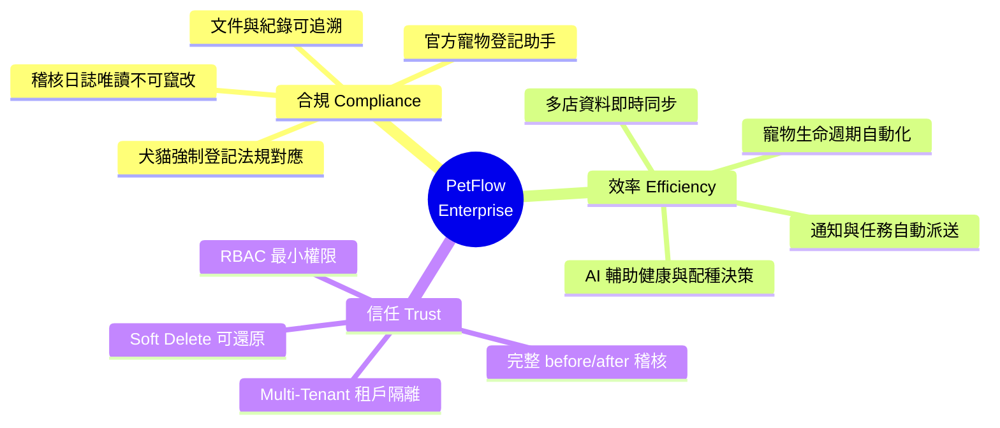
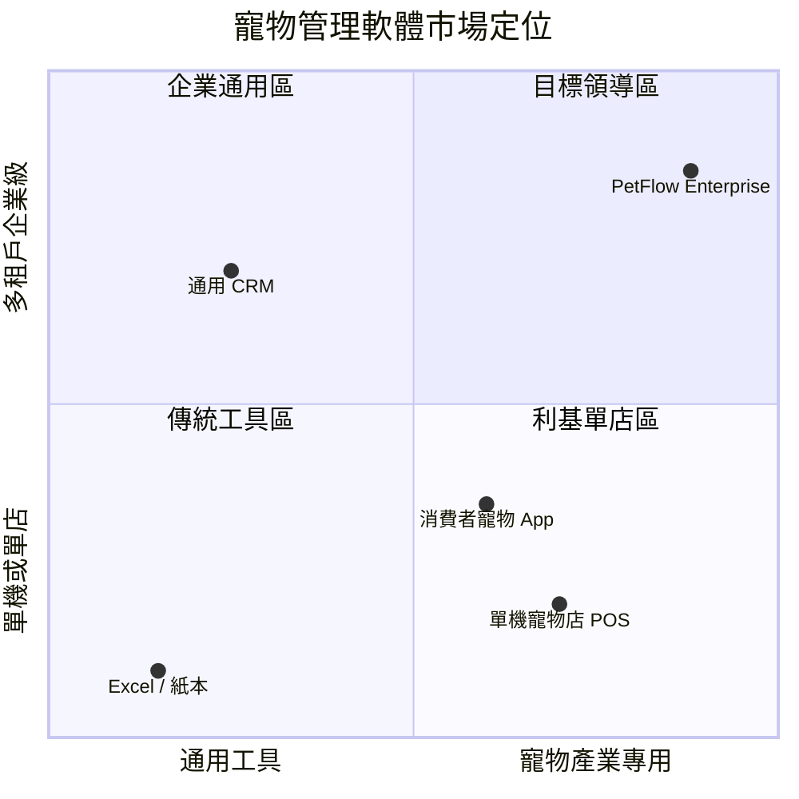

# 願景宣言（Product Vision Statement）

> 定義 PetFlow Enterprise 的長期願景、產品定位與差異化，作為全公司與全部文件的價值對齊基準。

| 文件版本 | 狀態 | 最後更新 | 所屬模組 |
| --- | --- | --- | --- |
| v0.2.0 | 初稿 | 2026-07-02 | 01 產品願景 |

---

## 1. 願景宣言（Vision Statement）

> **「讓每一隻被管理的寵物，都擁有合規、透明、可信賴的數位生命紀錄；讓每一個寵物事業，都能專注於照顧生命，而非埋首於紙本作業。」**

PetFlow Enterprise 的十年願景是成為**亞太地區寵物產業的營運作業系統（Operating System for Pet Businesses）**——從單店寵物店到跨國連鎖、從家庭式犬舍到專業繁殖場，所有寵物事業的日常營運、法規合規與商業決策，都在 PetFlow 上完成。

## 2. 標準格式願景（Geoffrey Moore Template）

| 元素 | 內容 |
| --- | --- |
| For（目標客群） | 寵物店、連鎖門市、專業繁殖者與寵物服務業者 |
| Who（面臨的問題） | 仰賴紙本與試算表管理寵物、飼主、健康與配種紀錄，難以符合官方寵物登記法規、無法追溯歷史、多店資訊不同步 |
| The（產品名稱） | PetFlow Enterprise |
| Is a（產品類別） | 多租戶 B2B SaaS 寵物生命週期管理平台 |
| That（關鍵利益） | 以自動化流程與官方登記助手，讓業者在單一平台完成寵物、飼主、健康、配種與登記管理，全程留存完整稽核軌跡 |
| Unlike（既有替代方案） | 紙本表單、Excel/Google 試算表、單機版寵物店 POS、通用型 CRM |
| Our product（差異化） | 深度整合台灣寵物登記法規（寵物登記管理辦法）、Cloudflare Native 邊緣架構、Multi-Tenant + RBAC + Audit Log 的企業級信任基礎，以及 AI 強化的健康與配種決策支援 |

## 3. 願景的三大支柱

PetFlow Enterprise 的所有產品決策，皆須回扣以下三大核心價值支柱。任何功能若無法對應至少一項支柱，即不應進入 Roadmap。

| 支柱 | 定義 | 對業者的意義 | 對應模組 |
| --- | --- | --- | --- |
| 合規（Compliance） | 內建官方寵物登記流程與法規檢核 | 免罰款、可通過主管機關稽查 | 17 官方登記助手、25 AuditLog |
| 效率（Efficiency） | 以自動化取代重複性人工作業 | 每店每月節省 20+ 小時行政工時 | 13–18 核心模組、26 通知中心、27 AI |
| 信任（Trust） | 資料隔離、權限控管、全程稽核 | 敢把商業命脈資料放上雲端 | 22 MultiTenant、24 RBAC、25 AuditLog、28 安全性 |

## 4. 我們相信的未來（Point of View）

1. **寵物家庭化是不可逆趨勢**：台灣新生兒數持續低於家犬貓登記數，寵物支出向「精緻化、醫療化、服務化」移動，業者的管理複雜度隨之上升。
2. **法規只會更嚴，不會更鬆**：犬貓強制登記、繁殖業者許可、動物福利要求逐年強化；「合規能力」將從成本項變成競爭門檻。
3. **單機軟體與試算表無法支撐多店與稽核需求**：資料孤島、無版本、無權限、無軌跡，是寵物產業數位化的最大瓶頸。
4. **AI 將改變一線工作型態**：疫苗提醒、健康異常偵測、配種配對建議等決策支援，會從「加分項」變成「基本盤」。
5. **平台生態系是終局**：寵物事業最終需要與獸醫院、保險、電商、物流串接，單點工具會被平台取代。

## 5. 產品定位（Positioning）

### 5.1 定位描述

PetFlow Enterprise 定位為 **「合規優先的寵物事業營運平台」**——不是 POS、不是通用 CRM、也不是消費者端寵物 App，而是以「被管理的寵物」為核心實體、以法規合規為賣點的 B2B 營運系統。

### 5.2 定位象限

### 5.3 我們是什麼 / 不是什麼

| 我們是 | 我們不是 |
| --- | --- |
| 寵物事業的營運與合規平台（B2B SaaS） | 消費者端寵物社群或電商 App |
| 寵物生命週期紀錄的唯一事實來源 | 取代獸醫的醫療診斷系統 |
| 多店、多角色、多租戶的企業級系統 | 單機收銀 POS（POS 為未來整合對象） |
| 官方登記流程的數位助手 | 官方登記系統本身（我們協助送件與檢核） |

## 6. 目標客群與擴張順序

| 優先序 | 客群 | 對應 Persona | 切入痛點 | 對應方案 |
| --- | --- | --- | --- | --- |
| P0 | 單店寵物店 | 阿豪、小美 | 紙本管理、登記逾期風險 | Free / Starter |
| P0 | 專業繁殖者（犬舍/貓舍） | 志明 | 血統與配種紀錄、繁殖業合規 | Starter / Pro |
| P1 | 連鎖寵物門市 | 雅婷 | 多店資料不同步、權限混亂 | Pro / Enterprise |
| P1 | 寵物服務業者（美容、住宿） | 阿豪（延伸） | 預約與寵物檔案脫節 | Starter / Pro |
| P2 | 特約獸醫與獸醫院 | Dr. Chen | 病歷與疫苗紀錄斷點 | 生態系整合（Y3） |

## 7. 北極星指標與願景的連結

願景是否被實現，以單一北極星指標衡量：

> **NSM = MAMP（Monthly Active Managed Pets，每月活躍管理寵物數）**
> 定義：當月在平台上發生至少一次有效管理行為（健康紀錄、登記、配種、照片、預約等寫入操作）的寵物數。

MAMP 同時反映三大支柱：寵物被「持續管理」代表業者獲得效率（願意持續使用）、紀錄完整（合規）、資料託付於平台（信任）。詳細定義與 KPI 樹見 [04_北極星指標與KPI定義](04_北極星指標與KPI定義.md)。

## 8. 三年里程碑摘要

| 年度 | 主題 | 市場 | 產品重點 | 願景檢核 |
| --- | --- | --- | --- | --- |
| Y1 | 站穩台灣 | 台灣單店 / 繁殖者 | MVP：寵物、飼主、健康、官方登記 | 合規支柱成立 |
| Y2 | 規模化與商業化 | 台灣連鎖多店 | 多店管理、AI 功能、訂閱收費全面上線 | 效率支柱成立 |
| Y3 | 國際化與生態系 | 日本、東南亞 | 多語系/多法規、獸醫院/保險/電商整合 | 信任支柱外溢為生態系 |

完整藍圖見 [05_產品三年願景藍圖](05_產品三年願景藍圖.md)。

## 9. 反願景（Anti-Vision）：我們拒絕成為的樣子

- **功能雜貨店**：為了短期訂單堆疊互不相干的功能，稀釋「寵物生命週期」核心。
- **資料掮客**：絕不販售或未經授權利用租戶與飼主資料；資料主權屬於租戶。
- **合規表面工程**：登記助手若不能真正降低業者法遵風險，寧可不上線。
- **重型導入軟體**：需要顧問駐點三個月才能上線的系統，違反 SaaS 自助精神；目標為註冊當天即可建立第一隻寵物。

## 10. 願景治理

- 本宣言由產品負責人維護，每年 Q4 隨年度規劃檢視一次；重大市場變化（法規修訂、競品併購）得臨時修訂。
- 修訂需同步檢查：`02_使命與核心價值.md`、`04_北極星指標與KPI定義.md`、`05_產品三年願景藍圖.md` 與 [31 Roadmap](../31_Roadmap/README.md) 的一致性。
- 所有 PRD 與規格文件的「目標」章節，必須能對應本文件第 3 節三大支柱之一。

---

> 本文件屬於 PetFlow Enterprise 官方文件，遵循根目錄 CLAUDE.md 之規範。
