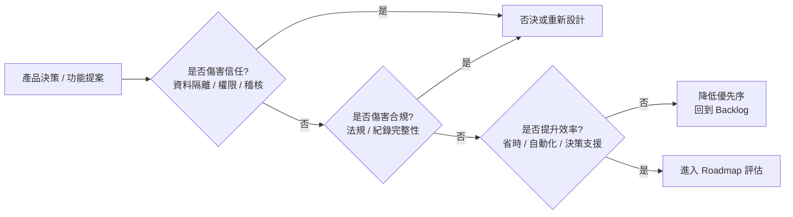
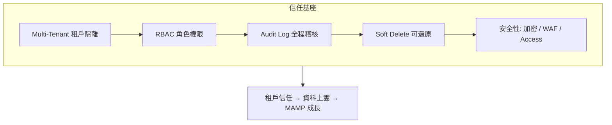

# 使命與核心價值（Mission & Core Values）

> 定義 PetFlow Enterprise 的使命宣言、三大核心價值的行為準則，以及價值觀落地到產品決策的機制。

| 文件版本 | 狀態 | 最後更新 | 所屬模組 |
| --- | --- | --- | --- |
| v0.2.0 | 初稿 | 2026-07-02 | 01 產品願景 |

---

## 1. 使命宣言（Mission Statement）

> **「用軟體消除寵物事業的行政負擔與合規風險，讓照顧生命的人把時間還給生命。」**

願景（[01_願景宣言](01_願景宣言.md)）描述十年後的世界；使命描述我們**每天在做的事**：把寵物店、繁殖者與寵物服務業者的紙本作業、法規流程與跨店協作，轉化為自動化、可稽核、可信賴的數位工作流。

### 1.1 使命的三個動詞

| 動詞 | 意義 | 產品體現 |
| --- | --- | --- |
| 消除（Eliminate） | 移除重複性行政作業 | 自動提醒、批次作業、範本化文件 |
| 降低（De-risk） | 把法遵風險前置到日常流程 | 官方登記助手、期限檢核、稽核日誌 |
| 賦能（Enable） | 讓小業者擁有企業級能力 | Free 方案入門、AI 決策支援、多店擴展 |

## 2. 核心價值總覽

三大核心價值 = 合規（Compliance）、效率（Efficiency）、信任（Trust）。它們不是行銷口號，而是**產品取捨的優先序**：

> 取捨規則：**信任 > 合規 > 效率**。效率功能再吸引人，只要削弱租戶隔離、權限控管或稽核完整性，一律否決。

## 3. 核心價值一：合規（Compliance）

### 3.1 定義

讓租戶「順著系統用，就自然符合法規」。以台灣《寵物登記管理辦法》（犬貓強制登記）為首發合規基準，未來隨市場擴展納入日本與東南亞當地法規。

### 3.2 行為準則（Do / Don't）

| 我們會（Do） | 我們不會（Don't） |
| --- | --- |
| 在寵物建檔流程內建登記狀態與期限檢核 | 把合規做成事後另購的附加模組 |
| 追蹤法規修訂並更新登記助手規則 | 對法規變動採「使用者自行注意」態度 |
| 保留完整、不可竄改的操作紀錄以供稽查 | 允許任何人（含平台管理員宥廷）竄改稽核日誌 |
| 明確標示系統為「登記助手」而非官方系統 | 宣稱可代替主管機關完成法定程序 |

### 3.3 落地機制

- **登記助手**（[17 官方登記助手](../17_官方登記助手/README.md)）：晶片、登記證、轉讓、死亡除戶等法定事件的流程引導與文件產出。
- **合規儀表板**：以租戶為單位顯示「未登記 / 即將逾期 / 已逾期」寵物數，對應 Persona 阿豪最怕的罰款風險。
- **稽核日誌**（[25 AuditLog](../25_AuditLog/README.md)）：所有寫入操作記錄 who / what / when / where / before-after / tenantId，唯讀保存。

## 4. 核心價值二：效率（Efficiency）

### 4.1 定義

以自動化與 AI，讓每一店每月至少省下 20 小時行政工時；讓「輸入一次、處處可用」成為預設。

### 4.2 行為準則（Do / Don't）

| 我們會（Do） | 我們不會（Don't） |
| --- | --- |
| Mobile First：一線店員（小美）單手可完成日常操作 | 為了功能齊全犧牲高頻操作的速度 |
| 疫苗、驅蟲、回診到期自動通知（26 通知中心） | 要求使用者自行記憶與查表 |
| 多店資料即時同步，區經理（雅婷）一眼看全局 | 讓分店各自維護一份資料再人工彙整 |
| AI 輔助建檔、健康異常提示、配種配對建議（27 AI） | 用 AI 自動做出不可逆決定而無人工確認 |

### 4.3 效率衡量

| 指標 | 基準（紙本/試算表） | 目標（PetFlow） |
| --- | --- | --- |
| 新寵物完整建檔時間 | 15–20 分鐘 | ≤ 3 分鐘 |
| 疫苗到期名單整理 | 每月人工 2–4 小時 | 0（自動產生與通知） |
| 官方登記文件準備 | 每件 30–60 分鐘 | ≤ 10 分鐘 |
| 跨店庫存/寵物狀態確認 | 電話往返、當日內 | 即時 |

## 5. 核心價值三：信任（Trust）

### 5.1 定義

租戶敢把商業命脈（客戶名單、血統資料、營運紀錄）託付給平台；飼主的個資獲得等同金融級的對待。

### 5.2 行為準則（Do / Don't）

| 我們會（Do） | 我們不會（Don't） |
| --- | --- |
| Multi-Tenant 嚴格隔離，所有查詢強制帶 tenantId | 出現任何跨租戶讀取的 API 或報表 |
| RBAC 最小權限、Deny by default（24 RBAC） | 為了方便給一線人員過大權限 |
| Soft Delete 預設可還原，硬刪除走特別流程 | 允許一鍵永久毀滅資料 |
| 資料可攜：租戶可完整匯出自己的資料 | 以資料綁架（lock-in）作為留客手段 |
| 透明的服務狀態頁與事故報告 | 掩蓋資安或可用性事件 |

### 5.3 信任的技術基座

對應模組：[22 MultiTenant](../22_MultiTenant/README.md)、[24 RBAC](../24_RBAC/README.md)、[25 AuditLog](../25_AuditLog/README.md)、[28 安全性](../28_安全性/README.md)。

## 6. 價值觀與 Persona 的對應

| Persona | 最在意的價值 | 一句話承諾 |
| --- | --- | --- |
| 阿豪（單店老闆） | 合規、效率 | 「不用再怕動保稽查，也不用再加班整理表格。」 |
| 雅婷（連鎖區經理） | 效率、信任 | 「所有分店的真實狀況，打開儀表板就知道。」 |
| 志明（專業繁殖者） | 合規、信任 | 「血統與配種紀錄完整可證明，買家更信任你。」 |
| 小美（門市店員） | 效率 | 「手機上三分鐘完成建檔，其他時間留給毛孩。」 |
| Dr. Chen（特約獸醫） | 信任、合規 | 「看得到完整病史與疫苗紀錄，醫囑有依據。」 |
| 宥廷（平台管理員） | 信任 | 「平台端也受 RBAC 與稽核約束，沒有後門。」 |

## 7. 價值觀落地機制（Governance）

1. **PRD 檢核欄位**：每份 PRD 須填「本功能支持的核心價值」與「對其餘價值的影響評估」；無法填寫者退回。
2. **價值衝突裁決**：依「信任 > 合規 > 效率」優先序裁決；有疑義時由產品負責人召集裁決會議並記錄於決策紀錄。
3. **季度價值稽核**：每季抽樣檢視已上線功能是否兌現承諾（如效率指標第 4.3 節），未達標列入改善 Backlog。
4. **對外承諾一致性**：行銷素材、銷售話術引用的價值主張，必須可對應本文件與 [03_價值主張畫布](03_價值主張畫布.md)，禁止超賣。

## 8. 與其他文件的關係

| 文件 | 關係 |
| --- | --- |
| [01_願景宣言](01_願景宣言.md) | 願景 = 目的地；使命 = 每日路徑 |
| [03_價值主張畫布](03_價值主張畫布.md) | 核心價值展開為對各客群的具體價值主張 |
| [04_北極星指標與KPI定義](04_北極星指標與KPI定義.md) | 價值兌現程度以 MAMP 與 KPI 樹量化 |
| [24 RBAC](../24_RBAC/README.md) / [25 AuditLog](../25_AuditLog/README.md) | 信任價值的技術規格出處 |

---

> 本文件屬於 PetFlow Enterprise 官方文件，遵循根目錄 CLAUDE.md 之規範。
