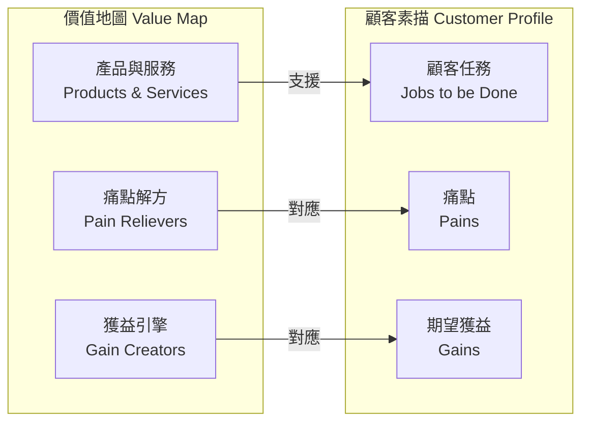

# 價值主張畫布（Value Proposition Canvas）

> 以 Value Proposition Canvas 方法，將 PetFlow Enterprise 的產品能力對應到各目標客群的任務、痛點與期望獲益。

| 文件版本 | 狀態 | 最後更新 | 所屬模組 |
| --- | --- | --- | --- |
| v0.2.0 | 初稿 | 2026-07-02 | 01 產品願景 |

---

## 1. 方法說明

本文件採 Osterwalder 的 **Value Proposition Canvas**，左側為價值地圖（Value Map：產品與服務、痛點解方、獲益引擎），右側為顧客素描（Customer Profile：顧客任務、痛點、期望獲益）。每一個主要 Persona 各建立一張畫布，最後彙整為總體價值主張陳述。

## 2. 總體價值主張陳述

> **PetFlow Enterprise 幫助寵物店、連鎖門市與專業繁殖者，在單一平台完成寵物生命週期管理與官方登記合規，將每月行政工時削減 20 小時以上，並以完整稽核與權限控管，讓每一筆紀錄都經得起主管機關與客戶的檢驗。**

## 3. 畫布一：阿豪（單店寵物店老闆，Free → Starter）

### 3.1 顧客素描

| 類別 | 內容 |
| --- | --- |
| 顧客任務 | 管理在店寵物與待售幼犬貓；維護飼主客戶資料；完成犬貓強制登記；追蹤疫苗與驅蟲；經營回頭客 |
| 痛點 | 紙本與 LINE 訊息四散、登記期限漏掉怕被罰、員工異動交接靠口頭、下班後還在整理表格 |
| 期望獲益 | 稽查來了拿得出完整紀錄、疫苗到期自動提醒客人回店、不用學複雜系統、成本低甚至免費起步 |

### 3.2 價值地圖

| 類別 | 內容 | 對應模組 |
| --- | --- | --- |
| 產品與服務 | 寵物/飼主建檔、健康紀錄、官方登記助手、Free 方案（1 店/2 使用者/30 寵物） | 13、14、15、17、19 |
| 痛點解方 | 登記期限自動檢核與提醒；所有紀錄集中且可搜尋；員工操作留有稽核軌跡 | 17、25、26 |
| 獲益引擎 | 疫苗到期名單自動生成 → 回店率提升；免費起步、店大了升級 Starter NT$599/月 | 15、26、19 |

### 3.3 Fit 檢驗（最關鍵配對）

| 痛點 | 解方 | 成效指標 |
| --- | --- | --- |
| 登記逾期罰款風險 | 建檔即檢核登記狀態、逾期前多階段通知 | 逾期登記寵物數 → 0 |
| 行政時間吞噬營業時間 | 建檔 ≤ 3 分鐘、名單自動化 | 每月省 ≥ 20 小時 |

## 4. 畫布二：雅婷（連鎖店區經理，Pro → Enterprise）

### 4.1 顧客素描

| 類別 | 內容 |
| --- | --- |
| 顧客任務 | 監督 3–10 家分店營運；統一 SOP 與資料標準；向總部回報 KPI；控管人員權限與異動 |
| 痛點 | 各店各用一套表格、彙整報表耗費每週一天、無法確認分店資料真偽、離職員工帳號權限難收回 |
| 期望獲益 | 跨店即時儀表板、標準化流程可稽核、權限一鍵調整、資料可信可追溯 |

### 4.2 價值地圖

| 類別 | 內容 | 對應模組 |
| --- | --- | --- |
| 產品與服務 | 多店管理、跨店儀表板、RBAC 角色管理、Pro 方案（3 店/15 使用者/1,000 寵物/AI） | 23、24、19 |
| 痛點解方 | 單一資料庫多店視圖，免人工彙整；每筆變更含 before/after 稽核；角色權限集中控管、Deny by default | 23、25、24 |
| 獲益引擎 | 區域 KPI（MAMP、健康紀錄完成率）自動化；AI 異常偵測凸顯需關注門市 | 23、27 |

### 4.3 Fit 檢驗

| 痛點 | 解方 | 成效指標 |
| --- | --- | --- |
| 週報彙整耗時 | 跨店即時儀表板 | 彙整時間 8h/週 → <1h/週 |
| 資料真偽難辨 | 唯讀稽核日誌 + 操作者紀錄 | 稽核爭議案件 → 可 100% 還原事實 |

## 5. 畫布三：志明（專業犬舍繁殖者，Starter → Pro）

### 5.1 顧客素描

| 類別 | 內容 |
| --- | --- |
| 顧客任務 | 管理種犬血統與配種計畫；記錄發情/交配/懷孕/生產；替幼犬完成晶片與登記；向買家證明血統與健康 |
| 痛點 | 血統書與配種紀錄手寫易錯、近親係數靠心算、繁殖業許可稽查文件整理費時、買家質疑紀錄真實性 |
| 期望獲益 | 系譜自動化、配對建議避開遺傳風險、稽查文件一鍵匯出、以完整數位紀錄提升售價與信任 |

### 5.2 價值地圖

| 類別 | 內容 | 對應模組 |
| --- | --- | --- |
| 產品與服務 | 配種管理（系譜、發情週期、產仔紀錄）、健康/基因檢測紀錄、照片管理、官方登記助手 | 16、15、18、17 |
| 痛點解方 | 系譜圖自動生成與近親係數計算；幼犬批次建檔與批次登記；紀錄不可竄改可供買家驗證 | 16、17、25 |
| 獲益引擎 | AI 配對建議（Pro）；對買家分享的血統/健康履歷頁提升成交信任 | 27、16 |

### 5.3 Fit 檢驗

| 痛點 | 解方 | 成效指標 |
| --- | --- | --- |
| 血統紀錄錯誤 / 近親風險 | 系譜自動化 + 配對檢核 | 人工系譜錯誤 → 0 |
| 稽查文件準備 | 一鍵匯出合規報告 | 每次稽查準備 2 天 → 1 小時 |

## 6. 畫布四：小美（門市店員，日常操作者）

| 類別 | 顧客素描 | 價值地圖對應 |
| --- | --- | --- |
| 顧客任務 | 到店寵物報到、日常照護紀錄、拍照更新、協助客人查詢 | Mobile First 操作介面（12 UIUX）、照片上傳（18） |
| 痛點 | 系統難用寧可寫紙上、怕按錯被罵、交接班資訊漏接 | ≥48dp 觸控目標、Soft Delete 可還原、交接班摘要通知（26） |
| 期望獲益 | 三分鐘完成一筆、錯了可以救回來 | 快速建檔流程、還原機制、操作皆有紀錄免揹黑鍋（25） |

## 7. 畫布五：Dr. Chen（特約獸醫，生態系角色）

| 類別 | 顧客素描 | 價值地圖對應 |
| --- | --- | --- |
| 顧客任務 | 巡診時掌握寵物病史、開立疫苗與醫囑、簽核健康證明 | 受邀存取的獸醫角色（24 RBAC）、健康紀錄時間軸（15） |
| 痛點 | 到場才發現紀錄不全、口頭轉述病史失真 | 完整疫苗/用藥/體重歷程；來源與時間可稽核（25） |
| 期望獲益 | 醫囑有據、責任界線清楚 | 醫囑紀錄含簽核者與時間戳；Y3 與獸醫院系統整合 |

> 註：宥廷（平台管理員）為內部角色，不列客群畫布；其需求（租戶營運、方案管理、平台稽核）見 [21 SaaS](../21_SaaS/README.md) 與 [24 RBAC](../24_RBAC/README.md)。

## 8. 價值主張 × 訂閱方案對應

| 價值主張 | Free $0 | Starter $599 | Pro $1,499 | Enterprise $3,999 起 |
| --- | --- | --- | --- | --- |
| 寵物/飼主/健康基礎管理 | ✔（30 寵物） | ✔（200 寵物） | ✔（1,000 寵物） | ✔（客製） |
| 官方登記助手 | ✔ | ✔ | ✔ | ✔ |
| 自動通知（疫苗/登記到期） | 基本 | ✔ | ✔ | ✔ |
| 多店管理 | — | —（1 店） | ✔（3 店） | ✔（不限） |
| RBAC 進階角色 | 基本 2 使用者 | 5 使用者 | 15 使用者 | 客製 |
| AI 功能（配對建議、異常偵測） | — | — | ✔ | ✔ |
| 稽核日誌保存 | 90 天 | 1 年 | 3 年 | 客製 |

> 定價詳情與年繳 83 折規則見 [19 會員訂閱](../19_會員訂閱/README.md)；本表僅表達「價值—方案」對應原則。

## 9. 差異化與替代方案比較

| 面向 | 紙本/Excel | 單機 POS | 通用 CRM | PetFlow Enterprise |
| --- | --- | --- | --- | --- |
| 寵物生命週期模型 | ✘ | 部分 | ✘（需客製） | ✔ 原生 |
| 台灣登記法規內建 | ✘ | ✘ | ✘ | ✔ |
| 多店 / 多租戶 | ✘ | ✘ | ✔ | ✔ |
| 稽核日誌 | ✘ | ✘ | 部分 | ✔ 唯讀完整 |
| AI 決策支援 | ✘ | ✘ | 部分 | ✔（Pro+） |
| 起步成本 | 低 | 中（買斷） | 高 | 低（Free 起步） |

## 10. 驗證計畫

| 假設 | 驗證方法 | 通過門檻 |
| --- | --- | --- |
| 登記合規是首要購買理由 | Y1 前 50 家租戶訪談 + 功能使用率 | ≥60% 租戶每月使用登記助手 |
| 每月省 20 小時行政工時 | 上線前後工時日誌對照（10 家樣本） | 中位數節省 ≥20 小時 |
| Pro 的 AI 功能驅動升級 | Starter→Pro 升級歸因調查 | ≥30% 升級主因含 AI |
| 繁殖者願為系譜功能付費 | 志明型租戶的留存與 NPS | 12 個月留存 ≥85%、NPS ≥40 |

驗證結果回填 [02 市場分析](../02_市場分析/README.md) 與 [04 需求分析](../04_需求分析/README.md)。

---

> 本文件屬於 PetFlow Enterprise 官方文件，遵循根目錄 CLAUDE.md 之規範。
