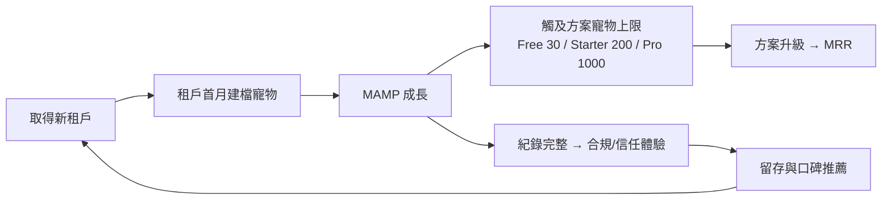
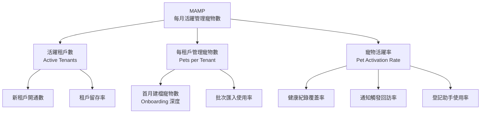

# 北極星指標與 KPI 定義（North Star Metric & KPI）

> 定義 PetFlow Enterprise 的北極星指標 MAMP、輸入指標樹、各層級 KPI 與量測治理規則。

| 文件版本 | 狀態 | 最後更新 | 所屬模組 |
| --- | --- | --- | --- |
| v0.2.0 | 初稿 | 2026-07-02 | 01 產品願景 |

---

## 1. 北極星指標（North Star Metric）

> **MAMP — 每月活躍管理寵物數（Monthly Active Managed Pets）**

### 1.1 正式定義

| 項目 | 定義 |
| --- | --- |
| 指標名稱 | MAMP（Monthly Active Managed Pets） |
| 計算單位 | 寵物（Pet Aggregate，去重後） |
| 活躍定義 | 該日曆月內，該寵物發生**至少一次有效管理行為** |
| 有效管理行為 | 對該寵物的**寫入操作**：健康紀錄（疫苗、驅蟲、就診、體重）、官方登記事件、配種事件、照片上傳、基本資料更新、預約/服務紀錄 |
| 排除項 | 純讀取（瀏覽/查詢/匯出）、系統自動作業（排程通知、資料遷移）、已軟刪除寵物、測試/示範租戶 |
| 資料來源 | Audit Log 寫入事件流（以 entityType = Pet 或關聯至 PetId 的事件聚合） |
| 統計口徑 | 依 tenantId 歸戶後全平台加總；同一寵物單月多次行為僅計 1 |

### 1.2 為什麼選 MAMP

| 候選指標 | 未採用原因 |
| --- | --- |
| MRR（月經常性收入） | 落後指標；Free 租戶的價值創造不可見 |
| 租戶數 / 註冊數 | 可被行銷灌水；殭屍租戶無價值 |
| DAU / MAU（使用者） | 使用者活躍 ≠ 寵物被好好管理；偏離產品本質 |
| 登記完成數 | 僅覆蓋合規支柱，範圍過窄 |

MAMP 同時滿足北極星指標三準則：**反映顧客獲得的核心價值**（寵物被持續管理 = 合規 + 效率 + 信任兌現）、**可被團隊影響**（功能與流程改善直接提升管理行為）、**領先於營收**（MAMP 成長 → 額度升級 → MRR 成長）。

### 1.3 與商業結果的因果鏈



## 2. 指標樹（Input Metrics Tree）



分解公式：

> **MAMP = 活躍租戶數 × 平均每租戶在檔寵物數 × 寵物月活躍率**

| 輸入指標 | 定義 | 主要負責模組 |
| --- | --- | --- |
| 活躍租戶數 | 當月有 ≥1 位使用者登入且 ≥1 次寫入的租戶 | 21 SaaS、19 會員訂閱 |
| 每租戶在檔寵物數 | 未軟刪除的寵物數（tenantId 歸戶） | 13 寵物管理 |
| 寵物月活躍率 | MAMP ÷ 在檔寵物總數 | 15 健康、17 登記、26 通知 |

## 3. KPI 層級體系

### 3.1 公司層（North Star + Guardrail）

| 指標 | 定義 | Y1 目標 | Y2 目標 | Y3 目標 |
| --- | --- | --- | --- | --- |
| MAMP | 見第 1 節 | 30,000 | 150,000 | 500,000 |
| 付費租戶數 | Starter 以上有效訂閱 | 300 | 1,500 | 5,000 |
| MRR（NT$） | 月經常性收入（年繳按月攤提，83 折後） | 250,000 | 1,800,000 | 7,500,000 |
| NRR | 淨收入留存率 | ≥95% | ≥105% | ≥110% |
| 租戶月流失率 | 付費轉出/取消 ÷ 期初付費租戶 | ≤3% | ≤2% | ≤1.5% |

### 3.2 產品層（各模組輸入指標）

| KPI | 定義 | 目標 | 對應模組 |
| --- | --- | --- | --- |
| 首週建檔率 | 新租戶 7 天內建立 ≥5 隻寵物比率 | ≥60% | 13、Onboarding |
| 建檔耗時 P50 | 完整建立一隻寵物所需時間 | ≤3 分鐘 | 13、12 UIUX |
| 健康紀錄覆蓋率 | 當月有健康紀錄的寵物 ÷ 在檔寵物 | ≥50% | 15 |
| 登記合規率 | 已完成官方登記寵物 ÷ 應登記寵物 | ≥90% | 17 |
| 通知回訪率 | 收到到期通知後 7 天內產生對應紀錄比率 | ≥40% | 26 |
| AI 建議採納率 | AI 建議被採納 ÷ 顯示次數（Pro+） | ≥25% | 27 |
| 照片附掛率 | 有 ≥1 張照片的寵物比率 | ≥70% | 18 |

### 3.3 營運/品質層（Guardrail Metrics）

北極星衝刺不得犧牲以下護欄：

| 護欄指標 | 門檻 | 說明 |
| --- | --- | --- |
| API P95 延遲 | <300ms（Edge） | Cloudflare Workers 邊緣效能 |
| 月可用率 | ≥99.9% | 狀態頁公開 |
| 跨租戶資料事件 | 0 件 | 任何一件即為 P0 事故 |
| 稽核日誌完整率 | 100% 寫入操作留痕 | 25 AuditLog |
| 個資事件 | 0 件 | 28 安全性 |
| 支援首次回應 | <4 工作小時（付費） | 客服 SLA |

## 4. 指標定義細則（Metric Spec）

### 4.1 MAMP 計算規格

```text
指標：MAMP
週期：日曆月（Asia/Taipei 時區）
分子：COUNT(DISTINCT pet_id)
  WHERE event_type IN (有效管理行為白名單)
    AND event_time ∈ 當月
    AND pet.deleted_at IS NULL（月底時點）
    AND tenant.type = 'production'（排除測試/示範租戶）
維度切分：tenantId、方案（Free/Starter/Pro/Enterprise）、
        店別、寵物種類（犬/貓/其他）、市場（TW/JP/SEA）
發布：每月 1 日產出上月正式值；月中提供滾動 30 日估計值
```

### 4.2 有效管理行為白名單（v0.2.0）

| 事件類別 | 事件例 | 計入 MAMP |
| --- | --- | --- |
| 健康 | 疫苗、驅蟲、就診、用藥、體重量測 | ✔ |
| 登記 | 晶片植入、登記申請、轉讓、除戶 | ✔ |
| 配種 | 發情、交配、懷孕確認、產仔 | ✔ |
| 檔案 | 基本資料更新、照片上傳 | ✔ |
| 服務 | 預約、報到、服務完成紀錄 | ✔ |
| 系統 | 排程通知發送、批次遷移、自動備份 | ✘ |
| 讀取 | 查看、搜尋、匯出、列印 | ✘ |

> 白名單變更屬**指標定義變更**，須依第 6 節治理流程審批，並保留舊口徑回溯重算以維持趨勢可比。

### 4.3 反作弊與品質規則

- 同一寵物同分鐘內的重複同型事件去重（防止連點灌量）。
- 批次匯入當月計入 MAMP，但另立「匯入貢獻 MAMP」維度供分析，避免誤判自然活躍。
- 平台管理員（宥廷）代操作的寫入標記 `actor_type = platform`，預設不計入 MAMP。

## 5. 儀表板與節奏（Cadence）

| 節奏 | 會議/產出 | 內容 |
| --- | --- | --- |
| 每日 | 自動日報 | 滾動 MAMP、新租戶、異常告警 |
| 每週 | 產品週會 | 指標樹輸入指標週變化、實驗結果 |
| 每月 | 經營月會 | 正式 MAMP、MRR、留存、護欄檢視 |
| 每季 | OKR 檢討 | KPI 目標達成率、下季目標校準 |
| 每年 | 年度規劃 | Y1/Y2/Y3 目標與願景藍圖對齊 |

儀表板實作依 [23 多店管理](../23_多店管理/README.md)（租戶端）與平台端分析（[21 SaaS](../21_SaaS/README.md)）規格，資料事件源自 [25 AuditLog](../25_AuditLog/README.md)。

## 6. 指標治理（Governance）

1. **唯一事實來源**：本文件為所有指標定義的 SSOT；儀表板、報表、簡報引用的口徑與本文件衝突時，以本文件為準。
2. **變更流程**：指標定義變更需提出變更提案（動機、影響、回溯重算計畫）→ 產品負責人與數據負責人會簽 → 版本號遞增並記錄於變更歷史。
3. **命名規範**：指標以英文縮寫 + 中文全名並列（如 MAMP／每月活躍管理寵物數），程式碼與事件命名遵循 CLAUDE.md 統一語言。
4. **隱私邊界**：所有指標僅得使用去識別化聚合資料；平台端不得以分析之名讀取單一租戶明細內容（信任 > 效率）。

## 7. 變更歷史

| 版本 | 日期 | 變更 |
| --- | --- | --- |
| v0.2.0 | 2026-07-02 | 初稿：確立 MAMP 定義、指標樹、三層 KPI、治理流程 |

---

> 本文件屬於 PetFlow Enterprise 官方文件，遵循根目錄 CLAUDE.md 之規範。
