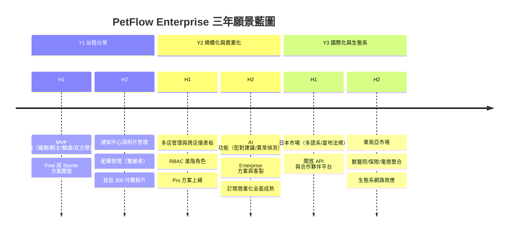
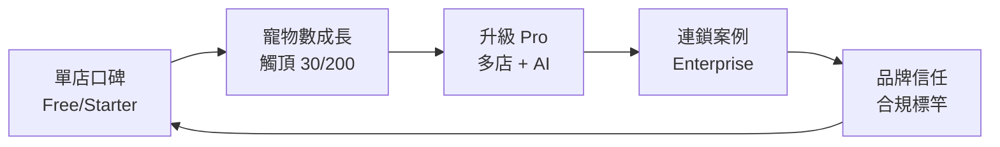
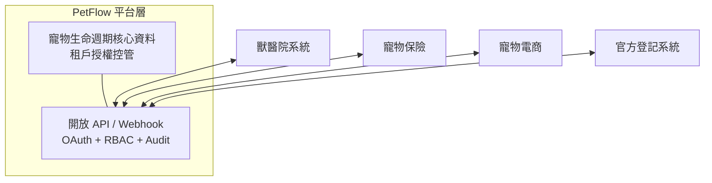

# 產品三年願景藍圖（3-Year Product Vision Roadmap）

> 描繪 PetFlow Enterprise 自 Y1 至 Y3 的階段主題、市場擴張、產品里程碑與成功判準，作為 31 Roadmap 詳細排程的上位依據。

| 文件版本 | 狀態 | 最後更新 | 所屬模組 |
| --- | --- | --- | --- |
| v0.2.0 | 初稿 | 2026-07-02 | 01 產品願景 |

---

## 1. 藍圖總覽

三年藍圖以「**先深後廣**」為原則：Y1 在台灣以合規賣點站穩單店與繁殖者，Y2 以多店與 AI 完成商業化，Y3 以多市場與生態系放大網路效應。

| 年度 | 主題 | 一句話目標 | NSM 目標（MAMP） |
| --- | --- | --- | --- |
| Y1 | 站穩台灣（Land） | 成為台灣單店與繁殖者「合規管寵物」的預設選擇 | 30,000 |
| Y2 | 規模化與商業化（Expand） | 連鎖多店 + AI + 訂閱收費飛輪成形 | 150,000 |
| Y3 | 國際化與生態系（Ecosystem） | 走出台灣，成為寵物產業的平台層 | 500,000 |

## 2. Y1 — 站穩台灣：單店與繁殖者（MVP）

### 2.1 目標客群與市場

- **主攻**：台灣單店寵物店（阿豪）、專業犬舍/貓舍繁殖者（志明）。
- **市場槓桿**：台灣《寵物登記管理辦法》犬貓強制登記——以「不怕稽查、不會逾期」為第一銷售訊息。

### 2.2 產品里程碑

| 半年度 | 里程碑 | 範圍 | 對應模組 |
| --- | --- | --- | --- |
| Y1-H1 | MVP 上線 | 寵物管理、飼主管理、健康管理（疫苗/驅蟲/就診/體重）、官方登記助手 | 13、14、15、17 |
| Y1-H1 | 信任基座 | Multi-Tenant、RBAC 基本角色、Audit Log、Soft Delete 自 Day 1 內建 | 22、24、25 |
| Y1-H1 | 商業化起步 | Free（$0）與 Starter（$599）方案、線上訂閱與付款 | 19、20 |
| Y1-H2 | 留存引擎 | 通知中心（疫苗/登記到期）、照片管理（R2） | 26、18 |
| Y1-H2 | 繁殖者深化 | 配種管理：系譜、發情週期、產仔紀錄、幼犬批次建檔 | 16 |

### 2.3 Y1 成功判準（Exit Criteria）

| 指標 | 門檻 |
| --- | --- |
| MAMP | ≥30,000 |
| 付費租戶 | ≥300（Starter 為主） |
| 首週建檔率 | ≥60% |
| 登記合規率（平台內寵物） | ≥90% |
| 付費租戶月流失率 | ≤3% |
| 跨租戶資料事件 | 0 |

> 未達成 MAMP 與流失率門檻前，**不啟動 Y2 多店開發**；優先修復留存漏斗。

## 3. Y2 — 規模化與商業化：連鎖多店 + AI + 訂閱

### 3.1 目標客群與市場

- **主攻**：台灣連鎖寵物門市（雅婷）與成長中的 Y1 租戶升級。
- **策略**：由下而上（單店口碑）+ 由上而下（連鎖總部銷售）雙軌獲客。

### 3.2 產品里程碑

| 半年度 | 里程碑 | 範圍 | 對應模組 |
| --- | --- | --- | --- |
| Y2-H1 | 多店管理 | 店別資料模型、跨店儀表板、寵物跨店調撥、店別權限 | 23、24 |
| Y2-H1 | Pro 方案上線 | 3 店/15 使用者/1,000 寵物/AI，NT$1,499/月 | 19 |
| Y2-H1 | RBAC 進階 | 自訂角色、店別範圍權限、審批流 | 24 |
| Y2-H2 | AI 功能套組 | 配種配對建議、健康異常偵測、智慧建檔（Workers AI / Vectorize） | 27 |
| Y2-H2 | Enterprise 方案 | 店數不限、客製整合、SLA，NT$3,999 起 | 19、21 |
| Y2-H2 | 商業化成熟 | 年繳 83 折推廣、升級引導（額度觸頂 → 升級）、自助帳務 | 19、20 |

### 3.3 Y2 商業飛輪

### 3.4 Y2 成功判準

| 指標 | 門檻 |
| --- | --- |
| MAMP | ≥150,000 |
| 付費租戶 | ≥1,500；其中 Pro+ 佔比 ≥25% |
| NRR | ≥105%（升級動能證明） |
| AI 建議採納率 | ≥25%（Pro 租戶） |
| 多店租戶佔 MRR | ≥40% |

## 4. Y3 — 國際化與生態系

### 4.1 市場擴張

| 市場 | 進入時點 | 在地化重點 |
| --- | --- | --- |
| 日本 | Y3-H1 | 日文介面、狂犬病預防法與畜犬登録對應、當地支付（含 Konbini/銀行轉帳）、消費稅 |
| 東南亞（首選新加坡/馬來西亞） | Y3-H2 | 英文介面、當地寵物執照制度、多幣別計價 |

國際化前置工程（i18n 架構、多幣別、多法規規則引擎）於 Y2-H2 併行啟動，避免 Y3 重寫。

### 4.2 生態系整合

| 整合對象 | 形式 | 價值 |
| --- | --- | --- |
| 獸醫院（Dr. Chen 場景延伸） | 病歷/疫苗紀錄雙向 API、轉診 | 健康紀錄閉環，提升 MAMP 活躍率 |
| 寵物保險 | 以健康履歷核保/理賠佐證（租戶與飼主授權制） | 新收入分潤、紀錄價值變現 |
| 寵物電商/供應商 | 飼料/用品補貨建議與訂購串接 | 租戶採購效率、平台佣金 |
| 開放平台 | 公開 API（OpenAPI 3.1）+ Webhook + 合作夥伴應用審核 | 第三方開發者生態 |

> 生態系原則：**資料主權屬於租戶**。任何第三方存取都須租戶（必要時含飼主）明示授權、範圍最小化、全程稽核——信任支柱不因生態系打折。

### 4.3 Y3 成功判準

| 指標 | 門檻 |
| --- | --- |
| MAMP | ≥500,000；海外佔比 ≥15% |
| 付費租戶 | ≥5,000 |
| NRR | ≥110% |
| 生態系收入佔比 | ≥10%（分潤/佣金/API） |
| 第三方整合數 | ≥20 個上架合作夥伴 |

## 5. 跨年度技術演進（Cloudflare Native）

| 能力 | Y1 | Y2 | Y3 |
| --- | --- | --- | --- |
| 運算/前端 | Workers + Pages | 同左 + Queues 深化（影像/通知） | 多區域最佳化 |
| 資料 | D1 單區 + KV 快取 | D1 讀寫分離策略、報表聚合管線 | 分市場資料落地（法遵） |
| 檔案 | R2 照片管理 | 影像處理管線（縮圖/壓縮） | 跨市場 CDN 策略 |
| AI | — | Workers AI + Vectorize（配對/異常/搜尋） | 多語系 AI、生態系資料強化 |
| 安全 | Access/WAF、RBAC、Audit | SSO（Enterprise）、進階威脅防護 | 各市場合規認證（如 ISO 27001） |

## 6. 風險與應對

| 風險 | 影響年度 | 應對 |
| --- | --- | --- |
| 法規修訂使登記助手規則失效 | Y1–Y3 | 法規監測機制；規則引擎化，規則變更不改核心碼（文件先行） |
| 免費租戶不轉付費 | Y1–Y2 | 額度設計（30 寵物）貼近自然觸頂；升級引導實驗 |
| 連鎖導入週期長、客製需求膨脹 | Y2 | Enterprise 客製以設定化為先，拒絕分叉程式碼 |
| 日本市場在地競品強勢 | Y3 | 以繁殖者/連鎖利基切入，尋找在地通路夥伴 |
| 生態系夥伴資料要求逾越信任原則 | Y3 | 授權框架先行；不符「租戶資料主權」者不合作 |
| Edge 平台限制（D1 規模、執行時間） | Y2–Y3 | 架構每半年容量演練；聚合/佇列化削峰（29 部署） |

## 7. 藍圖治理

- 本藍圖為 [31 Roadmap](../31_Roadmap/README.md) 的上位文件：Roadmap 排程不得與本藍圖階段主題矛盾；矛盾時先修訂本文件。
- 每半年（H1/H2 交界）檢視一次成功判準達成度，決定「推進 / 延長 / 轉向」。
- 年度目標（MAMP 等）由 [04_北極星指標與KPI定義](04_北極星指標與KPI定義.md) 的口徑量測；口徑變更需回溯重算以維持三年趨勢可比。
- 任何新市場/新生態系提案，須先通過 [02_使命與核心價值](02_使命與核心價值.md) 第 2 節的價值取捨流程（信任 > 合規 > 效率）。

---

> 本文件屬於 PetFlow Enterprise 官方文件，遵循根目錄 CLAUDE.md 之規範。
