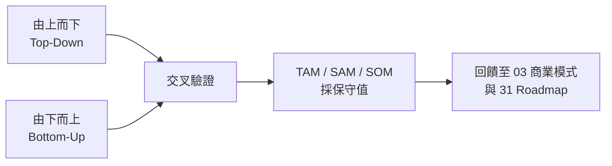
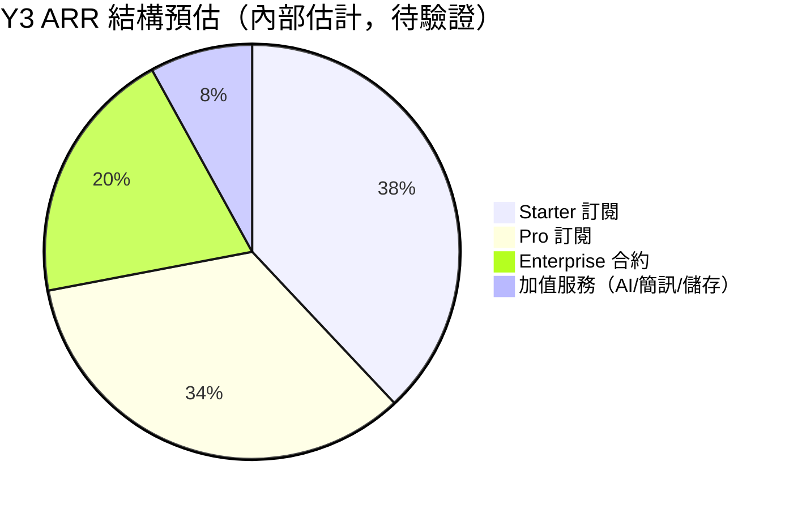
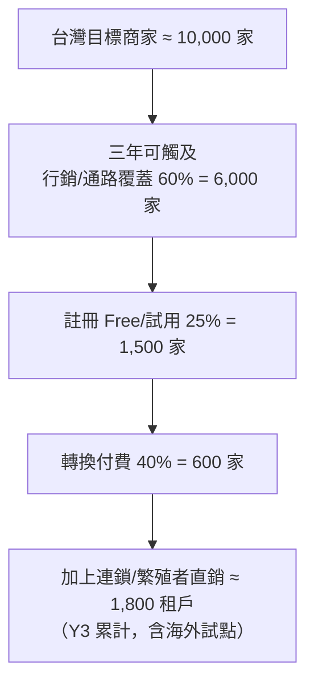

# 市場規模 TAM/SAM/SOM 試算

> 以「由上而下」與「由下而上」雙軌估算 PetFlow Enterprise 在台灣及後續擴展市場的可觸及規模，作為商業模式與募資溝通的量化基礎。

| 文件版本 | 狀態 | 最後更新 | 所屬模組 |
| --- | --- | --- | --- |
| v0.2.0 | 初稿 | 2026-07-02 | 02 市場分析 |

---

## 1. 目的與範圍

本文件量化 PetFlow Enterprise（多租戶 B2B SaaS，服務寵物店、連鎖門市、專業繁殖者與寵物服務業者）之市場規模：

- **TAM（Total Addressable Market）**：理論上可服務的全部市場。
- **SAM（Serviceable Addressable Market）**：以目前產品型態與地理範圍可服務的市場。
- **SOM（Serviceable Obtainable Market）**：三年內可實際取得的市場份額。

估算基準日為 2026 年，貨幣單位為新台幣（NT$）。除引用政府公開統計外，其餘數據均為「內部估計，待驗證」。

## 2. 估算方法

- **由上而下**：從寵物產業總產值 → 商家管理軟體支出比例 → 可服務區隔。
- **由下而上**：目標商家數 × 可轉換率 × ARPA（每租戶平均年收）。
- 兩者差異超過 ±30% 時，一律採**保守值**並記錄假設。

## 3. 市場輸入假設（台灣，2026）

| 項目 | 估計值 | 來源 / 備註 |
| --- | --- | --- |
| 登記犬貓總數 | 約 300 萬隻 | 農業部寵物登記管理資訊網公開統計量級（內部估計，待驗證） |
| 寵物產業年產值 | 約 NT$600 億 | 產業報告常見量級（內部估計，待驗證） |
| 特定寵物業許可業者（買賣/繁殖/寄養） | 約 3,500 家 | 主管機關許可名冊量級（內部估計，待驗證） |
| 寵物相關店家總數（含美容、旅館、用品店） | 約 8,000–10,000 家 | 內部估計，待驗證 |
| 專業繁殖者（含小型犬舍/貓舍） | 約 2,500 家 | 內部估計，待驗證 |
| 連鎖體系（3 店以上） | 約 150 個品牌 | 內部估計，待驗證 |
| 商家軟體支出佔營收比 | 0.8%–1.5% | 對標餐飲 POS SaaS 滲透經驗（內部估計，待驗證） |

## 4. TAM：總體可服務市場

### 4.1 由上而下

- 台灣 + 日本 + 東南亞六國寵物服務相關商家「管理軟體可支配預算」：
  - 台灣：約 10,000 家 × 平均年軟體預算 NT$18,000 ≈ **NT$1.8 億/年**
  - 日本：商家數約為台灣 5–6 倍，客單價約 1.5 倍 ≈ **NT$15 億/年**
  - 東南亞：商家數多但客單價低 ≈ **NT$6 億/年**
- **TAM ≈ NT$22–25 億/年**（內部估計，待驗證）

### 4.2 由下而上（驗證）

| 市場 | 目標商家數 | 平均 ARPA（年） | 小計 |
| --- | --- | --- | --- |
| 台灣 | 10,000 | NT$14,400（≈ Starter–Pro 加權） | NT$1.44 億 |
| 日本 | 55,000 | NT$21,600 | NT$11.9 億 |
| 東南亞 | 80,000 | NT$7,200 | NT$5.8 億 |
| **合計** | 145,000 | — | **≈ NT$19 億/年** |

兩法交叉後，**採 TAM ≈ NT$20 億/年**。

## 5. SAM：可服務市場（Y1–Y2 產品型態）

限縮條件：僅繁體中文介面、台灣寵物登記法規合規功能、台灣金流。

| 區隔 | 商家數 | 可服務比例 | 可服務家數 | 加權 ARPA（年） | SAM 貢獻 |
| --- | --- | --- | --- | --- | --- |
| 單店寵物店（阿豪型） | 6,500 | 80% | 5,200 | NT$7,200（Starter 為主） | NT$3,744 萬 |
| 專業繁殖者（志明型） | 2,500 | 70% | 1,750 | NT$9,600（Starter/Pro） | NT$1,680 萬 |
| 連鎖多店（雅婷型） | 150 品牌 | 90% | 135 | NT$96,000（Pro/Enterprise，多店計） | NT$1,296 萬 |
| 其他服務業者（美容/旅館） | 1,500 | 50% | 750 | NT$7,200 | NT$540 萬 |
| **合計** | — | — | ≈ 7,835 | — | **≈ NT$7,260 萬/年** |

**SAM ≈ NT$0.7–0.8 億/年**（內部估計，待驗證）。

## 6. SOM：三年可取得市場

依三年藍圖（Y1 台灣單店/繁殖者 MVP、Y2 連鎖+AI+商業化、Y3 國際化）設定滲透率：

| 年度 | 目標付費租戶 | 佔 SAM 家數滲透率 | 加權 ARPA（年） | ARR 估算 | MAMP 對應目標 |
| --- | --- | --- | --- | --- | --- |
| Y1（2026） | 150 | ≈ 2% | NT$7,200 | ≈ NT$108 萬 | 12,000 |
| Y2（2027） | 700 | ≈ 9% | NT$9,000 | ≈ NT$630 萬 | 70,000 |
| Y3（2028） | 1,800（含海外試點） | ≈ 20%（台灣） | NT$10,800 | ≈ NT$1,944 萬 | 200,000 |

- MAMP（每月活躍管理寵物數）為北極星指標，估算基準：單店平均 60–120 隻活躍寵物、繁殖者 30–80 隻、連鎖品牌 500+ 隻（內部估計，待驗證）。
- Free 方案租戶不計入 ARR，但計入 MAMP 與轉換漏斗。

## 7. 漏斗模型（由下而上 SOM 驗證）

轉換率假設對標台灣餐飲/零售 SaaS 公開分享之漏斗經驗（內部估計，待驗證）。

## 8. 敏感度分析

| 情境 | 關鍵假設變動 | Y3 ARR |
| --- | --- | --- |
| 悲觀 | 付費轉換率 −40%、ARPA −15% | ≈ NT$1,000 萬 |
| 基準 | 如第 6 節 | ≈ NT$1,944 萬 |
| 樂觀 | 連鎖滲透率倍增、日本試點提前 | ≈ NT$3,200 萬 |

主要風險變數（依影響度排序）：

1. **Excel/LINE 手工管理的慣性**（最大競品）：直接壓低漏斗第 C 層。
2. 連鎖品牌決策週期（3–9 個月）影響 Y2 放量時點。
3. 法規合規功能（官方寵物登記）若成為強需求，轉換率可上修。

## 9. 假設登錄與驗證計畫

| # | 假設 | 驗證方式 | 期限 |
| --- | --- | --- | --- |
| A1 | 台灣目標商家 ≈ 10,000 家 | 彙整主管機關許可名冊 + Google Maps 爬點抽樣 | Y1 Q3 |
| A2 | Free→付費轉換 40% | Beta 客群 cohort 追蹤 | Y1 Q4 |
| A3 | 單店 ARPA ≈ NT$7,200/年 | 定價訪談 30 家（Van Westendorp） | Y1 Q3 |
| A4 | 連鎖 ARPA ≈ NT$96,000/年 | 3 家連鎖 POC 報價驗證 | Y2 Q1 |
| A5 | 日本市場量級 | 委外市調 + JPRA 公開資料 | Y2 Q4 |

## 10. 結論

- **TAM ≈ NT$20 億/年、SAM ≈ NT$0.75 億/年、SOM（Y3）≈ NT$0.2 億 ARR**，皆為內部估計，待驗證。
- 台灣 SAM 天花板有限，**Y2 起的連鎖客群與 Y3 國際化是成長的必要路徑**，與 [31 Roadmap](../31_Roadmap/README.md) 一致。
- 本試算結果作為 [03 商業模式](../03_商業模式/README.md) 定價與 [19 會員訂閱](../19_會員訂閱/README.md) 方案設計之輸入。

---

> 本文件屬於 PetFlow Enterprise 官方文件，遵循根目錄 CLAUDE.md 之規範。
