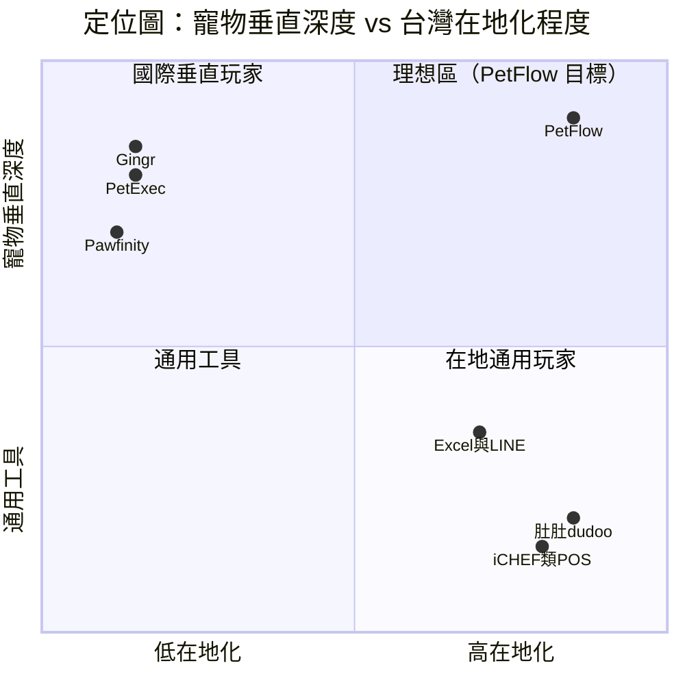

# 競品分析表（功能 / 定價 / 定位）

> 盤點通用 POS/CRM、國際寵物專用軟體與「Excel/LINE 手工管理」三類競爭者，比較功能、定價與定位，導出 PetFlow 的差異化主軸。

| 文件版本 | 狀態 | 最後更新 | 所屬模組 |
| --- | --- | --- | --- |
| v0.2.0 | 初稿 | 2026-07-02 | 02 市場分析 |

---

## 1. 競爭者分類

```mermaid
flowchart TD
    subgraph 直接競品
        G[Gingr]
        PE[PetExec]
        PF[Pawfinity]
    end
    subgraph 間接競品
        DD[肚肚 dudoo]
        IC[iCHEF 類通用 POS]
        CRM[通用 CRM / 預約系統]
    end
    subgraph 替代方案（最大競品）
        EX[Excel / Google 試算表]
        LN[LINE 群組 + 紙本]
    end
    直接競品 --> P[PetFlow Enterprise]
    間接競品 --> P
    替代方案（最大競品） --> P
```

| 類型 | 代表 | 與 PetFlow 的競爭關係 |
| --- | --- | --- |
| 直接競品 | Gingr、PetExec、Pawfinity | 同為寵物商家管理 SaaS，但無台灣在地化 |
| 間接競品 | 肚肚 dudoo、iCHEF 類通用 POS/CRM | 解決收銀與會員，但不懂「寵物」這個資產 |
| 替代方案 | Excel/試算表、LINE + 紙本 | 零成本、零學習門檻，**市佔最高** |

## 2. 功能比較矩陣

圖例：● 完整支援　◐ 部分支援　○ 不支援　？ 待查證

| 功能構面 | PetFlow（規劃） | Gingr | PetExec | Pawfinity | 肚肚/通用 POS | Excel/LINE |
| --- | --- | --- | --- | --- | --- | --- |
| 寵物檔案（品種/晶片/照片） | ● | ● | ● | ● | ○ | ◐（手工） |
| 飼主 CRM 與寵物關聯 | ● | ● | ● | ● | ◐（僅會員） | ◐ |
| 健康紀錄 / 疫苗提醒 | ● | ◐ | ◐ | ◐ | ○ | ◐（易漏） |
| 配種 / 血統管理 | ●（犬舍核心） | ○ | ◐ | ○ | ○ | ◐ |
| **台灣官方寵物登記助手** | ●（獨有） | ○ | ○ | ○ | ○ | ○（自行跑流程） |
| 多店 / 多租戶架構 | ●（原生 Multi-Tenant） | ◐ | ◐ | ○ | ◐ | ○ |
| RBAC 角色權限 | ● | ◐ | ◐ | ◐ | ◐ | ○ |
| 稽核日誌（Audit Log） | ●（不可竄改） | ？ | ？ | ○ | ○ | ○ |
| 預約 / 排程 | ●（Roadmap） | ● | ● | ● | ◐ | ◐ |
| POS 收銀 / 發票 | ◐（整合為主） | ● | ● | ◐ | ● | ○ |
| 訂閱制收費管理 | ● | ● | ● | ● | ◐ | ○ |
| AI 功能（品種辨識/智能摘要） | ●（Pro 以上） | ◐ | ○ | ○ | ○ | ○ |
| 繁體中文 / 台灣在地支援 | ● | ○ | ○ | ○ | ● | ● |
| Mobile First / PWA | ● | ◐ | ◐ | ◐ | ● | ●（LINE 天生行動） |
| API / 開放整合 | ●（API First） | ◐ | ◐ | ○ | ◐ | ○ |

> 競品欄位為 2026 年官網與公開資料之整理概況（內部估計，待驗證）；「？」項目列入競品追蹤待辦。

## 3. 定價比較

| 產品 | 定價模式 | 入門價（月） | 中階（月） | 高階（月） | 備註 |
| --- | --- | --- | --- | --- | --- |
| **PetFlow** | 訂閱/租戶 | Free $0；Starter NT$599 | Pro NT$1,499 | Enterprise NT$3,999 起 | 年繳 83 折；以店數/使用者/寵物數分級 |
| Gingr | 訂閱/據點 | ≈ US$95（≈ NT$3,000） | ≈ US$155 | 客製 | 主打寄宿/日托，價位高（內部估計，待驗證） |
| PetExec | 訂閱/據點 | ≈ US$105 | ≈ US$150 | 客製 | 功能全但介面老舊（內部估計，待驗證） |
| Pawfinity | 訂閱/據點 | ≈ US$60 | ≈ US$100 | — | 主打美容沙龍（內部估計，待驗證） |
| 肚肚 dudoo / iCHEF 類 | 訂閱+硬體 | ≈ NT$1,000–3,000 | — | — | 含 POS 硬體綁定，非寵物垂直 |
| Excel / LINE | 免費 | $0 | $0 | $0 | 隱性成本：漏記、無稽核、無法交接 |

**定價洞察**：

1. 國際競品月費約為 PetFlow Starter 的 **5 倍以上**，且無台灣在地化 → PetFlow 在價格與合規雙重優勢。
2. 真正的定價錨點不是競品，而是「免費的 Excel/LINE」→ Free 方案（1 店/2 使用者/30 寵物）即是對此設計的轉換入口。
3. 通用 POS 已教育台灣商家「月付 NT$1,000–3,000 買管理系統」的習慣，Pro NT$1,499 落在既有心理帳戶內。

## 4. 定位比較（Positioning Map）



## 5. 逐一競品摘要

### 5.1 Gingr（美國）

- **定位**：寄宿/日托/美容一體化，北美市佔領先。
- **優勢**：預約排程成熟、線上金流、家長 App。
- **弱勢**：無中文、無台灣登記法規、以據點計價昂貴、無配種血統模組。
- **對 PetFlow 啟示**：預約與家長端體驗是 Y2 必補功能；其「按據點收費」模式驗證了連鎖客群付費力。

### 5.2 PetExec（美國）

- **定位**：功能大而全的老牌系統。
- **優勢**：功能覆蓋廣（含簡易配種紀錄）、生態成熟。
- **弱勢**：UI 過時、行動體驗差、學習曲線陡。
- **啟示**：PetFlow 以 Material Design 3 + Mobile First 直接打其體驗弱點。

### 5.3 Pawfinity（美國）

- **定位**：精品美容沙龍管理。
- **優勢**：價格較低、美容流程細緻。
- **弱勢**：單店導向、無多店/多租戶、無 API。
- **啟示**：單店市場對「輕、快、便宜」敏感，Starter 方案需維持極低上手成本。

### 5.4 肚肚 dudoo / iCHEF 類（台灣，類比）

- **定位**：餐飲 POS/CRM，此處作為「台灣垂直 SaaS 成功模式」類比與潛在跨界者。
- **優勢**：在地金流/發票/客服完整、通路（業務+經銷）成熟。
- **弱勢**：無寵物領域模型（寵物不是「商品」而是「主體」），跨入垂直需重建資料模型。
- **啟示**：其 GTM 打法（展會、業務地推、發票補助話術）值得在 [GTM 策略](06_GTM進入市場策略.md) 借鏡；同時須監測其跨界風險。

### 5.5 Excel / LINE 手工管理（最大競品）

- **現況**：估計 **70% 以上** 目標商家以試算表 + LINE 群組 + 紙本卡片運作（內部估計，待驗證）。
- **優勢**：零成本、零學習、極度彈性。
- **弱勢**：疫苗到期漏追蹤、無權限控管、員工離職即資料斷層、無法出具稽核與登記文件。
- **對策**：
  1. Free 方案 + **一鍵匯入 Excel**，把轉換成本降到一次午休時間。
  2. 行銷主軸打「漏打疫苗的代價」「員工離職資料帶不走」等具體痛點。
  3. 首週引導以「30 秒建立一隻寵物檔案」為 Aha Moment，直接對比手工流程。

## 6. 差異化總結（Why PetFlow Wins）

| 差異化支柱 | 內容 | 對應競品缺口 |
| --- | --- | --- |
| 合規 | 官方寵物登記助手、完整 Audit Log | 全部競品皆無台灣登記整合 |
| 效率 | 自動化提醒、AI 品種辨識/摘要、API First | Excel/LINE 手工、國際競品無中文自動化 |
| 信任 | Multi-Tenant 隔離、RBAC、不可竄改稽核 | 通用 POS 與手工管理皆無 |
| 在地 × 垂直 | 唯一同時佔據「高在地化 × 高寵物深度」象限 | 見第 4 節定位圖 |
| 價格 | Starter NT$599 對比國際競品 ≈ NT$3,000 | 以 Cloudflare Native 成本結構支撐低價 |

## 7. 競品追蹤機制

- 每季更新本表（負責：產品行銷）；重大競品動態（降價、跨界、進台）48 小時內開 issue 通報。
- 待查證清單：Gingr/PetExec 稽核功能細節、肚肚是否有寵物垂直計畫、日本在地競品（うちの子カルテ類）盤點（Y2 前完成）。

---

> 本文件屬於 PetFlow Enterprise 官方文件，遵循根目錄 CLAUDE.md 之規範。
