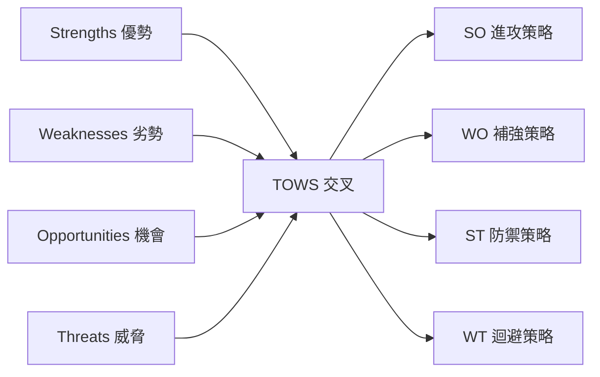

# SWOT 分析

> 系統性盤點 PetFlow Enterprise 的優勢、劣勢、機會與威脅，並以 TOWS 交叉矩陣轉化為可執行策略與風險應對計畫。

| 文件版本 | 狀態 | 最後更新 | 所屬模組 |
| --- | --- | --- | --- |
| v0.2.0 | 初稿 | 2026-07-02 | 02 市場分析 |

---

## 1. 分析框架

以 SWOT 盤點內外部因素，再以 TOWS 矩陣導出 SO/WO/ST/WT 四類策略，最後對應到負責模組與 Roadmap 時點。內部因素以產品規格（`docs/` 各模組）為準，外部因素引用 [產業趨勢與法規環境調查](04_產業趨勢與法規環境調查.md)。

## 2. SWOT 總覽

| | **有利** | **不利** |
| --- | --- | --- |
| **內部** | **S 優勢**：合規獨特性、垂直深度、成本結構、技術架構 | **W 劣勢**：品牌零知名度、資源有限、功能廣度不足、雙邊依賴 |
| **外部** | **O 機會**：飼養率上升、法規趨嚴、數位化浪潮、國際空缺 | **T 威脅**：手工慣性、通用 POS 跨界、國際競品在地化、法規/個資變動 |

## 3. Strengths（優勢）

| # | 優勢 | 說明 | 證據/依據 |
| --- | --- | --- | --- |
| S1 | **官方寵物登記合規獨特性** | 台灣犬貓強制登記；PetFlow 是目前唯一將「登記助手」納入核心的商家系統 | [17 官方登記助手](../17_官方登記助手/README.md)；[競品分析](02_競品分析表.md) 第 2 節 |
| S2 | **寵物垂直領域模型** | Pet/Owner/BreedingRecord/Vaccination 等 DDD 領域模型，非通用 CRM 能速成 | [13 寵物管理](../13_寵物管理/README.md)、[16 配種管理](../16_配種管理/README.md) |
| S3 | **Cloudflare Native 成本結構** | Edge 架構近零固定伺服器成本，支撐 Free + NT$599 低價策略 | CLAUDE.md 第 8 節；[29 部署](../29_部署/README.md) |
| S4 | **企業級信任機制** | Multi-Tenant 隔離、RBAC、不可竄改 Audit Log、Soft Delete，超規格於同價位帶 | [22 MultiTenant](../22_MultiTenant/README.md)、[24 RBAC](../24_RBAC/README.md)、[25 AuditLog](../25_AuditLog/README.md) |
| S5 | **API First / Mobile First / AI Enhanced 定位** | 直接打國際競品體驗老舊與封閉的弱點 | [11 API設計](../11_API設計/README.md)、[27 AI](../27_AI/README.md) |

## 4. Weaknesses（劣勢）

| # | 劣勢 | 說明 | 影響 |
| --- | --- | --- | --- |
| W1 | 品牌零知名度、無既有客群 | 新進者，無案例可背書 | 銷售週期拉長、連鎖客戶觀望 |
| W2 | 團隊與資金規模有限 | 無法同時打多市場、多功能線 | 必須嚴守 Roadmap 聚焦 |
| W3 | 功能廣度暫不及老牌競品 | Y1 無完整 POS 收銀、預約排程後到 | 部分商家因單點功能流失 |
| W4 | 依賴外部整合 | 官方登記流程、金流（[20 付款系統](../20_付款系統/README.md)）、LINE 通知皆依賴第三方 | 外部介面變動即產品風險 |
| W5 | Edge 架構限制 | Workers 執行時間/記憶體限制，重運算（AI、報表）需特別設計 | 架構複雜度、部分功能延遲上線 |

## 5. Opportunities（機會）

| # | 機會 | 說明 |
| --- | --- | --- |
| O1 | 寵物數量與消費持續成長 | 台灣「毛小孩>新生兒」趨勢，產業年成長約 8–10%（內部估計，待驗證） |
| O2 | 法規趨嚴 | 寵物登記稽查、特定寵物業管理趨嚴 → 合規從 nice-to-have 變 must-have |
| O3 | 商家數位化浪潮 | 疫後預約制、無接觸支付普及，商家對 SaaS 接受度提高 |
| O4 | 「高在地化 × 高垂直深度」象限無人佔據 | 見競品定位圖；先進者可建立品類心智 |
| O5 | 國際化空間 | 日本市場規模約台灣 6 倍且同樣缺乏在地垂直 SaaS（內部估計，待驗證） |
| O6 | AI 技術紅利 | Workers AI/Vectorize 讓小團隊也能提供品種辨識、健康摘要等差異化功能 |

## 6. Threats（威脅）

| # | 威脅 | 說明 | 可能性/衝擊 |
| --- | --- | --- | --- |
| T1 | **Excel/LINE 手工慣性（最大競品）** | 「免費且夠用」的心理，轉換動機不足 | 高/高 |
| T2 | 通用 POS（肚肚、iCHEF 類）跨界 | 具通路與品牌優勢，若推寵物模組將直接競爭 | 中/高 |
| T3 | 國際競品在地化 | Gingr 等若進亞洲並中文化 | 低/中 |
| T4 | 法規與個資風險 | 個資法、寵物登記介接規則變動；跨境（日本 APPI）合規成本 | 中/中 |
| T5 | 價格戰 | 競品以免費或補貼搶市 | 中/中 |
| T6 | 平台依賴風險 | Cloudflare 服務條款/價格變動 | 低/中 |

## 7. TOWS 交叉策略矩陣

| | **O 機會** | **T 威脅** |
| --- | --- | --- |
| **S 優勢** | **SO 進攻**：SO1 以「合規+登記助手」為矛，趁法規趨嚴打開單店/繁殖者市場；SO2 以低成本結構推 Free 方案吃下數位化首購族；SO3 以 AI 功能建立 Pro 方案升級誘因 | **ST 防禦**：ST1 以垂直領域模型+稽核信任築護城河，拉開與跨界 POS 的深度差距；ST2 以年繳 83 折與資料沉澱（照片、血統、健康史）提高轉換成本；ST3 以法規介接經驗形成合規壁壘，墊高後進者門檻 |
| **W 劣勢** | **WO 補強**：WO1 與獸醫院、公會、寵物展合作借力打品牌（補 W1）；WO2 嚴守三年藍圖聚焦單一市場單一客群（補 W2）；WO3 以 API First 讓第三方補足 POS/預約缺口（補 W3） | **WT 迴避**：WT1 不與通用 POS 打收銀正面戰，定位「寵物資產管理系統」；WT2 金流/登記介接採防腐層設計降低外部依賴衝擊；WT3 建立競品季度追蹤與法規監測機制 |

### 策略落地對應

| 策略 | 對應模組/文件 | 時點 |
| --- | --- | --- |
| SO1 合規為矛 | [17 官方登記助手](../17_官方登記助手/README.md)、[06 GTM](06_GTM進入市場策略.md) | Y1 |
| SO2 Free 吃首購族 | [19 會員訂閱](../19_會員訂閱/README.md) | Y1 |
| SO3 AI 升級誘因 | [27 AI](../27_AI/README.md) | Y2 |
| ST1/ST2 護城河 | [25 AuditLog](../25_AuditLog/README.md)、[18 照片管理](../18_照片管理/README.md) | 持續 |
| WO1 通路借力 | [06 GTM](06_GTM進入市場策略.md) | Y1–Y2 |
| WT2 防腐層 | [09 系統架構](../09_系統架構/README.md) | Y1 |

## 8. 風險燈號與監測指標

| 監測項 | 綠 | 黃 | 紅 | 檢視頻率 |
| --- | --- | --- | --- | --- |
| Free→付費轉換率 | ≥35% | 20–35% | <20% | 月 |
| 通用 POS 寵物模組動態 | 無跡象 | 招募/公告訊號 | 產品上線 | 季 |
| 官方登記介面變動 | 穩定 | 公告修法 | 介接中斷 | 月 |
| MAMP 月增率 | ≥15% | 5–15% | <5% | 月 |
| 流失率（付費租戶） | <2%/月 | 2–4% | >4% | 月 |

## 9. 結論

1. PetFlow 的勝負手是 **S1 合規 × O2 法規趨嚴** 的組合拳，所有 Y1 行銷與產品優先序應圍繞此展開。
2. 最大威脅不是任何軟體，而是 **T1 手工管理慣性**；對策已落在 Free 方案、Excel 匯入與 Aha Moment 設計。
3. 劣勢多屬「新創必然」，以 **聚焦（WO2）與借力（WO1、WO3）** 管理，不以資源硬補。

---

> 本文件屬於 PetFlow Enterprise 官方文件，遵循根目錄 CLAUDE.md 之規範。
