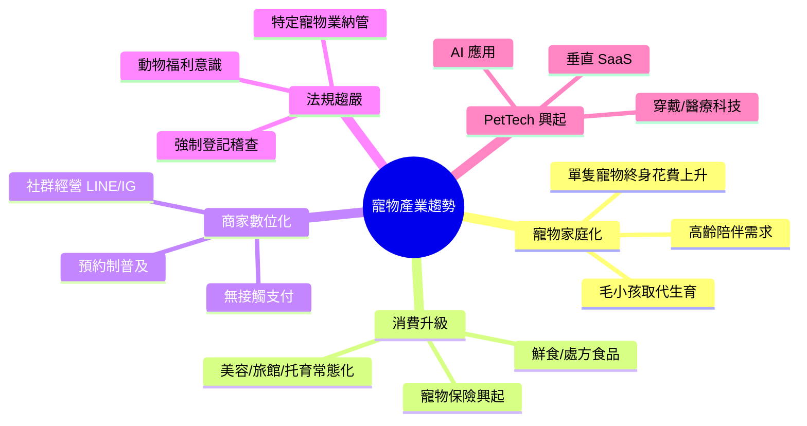
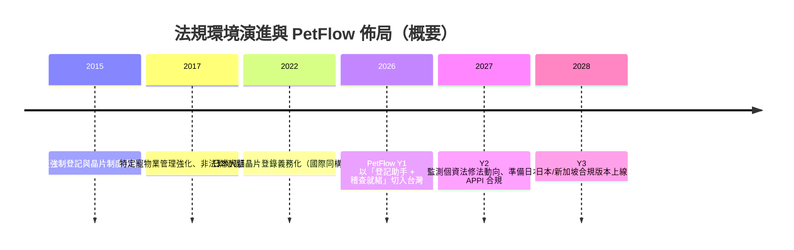

# 產業趨勢與法規環境調查

> 彙整寵物產業結構性趨勢與台灣（及後續日本、東南亞）法規環境，界定 PetFlow 的合規義務與「合規即賣點」的產品機會。

| 文件版本 | 狀態 | 最後更新 | 所屬模組 |
| --- | --- | --- | --- |
| v0.2.0 | 初稿 | 2026-07-02 | 02 市場分析 |

---

## 1. 調查範圍與方法

- **產業趨勢**：飼養結構、消費行為、商家數位化、PetTech 資本動向。
- **法規環境**：寵物登記與特定寵物業法規（產品機會面）、個資與資安法規（合規義務面）、金流與電子發票（商業化面）。
- 方法：政府公開統計、主管機關法規檢索、產業報告與商家訪談彙整。除法規名稱與制度事實外，數據推估均標註「內部估計，待驗證」。

## 2. 產業趨勢

### 2.1 結構性趨勢總覽

### 2.2 台灣關鍵趨勢

| 趨勢 | 描述 | 對 PetFlow 的意涵 |
| --- | --- | --- |
| 犬貓數超越 15 歲以下人口 | 「毛小孩經濟」成為主流敘事，貓數量成長尤快 | 市場長期擴大；貓咪管理功能不可弱於犬 |
| 飼主年輕化與數位原生化 | 主力飼主 25–44 歲，習慣 LINE/IG、線上預約 | 商家被迫數位化 → SaaS 需求；未來可延伸飼主端入口 |
| 寵物服務業態多元化 | 美容、旅館、日托、行為訓練、寵物友善餐飲興起 | 目標客群從「寵物店」擴大到「寵物服務業者」 |
| 專業繁殖走向品牌化 | 合法犬舍/貓舍重視血統證明、健康檢測與信譽 | 配種管理 + 稽核紀錄是繁殖者付費關鍵（Persona 志明） |
| 連鎖化與併購 | 通路品牌展店、上下游整合 | Y2 連鎖多店功能（Persona 雅婷）具時間窗 |
| 商家管理仍以手工為主 | 估計 70%+ 商家用 Excel/LINE/紙本（內部估計，待驗證） | 最大競品是慣性；教育成本需由 GTM 承擔 |

### 2.3 國際趨勢（Y2–Y3 擴展參考）

| 市場 | 重點觀察 | 內部估計（待驗證） |
| --- | --- | --- |
| 日本 | 高齡化寵物陪伴需求極強；2022 年起犬貓晶片登錄義務化（改正動物愛護管理法），與台灣合規賣點同構 | 市場規模約台灣 6 倍；在地垂直 SaaS 稀少 |
| 東南亞 | 中產階級擴大帶動寵物消費；法規成熟度不一 | 以新加坡（法規最完整）為灘頭堡 |
| 全球 PetTech | 資本持續投入垂直 SaaS 與 AI 健康應用 | 驗證品類；亦預告競爭將增溫 |

## 3. 台灣法規環境

### 3.1 產品機會面：寵物登記與特定寵物業

| 法規/制度 | 重點內容 | 產品機會 |
| --- | --- | --- |
| 動物保護法 + 寵物登記管理辦法 | 犬（及指定寵物）**強制辦理寵物登記**與晶片植入；未登記可處罰鍰 | **[17 官方登記助手](../17_官方登記助手/README.md)**：協助商家/繁殖者備妥文件、追蹤登記狀態 |
| 特定寵物業管理辦法 | 犬貓買賣、繁殖、寄養業者須取得**許可證**，並負擔紀錄義務（來源、去向、繁殖紀錄） | 系統原生保存繁殖/交易紀錄 + Audit Log，即「稽查就緒（inspection-ready）」 |
| 寵物登記站制度 | 登記透過獸醫院等指定機構辦理 | Dr. Chen（特約獸醫）角色的協作介面；與獸醫院的通路合作切點 |
| 絕育申報義務 | 飼主負絕育或申報義務 | 健康管理模組記錄絕育狀態，提醒商家協助飼主合規 |

> 法規條文細節與介接流程以主管機關（農業部）最新公告為準，須每季覆核；本節為產品規劃層次之整理。

### 3.2 合規義務面：個資與資安

| 法規 | 對 PetFlow 的義務 | 對應模組 |
| --- | --- | --- |
| 個人資料保護法（個資法） | 飼主姓名、電話、地址、晶片關聯資料屬個資；須告知目的、取得同意、提供查詢/刪除管道 | [28 安全性](../28_安全性/README.md)、[14 飼主管理](../14_飼主管理/README.md) |
| 個資法（委託處理） | 商家為個資控管者，PetFlow 為受託處理者 → 須提供 DPA（資料處理協議）與租戶隔離保證 | [22 MultiTenant](../22_MultiTenant/README.md)、[21 SaaS](../21_SaaS/README.md) |
| 資安通報實務 | 資料外洩之通知義務與紀錄保存 | [25 AuditLog](../25_AuditLog/README.md)、[28 安全性](../28_安全性/README.md) |
| 跨境傳輸 | 使用 Cloudflare 全球節點須評估個資跨境議題，敏感資料落地策略需明文化 | [29 部署](../29_部署/README.md) |

**設計原則對應**：Soft Delete（保留法定紀錄同時支援「刪除權」流程）、Audit Log 不可竄改（稽查舉證）、RBAC 最小權限（個資存取控管）——此三者既是 CLAUDE.md 之工程規範，也是法遵要求的直接落實。

### 3.3 商業化面：金流與發票

| 項目 | 重點 | 影響 |
| --- | --- | --- |
| 電子發票 | B2B 訂閱收費須開立電子發票（B2B 憑證） | [20 付款系統](../20_付款系統/README.md) 須整合加值中心 |
| 第三方支付/信用卡定期定額 | 訂閱扣款採定期定額，須符合收單行規範 | 影響年繳 83 折之扣款設計 |
| 促銷與消保 | 免費轉付費、自動續約須明確告知並可取消 | 訂閱流程 UX 與條款設計 |

### 3.4 法規時間軸與監測

**監測機制**：

- 每季由產品負責人檢視農業部與各縣市動保處公告，變動記錄於本模組變更紀錄。
- 登記介接屬外部依賴，架構上以防腐層隔離（見 [09 系統架構](../09_系統架構/README.md)），法規變動時僅調整轉接層。

## 4. 趨勢 × 法規交叉：機會與風險清單

| # | 類型 | 敘述 | 建議行動 |
| --- | --- | --- | --- |
| 1 | 機會 | 登記稽查趨嚴 → 商家「怕被罰」是最強購買動機 | GTM 訊息主打「稽查就緒」；銷售工具附罰則對照表 |
| 2 | 機會 | 日本晶片義務化與台灣制度同構 | Y2 預研日本版登記助手，複用領域模型 |
| 3 | 機會 | 手工管理無法滿足紀錄義務 | 內容行銷：「用 Excel 應付動保稽查的三個地雷」 |
| 4 | 風險 | 官方登記系統無公開 API 或介接規則變動 | 登記助手以「文件準備+流程指引」為 MVP，不硬依賴介接 |
| 5 | 風險 | 個資事件將重創 B2B 信任 | 上線前完成 [28 安全性](../28_安全性/README.md) 檢核與滲透測試 |
| 6 | 風險 | 電子發票/金流整合延遲影響商業化 | Y1 Q4 前完成金流 POC |

## 5. 結論

1. 產業趨勢（寵物家庭化、消費升級、商家數位化）確立**長期順風**；法規趨嚴則提供**短期切入的購買動機**。
2. 「合規」在 PetFlow 是雙面詞：對客戶是**賣點**（登記助手、稽查就緒），對自身是**義務**（個資法、資安）——兩者都已對應到具體模組。
3. 日本晶片登錄義務化證明合規打法可跨市場複製，支持三年藍圖 Y3 國際化的合理性。

---

> 本文件屬於 PetFlow Enterprise 官方文件，遵循根目錄 CLAUDE.md 之規範。
