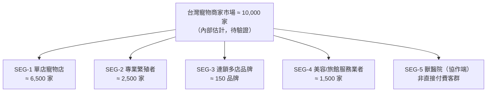
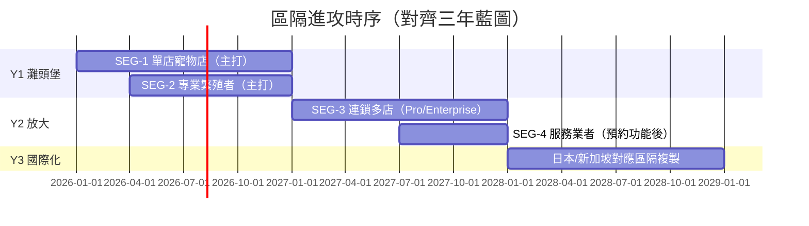

# 目標市場區隔（Segmentation）

> 以 STP 方法將寵物商家市場切分為可操作的區隔，評選出 Y1–Y3 的主打客群，並將區隔對應到 Persona、訂閱方案與功能優先序。

| 文件版本 | 狀態 | 最後更新 | 所屬模組 |
| --- | --- | --- | --- |
| v0.2.0 | 初稿 | 2026-07-02 | 02 市場分析 |

---

## 1. 區隔方法（Segmentation → Targeting → Positioning）

採用四個區隔軸線：

1. **業態**：零售買賣 / 繁殖 / 美容服務 / 寄宿托育 / 綜合。
2. **規模**：單店 / 小型連鎖（2–3 店）/ 連鎖（4 店以上）。
3. **數位成熟度**：紙本 → Excel/LINE → 已用某種系統。
4. **合規壓力**：是否持有特定寵物業許可證（繁殖/買賣/寄養須許可，合規壓力高）。

## 2. 區隔輪廓

### SEG-1 單店寵物店（主 Persona：阿豪；使用端：小美）

| 面向 | 描述 |
| --- | --- |
| 規模 | 1 店、2–5 名員工，老闆兼店長 |
| 現況工具 | Excel + LINE 群組 + 紙本會員卡（估 75%，內部估計，待驗證） |
| 核心痛點 | 疫苗/回購提醒漏追、員工交接資料斷層、登記文件每次重找 |
| 購買行為 | 老闆一人決策、決策週期 1–4 週、對月費極度敏感（心理上限約 NT$1,000） |
| 付費能力 | Free 起步 → Starter NT$599 為甜蜜點 |
| 成功指標 | 首月建檔寵物數、提醒觸發率 |

### SEG-2 專業繁殖者（主 Persona：志明）

| 面向 | 描述 |
| --- | --- |
| 規模 | 犬舍/貓舍，飼養 20–150 隻種犬貓，多為家族經營 |
| 現況工具 | 血統紙本 + 相簿 + 記憶（數位化程度最低） |
| 核心痛點 | 血統/配種紀錄複雜、幼犬去向須留存備查、許可證稽查壓力大 |
| 購買行為 | 由口碑與同業社群驅動；重視「稽查就緒」與血統證明產出 |
| 付費能力 | Starter → Pro（AI 品種辨識、1,000 寵物額度為升級誘因） |
| 成功指標 | 配種紀錄數、登記助手使用率 |

### SEG-3 連鎖多店品牌（主 Persona：雅婷）

| 面向 | 描述 |
| --- | --- |
| 規模 | 3 店以上、有區經理/總部職能，部分兼營美容與旅館 |
| 現況工具 | 通用 POS + 自建表單 + 各店各自為政 |
| 核心痛點 | 跨店資料不一致、權限混亂、總部看不到即時營運全貌 |
| 購買行為 | B2B 正式採購：POC → 簡報 → 議價，週期 3–9 個月；重視 RBAC、Audit Log、SLA |
| 付費能力 | Pro NT$1,499（3 店）→ Enterprise NT$3,999 起 |
| 成功指標 | 跨店報表使用率、席次擴充率 |

### SEG-4 美容/旅館等服務業者

| 面向 | 描述 |
| --- | --- |
| 規模 | 1–2 店，預約導向業態 |
| 核心痛點 | 預約排程、服務紀錄與照片交付（洗前/洗後） |
| 評估 | 預約功能 Y2 才完備 → **Y1 不主打**，但 Free 方案開放自然流入 |

### SEG-5 獸醫院（協作端，Persona：Dr. Chen）

- 非付費目標客群，而是**通路與生態節點**：寵物登記站多設於獸醫院，且為疫苗紀錄之權威來源。
- 策略：提供特約獸醫協作角色（RBAC 之外部角色）與轉介方案，詳見 [GTM 策略](06_GTM進入市場策略.md)。

## 3. 區隔吸引力評估

評分 1–5，權重反映 Y1 資源約束下的優先邏輯。

| 準則（權重） | SEG-1 單店 | SEG-2 繁殖者 | SEG-3 連鎖 | SEG-4 服務業 |
| --- | --- | --- | --- | --- |
| 市場規模（20%） | 5 | 3 | 2 | 3 |
| 痛點強度/合規壓力（25%） | 4 | 5 | 3 | 2 |
| 付費意願（20%） | 3 | 4 | 5 | 3 |
| 觸達成本（15%） | 4 | 4 | 2 | 3 |
| 產品匹配度 Y1（20%） | 5 | 5 | 2 | 2 |
| **加權總分** | **4.20** | **4.25** | **2.90** | **2.55** |

> 評分為跨職能工作坊之共識值（內部估計，待驗證），每半年覆核一次。

## 4. 目標選擇（Targeting）與時序

**選擇理由**：

1. **Y1 雙灘頭 = SEG-1 + SEG-2**：兩者合計約 9,000 家、痛點與 Y1 功能（寵物/飼主/健康/配種/登記助手）高度匹配，且可由同一套自助式 GTM 服務。
2. **SEG-3 延至 Y2** 並非放棄：Y1 即以 Multi-Tenant、RBAC、Audit Log 打底（架構先行），Y2 補多店報表與 SLA 後正面進攻；Y1 若有連鎖主動洽詢，以 design partner 模式收 2–3 家。
3. **SEG-4 被動收單**：不投放行銷資源，避免因預約功能未熟造成負評。

## 5. 區隔 × 方案 × Persona 對應

| 區隔 | 進入方案 | 目標方案 | Persona | 決策者/使用者 | 主打訊息 |
| --- | --- | --- | --- | --- | --- |
| SEG-1 | Free | Starter $599 | 阿豪（決策）、小美（使用） | 同一店內 | 「30 秒建檔，疫苗提醒不再漏」 |
| SEG-2 | Starter | Pro $1,499 | 志明 | 本人 | 「血統配種全紀錄，稽查抽查不心虛」 |
| SEG-3 | Pro（POC） | Enterprise $3,999 起 | 雅婷（推動）、宥廷（平台對接） | 總部採購 | 「一個後台管所有門市，權限與稽核一次到位」 |
| SEG-4 | Free | Starter | （待 Y2 定義） | 店主 | 「服務紀錄與照片，一鍵傳給飼主」 |

## 6. 定位宣言（Positioning）

> 對於**受寵物登記法規約束、仍以 Excel 與 LINE 管理營運**的台灣寵物商家與繁殖者，**PetFlow Enterprise** 是一套**寵物事業管理雲端系統**，它能**把寵物、飼主、健康與配種紀錄變成合規、可稽核、可傳承的數位資產**；不同於**通用 POS 只管收銀、國際軟體不懂台灣法規**，我們**以官方登記助手與完整稽核日誌，讓商家隨時「稽查就緒」**。

## 7. 反區隔（明確不服務對象）

| 對象 | 不服務原因 |
| --- | --- |
| 一般飼主（C 端） | B2B 聚焦；飼主端僅作為未來生態延伸（Y3 後評估） |
| 動物收容所/公部門 | 採購流程與需求差異大，Y3 前不投入 |
| 非法/無證繁殖業者 | 與「合規」品牌核心牴觸，拒絕服務並保留通報權利 |
| 純電商（無實體寵物管理需求） | 產品匹配度低 |

## 8. 結論與後續

1. **Y1 資源 100% 聚焦 SEG-1 與 SEG-2**，以合規與效率訊息切入；SEG-3 架構先行、商務後至。
2. 區隔輪廓中的痛點與訊息，直接作為 [06 GTM 進入市場策略](06_GTM進入市場策略.md) 的訊息矩陣輸入。
3. 各區隔轉換數據（註冊、啟用、付費）納入月度覆盤，若 SEG-2 轉換顯著優於 SEG-1，Y1 H2 得調整資源配比。

---

> 本文件屬於 PetFlow Enterprise 官方文件，遵循根目錄 CLAUDE.md 之規範。
