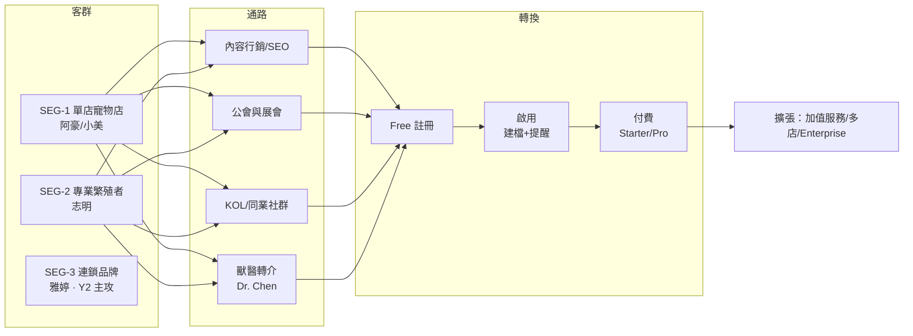
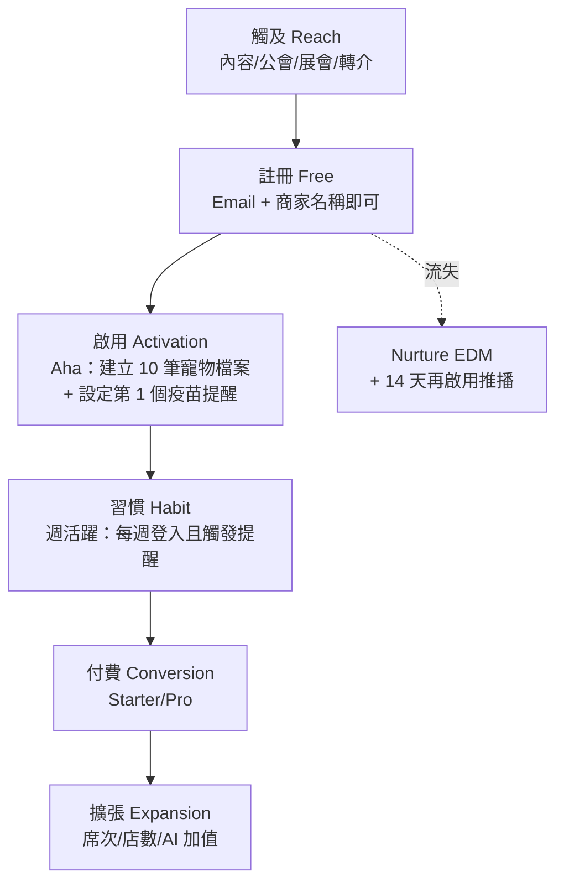
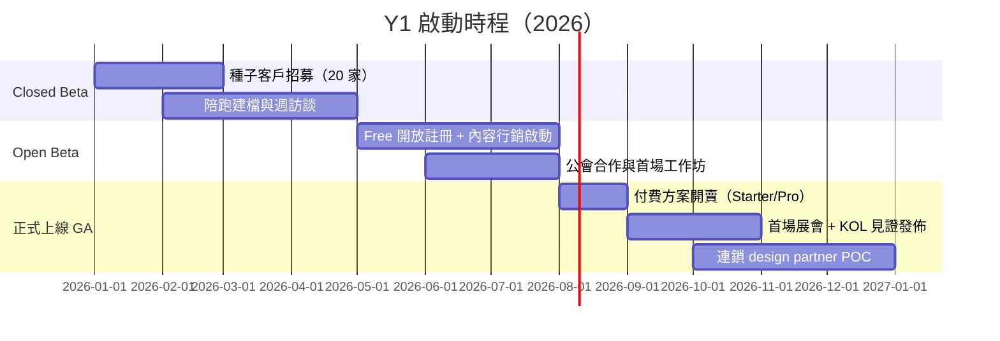

# GTM 進入市場策略

> 定義 PetFlow Enterprise 從 Beta 到正式上線、由台灣灘頭堡到國際化的進入市場策略：客群優先序、通路組合、免費增值轉換漏斗、啟動計畫與成效指標。

| 文件版本 | 狀態 | 最後更新 | 所屬模組 |
| --- | --- | --- | --- |
| v0.2.0 | 初稿 | 2026-07-02 | 02 市場分析 |

---

## 1. 目的與範圍

本文件將 [05 目標市場區隔](05_目標市場區隔.md) 的 Targeting 結論轉化為可執行的進入市場（Go-To-Market）計畫，涵蓋：

- **Who**：目標客群優先序與進攻順位。
- **What**：各客群的核心訊息與方案對應。
- **How**：通路策略（公會/展會/KOL/內容行銷/獸醫轉介）與銷售模式。
- **When**：Beta → 正式上線 → 商業化的啟動計畫。
- **Measure**：漏斗成效指標與停損/加碼決策點。

範圍以 **Y1 台灣市場** 為主，Y2–Y3（連鎖、國際化）僅列方向性原則，細節於年度覆盤時展開。

## 2. GTM 總覽

**GTM 主軸**：以「合規 + 效率」訊息、**自助式（Product-Led）免費增值**為主引擎，搭配低成本的社群/公會通路；連鎖客群採 **Sales-Led** 但延至 Y2 放量。

## 3. 目標客群優先序

依 [05 目標市場區隔](05_目標市場區隔.md) 的吸引力評分，Y1 資源配比如下：

| 優先序 | 客群 | 銷售模式 | 進入 → 目標方案 | Y1 資源配比 | 說明 |
| --- | --- | --- | --- | --- | --- |
| P0 | SEG-1 單店寵物店 | Product-Led（自助） | Free → Starter $599 | 50% | 量體最大、可自助轉換 |
| P0 | SEG-2 專業繁殖者 | Product-Led + 社群深耕 | Starter → Pro $1,499 | 35% | 痛點最強、口碑驅動 |
| P1 | SEG-3 連鎖品牌 | Sales-Led（design partner） | Pro（POC）→ Enterprise $3,999 起 | 10% | Y1 僅收 2–3 家設計夥伴 |
| P2 | SEG-4 美容/旅館 | 被動收單 | Free | 5% | 不投放行銷，避免預約功能未熟的負評 |
| — | SEG-5 獸醫院 | 通路夥伴（非客戶） | 免費協作角色 | （併入通路預算） | 轉介節點，見第 4.4 節 |

## 4. 通路策略

### 4.1 內容行銷 / SEO（P0，長期資產）

- **合規內容為錨**：「特定寵物業許可證申請攻略」「寵物登記罰則懶人包」「犬舍稽查檢查表」等長尾主題，鎖定阿豪/志明的搜尋意圖。
- 節奏：每週 1 篇部落格 + 1 支 3 分鐘短影音（功能情境示範）；全部內容附「用 PetFlow 免費建立第一筆寵物檔案」CTA。
- 免費工具引流：**線上版疫苗提醒產生器、血統書範本下載**，需 Email 領取 → 進 nurture 名單。
- 目標：Y1 Q4 自然流量佔新註冊 ≥ 30%。

### 4.2 寵物公會 / 協會（P0，信任背書）

- 對象：各縣市寵物商業同業公會、繁殖者協會、畜犬協會（KCT 等血統登錄機構）。
- 作法：
  1. 提供**會員專屬優惠**（Starter 首年 75 折）換取公會 EDM/群組露出。
  2. 免費開辦「數位化與稽查就緒」實體工作坊（每季 1–2 場），現場協助建檔。
  3. 與血統登錄機構洽談資料格式對接，成為繁殖者的預設工具。
- 目標：Y1 簽下 ≥ 3 個公會/協會合作備忘錄。

### 4.3 展會 / KOL（P1，爆量觸點）

- **展會**：台北/台中/高雄寵物用品展設攤（每年 2–3 場），主打「現場 30 秒建檔」體驗 + 展場限定優惠碼（歸因追蹤）。單場預算上限 NT$25 萬，CAC 超標即縮編。
- **KOL/同業意見領袖**：不找 C 端網紅，鎖定**繁殖圈與寵物店經營社團的版主/講師** 5–10 位，以年度免費 Pro 帳號 + 轉介分潤（首年訂閱 15%）合作，產出真實使用心得。

### 4.4 獸醫轉介網絡（P1，生態通路）

- Dr. Chen 型獸醫院為寵物登記站與疫苗權威來源：提供**免費特約獸醫協作角色**（RBAC 外部角色，唯讀+疫苗登錄），讓獸醫直接把紀錄寫進飼主所屬商家的系統。
- 轉介機制：獸醫院推薦商家註冊付費，回饋等值健檢行銷版位或轉介金；同時累積獸醫端黏著，為 Y3 生態鋪路。

### 4.5 通路預算與 CAC 護欄（Y1）

| 通路 | 年預算佔比 | 目標 CAC（付費租戶） | 停損規則 |
| --- | --- | --- | --- |
| 內容/SEO | 35% | ≤ NT$3,000 | 連續兩季自然註冊無成長則改版內容策略 |
| 公會/工作坊 | 25% | ≤ NT$4,000 | 單一公會轉換 < 5 家即不再續約 |
| 展會 | 20% | ≤ NT$6,000 | 單場 CAC 超標 50% 則下一場縮減攤位 |
| KOL/轉介 | 15% | ≤ NT$2,500 | 依分潤自然調節 |
| 付費廣告（實驗） | 5% | ≤ NT$5,000 | 僅小額 A/B，不放量 |

> CAC 護欄基準：Starter 年約 LTV ≈ NT$7,200 × 預估 2.5 年 ≈ NT$18,000，**LTV:CAC 目標 ≥ 3**（內部估計，待驗證）。

## 5. 訊息矩陣（Messaging）

| 客群 | 一句話主訊息 | 支撐證據 | 主要異議與回應 |
| --- | --- | --- | --- |
| SEG-1 阿豪 | 「30 秒建檔，疫苗提醒不再漏」 | 建檔 Demo、提醒觸發率數據 | 「Excel 免費」→ Free 方案零成本起步、算給他漏一次回購的損失 |
| SEG-2 志明 | 「血統配種全紀錄，稽查抽查不心虛」 | 稽查檢查表對照、血統書一鍵產出 | 「紙本用了十年」→ 工作坊現場代匯入 + 同業見證 |
| SEG-3 雅婷 | 「一個後台管所有門市，權限與稽核一次到位」 | RBAC/Audit Log 展示、跨店報表 | 「導入成本高」→ design partner 免費 POC 90 天 |
| 通路（獸醫） | 「病歷之外，幫你的客戶把寵物資料管好」 | 協作角色示範 | 「多一套系統」→ 唯讀免費、不改變院內流程 |

## 6. 免費增值轉換漏斗（Freemium Funnel）

### 6.1 漏斗設計

### 6.2 免費 → 付費的升級觸發點

| 觸發點 | 機制 | 對應方案 |
| --- | --- | --- |
| 寵物檔案數達 Free 上限 | 到達 80% 時提前站內通知 + 一鍵升級 | Starter |
| 提醒/通知額度用罄 | 顯示「本月已幫你避免 N 次漏追」再引導升級 | Starter |
| 需要血統書/配種報表匯出 | 匯出功能為付費牆 | Starter/Pro |
| 多員工帳號與權限需求 | 邀請第 2 位員工時觸發 | Starter/Pro |
| AI 品種辨識 / 多店管理 | 功能入口可見但鎖定（feature gating） | Pro |

- 年繳 83 折為主推方案，結帳頁預設年繳。
- **反向承諾**：Free 永久免費、資料可完整匯出，降低「被綁架」疑慮（信任是核心價值）。

### 6.3 漏斗基準值（Y1 目標，內部估計，待驗證）

| 階段轉換 | 目標值 | 對標依據 |
| --- | --- | --- |
| 觸及 → 註冊 | 5% | 內容型 SaaS 落地頁均值 |
| 註冊 → 啟用（14 天內） | 45% | 有工作坊/代建檔輔助，高於自助均值 |
| 啟用 → 付費（90 天內） | 25% | 對齊 [01 TAM 試算](01_市場規模TAM_SAM_SOM試算.md) 漏斗假設 |
| 付費 → 年繳 | 60% | 83 折誘因 |
| 月付費流失率（Churn） | ≤ 3% | 中小企業 SaaS 護欄 |

## 7. 啟動計畫（Beta → 正式）

### 7.1 Closed Beta（Q1–Q2 初）

- 招募 **20 家種子客戶**（SEG-1 × 12、SEG-2 × 8），來源：團隊人脈 + 公會引介；免費使用 + 每週 30 分鐘訪談義務。
- 成功判準（GA 前置條件）：≥ 70% 種子客戶完成 Aha（10 筆建檔 + 1 個提醒）、NPS ≥ 30、P0 bug 清零。

### 7.2 Open Beta（Q2–Q3）

- Free 方案開放自助註冊；內容行銷與公會通路全面啟動；價格頁公開但暫不收費（累積升級意向名單）。
- 目標：累計 500 家註冊、啟用率 ≥ 40%。

### 7.3 正式上線 GA（Q3–Q4）

- Starter/Pro 開賣，Beta 用戶享**創始會員價**（首年 75 折，限量 100 名，製造轉換急迫性）。
- 展會與 KOL 見證集中在 GA 後 60 天內釋出，形成聲量高峰。
- 目標：Y1 底 **150 家付費租戶**（對齊 [01 TAM 試算](01_市場規模TAM_SAM_SOM試算.md) 之 SOM）。

### 7.4 Y2–Y3 方向（原則性）

- **Y2**：組建 2 人 B2B 銷售小組主攻 SEG-3 連鎖；AI 功能（品種辨識、健康洞察）作為 Pro 升級與漲價槓桿；SEG-4 於預約功能上線後開始投放。
- **Y3**：以「台灣合規 SaaS」成功案例複製至日本（先行）與新加坡：當地公會/展會通路優先、尋找在地經銷夥伴，產品先完成多語系與當地登記法規模組。

## 8. 成效指標與覆盤機制

### 8.1 GTM 指標樹（對齊北極星 MAMP）

| 層級 | 指標 | Y1 目標 | 量測頻率 |
| --- | --- | --- | --- |
| 北極星 | MAMP（月活躍管理寵物數） | 12,000 | 月 |
| 營收 | 付費租戶數 / ARR | 150 家 / ≈ NT$108 萬 | 月 |
| 轉換 | 註冊→啟用 / 啟用→付費 | 45% / 25% | 週 |
| 通路 | 各通路註冊佔比與 CAC | 見 4.5 節護欄 | 月 |
| 留存 | 月流失率 / NPS | ≤ 3% / ≥ 40 | 月 / 季 |
| 擴張 | 年繳比例 / ARPA | 60% / NT$7,200 | 季 |

### 8.2 覆盤與決策點

1. **週會**：漏斗週報（註冊、啟用、升級觸發點點擊），異常 ±20% 需歸因。
2. **月會**：通路 CAC 對照護欄，觸發停損規則者立即調整預算。
3. **季度覆盤**：客群配比檢討——若 SEG-2 轉換顯著優於 SEG-1（差 ≥ 1.5 倍），Y1 H2 將資源配比調整為 40%:45%。
4. **GA + 6 個月**：若付費租戶 < 目標 50%，啟動 Plan B——縮減展會、全力轉向公會/獸醫轉介等高信任低成本通路，並重新驗證定價。

## 9. 風險與應對

| 風險 | 影響 | 應對 |
| --- | --- | --- |
| Excel/LINE 慣性強於預期，啟用率低 | 漏斗 C 層崩壞 | 工作坊代建檔、匯入工具優先開發、首月人工 onboarding |
| 公會合作進度慢 | 信任通路缺口 | 提前以 KOL/同業社群補位；個別意見領袖先行 |
| 競品降價或免費化 | 價格戰 | 回到差異化主軸（合規/稽核），不跟價，見 [02 競品分析](02_競品分析表.md) |
| 連鎖 design partner 需求外溢拖累 Y1 路線圖 | 資源失焦 | 限收 2–3 家、需求一律進 backlog 由 PM 排序 |

## 10. 結論

1. Y1 GTM = **Product-Led 免費增值 ×（內容 + 公會 + 社群）低成本通路**，以「合規 + 效率」訊息攻下 SEG-1/SEG-2 灘頭堡。
2. 所有通路皆設 CAC 護欄與停損規則，**LTV:CAC ≥ 3** 為總開關。
3. 本策略之定價與方案結構輸入自 [03 商業模式](../03_商業模式/README.md)；轉換數據回饋 [01 TAM 試算](01_市場規模TAM_SAM_SOM試算.md) 的假設登錄表（A2、A3）。

---

> 本文件屬於 PetFlow Enterprise 官方文件，遵循根目錄 CLAUDE.md 之規範。
