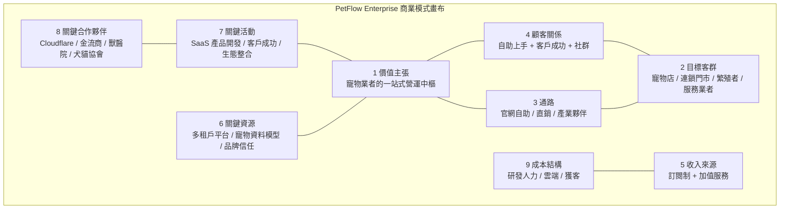
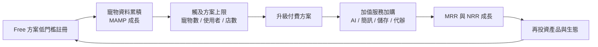

# 商業模式畫布（Business Model Canvas）

> 以九宮格畫布完整描述 PetFlow Enterprise 如何為寵物產業創造、傳遞與獲取價值。

| 文件版本 | 狀態 | 最後更新 | 所屬模組 |
| --- | --- | --- | --- |
| v0.2.0 | 初稿 | 2026-07-02 | 03 商業模式 |

---

## 1. 文件目的

本文件以 Business Model Canvas（BMC）作為 PetFlow Enterprise 商業模式的最上層框架，供全公司（產品、業務、行銷、財務）建立共同語言。後續文件（定價、單位經濟、收入來源、成本結構）皆為本畫布個別區塊的展開。

## 2. 畫布總覽

## 3. 九大區塊詳述

### 3.1 價值主張（Value Propositions）

| 客群痛點 | PetFlow 價值主張 |
| --- | --- |
| 寵物資料散落於紙本、Excel、LINE 對話 | 單一平台集中管理寵物、飼主、健康、照片資料 |
| 連鎖多店資料不同步、權限混亂 | 多租戶 + 多店架構、RBAC 角色權限、跨店報表 |
| 繁殖紀錄、血統與官方登記流程繁瑣 | 配種管理 + 官方登記助手，代辦文件一鍵產出 |
| 疫苗、回診、預約提醒靠人腦 | 通知中心自動提醒（App / 簡訊 / Email） |
| 缺乏數據做經營決策 | 營運儀表板與 AI 洞察（Pro 以上方案） |
| 擔心資料遺失與外洩 | 雲端原生（Cloudflare）、稽核日誌、軟刪除可還原 |

**一句話定位**：「PetFlow Enterprise 是寵物業者的一站式營運中樞——從寵物與飼主管理、健康與配種紀錄，到官方登記與訂閱金流，全部在一個安全的多租戶 SaaS 平台完成。」

### 3.2 目標客群（Customer Segments）

以 Persona 對應（詳見 [05 使用者角色](../05_使用者角色/README.md)）：

| 區隔 | 代表 Persona | 特徵 | 對應方案 |
| --- | --- | --- | --- |
| 單店寵物店 | 阿豪（老闆）、小美（店員） | 1 店、2–5 人、價格敏感 | Free → Starter |
| 連鎖寵物門市 | 雅婷（區經理） | 2–10 店、需跨店權限與報表 | Pro → Enterprise |
| 專業繁殖者（犬舍/貓舍） | 志明 | 血統、配種、官方登記需求深 | Starter → Pro |
| 寵物服務業者 | 美容/住宿/訓練業者 | 預約與會員經營導向 | Starter → Pro |
| 生態系角色 | Dr. Chen（特約獸醫）、宥廷（平台管理員） | 非付費主體，為平台黏著與營運角色 | — |

市場優先序：**Y1 台灣 → Y2 台灣連鎖深化 → Y3 日本、東南亞**（詳見 [02 市場分析](../02_市場分析/README.md)、[31 Roadmap](../31_Roadmap/README.md)）。

### 3.3 通路（Channels）

| 通路 | 適用客群 | 說明 |
| --- | --- | --- |
| 官網自助註冊（PLG） | 單店、繁殖者 | Free 方案免信用卡註冊，產品內升級 |
| 內容行銷 / SEO | 全部 | 寵物店經營、繁殖登記教學文章導流 |
| 直銷業務（Sales-assisted） | 連鎖、Enterprise | Demo、POC、客製報價 |
| 產業夥伴轉介 | 全部 | 犬貓協會、獸醫院、寵物用品經銷商 |
| 展會與社群 | 繁殖者、店家 | 寵物展、繁殖者社團、Facebook/LINE 社群 |

### 3.4 顧客關係（Customer Relationships）

- **自助（Self-serve）**：產品內導引（Onboarding Checklist）、知識庫、範本資料匯入。
- **客戶成功（CSM）**：Pro 以上提供上線輔導；Enterprise 提供專屬 CSM 與客製 SLA。
- **社群經營**：店主/繁殖者社群、功能許願牆、Beta 計畫。
- **留存機制**：資料累積（寵物/健康/照片）形成轉換成本，MAMP 越高黏著越強。

### 3.5 收入來源（Revenue Streams）

核心為 **B2B SaaS 訂閱制 + 加值服務**（詳見 [04_收入來源與加值服務清單](04_收入來源與加值服務清單.md)）：

| 類型 | 項目 | 計費方式 |
| --- | --- | --- |
| 訂閱收入 | Free $0 / Starter $599 / Pro $1,499 / Enterprise $3,999 起（NT$/月/租戶） | 月繳或年繳（83 折） |
| 加值服務 | AI 加購、簡訊/通知額度、照片儲存空間擴充、官方登記代辦加值 | 加購包 / 用量計費 / 按件計費 |

### 3.6 關鍵資源（Key Resources）

| 資源 | 說明 |
| --- | --- |
| 多租戶 SaaS 平台 | Cloudflare 原生架構（Workers / D1 / R2 / Queues），見 [09 系統架構](../09_系統架構/README.md) |
| 寵物領域資料模型 | 寵物、血統、健康、配種、登記之結構化資料資產 |
| AI 能力 | Workers AI / Vectorize 之影像辨識與智慧建議，見 [27 AI](../27_AI/README.md) |
| 團隊 | 全端工程、產品設計、寵物產業領域知識 |
| 品牌與信任 | 資料安全（RBAC、Audit Log）、產業口碑 |

### 3.7 關鍵活動（Key Activities）

1. 產品開發與迭代（依 [31 Roadmap](../31_Roadmap/README.md) 三年藍圖：Y1 台灣 MVP、Y2 連鎖多店+AI+商業化、Y3 國際化+生態系）。
2. 獲客與轉換漏斗優化（Free → 付費）。
3. 客戶成功與續約管理（降低 Churn、提升 NRR）。
4. 生態系整合（獸醫院、協會、金流、政府登記流程）。
5. 資料安全與合規維運（個資法、多租戶隔離）。

### 3.8 關鍵合作夥伴（Key Partnerships）

| 夥伴 | 角色 |
| --- | --- |
| Cloudflare | 基礎設施供應商（Pages/Workers/D1/R2/KV/Queues/AI） |
| 金流服務商 | TapPay / 綠界 / Stripe 擇一（商業層決策，見 [20 付款系統](../20_付款系統/README.md)） |
| 簡訊/通知供應商 | 簡訊額度批發、Email 遞送服務 |
| 犬貓協會 / 畜犬協會 | 官方登記流程對接與代辦通路 |
| 特約獸醫 / 獸醫院 | 健康紀錄生態、專業背書 |
| 寵物產業 KOL / 公會 | 通路與品牌信任 |

### 3.9 成本結構（Cost Structure）

摘要（詳見 [05_成本結構分析](05_成本結構分析.md)）：

- **固定成本為主**：研發與營運人力約占總成本 60–70%（內部估計，待驗證）。
- **變動成本低**：Cloudflare 邊緣架構使每租戶邊際成本極低，毛利率目標 ≥ 80%。
- **獲客成本**：PLG 為主、Sales-assisted 為輔，控制 CAC 回收期 ≤ 12 個月。

## 4. 商業模式飛輪

北極星指標為 **MAMP（每月活躍管理寵物數）**：寵物資料越多 → 平台價值越高 → 越接近付費上限 → 收入成長 → 再投資，形成正向飛輪。

## 5. 驗證假設與風險

| 假設 | 驗證方式 | 風險等級 |
| --- | --- | --- |
| 單店願意為數位化付 NT$599/月 | Y1 Starter 轉換率 ≥ 5%（內部估計，待驗證） | 高 |
| 繁殖者對登記代辦有付費意願 | 代辦服務試點轉換率 | 中 |
| 連鎖客戶需要多店+RBAC | Pro/Enterprise 商機訪談 ≥ 20 家 | 中 |
| Cloudflare 架構可維持 80% 毛利 | 每租戶成本監控 | 低 |
| 台灣模式可複製到日本/東南亞 | Y3 前完成在地化 POC | 高 |

## 6. 相關文件

- [02_訂閱方案與定價策略](02_訂閱方案與定價策略.md)
- [03_單位經濟模型](03_單位經濟模型.md)
- [04_收入來源與加值服務清單](04_收入來源與加值服務清單.md)
- [05_成本結構分析](05_成本結構分析.md)
- [19 會員訂閱](../19_會員訂閱/README.md)、[21 SaaS](../21_SaaS/README.md)

---

> 本文件屬於 PetFlow Enterprise 官方文件，遵循根目錄 CLAUDE.md 之規範。
