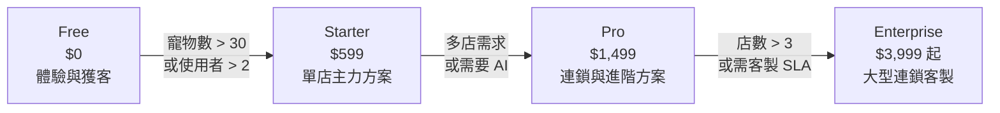
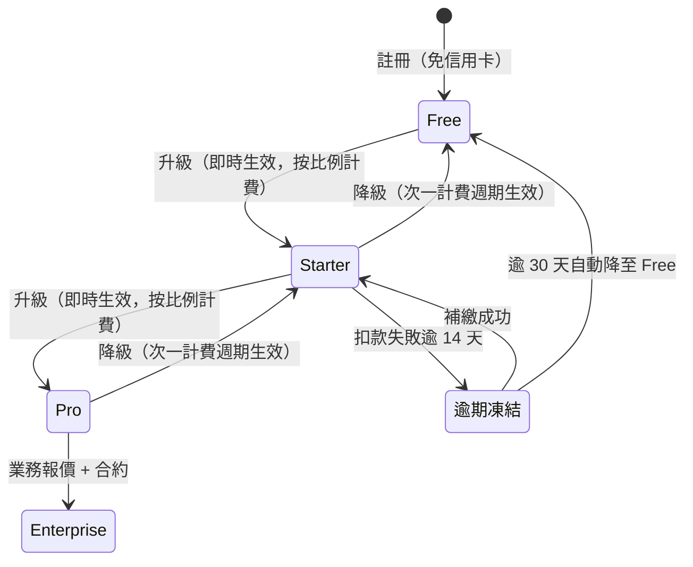

# 訂閱方案與定價策略（Pricing Tiers）

> 定義 PetFlow Enterprise 四層訂閱方案的定價、限額、升降級規則與定價策略邏輯。

| 文件版本 | 狀態 | 最後更新 | 所屬模組 |
| --- | --- | --- | --- |
| v0.2.0 | 初稿 | 2026-07-02 | 03 商業模式 |

---

## 1. 文件目的

本文件是全 repo 訂閱定價的**唯一事實來源（SSOT）**。[19 會員訂閱](../19_會員訂閱/README.md) 的系統設計與 [20 付款系統](../20_付款系統/README.md) 的金流實作，皆須以本文件之方案與價格為準。

## 2. 方案總表（標準定價）

> 幣別：新台幣（NT$），計費單位：**每月 / 每租戶（Tenant）**。

| 項目 | Free 免費版 | Starter 入門版 | Pro 專業版 | Enterprise 企業版 |
| --- | --- | --- | --- | --- |
| **月費** | $0 | $599 | $1,499 | $3,999 起 |
| **年繳（83 折）** | — | 約 $5,966/年 | 約 $14,930/年 | 約 $39,830 起/年 |
| **店數** | 1 店 | 1 店 | 3 店 | 店數不限 |
| **使用者數** | 2 | 5 | 15 | 客製 |
| **寵物數** | 30 | 200 | 1,000 | 客製 |
| **AI 功能** | — | 可加購 | ✅ 內含 | ✅ 內含 |
| **SLA** | 社群支援 | Email 支援 | 優先支援 | 客製 SLA + 專屬 CSM |

> 年繳金額為月費 × 12 × 0.83 之四捨五入值，實際請款金額以 [20 付款系統](../20_付款系統/README.md) 之計費規則為準。

### 2.1 各方案功能對照（摘要）

| 功能模組 | Free | Starter | Pro | Enterprise |
| --- | :-: | :-: | :-: | :-: |
| 寵物 / 飼主管理（13、14） | ✅ | ✅ | ✅ | ✅ |
| 健康管理與疫苗提醒（15、26） | ✅ 基本 | ✅ | ✅ | ✅ |
| 照片管理（18） | 1GB | 10GB | 50GB | 客製 |
| 配種管理（16） | — | ✅ | ✅ | ✅ |
| 官方登記助手（17） | — | ✅ | ✅ | ✅ |
| 多店管理與跨店報表（23） | — | — | ✅（3 店） | ✅（不限） |
| RBAC 進階自訂角色（24） | — | — | ✅ | ✅ |
| AI 照片辨識 / 智慧建議（27） | — | 加購 | ✅ | ✅ |
| Audit Log 查詢介面（25） | — | 30 天 | 180 天 | 客製保存 |
| API 存取 | — | — | ✅ | ✅ + 專屬額度 |

> 照片儲存額度與 Audit Log 保存天數為內部估計，待與 18、25 模組文件對齊後定版。

## 3. 定價策略邏輯

### 3.1 定價方法：價值導向 + 競品錨定

- **價值導向（Value-based）**：以「每月每店節省的行政工時」估算願付價格。單店每月約可省 20–30 小時紙本/Excel 作業，以時薪 NT$200 計，價值約 NT$4,000–6,000/月；Starter 定價 $599 約為創造價值的 10–15%（內部估計，待驗證）。
- **競品錨定**：對標台灣 POS / 預約 SaaS 常見區間（NT$500–2,000/月），Starter 落在入門帶、Pro 落在專業帶。
- **心理定價**：採 $599 / $1,499 / $3,999 尾數 9 定價；Enterprise 標示「起」保留議價空間。

### 3.2 分層設計原則（Good–Better–Best）

| 層級 | 角色 | 升級槓桿（Upgrade Trigger） |
| --- | --- | --- |
| Free | 獲客漏斗入口、產品體驗 | 30 隻寵物上限（對應 NSM：MAMP 成長自然觸頂） |
| Starter | 單店變現主力（阿豪、志明） | 200 隻寵物、5 使用者、無多店/AI |
| Pro | 連鎖與專業客群（雅婷、志明進階） | 3 店、1,000 隻寵物、15 使用者 |
| Enterprise | 大型連鎖、指名客戶 | 不限店數、客製 SLA、專屬支援 |

### 3.3 年繳 83 折策略

- 目的：**預收現金流、降低月流失（Churn）**，年繳客戶流失率預期為月繳的 40–50%（內部估計，待驗證）。
- 折扣一律為 **83 折**，不另設其他長約折扣，維持定價紀律。
- 年繳中途升級：差額按剩餘月份比例補收；中途降級於**次一續約期**生效（詳見 3.4）。

## 4. 方案生命週期規則

### 4.1 升級 / 降級

| 規則 | 內容 |
| --- | --- |
| 升級 | 即時生效；當期差額按剩餘天數比例（pro-rata）補收 |
| 降級 | 次一計費週期生效；超出新方案限額的資料**唯讀保留**（遵循軟刪除原則，不刪資料） |
| 超額處理 | 達限額 80% / 100% 時由 [26 通知中心](../26_通知中心/README.md) 推播提醒；達 100% 後禁止新增、既有資料可讀 |
| 逾期未繳 | 14 天寬限（唯讀）→ 30 天自動降 Free；資料保留 |
| 取消 | 當期結束前可用；資料依保留政策保存 90 天後進入封存（內部估計，待驗證） |

### 4.2 試用與促銷

- **Pro 14 天免費試用**：註冊付費方案前可試用 Pro 全功能，免綁卡；到期未升級自動回 Free。
- **促銷折扣原則**：任何促銷不得低於年繳 83 折之實質價格下限；促銷一律有明確迄日，避免定價侵蝕。
- **祖父條款（Grandfathering）**：調價時既有客戶保留原價至少 12 個月，並提前 60 天通知。

## 5. 加值服務與定價的關係

加值服務為**方案之上的擴充**，不改變方案層級（明細見 [04_收入來源與加值服務清單](04_收入來源與加值服務清單.md)）：

| 加值項目 | 適用方案 | 計費模式 |
| --- | --- | --- |
| AI 功能加購 | Starter | 月費加購包 |
| 簡訊 / 通知額度 | 全部付費方案 | 用量加購包（預付點數） |
| 照片儲存空間擴充 | 全部付費方案 | 每 10GB 月費 |
| 官方登記代辦加值 | Starter 以上 | 按件計費 |

## 6. 定價與商業指標之連動

| 指標 | 定價策略如何影響 |
| --- | --- |
| MRR / ARR | 分層上限驅動升級；年繳提升 ARR 可預測性 |
| Churn | 年繳 83 折降低月流失；資料累積提高轉換成本 |
| NRR | 加值服務與座位/寵物數擴張推升 NRR 目標 ≥ 110%（內部估計，待驗證） |
| CAC 回收 | Free PLG 降低獲客成本，目標回收期 ≤ 12 個月 |
| MAMP（NSM） | 寵物數限額 30 / 200 / 1,000 直接以 NSM 作為升級槓桿 |

## 7. 國際化定價預留（Y3）

- Y3 進入日本、東南亞時採**在地定價（Regional Pricing）**：以當地願付價格重訂，非單純匯率換算。
- 系統層需支援多幣別與稅制（消費稅/JCT、VAT），需求先行登錄於 [20 付款系統](../20_付款系統/README.md) 與 [31 Roadmap](../31_Roadmap/README.md)。
- 台灣定價為全球定價之基準錨點；各區價格由當地購買力平價（PPP）係數調整（內部估計，待驗證）。

## 8. 治理與變更流程

1. 任何價格、限額、折扣變更，**須先修訂本文件**（SSOT），經產品與財務雙簽核後，才可反映至 19/20 模組與行銷素材。
2. 價格版本以本文件「文件版本」追蹤；歷史定價須保留於 [32 版本紀錄](../32_版本紀錄/README.md)。
3. 每季檢視一次：轉換率、各層分佈、升級路徑數據，作為調價依據。

## 9. 相關文件

- [01_商業模式畫布](01_商業模式畫布.md)
- [03_單位經濟模型](03_單位經濟模型.md)
- [04_收入來源與加值服務清單](04_收入來源與加值服務清單.md)
- [19 會員訂閱](../19_會員訂閱/README.md)、[20 付款系統](../20_付款系統/README.md)

---

> 本文件屬於 PetFlow Enterprise 官方文件，遵循根目錄 CLAUDE.md 之規範。
