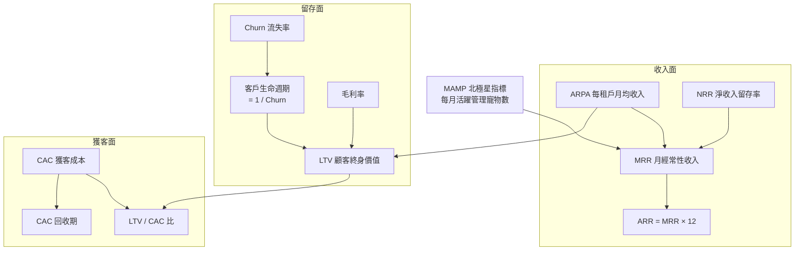
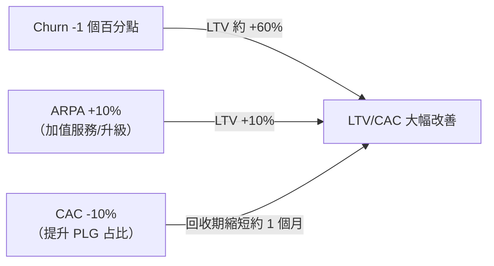

# 單位經濟模型（CAC / LTV / Churn）

> 定義 PetFlow Enterprise 的單位經濟指標口徑、計算公式、目標值與健康度守則。

| 文件版本 | 狀態 | 最後更新 | 所屬模組 |
| --- | --- | --- | --- |
| v0.2.0 | 初稿 | 2026-07-02 | 03 商業模式 |

---

## 1. 文件目的

建立全公司一致的單位經濟（Unit Economics）**指標口徑與目標值**，作為定價、行銷預算、募資簡報與經營檢討的共同基準。所有數字除公式外皆為 **內部估計，待驗證**，須以實際營運數據按季回填修正。

## 2. 指標地圖

## 3. 指標定義與口徑（SSOT）

| 指標 | 定義 | 計算口徑 |
| --- | --- | --- |
| **MAMP**（NSM） | 每月活躍管理寵物數 | 當月有被查看/編輯/紀錄之未軟刪除寵物數（跨全租戶加總） |
| **MRR** | 月經常性收入 | 所有付費租戶當月訂閱正規化收入；年繳除以 12；**不含**一次性代辦費 |
| **ARR** | 年經常性收入 | MRR × 12 |
| **ARPA** | 每付費租戶平均月收入 | MRR ÷ 付費租戶數（Free 不計入分母） |
| **Logo Churn** | 客戶數流失率（月） | 當月流失付費租戶數 ÷ 月初付費租戶數 |
| **Revenue Churn** | 收入流失率（月） | 當月流失+降級 MRR ÷ 月初 MRR |
| **NRR** | 淨收入留存率（月/年化） | （期初客戶群之期末 MRR，含升級/加購/降級/流失）÷ 期初 MRR |
| **CAC** | 單一付費租戶獲客成本 | （行銷費用 + 業務人事費）÷ 當期新增付費租戶數 |
| **LTV** | 顧客終身價值（毛利口徑） | ARPA × 毛利率 ÷ Revenue Churn（月） |
| **CAC 回收期** | 回收獲客成本所需月數 | CAC ÷（ARPA × 毛利率） |

> 口徑原則：LTV 一律採**毛利口徑**（非營收口徑）；Churn 預設指 Revenue Churn，引用 Logo Churn 時須明確標註。

## 4. 基準情境估算（Y2 商業化階段）

### 4.1 付費方案組合與 ARPA

| 方案 | 佔付費租戶比 | 月費 | 加權貢獻 |
| --- | --- | --- | --- |
| Starter $599 | 60% | $599 | $359 |
| Pro $1,499 | 35% | $1,499 | $525 |
| Enterprise $3,999 起（均值以 $4,500 估） | 5% | $4,500 | $225 |
| **訂閱 ARPA 小計** | | | **約 $1,109** |
| 加值服務（AI / 簡訊 / 儲存 / 代辦，約訂閱 10%） | | | 約 $110 |
| **Blended ARPA** | | | **約 NT$1,220 / 月**（內部估計，待驗證） |

### 4.2 Churn 與生命週期

| 方案 | 月 Revenue Churn（估） | 平均生命週期 |
| --- | --- | --- |
| Starter | 3.0% | 約 33 個月 |
| Pro | 1.5% | 約 67 個月 |
| Enterprise | 0.5% | 約 200 個月（合約制） |
| **Blended** | **約 2.5%** | **約 40 個月**（內部估計，待驗證） |

年繳客戶（83 折）之流失率預期為月繳客戶之 40–50%，故提升年繳占比為降 Churn 首要槓桿。

### 4.3 LTV 計算

- 毛利率假設：**80%**（Cloudflare 邊緣架構、低邊際成本，見 [05_成本結構分析](05_成本結構分析.md)）。
- **LTV = $1,220 × 80% ÷ 2.5% ≈ NT$39,000 / 付費租戶**（內部估計，待驗證）。

### 4.4 CAC 分通路估算

| 獲客通路 | 佔新增付費租戶比 | 單位 CAC（估） | 說明 |
| --- | --- | --- | --- |
| PLG 自助（Free 轉付費） | 65% | $3,000 | 內容行銷 + 廣告 + 產品內升級 |
| Sales-assisted（Pro/Ent） | 25% | $25,000 | 業務人事 + Demo/POC 成本 |
| 夥伴轉介（協會/獸醫院） | 10% | $6,000 | 轉介獎金 |
| **Blended CAC** | | **約 NT$8,800**（內部估計，待驗證） | |

### 4.5 健康度結果

| 指標 | 估算值 | 目標 / 健康線 | 判定 |
| --- | --- | --- | --- |
| LTV / CAC | 39,000 ÷ 8,800 ≈ **4.4** | ≥ 3（優良 ≥ 4） | ✅ 健康 |
| CAC 回收期 | 8,800 ÷（1,220 × 0.8）≈ **9 個月** | ≤ 12 個月 | ✅ 健康 |
| NRR（年化） | 目標 **≥ 110%** | ≥ 100%；優良 ≥ 110% | 🎯 目標值 |
| Free → 付費轉換率 | 目標 **5%** | 產業常見 2–5% | 🎯 目標值 |

## 5. 敏感度分析

LTV 對 Churn 高度敏感，Churn 為單位經濟第一優先管理項：

| 情境 | 月 Churn | ARPA | LTV（80% 毛利） | LTV/CAC（CAC $8,800） |
| --- | --- | --- | --- | --- |
| 悲觀 | 4.0% | $1,100 | $22,000 | 2.5 ⚠️ |
| **基準** | **2.5%** | **$1,220** | **$39,000** | **4.4 ✅** |
| 樂觀 | 1.8% | $1,350 | $60,000 | 6.8 ✅ |

（以上皆為內部估計，待驗證。）

## 6. 改善槓桿與負責機制

| 槓桿 | 具體行動 | 對應模組 |
| --- | --- | --- |
| 降低 Churn | 年繳推廣（83 折）、Onboarding 完成率、疫苗提醒等黏著功能 | 19、26 |
| 提升 ARPA / NRR | 升級槓桿（寵物數/店數上限）、AI 加購、簡訊與儲存加購 | 02_定價、04_收入來源 |
| 降低 CAC | 內容行銷 SEO、Free PLG 佔比拉高至 70%、轉介計畫 | 02 市場分析 |
| 提升轉換率 | 產品內升級提示（達限額 80% 通知）、Pro 14 天試用 | 19、26 |

## 7. 追蹤節奏與資料來源

- **週會**：MRR、新增/流失付費租戶、Free→付費轉換率。
- **月會**：ARPA、Churn（Logo/Revenue）、NRR、MAMP。
- **季會**：LTV、CAC、LTV/CAC、回收期，並回填修正本文件之估算值。
- 資料來源：訂閱系統（19）、付款系統（20）、產品事件分析；指標計算須排除軟刪除與測試租戶。

## 8. 常見誤用與注意事項

- **不得以 Logo Churn 替代 Revenue Churn** 計算 LTV：兩者在客戶規模不均時差異大（流失一個 Enterprise ≠ 流失一個 Starter）。
- **Free 租戶不計入 ARPA 分母**：混入會低估付費表現；Free 只追蹤 MAMP 與轉換率。
- **CAC 須含業務人事費**：只算廣告費會系統性低估 Sales-assisted 通路成本。
- **年繳收入須除以 12 正規化**後才可計入 MRR，避免簽約當月虛胖。
- 指標一律排除**測試租戶與已軟刪除資料**，與 [25 AuditLog](../25_AuditLog/README.md)、[22 MultiTenant](../22_MultiTenant/README.md) 的資料口徑一致。

## 9. 相關文件

- [01_商業模式畫布](01_商業模式畫布.md)
- [02_訂閱方案與定價策略](02_訂閱方案與定價策略.md)
- [05_成本結構分析](05_成本結構分析.md)
- [02 市場分析](../02_市場分析/README.md)、[31 Roadmap](../31_Roadmap/README.md)

---

> 本文件屬於 PetFlow Enterprise 官方文件，遵循根目錄 CLAUDE.md 之規範。
