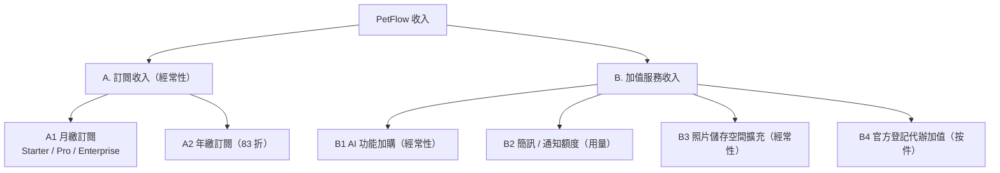
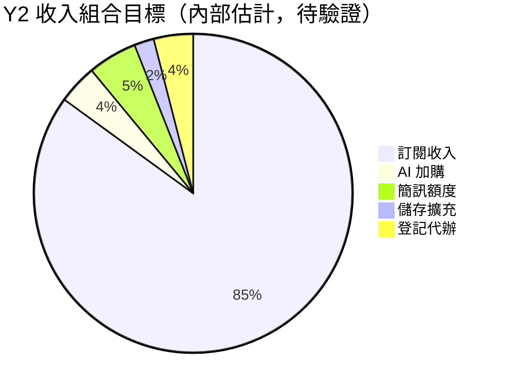

# 收入來源與加值服務清單

> 盤點 PetFlow Enterprise 全部收入來源，定義四項加值服務之內容、計費方式與收入占比目標。

| 文件版本 | 狀態 | 最後更新 | 所屬模組 |
| --- | --- | --- | --- |
| v0.2.0 | 初稿 | 2026-07-02 | 03 商業模式 |

---

## 1. 文件目的

本文件為收入來源的**唯一事實來源（SSOT）**：定義「哪些東西收錢、怎麼收、收多少（估）」。訂閱方案價格以 [02_訂閱方案與定價策略](02_訂閱方案與定價策略.md) 為準；本文件聚焦收入結構與**加值服務**明細。

## 2. 收入來源總覽

商業模式為 **B2B SaaS 訂閱制 + 加值服務**，共兩大類、六個收入流：

| 收入流 | 性質 | 計入 MRR | 主要客群 |
| --- | --- | :-: | --- |
| A1 月繳訂閱 | 經常性 | ✅ | 全部付費租戶 |
| A2 年繳訂閱（83 折） | 經常性（÷12 正規化） | ✅ | 留存導向客戶 |
| B1 AI 功能加購 | 經常性加購 | ✅ | Starter 租戶 |
| B2 簡訊/通知額度 | 用量型（預付點數） | ❌（另計用量收入） | 通知量大的店家 |
| B3 照片儲存空間擴充 | 經常性加購 | ✅ | 照片量大的店家/犬舍 |
| B4 官方登記代辦加值 | 一次性按件 | ❌ | 繁殖者（志明） |

## 3. 訂閱收入（核心）

四層方案：**Free $0（1 店 / 2 使用者 / 30 寵物）、Starter $599（1 店 / 5 使用者 / 200 寵物）、Pro $1,499（3 店 / 15 使用者 / 1,000 寵物 / 含 AI）、Enterprise $3,999 起（店數不限 / 客製 SLA）**，NT$/月/租戶，年繳 83 折。

- Free 為獲客與 MAMP 成長引擎，不直接產生收入。
- 訂閱收入為收入基石，目標長期占總收入 **80–85%**（內部估計，待驗證）。

## 4. 加值服務明細

### 4.1 B1：AI 功能加購

| 項目 | 內容 |
| --- | --- |
| 內容 | 寵物照片品種/特徵辨識、健康紀錄智慧摘要、配種建議（見 [27 AI](../27_AI/README.md)） |
| 適用方案 | **Starter 專屬加購**（Pro/Enterprise 已內含） |
| 定價（估） | NT$299/月/租戶（內部估計，待驗證） |
| 計費 | 隨訂閱週期出帳，計入 MRR |
| 限制 | AI 呼叫量公平使用上限 1,000 次/月，超量降速（內部估計，待驗證） |
| 策略意義 | 讓單店低成本體驗 AI，成為升級 Pro 的中繼站 |

### 4.2 B2：簡訊 / 通知額度

| 項目 | 內容 |
| --- | --- |
| 內容 | 疫苗提醒、回診、預約通知之簡訊發送額度（Email/App 推播不計費，見 [26 通知中心](../26_通知中心/README.md)） |
| 適用方案 | 全部付費方案（Free 不可購買） |
| 內含額度（估） | Starter 50 則/月、Pro 200 則/月、Enterprise 客製（內部估計，待驗證） |
| 加購包定價（估） | 300 則 NT$450、1,000 則 NT$1,300、3,000 則 NT$3,600（內部估計，待驗證） |
| 計費 | 預付點數制，12 個月效期；發送成功才扣點 |
| 成本結構 | 簡訊批發成本約 NT$0.7–0.9/則，目標毛利 35–45%（內部估計，待驗證） |

### 4.3 B3：照片儲存空間擴充

| 項目 | 內容 |
| --- | --- |
| 內容 | 超出方案內含額度之 R2 儲存空間（見 [18 照片管理](../18_照片管理/README.md)） |
| 內含額度（估） | Free 1GB、Starter 10GB、Pro 50GB、Enterprise 客製 |
| 加購定價（估） | NT$99/月/每 10GB（內部估計，待驗證） |
| 計費 | 月費加購，計入 MRR；降購時超量照片唯讀保留（遵循軟刪除原則） |
| 成本結構 | R2 儲存成本極低（約 US$0.015/GB/月），毛利 > 90%（內部估計，待驗證） |

### 4.4 B4：官方登記代辦加值

| 項目 | 內容 |
| --- | --- |
| 內容 | 血統書申請、晶片登記、繁殖登記等官方文件之代辦服務（見 [17 官方登記助手](../17_官方登記助手/README.md)） |
| 適用方案 | Starter 以上 |
| 定價（估） | 平台服務費 NT$150–500/件（依文件類型），規費實支實付另計（內部估計，待驗證） |
| 計費 | 按件計費，完成受理後出帳；不計入 MRR |
| 合作方 | 犬貓協會 / 畜犬協會等登記單位 |
| 策略意義 | 繁殖者（志明）高頻剛需，建立生態系與差異化護城河 |

## 5. 收入組合目標（Y1–Y3）

對應三年藍圖（Y1 台灣 MVP、Y2 連鎖多店+AI+商業化、Y3 國際化+生態系）：

| 收入流 | Y1（MVP 驗證） | Y2（商業化） | Y3（國際化） |
| --- | --- | --- | --- |
| 訂閱（A1+A2） | 90% | 85% | 80% |
| AI 加購（B1） | 0% | 4% | 6% |
| 簡訊額度（B2） | 5% | 5% | 6% |
| 儲存擴充（B3） | 2% | 2% | 3% |
| 登記代辦（B4） | 3% | 4% | 5% |

> 上表為占總收入之百分比目標（內部估計，待驗證）。Y1 聚焦訂閱驗證，AI 於 Y2 隨 Pro 商業化推出。

## 6. 收入認列與出帳原則（商業層）

| 原則 | 說明 |
| --- | --- |
| 訂閱收入 | 按服務期間逐月認列；年繳預收款以遞延收入處理 |
| 用量/按件收入 | 於服務完成（簡訊送達、代辦受理）時認列 |
| 退款 | 月繳恕不退款；年繳依剩餘完整月數按 83 折實付價比例退（內部估計，待驗證，需法務確認） |
| 發票與稅 | 台灣開立電子發票、內含 5% 營業稅；金流細節見 [20 付款系統](../20_付款系統/README.md) |
| 幣別 | Y1–Y2 僅 NT$；Y3 國際化引入多幣別 |

## 7. 明確不收費項目（Free 的邊界）

為維持獲客漏斗與口碑，以下永久免費：

- Free 方案額度內之寵物/飼主基本管理（1 店 / 2 使用者 / 30 寵物）。
- Email 與 App 內推播通知（簡訊除外）。
- 資料匯出（避免綁架資料的負面觀感，同時符合個資可攜精神）。

## 8. 新收入流評估準則

未來新增收入流（如市集抽成、保險導購、API 商用授權）須通過以下檢核才可立案：

1. 與 NSM（MAMP）正相關，不傷害寵物資料的累積誘因。
2. 毛利率 ≥ 50%，或具明確策略價值（生態卡位）。
3. 不與既有方案分層衝突（不得讓加購比升級便宜太多而阻礙升級）。
4. 先修訂本文件（SSOT）再進入 [04 需求分析](../04_需求分析/README.md) 流程。

## 9. 相關文件

- [01_商業模式畫布](01_商業模式畫布.md)
- [02_訂閱方案與定價策略](02_訂閱方案與定價策略.md)
- [05_成本結構分析](05_成本結構分析.md)
- [17 官方登記助手](../17_官方登記助手/README.md)、[18 照片管理](../18_照片管理/README.md)、[26 通知中心](../26_通知中心/README.md)、[27 AI](../27_AI/README.md)

---

> 本文件屬於 PetFlow Enterprise 官方文件，遵循根目錄 CLAUDE.md 之規範。
