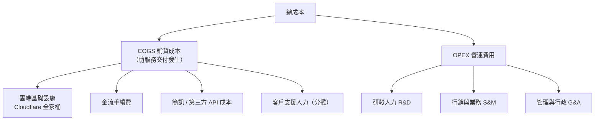

# 成本結構分析

> 拆解 PetFlow Enterprise 的固定與變動成本、COGS 與營運費用，建立毛利率與損益兩平的估算基準。

| 文件版本 | 狀態 | 最後更新 | 所屬模組 |
| --- | --- | --- | --- |
| v0.2.0 | 初稿 | 2026-07-02 | 03 商業模式 |

---

## 1. 文件目的

定義成本分類口徑（COGS vs. OPEX、固定 vs. 變動），估算各項成本規模與每租戶邊際成本，支撐 [03_單位經濟模型](03_單位經濟模型.md) 的 80% 毛利率假設，並推導損益兩平點。全數金額為 **內部估計，待驗證**，以 Y2 商業化階段（約 500 付費租戶）為基準情境。

## 2. 成本分類框架

| 分類 | 判定原則 |
| --- | --- |
| COGS | 服務既有客戶所直接發生的成本（少一個客戶就少一分） |
| OPEX | 打造產品與獲取客戶的投資（不隨單一客戶增減） |
| 固定成本 | 人事、辦公、固定訂閱工具 |
| 變動成本 | 用量計費之雲端、金流費率、簡訊則數 |

## 3. COGS：銷貨成本（變動為主）

### 3.1 雲端基礎設施（Cloudflare Native）

依 [08 Cloudflare Native 原則](../../CLAUDE.md) 之技術選型，邊緣架構使基礎設施成本極低：

| 服務 | 用途 | Y2 月成本估算 |
| --- | --- | --- |
| Workers（含 Paid 方案） | 後端 API | 約 NT$3,000 |
| D1 | 關聯式資料庫 | 約 NT$2,000 |
| R2 | 照片/檔案儲存（估 5TB） | 約 NT$3,500 |
| KV / Queues | 快取、非同步任務 | 約 NT$1,500 |
| Workers AI / Vectorize | AI 推論與向量檢索 | 約 NT$6,000 |
| Pages / WAF / Access | 前端託管與防護 | 約 NT$2,000 |
| **小計** | | **約 NT$18,000 / 月**（內部估計，待驗證） |

> 每付費租戶基礎設施邊際成本約 **NT$36/月**（18,000 ÷ 500），僅占 Blended ARPA（約 NT$1,220）的 3%，為高毛利結構之核心。

### 3.2 金流手續費

- 台灣在地金流（TapPay / 綠界 / Stripe 擇一，見 [20 付款系統](../20_付款系統/README.md)）信用卡費率以 **2.8%** 估算（內部估計，待驗證）。
- Y2 月收入若為 NT$610,000（500 租戶 × ARPA 1,220），手續費約 **NT$17,100/月**。

### 3.3 簡訊與第三方 API

- 簡訊批發成本約 NT$0.7–0.9/則；隨 B2 加購包銷售發生，屬**直接對應收入的變動成本**（目標毛利 35–45%）。
- Y2 估月發送 40,000 則，成本約 **NT$32,000/月**（內部估計，待驗證）。

### 3.4 客戶支援（分攤）

- 1 名客戶成功/支援人員之 60% 工時分攤入 COGS，約 **NT$42,000/月**（內部估計，待驗證）。

### 3.5 COGS 小計與毛利率

| 項目 | 月成本（估） |
| --- | --- |
| 雲端基礎設施 | $18,000 |
| 金流手續費 | $17,100 |
| 簡訊/第三方 API | $32,000 |
| 支援人力分攤 | $42,000 |
| **COGS 合計** | **約 NT$109,000 / 月** |

- Y2 月收入估 NT$610,000 → **毛利率 ≈ 82%**，支持單位經濟模型之 80% 假設（內部估計，待驗證）。

## 4. OPEX：營運費用（固定為主）

以 Y2 團隊規模 9 人估算（含勞健保與雇主成本之全載成本）：

| 類別 | 編制 | 月成本（估） | 占比 |
| --- | --- | --- | --- |
| 研發 R&D | 工程師 4 + 產品 1 + 設計 1 | $720,000 | 約 58% |
| 行銷業務 S&M | 行銷 1 + 業務 1 + 廣告/內容預算 | $310,000 | 約 25% |
| 管理行政 G&A | 兼任財務/行政 1 + 辦公/軟體/法會計 | $130,000 | 約 10% |
| 客戶成功（40% 未分攤 COGS 部分） | — | $28,000 | 約 2% |
| 其他（保險、雜項預備金） | — | $60,000 | 約 5% |
| **OPEX 合計** | | **約 NT$1,248,000 / 月**（內部估計，待驗證） | 100% |

> 固定人力成本占總成本約 65%，符合 SaaS 早期「重研發投資、輕邊際成本」的典型結構。

## 5. 總成本結構與損益兩平

### 5.1 Y2 基準月損益（估）

| 項目 | 金額（NT$/月） |
| --- | --- |
| 收入（500 付費租戶 × ARPA $1,220） | 610,000 |
| （−）COGS | 109,000 |
| **毛利（82%）** | **501,000** |
| （−）OPEX | 1,248,000 |
| **營業損益** | **−747,000**（投資期，內部估計，待驗證） |

### 5.2 損益兩平點

- 每租戶月毛利 ≈ $1,220 × 82% ≈ **NT$1,000**。
- 損益兩平所需付費租戶數 ≈ OPEX 1,248,000 ÷ 1,000 ≈ **約 1,250 個付費租戶**（在 OPEX 不擴編的前提下；內部估計，待驗證）。
- 對照三年藍圖：目標於 **Y3 上半年**達成台灣市場營運損益兩平，國際化投資另計。

## 6. 規模化下的成本行為

| 成本項 | 隨租戶數成長之行為 | 管理策略 |
| --- | --- | --- |
| Cloudflare 基礎設施 | 近線性但單價遞減 | 監控每租戶成本，設 D1/R2 用量告警 |
| 金流手續費 | 與收入成正比（費率固定） | 規模化後議價；推廣年繳降低交易筆數 |
| 簡訊成本 | 與加購銷量成正比 | 批發議價；引導改用 App 推播 |
| 研發人力 | 階梯式成長 | 每 500 付費租戶檢視一次編制 |
| 行銷費用 | 可調節（唯一主動槓桿） | 以 CAC 回收期 ≤ 12 個月為預算上限紀律 |
| 支援人力 | 次線性（自助化） | 知識庫、產品內導引降低單客服務成本 |

## 7. 成本風險與緩解

| 風險 | 影響 | 緩解措施 |
| --- | --- | --- |
| Cloudflare 漲價或方案變更 | COGS 上升、毛利下降 | 用量抽象層設計、每季成本回顧；毛利警戒線 75% |
| 匯率（美元計價雲端服務） | 成本波動 | 預算以 +10% 匯率緩衝編列 |
| AI 推論成本隨用量暴增 | B1/Pro 毛利被侵蝕 | 公平使用上限、快取推論結果、模型分級 |
| 免費租戶儲存濫用 | R2 成本失控 | Free 限 1GB、閒置租戶封存政策 |
| 人力市場薪資上漲 | OPEX 超支 | 精實編制、以 PLG 降低業務人力依賴 |

## 8. 治理原則

1. 本文件估算值每季與實際帳務對帳一次，差異超過 ±15% 須改版本文件並記錄於 [32 版本紀錄](../32_版本紀錄/README.md)。
2. 新增固定成本（人力、年約工具）須附「對 MRR 或 Churn 的預期影響」評估。
3. 毛利率為守門指標：任何新功能/加值服務上線前，須估算其對整體毛利率之影響（低於 75% 警戒線者須重新設計計費）。

## 9. 相關文件

- [01_商業模式畫布](01_商業模式畫布.md)
- [03_單位經濟模型](03_單位經濟模型.md)
- [04_收入來源與加值服務清單](04_收入來源與加值服務清單.md)
- [20 付款系統](../20_付款系統/README.md)、[29 部署](../29_部署/README.md)、[31 Roadmap](../31_Roadmap/README.md)

---

> 本文件屬於 PetFlow Enterprise 官方文件，遵循根目錄 CLAUDE.md 之規範。
