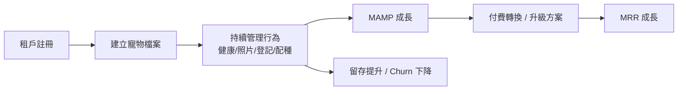
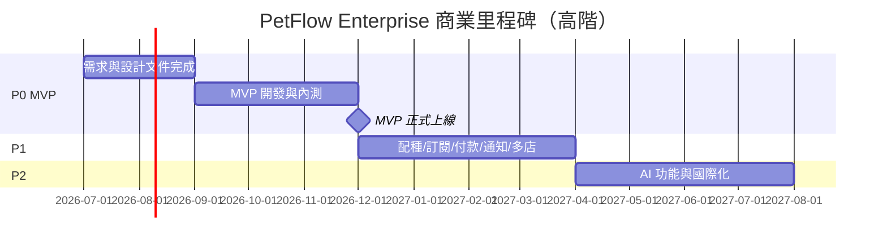

# 商業需求文件（BRD, Business Requirement Document）

> 定義 PetFlow Enterprise 的商業目標、專案範圍、利害關係人與成功衡量標準，作為所有產品需求（PRD）的商業依據。

| 文件版本 | 狀態 | 最後更新 | 所屬模組 |
| --- | --- | --- | --- |
| v0.2.0 | 初稿 | 2026-07-02 | 04 需求分析 |

---

## 1. 文件目的與適用範圍

本文件（BRD）從**商業視角**回答三個問題：

1. **為什麼要做**：市場問題與商業機會為何？
2. **要做到什麼程度**：商業目標與成功指標為何？
3. **界線在哪裡**：哪些屬於本專案範圍，哪些明確排除？

本文件是 [PRD](02_產品需求文件PRD.md)、[功能需求清單](03_功能需求清單.md) 與 [非功能性需求](04_非功能性需求NFR.md) 的上游依據。所有功能需求皆須能追溯至本文件的商業目標（見 [需求追溯矩陣](05_需求追溯矩陣.md)）。

## 2. 背景與問題陳述

### 2.1 市場背景

台灣與亞太地區寵物產業持續成長，寵物店、連鎖門市、專業犬舍/貓舍與寵物服務業者（美容、寄宿、訓練）普遍面臨數位化程度低的營運困境：

- 寵物資料、疫苗紀錄、病歷散落於紙本、Excel 與 LINE 對話中，**查找困難且易遺失**。
- 官方登記（晶片登記、犬籍/血統書申請）流程繁瑣，**依賴個人經驗**，人員異動即斷層。
- 配種紀錄與血統管理缺乏系統化工具，**近親配種風險**難以事前檢核。
- 連鎖門市缺乏跨店統一的客戶（飼主）視圖與權限控管，**資料孤島**嚴重。
- 現有 POS 或客戶管理系統以「交易」為中心，**缺乏以「寵物」為中心的生命週期管理**。

### 2.2 問題陳述（Problem Statement）

> 寵物事業經營者缺乏一套以寵物為中心、支援多店與多角色協作、並涵蓋健康/配種/官方登記等專業流程的雲端管理系統，導致營運效率低落、合規風險升高、客戶體驗不一致。

### 2.3 解決方案概述

**PetFlow Enterprise** 是面向寵物店、連鎖門市、專業繁殖者與寵物服務業者的**多租戶（Multi-Tenant）B2B SaaS 平台**，提供：

- 以寵物為中心的資料管理（寵物、飼主、健康、照片）
- 專業流程數位化（配種管理、官方登記助手）
- 企業級治理（RBAC、Audit Log、Soft Delete、多店管理）
- 訂閱制商業模式（Free / Starter / Pro / Enterprise）
- Cloudflare Native 架構，低營運成本、全球邊緣佈署

## 3. 商業目標（Business Goals）

商業目標採編號 **BG-NNN**，供需求追溯使用。

| 編號 | 商業目標 | 衡量指標 | 目標值（上線後 12 個月） |
| --- | --- | --- | --- |
| BG-001 | 建立以寵物為中心的 SaaS 營運平台，成為寵物事業首選管理工具 | 北極星指標 **MAMP**（每月活躍管理寵物數） | ≥ 50,000 |
| BG-002 | 以訂閱制建立可預期的經常性收入 | MRR（月經常性收入） | ≥ NT$1,500,000 |
| BG-003 | 降低寵物業者的行政作業時間 | 單筆登記/建檔平均耗時 | 較紙本流程減少 ≥ 60% |
| BG-004 | 建立付費轉換漏斗（Free → 付費） | Free → 付費轉換率 | ≥ 8% |
| BG-005 | 支援連鎖與多店客戶，提高客單價 | Pro 以上方案佔付費租戶比例 | ≥ 30% |
| BG-006 | 以合規與稽核能力建立企業信任 | 資料事故（外洩/跨租戶存取）次數 | 0 件 |
| BG-007 | 維持健康的留存 | 付費租戶月流失率（Churn） | ≤ 3% |

### 3.1 北極星指標定義

**MAMP（Monthly Active Managed Pets）**：當月內至少發生一次「有效管理行為」（建檔、健康紀錄、照片上傳、登記申請、配種紀錄等寫入操作）的寵物數量。此指標同時反映租戶活躍度與平台核心價值的實現程度。

## 4. 專案範圍（Scope）

### 4.1 範圍內（In Scope）

依 MVP（P0）、P1、P2 分期，模組代碼對應 `docs/13`–`docs/27` 資料夾：

| 分期 | 模組 | 代碼 | 對應資料夾 |
| --- | --- | --- | --- |
| P0（MVP） | 寵物管理 | PET | `docs/13_寵物管理/` |
| P0（MVP） | 飼主管理 | OWN | `docs/14_飼主管理/` |
| P0（MVP） | 健康管理（疫苗/病歷） | HLT | `docs/15_健康管理/` |
| P0（MVP） | 官方登記助手 | REG | `docs/17_官方登記助手/` |
| P0（MVP） | 照片管理（基礎） | PHT | `docs/18_照片管理/` |
| P0（MVP） | Multi-Tenant | TNT | `docs/22_MultiTenant/` |
| P0（MVP） | RBAC 角色權限 | RBC | `docs/24_RBAC/` |
| P0（MVP） | Audit Log | AUD | `docs/25_AuditLog/` |
| P0（MVP） | Soft Delete（橫切機制） | — | `docs/10_資料庫設計/` |
| P1 | 配種管理 | BRD | `docs/16_配種管理/` |
| P1 | 會員訂閱 | SUB | `docs/19_會員訂閱/` |
| P1 | 付款系統 | PAY | `docs/20_付款系統/` |
| P1 | 通知中心 | NTF | `docs/26_通知中心/` |
| P1 | 多店管理 | STO | `docs/23_多店管理/` |
| P2 | AI 功能 | AI | `docs/27_AI/` |
| P2 | 國際化（i18n） | — | 待立項 |

### 4.2 範圍外（Out of Scope）

以下明確**不在**本專案範圍，避免範圍蔓延：

- ❌ POS 收銀機硬體整合與發票開立（僅保留 API 擴充點）
- ❌ 電商/商品庫存管理（非寵物生命週期核心）
- ❌ 消費者端（C 端）飼主 App（本產品為 B2B，飼主僅為被管理的資料主體；未來可評估飼主入口）
- ❌ 獸醫院 HIS（醫院資訊系統）完整功能（僅涵蓋業者側疫苗/病歷紀錄）
- ❌ 政府登記系統的自動化直連（官方登記助手為「輔助準備與追蹤」，不代辦送件）
- ❌ 自建機房 / 私有化部署（僅 Cloudflare Native SaaS）

## 5. 利害關係人（Stakeholders）

| 類別 | 角色 | 對應 Persona | 關注點 | 影響力 |
| --- | --- | --- | --- | --- |
| 客戶（買方） | 單店寵物店老闆 | 阿豪 | 簡單易用、價格合理、快速建檔 | 高 |
| 客戶（買方） | 連鎖店區經理 | 雅婷 | 跨店報表、權限控管、資料一致 | 高 |
| 客戶（買方） | 專業犬舍繁殖者 | 志明 | 血統管理、配種紀錄、官方登記 | 高 |
| 客戶（使用者） | 門市店員 | 小美 | 操作直覺、行動裝置可用 | 中 |
| 客戶（協作者） | 特約獸醫 | Dr. Chen | 病歷/疫苗紀錄正確性、受限存取 | 中 |
| 內部 | 平台管理員 | 宥廷 | 租戶管理、訂閱/帳務、平台健康 | 高 |
| 內部 | 產品/開發團隊 | — | 需求明確、架構可維護 | 高 |
| 外部 | 政府登記機關 | — | 登記資料格式正確、合規 | 中 |
| 外部 | 金流服務商 | — | 付款整合規範 | 中 |
| 資料主體 | 飼主（消費者） | — | 個資保護（個資法/GDPR 精神） | 中 |

## 6. 商業模式與訂閱方案

定價與商業模式細節見 [`docs/03_商業模式/`](../03_商業模式/README.md)，此處摘錄與需求相關之基準：

| 方案 | 月費（NT$/月） | 目標客群 | 關鍵限制（由 SUB 模組執行） |
| --- | --- | --- | --- |
| Free | $0 | 試用、微型業者 | 寵物數/照片容量/使用者數 低額度 |
| Starter | $599 | 單店（阿豪） | 單店、基礎模組 |
| Pro | $1,499 | 多店/犬舍（雅婷、志明） | 多店、配種、通知、進階報表 |
| Enterprise | $3,999 起 | 連鎖集團 | 客製角色、SLA、專屬支援 |

- 年繳享 **83 折**。
- 方案升降級、額度計算與付款整合為 P1 範圍（SUB / PAY 模組）。

## 7. 商業層級 MoSCoW 排序

| MoSCoW | 內容 | 對應分期 |
| --- | --- | --- |
| **Must Have** | 寵物/飼主/健康管理、官方登記助手、照片基礎、Multi-Tenant、RBAC、Audit Log、Soft Delete | P0（MVP） |
| **Should Have** | 配種管理、會員訂閱、付款系統、通知中心、多店管理 | P1 |
| **Could Have** | AI 功能（照片辨識、健康建議草稿）、國際化 | P2 |
| **Won't Have（本期）** | POS 硬體、電商庫存、C 端 App、HIS、政府系統直連、私有化部署 | 範圍外 |

## 8. 商業限制與假設

### 8.1 限制（Constraints）

| 編號 | 限制 |
| --- | --- |
| C-001 | 技術平台限定 Cloudflare 生態（Pages/Workers/D1/R2/KV/Queues），須遵循 Edge 執行限制 |
| C-002 | 全產品文件、介面預設語言為繁體中文（P2 前不做多語系） |
| C-003 | 團隊規模有限，MVP 須聚焦 P0 模組，不做客製開發 |
| C-004 | 個資處理須符合台灣《個人資料保護法》，並以 GDPR 精神設計（最小蒐集、可刪除/可攜） |
| C-005 | 金流須透過合規之第三方金流服務商，平台不留存卡號 |

### 8.2 假設（Assumptions）

| 編號 | 假設 | 若不成立之影響 |
| --- | --- | --- |
| A-001 | 目標客群願意以月費 NT$599–3,999 訂閱管理工具 | 定價與方案需重新驗證（02 市場分析） |
| A-002 | 業者可接受純雲端 SaaS（無單機版） | 需重新評估離線能力優先級 |
| A-003 | 官方登記流程規則可由文件化規則引擎維護 | REG 模組需增加人工維運成本 |
| A-004 | Cloudflare D1/R2 容量與效能足以支撐目標規模 | 需調整資料分片或儲存策略（09 系統架構） |

## 9. 商業風險

| 編號 | 風險 | 可能性 | 衝擊 | 因應策略 |
| --- | --- | --- | --- | --- |
| R-001 | 跨租戶資料外洩重創信任 | 低 | 極高 | Multi-Tenant 隔離為 P0；所有查詢強制 `tenantId`；滲透測試 |
| R-002 | 官方登記規則變動導致助手內容過時 | 中 | 高 | 規則版本化管理、免責聲明、規則更新 SOP |
| R-003 | Free 方案濫用（照片儲存成本） | 中 | 中 | 額度限制、R2 生命週期政策、防濫用機制 |
| R-004 | 競品（POS 廠商）向下延伸 | 中 | 中 | 深耕配種/登記等專業差異化功能 |
| R-005 | P1 金流整合延誤影響變現 | 中 | 高 | MVP 期間先以人工開通付費方案過渡 |
| R-006 | 業者數位能力不足導致 Onboarding 失敗 | 中 | 中 | 引導式建檔、匯入工具、範本資料 |

## 10. 成功標準與驗收（Business Acceptance Criteria）

MVP 上線後 3 個月內達成以下條件，視為商業面驗收通過：

- [ ] 註冊租戶 ≥ 300，其中活躍租戶（週活）≥ 40%
- [ ] MAMP ≥ 5,000
- [ ] 至少 20 個付費租戶（Starter 以上）
- [ ] 跨租戶資料存取事故 = 0（BG-006）
- [ ] 客戶建檔（寵物 + 飼主）平均耗時 ≤ 3 分鐘（BG-003）
- [ ] 系統可用性符合 [NFR](04_非功能性需求NFR.md) 基準（API P95 < 500ms、RPO ≤ 24h、RTO ≤ 4h）

## 11. 里程碑（高階時程）

詳細時程見 [`docs/31_Roadmap/`](../31_Roadmap/README.md)，此處為商業層級里程碑：

## 12. 相關文件

- [02_產品需求文件PRD.md](02_產品需求文件PRD.md)：本 BRD 的產品層落地
- [03_功能需求清單.md](03_功能需求清單.md)：全模組功能需求（含 MoSCoW）
- [04_非功能性需求NFR.md](04_非功能性需求NFR.md)：品質屬性基準
- [05_需求追溯矩陣.md](05_需求追溯矩陣.md)：BG ↔ FR ↔ 模組追溯
- [`docs/01_產品願景/`](../01_產品願景/README.md)、[`docs/02_市場分析/`](../02_市場分析/README.md)、[`docs/03_商業模式/`](../03_商業模式/README.md)

---

> 本文件屬於 PetFlow Enterprise 官方文件，遵循根目錄 CLAUDE.md 之規範。
