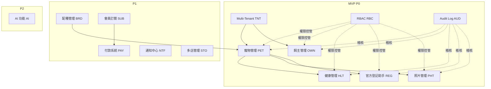
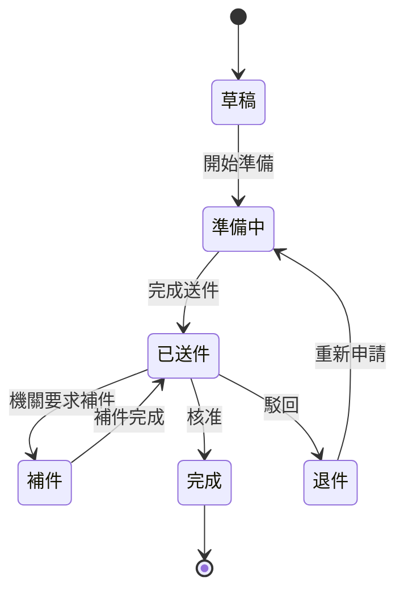
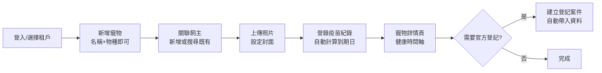
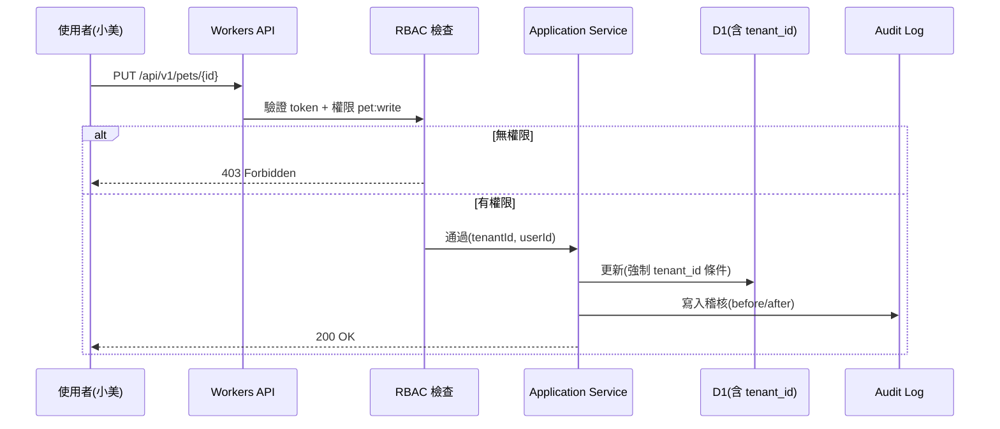

# 產品需求文件（PRD, Product Requirement Document）

> 定義 PetFlow Enterprise 的產品範圍、各模組功能需求概述、使用者流程與驗收標準，銜接 BRD 商業目標與後續設計開發。

| 文件版本 | 狀態 | 最後更新 | 所屬模組 |
| --- | --- | --- | --- |
| v0.2.0 | 初稿 | 2026-07-02 | 04 需求分析 |

---

## 1. 產品概述

### 1.1 一句話定義

**PetFlow Enterprise**：面向寵物店、連鎖門市、專業繁殖者與寵物服務業者的多租戶 B2B SaaS，以「寵物」為中心管理生命週期資料——飼主、健康、照片、配種與官方登記——並內建企業級治理（Multi-Tenant、RBAC、Audit Log、Soft Delete）。

### 1.2 產品目標（對應 BRD 商業目標）

| 產品目標 | 對應商業目標 |
| --- | --- |
| 3 分鐘內完成寵物 + 飼主建檔 | BG-003 |
| 疫苗/健康到期可視化與提醒（P1 通知） | BG-001、BG-007 |
| 官方登記文件準備時間減半 | BG-003 |
| 跨店資料一致且權限隔離 | BG-005、BG-006 |
| 免費方案可完整體驗核心流程 | BG-004 |

### 1.3 目標使用者（Persona 摘要）

Persona 完整定義見 [`docs/05_使用者角色/`](../05_使用者角色/README.md)。

| Persona | 角色 | 主要場景 | 關鍵模組 |
| --- | --- | --- | --- |
| 阿豪 | 單店寵物店老闆 | 建檔、健康紀錄、日常營運 | PET / OWN / HLT / PHT |
| 雅婷 | 連鎖店區經理 | 跨店查詢、報表、權限管理 | STO / RBC / AUD |
| 志明 | 專業犬舍繁殖者 | 血統/配種管理、犬籍登記 | BRD / REG / PET |
| 小美 | 門市店員 | 前台快速查詢與登錄 | PET / OWN / PHT |
| Dr. Chen | 特約獸醫 | 疫苗/病歷登錄與查閱 | HLT |
| 宥廷 | 平台管理員 | 租戶/訂閱/平台維運 | TNT / SUB / PAY / AUD |

## 2. 版本與範圍

| 版本 | 範圍 | 模組 |
| --- | --- | --- |
| **MVP（P0）** | 核心資料管理 + 治理 | PET、OWN、HLT、REG、PHT（基礎）、TNT、RBC、AUD、Soft Delete |
| **P1** | 專業流程 + 變現 | BRD、SUB、PAY、NTF、STO |
| **P2** | 智慧化 + 擴張 | AI、國際化 |

## 3. 模組需求概述

> 本章為各模組的產品層需求概述與驗收標準；完整功能需求編號清單見 [03_功能需求清單.md](03_功能需求清單.md)，模組細部規格見各自 `docs/13`–`docs/27` 資料夾。

### 3.1 寵物管理（PET）— P0

以寵物為中心的主檔管理，是全平台的核心 Aggregate。

**核心能力**

- 寵物建檔：名稱、物種、品種、性別、生日、晶片號碼、毛色、體重、狀態（在店/已售/寄養/歿）
- 寵物列表：搜尋（名稱/晶片/品種）、過濾、排序、分頁
- 寵物詳情頁：整合健康摘要、照片、飼主關聯、登記狀態
- 寵物與飼主的關聯（一寵多飼主的共同飼養、轉讓歷程）
- 軟刪除與還原

**驗收標準（摘要）**

- [ ] 必填欄位僅名稱與物種即可建檔，其餘可後補（3 分鐘建檔目標）
- [ ] 晶片號碼於租戶內唯一，重複時顯示明確錯誤（409）
- [ ] 列表 1,000 筆內搜尋回應 P95 < 500ms
- [ ] 刪除後預設不出現在任何列表/搜尋，可於回收區還原

### 3.2 飼主管理（OWN）— P0

**核心能力**

- 飼主建檔：姓名、電話（主鍵識別）、Email、地址、備註、標籤
- 飼主與寵物雙向關聯視圖
- 重複偵測（同電話提示合併）
- 個資遮蔽顯示（依 RBAC 權限決定完整/遮蔽）

**驗收標準（摘要）**

- [ ] 從寵物頁可一鍵新增並關聯飼主
- [ ] 電話重複時提示既有飼主，可直接關聯而非重建
- [ ] 無「查看完整個資」權限者，電話/地址遮蔽顯示

### 3.3 健康管理（HLT）— P0

**核心能力**

- 疫苗紀錄：疫苗種類、施打日、下次到期日、獸醫、批號
- 病歷紀錄：日期、症狀、診斷、處置、用藥、附件（照片/報告）
- 驅蟲/健檢等一般健康事件
- 健康時間軸（Timeline）視圖
- 到期提醒清單（P0 為站內清單；推播提醒屬 P1 NTF）

**驗收標準（摘要）**

- [ ] 疫苗紀錄建立時可自動帶出建議下次到期日（依疫苗種類規則）
- [ ] 健康時間軸依時間倒序整合疫苗/病歷/健康事件
- [ ] 「即將到期」清單可依 7/30/90 天過濾

### 3.4 官方登記助手（REG）— P0

協助業者準備與追蹤官方登記（寵物晶片登記、犬籍/血統書申請），**不代辦送件**。

**核心能力**

- 登記類型範本：所需文件清單、流程步驟、注意事項（規則版本化）
- 登記案件（Case）管理：狀態機（草稿 → 準備中 → 已送件 → 補件 → 完成/退件）
- 自寵物/飼主主檔自動帶入申請資料，產出可列印的申請資料彙整
- 案件與寵物檔案關聯、進度追蹤

**驗收標準（摘要）**

- [ ] 建立案件時自動帶入寵物與飼主資料，缺漏欄位以檢核清單提示
- [ ] 狀態流轉僅允許合法轉移，非法轉移回 422
- [ ] 規則範本更新不影響既有進行中案件（版本綁定）

### 3.5 照片管理（PHT，基礎）— P0

**核心能力**

- 寵物照片上傳（R2 儲存）、封面照設定、相簿檢視
- 縮圖自動產生（Queues 非同步處理）
- 依訂閱方案限制容量與單檔大小
- 照片軟刪除與還原

**驗收標準（摘要）**

- [ ] 支援 JPEG/PNG/WebP，單檔上限依方案（Free 5MB 起）
- [ ] 上傳後列表先顯示處理中縮圖佔位，處理完成自動更新
- [ ] 超出容量額度時阻擋上傳並提示升級（422 + 明確錯誤碼）

### 3.6 Multi-Tenant（TNT）— P0

**核心能力**

- 租戶註冊、租戶設定（名稱、Logo、時區）
- 資料層強制隔離：所有資料表含 `tenant_id`，所有查詢強制帶 `tenantId`
- 使用者邀請加入租戶、租戶內使用者管理
- 平台管理員（宥廷）之租戶總覽（不含租戶業務資料內容存取）

**驗收標準（摘要）**

- [ ] 任一 API 無法讀寫他租戶資料（自動化跨租戶測試 0 漏洞）
- [ ] Repository 介面層強制 `tenantId` 參數（見 CLAUDE.md 第 4 節）

### 3.7 RBAC（RBC）— P0

**核心能力**

- 預設角色：租戶擁有者、店長、店員、特約獸醫、唯讀
- 權限 = 資源 × 動作（如 `pet:read`、`pet:write`、`owner:pii:read`）
- 每個 API 宣告所需權限，**Deny by default**
- Enterprise 方案支援自訂角色（P1 延伸）

**驗收標準（摘要）**

- [ ] 無權限呼叫回 403，且不洩漏資源是否存在之多餘資訊
- [ ] 角色權限矩陣與 [`docs/24_RBAC/`](../24_RBAC/README.md) 一致

### 3.8 Audit Log（AUD）— P0

**核心能力**

- 所有寫入操作（建立/修改/刪除/還原）自動記錄：who / what / when / where / before-after / tenantId
- 稽核日誌唯讀、不可竄改、可查詢過濾（操作者、實體、時間區間）
- 匯出（CSV）供合規需求

**驗收標準（摘要）**

- [ ] 任一寫入 API 完成後可於稽核查詢中找到對應紀錄
- [ ] 稽核紀錄無任何更新/刪除 API

### 3.9 配種管理（BRD）— P1

**核心能力**

- 配種紀錄：父母、配種日、預產期、結果（產仔數、幼犬/幼貓建檔連動）
- 血統樹視圖（至少三代）
- 近親係數檢核與警示
- 發情/預產期日曆

### 3.10 會員訂閱（SUB）— P1

**核心能力**

- 方案管理：Free $0 / Starter $599 / Pro $1,499 / Enterprise $3,999 起（NT$/月），年繳 83 折
- 方案額度控制（寵物數、使用者數、照片容量、門市數）
- 升級即時生效、降級於週期末生效；額度超額時的降級防呆
- 試用與到期寬限期

### 3.11 付款系統（PAY）— P1

**核心能力**

- 第三方金流整合（信用卡定期定額）、平台不留存卡號
- 發票/收據、付款失敗重試與催繳流程
- 帳務對帳報表（平台管理員）

### 3.12 通知中心（NTF）— P1

**核心能力**

- 通知類型：疫苗到期、預產期、登記案件狀態變更、訂閱帳務
- 通道：站內通知（基礎）、Email、LINE Notify（延伸）
- 使用者層級通知偏好設定；經 Queues 非同步發送

### 3.13 多店管理（STO）— P1

**核心能力**

- 租戶下多門市（Store）結構，寵物/使用者歸屬門市
- 跨店查詢與調撥（寵物轉店），權限可限定門市範圍
- 跨店儀表板（雅婷場景）

### 3.14 AI 功能（AI）— P2

**核心能力（候選）**

- 照片品種辨識建議（Workers AI）
- 病歷摘要與健康建議「草稿」（人工確認後才儲存，不做醫療診斷）
- 自然語言搜尋（Vectorize）

## 4. 關鍵使用者流程

### 4.1 MVP 核心流程：建檔到健康管理

### 4.2 權限與稽核橫切流程

## 5. 產品層非功能需求（摘要）

完整清單見 [04_非功能性需求NFR.md](04_非功能性需求NFR.md)。

| 類別 | 基準 |
| --- | --- |
| 效能 | API P95 < 500ms |
| 可用性/備援 | RPO ≤ 24h、RTO ≤ 4h |
| 架構 | Cloudflare Native（Workers/D1/R2/KV/Queues） |
| API | API First、OpenAPI 3.1、`/api/v1` 版本前綴 |
| 程式品質 | TypeScript strict、禁止 `any`、Zod 輸入驗證 |
| 無障礙 | WCAG 2.1 AA |
| UI | Material Design 3、Mobile First、觸控目標 ≥ 48×48dp |
| 資料治理 | Soft Delete、Audit Log、Migration Up/Down |

## 6. 發佈標準（Release Criteria）

MVP 發佈須全數滿足：

- [ ] P0 功能需求（見 [03_功能需求清單.md](03_功能需求清單.md) 標記 P0 者）100% 完成並通過驗收
- [ ] 跨租戶隔離自動化測試通過率 100%
- [ ] 所有 P0 API 具 OpenAPI 3.1 合約並與實作一致
- [ ] NFR 中標記 P0 的項目全部達標
- [ ] 稽核日誌覆蓋所有寫入 API
- [ ] 使用者文件（Onboarding 指南）完成

## 7. 開放議題（Open Issues）

| 編號 | 議題 | 影響模組 | 目標決議時間 |
| --- | --- | --- | --- |
| OI-001 | 飼主是否於 P2 提供自助入口（查看自家寵物健康紀錄） | OWN / TNT | P1 規劃前 |
| OI-002 | 官方登記規則涵蓋範圍（先犬籍或先晶片登記） | REG | MVP 設計期 |
| OI-003 | Free 方案具體額度數字（寵物數/容量） | SUB | MVP 設計期 |
| OI-004 | LINE 通知採 LINE Notify 或官方帳號 Messaging API | NTF | P1 規劃前 |

## 8. 相關文件

- [01_商業需求文件BRD.md](01_商業需求文件BRD.md)
- [03_功能需求清單.md](03_功能需求清單.md)
- [04_非功能性需求NFR.md](04_非功能性需求NFR.md)
- [05_需求追溯矩陣.md](05_需求追溯矩陣.md)
- [`docs/06_User_Story/`](../06_User_Story/README.md)、[`docs/07_Use_Case/`](../07_Use_Case/README.md)、[`docs/11_API設計/`](../11_API設計/README.md)

---

> 本文件屬於 PetFlow Enterprise 官方文件，遵循根目錄 CLAUDE.md 之規範。
