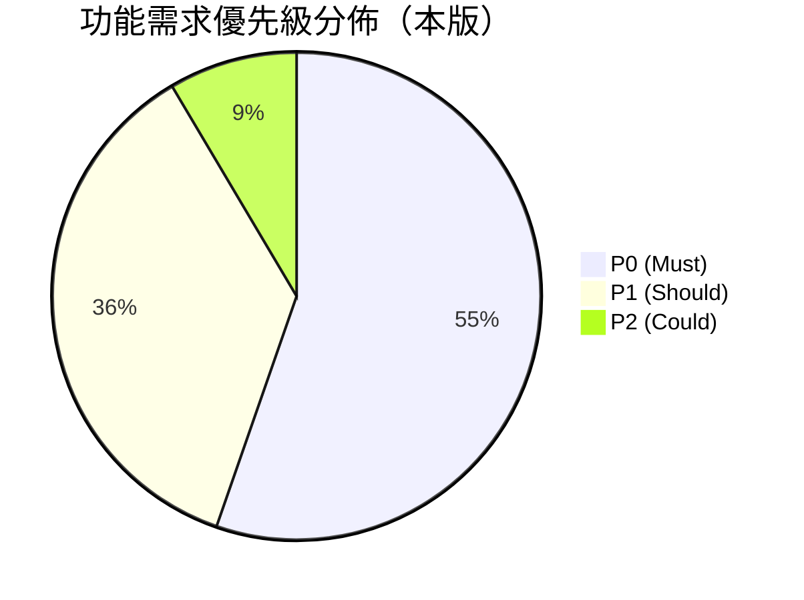

# 功能需求清單（含 MoSCoW 標記）

> 以需求編號 FR-<模組代碼>-NNN 逐條列出全模組功能需求，標註優先級（P0/P1/P2）與 MoSCoW，作為 User Story、Use Case、API 設計與測試的追溯基準。

| 文件版本 | 狀態 | 最後更新 | 所屬模組 |
| --- | --- | --- | --- |
| v0.2.0 | 初稿 | 2026-07-02 | 04 需求分析 |

---

## 1. 使用說明

### 1.1 編號與欄位規則

- **需求編號**：`FR-<模組代碼>-NNN`，例：`FR-PET-001`。編號一經發佈**不得重用**；廢止需求標記「已廢止」保留編號。
- **優先級**：`P0`（MVP 必要）/ `P1`（第二階段）/ `P2`(第三階段)。
- **MoSCoW**：M（Must）/ S（Should）/ C（Could）/ W（Won't，本期不做）。原則上 P0=M、P1=S、P2=C，個別例外於備註說明。
- 非功能性需求（NFR-NNN）另見 [04_非功能性需求NFR.md](04_非功能性需求NFR.md)。

### 1.2 模組代碼對照

| 代碼 | 模組 | 對應資料夾 | 優先級 |
| --- | --- | --- | --- |
| PET | 寵物管理 | `docs/13_寵物管理/` | P0 |
| OWN | 飼主管理 | `docs/14_飼主管理/` | P0 |
| HLT | 健康管理 | `docs/15_健康管理/` | P0 |
| BRD | 配種管理 | `docs/16_配種管理/` | P1 |
| REG | 官方登記助手 | `docs/17_官方登記助手/` | P0 |
| PHT | 照片管理 | `docs/18_照片管理/` | P0（基礎） |
| SUB | 會員訂閱 | `docs/19_會員訂閱/` | P1 |
| PAY | 付款系統 | `docs/20_付款系統/` | P1 |
| STO | 多店管理 | `docs/23_多店管理/` | P1 |
| RBC | RBAC | `docs/24_RBAC/` | P0 |
| AUD | Audit Log | `docs/25_AuditLog/` | P0 |
| NTF | 通知中心 | `docs/26_通知中心/` | P1 |
| AI | AI 功能 | `docs/27_AI/` | P2 |
| TNT | Multi-Tenant | `docs/22_MultiTenant/` | P0 |

### 1.3 優先級分佈總覽

## 2. 寵物管理（PET）— `docs/13_寵物管理/`

| 編號 | 需求描述 | 優先級 | MoSCoW |
| --- | --- | --- | --- |
| FR-PET-001 | 建立寵物檔案：必填名稱與物種；選填品種、性別、生日、晶片號碼、毛色、體重、備註 | P0 | M |
| FR-PET-002 | 晶片號碼於同一租戶內唯一，重複建立回 409 與明確錯誤訊息 | P0 | M |
| FR-PET-003 | 寵物列表：關鍵字搜尋（名稱/晶片/品種）、狀態過濾、排序、游標分頁 | P0 | M |
| FR-PET-004 | 寵物詳情頁整合健康摘要、封面照、飼主關聯、登記案件狀態 | P0 | M |
| FR-PET-005 | 編輯寵物資料，變更寫入 Audit Log（before/after） | P0 | M |
| FR-PET-006 | 寵物狀態管理：在店 / 已售 / 寄養 / 歿，狀態變更留存歷程 | P0 | M |
| FR-PET-007 | 軟刪除寵物與回收區還原；已刪除資料預設不出現於任何查詢 | P0 | M |
| FR-PET-008 | 寵物體重紀錄（多筆歷史）與趨勢圖 | P1 | S |
| FR-PET-009 | 品種主檔（犬/貓常見品種內建清單，可自訂新增） | P0 | M |
| FR-PET-010 | 寵物資料批次匯入（CSV 範本），含格式檢核與錯誤報告 | P1 | S |
| FR-PET-011 | 寵物轉讓：變更主要飼主並保留轉讓歷程 | P1 | S |
| FR-PET-012 | 寵物 QR Code 產生（掃描直達詳情頁，供店內識別） | P2 | C |

## 3. 飼主管理（OWN）— `docs/14_飼主管理/`

| 編號 | 需求描述 | 優先級 | MoSCoW |
| --- | --- | --- | --- |
| FR-OWN-001 | 建立飼主檔案：必填姓名與電話；選填 Email、地址、備註 | P0 | M |
| FR-OWN-002 | 電話重複偵測：建立時提示既有飼主並可直接選用 | P0 | M |
| FR-OWN-003 | 飼主列表：搜尋（姓名/電話）、標籤過濾、分頁 | P0 | M |
| FR-OWN-004 | 飼主詳情頁顯示名下所有寵物與互動紀錄 | P0 | M |
| FR-OWN-005 | 寵物—飼主多對多關聯（共同飼養），可指定主要飼主 | P0 | M |
| FR-OWN-006 | 個資遮蔽：無 `owner:pii:read` 權限者電話/地址遮蔽顯示 | P0 | M |
| FR-OWN-007 | 飼主軟刪除與還原；有在店寵物關聯時刪除須二次確認 | P0 | M |
| FR-OWN-008 | 飼主標籤管理（VIP、黑名單、待回訪等自訂標籤） | P1 | S |
| FR-OWN-009 | 飼主合併：重複飼主合併並轉移寵物關聯，過程寫入 Audit Log | P1 | S |
| FR-OWN-010 | 飼主資料匯出（個資法資料可攜要求，限有權限者） | P1 | S |

## 4. 健康管理（HLT）— `docs/15_健康管理/`

| 編號 | 需求描述 | 優先級 | MoSCoW |
| --- | --- | --- | --- |
| FR-HLT-001 | 建立疫苗紀錄：疫苗種類、施打日、下次到期日、施打獸醫、疫苗批號 | P0 | M |
| FR-HLT-002 | 依疫苗種類規則自動建議下次到期日（可手動覆寫） | P0 | M |
| FR-HLT-003 | 建立病歷紀錄：日期、症狀、診斷、處置、用藥、附件 | P0 | M |
| FR-HLT-004 | 一般健康事件紀錄（驅蟲、健檢、洗牙等，事件類型可設定） | P0 | M |
| FR-HLT-005 | 健康時間軸：整合疫苗/病歷/事件依時間倒序呈現 | P0 | M |
| FR-HLT-006 | 疫苗到期清單：依 7/30/90 天視窗過濾，跨寵物彙總 | P0 | M |
| FR-HLT-007 | 健康紀錄附件上傳（照片/檢驗報告，存 R2） | P0 | M |
| FR-HLT-008 | 健康紀錄軟刪除與還原；醫療紀錄修改須寫入 Audit Log | P0 | M |
| FR-HLT-009 | 特約獸醫角色（Dr. Chen）僅可存取被授權寵物之健康資料 | P0 | M |
| FR-HLT-010 | 疫苗種類主檔管理（內建常見疫苗 + 租戶自訂） | P0 | M |
| FR-HLT-011 | 過敏與慢性病警示標記，於寵物詳情頁醒目顯示 | P1 | S |
| FR-HLT-012 | 健康紀錄 PDF 匯出（提供飼主或轉診使用） | P1 | S |

## 5. 配種管理（BRD）— `docs/16_配種管理/`

| 編號 | 需求描述 | 優先級 | MoSCoW |
| --- | --- | --- | --- |
| FR-BRD-001 | 建立配種紀錄：父/母（站內寵物或外部個體）、配種日、方式 | P1 | S |
| FR-BRD-002 | 自動計算預產期（依物種孕期規則）並可手動調整 | P1 | S |
| FR-BRD-003 | 產仔紀錄：產仔數、存活數、幼犬/幼貓一鍵批次建檔並自動建立親子關聯 | P1 | S |
| FR-BRD-004 | 血統樹視圖：以寵物為節點呈現至少三代祖先 | P1 | S |
| FR-BRD-005 | 近親係數（COI）計算與配種前警示 | P1 | S |
| FR-BRD-006 | 發情週期紀錄與下次發情預估 | P1 | S |
| FR-BRD-007 | 繁殖日曆：發情/配種/預產期整合檢視 | P1 | S |
| FR-BRD-008 | 外部種公/種母個體登錄（非本租戶在養，僅供血統紀錄） | P1 | S |

## 6. 官方登記助手（REG）— `docs/17_官方登記助手/`

| 編號 | 需求描述 | 優先級 | MoSCoW |
| --- | --- | --- | --- |
| FR-REG-001 | 登記類型範本管理：所需文件、流程步驟、注意事項（平台維護、版本化） | P0 | M |
| FR-REG-002 | 建立登記案件並自動帶入寵物/飼主主檔資料 | P0 | M |
| FR-REG-003 | 案件資料完整性檢核清單：缺漏欄位/文件逐項提示 | P0 | M |
| FR-REG-004 | 案件狀態機：草稿→準備中→已送件→補件→完成/退件，非法轉移回 422 | P0 | M |
| FR-REG-005 | 產出申請資料彙整頁（可列印/PDF），格式對應官方表單欄位 | P0 | M |
| FR-REG-006 | 案件與寵物檔案雙向關聯，寵物詳情頁顯示登記狀態 | P0 | M |
| FR-REG-007 | 案件文件附件管理（掃描檔上傳至 R2） | P0 | M |
| FR-REG-008 | 規則範本版本綁定：範本更新不影響進行中案件 | P0 | M |
| FR-REG-009 | 案件狀態變更通知（站內；Email 推播屬 NTF P1） | P1 | S |
| FR-REG-010 | 登記案件統計報表（各狀態件數、平均完成天數） | P1 | S |

## 7. 照片管理（PHT）— `docs/18_照片管理/`

| 編號 | 需求描述 | 優先級 | MoSCoW |
| --- | --- | --- | --- |
| FR-PHT-001 | 寵物照片上傳（JPEG/PNG/WebP），儲存於 R2 | P0 | M |
| FR-PHT-002 | 縮圖自動產生（Queues 非同步），處理中顯示佔位 | P0 | M |
| FR-PHT-003 | 設定封面照，於列表與詳情頁顯示 | P0 | M |
| FR-PHT-004 | 寵物相簿檢視（網格、燈箱放大） | P0 | M |
| FR-PHT-005 | 依訂閱方案限制總容量與單檔大小，超額回 422 並提示升級 | P0 | M |
| FR-PHT-006 | 照片軟刪除與還原；還原時回復容量計算 | P0 | M |
| FR-PHT-007 | 照片存取授權：URL 須簽章/授權，不可公開列舉 | P0 | M |
| FR-PHT-008 | 批次上傳（多選/拖曳） | P1 | S |
| FR-PHT-009 | 照片標籤與拍攝日期整理 | P1 | S |
| FR-PHT-010 | 影像自動壓縮與 EXIF 清理（隱私） | P1 | S |

## 8. 會員訂閱（SUB）— `docs/19_會員訂閱/`

| 編號 | 需求描述 | 優先級 | MoSCoW |
| --- | --- | --- | --- |
| FR-SUB-001 | 方案主檔：Free $0 / Starter $599 / Pro $1,499 / Enterprise $3,999 起（NT$/月） | P1 | S |
| FR-SUB-002 | 年繳方案 83 折計價與週期管理 | P1 | S |
| FR-SUB-003 | 方案額度定義與即時檢核（寵物數、使用者數、照片容量、門市數） | P1 | S |
| FR-SUB-004 | 升級即時生效並按比例補收；降級於當期週期末生效 | P1 | S |
| FR-SUB-005 | 降級防呆：現有用量超過目標方案額度時阻擋並列出須處理項目 | P1 | S |
| FR-SUB-006 | 試用期與到期寬限期（唯讀模式），到期前站內提醒 | P1 | S |
| FR-SUB-007 | 租戶訂閱狀態頁：目前方案、用量儀表板、帳單歷史 | P1 | S |
| FR-SUB-008 | 平台管理員（宥廷）手動開通/調整方案（MVP 過渡與客服用） | P0 | M |

> 備註：FR-SUB-008 為 P0 例外——MVP 期間付款未上線，需以人工開通支撐早期付費客戶（對應 BRD 風險 R-005）。

## 9. 付款系統（PAY）— `docs/20_付款系統/`

| 編號 | 需求描述 | 優先級 | MoSCoW |
| --- | --- | --- | --- |
| FR-PAY-001 | 第三方金流整合：信用卡定期定額扣款，平台不留存卡號 | P1 | S |
| FR-PAY-002 | 付款結果 Webhook 處理（成功/失敗/退款），冪等處理重複通知 | P1 | S |
| FR-PAY-003 | 付款失敗自動重試（排程）與催繳通知流程 | P1 | S |
| FR-PAY-004 | 收據/發票資訊管理與開立紀錄 | P1 | S |
| FR-PAY-005 | 退款申請與處理流程（平台管理員審核） | P1 | S |
| FR-PAY-006 | 平台對帳報表：期間交易明細、金流手續費、異常清單 | P1 | S |

## 10. 多店管理（STO）— `docs/23_多店管理/`

| 編號 | 需求描述 | 優先級 | MoSCoW |
| --- | --- | --- | --- |
| FR-STO-001 | 租戶下建立多門市（Store），維護門市基本資料 | P1 | S |
| FR-STO-002 | 寵物、使用者可歸屬門市；查詢可依門市過濾 | P1 | S |
| FR-STO-003 | 使用者權限可限定門市範圍（店員僅見所屬門市資料） | P1 | S |
| FR-STO-004 | 寵物跨店調撥（轉店）流程與歷程紀錄 | P1 | S |
| FR-STO-005 | 跨店儀表板：各店寵物數、健康到期數、登記案件數（雅婷場景） | P1 | S |
| FR-STO-006 | 門市數額度依訂閱方案限制（與 SUB 連動） | P1 | S |

## 11. RBAC（RBC）— `docs/24_RBAC/`

| 編號 | 需求描述 | 優先級 | MoSCoW |
| --- | --- | --- | --- |
| FR-RBC-001 | 內建角色：租戶擁有者、店長、店員、特約獸醫、唯讀 | P0 | M |
| FR-RBC-002 | 權限模型：資源 × 動作（如 `pet:read`、`owner:pii:read`），Deny by default | P0 | M |
| FR-RBC-003 | 每個 API 端點宣告所需權限並於中介層強制檢查 | P0 | M |
| FR-RBC-004 | 使用者—角色指派管理介面（租戶擁有者/店長操作） | P0 | M |
| FR-RBC-005 | 403 回應不洩漏資源存在性等多餘資訊 | P0 | M |
| FR-RBC-006 | 角色/權限變更寫入 Audit Log | P0 | M |
| FR-RBC-007 | 自訂角色（Enterprise 方案）：以權限組合建立租戶自訂角色 | P1 | S |

## 12. Audit Log（AUD）— `docs/25_AuditLog/`

| 編號 | 需求描述 | 優先級 | MoSCoW |
| --- | --- | --- | --- |
| FR-AUD-001 | 所有寫入操作自動記錄：who / what / when / where(IP/裝置) / before-after / tenantId | P0 | M |
| FR-AUD-002 | 稽核日誌唯讀不可竄改：無更新/刪除介面，儲存層附加式寫入 | P0 | M |
| FR-AUD-003 | 稽核查詢：依操作者、實體類型、實體 ID、動作、時間區間過濾 | P0 | M |
| FR-AUD-004 | 稽核查詢受權限控管（`audit:read`），且僅限本租戶紀錄 | P0 | M |
| FR-AUD-005 | 稽核紀錄 CSV 匯出 | P1 | S |
| FR-AUD-006 | 保留政策：依方案設定保留期（Free 90 天起、Enterprise 可延長） | P1 | S |

## 13. 通知中心（NTF）— `docs/26_通知中心/`

| 編號 | 需求描述 | 優先級 | MoSCoW |
| --- | --- | --- | --- |
| FR-NTF-001 | 站內通知：鈴鐺清單、未讀計數、已讀標記 | P1 | S |
| FR-NTF-002 | 通知事件：疫苗到期、預產期臨近、登記案件狀態變更、訂閱帳務 | P1 | S |
| FR-NTF-003 | Email 通知通道與範本管理 | P1 | S |
| FR-NTF-004 | 使用者通知偏好：依事件類型開關與通道選擇 | P1 | S |
| FR-NTF-005 | 通知經 Cloudflare Queues 非同步發送，失敗重試與死信處理 | P1 | S |
| FR-NTF-006 | LINE 通知通道 | P2 | C |

## 14. AI 功能（AI）— `docs/27_AI/`

| 編號 | 需求描述 | 優先級 | MoSCoW |
| --- | --- | --- | --- |
| FR-AI-001 | 照片品種辨識建議：上傳照片時提供品種候選（Workers AI），人工確認後採用 | P2 | C |
| FR-AI-002 | 病歷摘要草稿產生：彙整健康時間軸產出摘要草稿，須人工確認，不做醫療診斷 | P2 | C |
| FR-AI-003 | 自然語言搜尋：以語意檢索寵物/飼主/紀錄（Vectorize） | P2 | C |
| FR-AI-004 | AI 產出內容一律標示「AI 產生」並記錄於 Audit Log | P2 | C |

## 15. Multi-Tenant（TNT）— `docs/22_MultiTenant/`

| 編號 | 需求描述 | 優先級 | MoSCoW |
| --- | --- | --- | --- |
| FR-TNT-001 | 租戶註冊與初始化（建立擁有者帳號、預設角色、預設方案 Free） | P0 | M |
| FR-TNT-002 | 資料層隔離：所有業務資料表含 `tenant_id`；Repository 查詢強制帶 `tenantId` | P0 | M |
| FR-TNT-003 | 認證 Token 綁定租戶上下文；跨租戶請求一律 403/404 | P0 | M |
| FR-TNT-004 | 租戶設定：名稱、Logo、時區、聯絡資訊 | P0 | M |
| FR-TNT-005 | 使用者邀請加入租戶（Email 邀請連結、角色預先指派） | P0 | M |
| FR-TNT-006 | 平台管理員租戶總覽：租戶清單、狀態、方案、用量（不含業務資料內容） | P0 | M |
| FR-TNT-007 | 租戶停用/註銷流程：資料凍結、保留期、到期清除（含法遵保留） | P1 | S |
| FR-TNT-008 | 單一使用者可隸屬多租戶並切換（如 Dr. Chen 服務多家業者） | P1 | S |

## 16. 橫切需求對應

以下橫切機制不單獨編號於本清單，但**所有模組需求皆隱含適用**：

| 橫切機制 | 依據 | 落點 |
| --- | --- | --- |
| Soft Delete | CLAUDE.md 第 11 節 | 各模組刪除類需求（FR-PET-007、FR-OWN-007、FR-HLT-008、FR-PHT-006 等） |
| Audit Log | CLAUDE.md 第 12 節 | 所有寫入需求 + 第 12 章 AUD 模組 |
| RBAC | CLAUDE.md 第 13 節 | 所有 API + 第 11 章 RBC 模組 |
| Multi-Tenant 隔離 | CLAUDE.md 第 4、13 節 | 所有查詢 + 第 15 章 TNT 模組 |
| Migration Up/Down | CLAUDE.md 第 14 節 | 所有涉及 Schema 的需求 |

## 17. 變更管理

- 新增需求：於對應模組章節末尾接續編號，並同步更新 [05_需求追溯矩陣.md](05_需求追溯矩陣.md)。
- 變更需求：修改描述並於 PR 中以 `docs:` Conventional Commit 說明；重大變更需更新文件版本號。
- 廢止需求：保留列並將描述改為「已廢止（原因/替代編號）」。

---

> 本文件屬於 PetFlow Enterprise 官方文件，遵循根目錄 CLAUDE.md 之規範。
