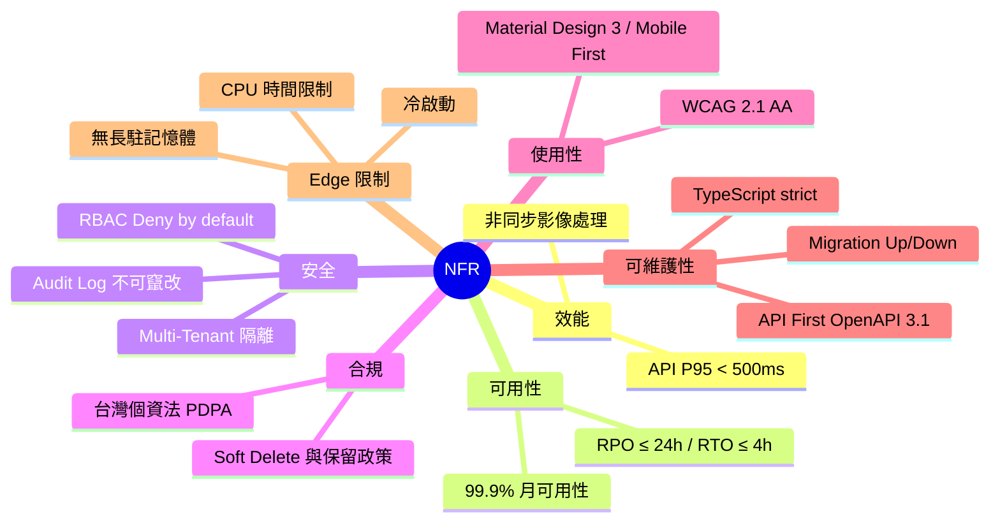

# 非功能性需求（NFR, Non-Functional Requirements）

> 以編號 NFR-NNN 定義 PetFlow Enterprise 的品質屬性基準——效能、可用性與可靠度、安全性、合規、使用性、可維護性與 Cloudflare Edge 限制——作為架構設計、驗收與 SLA 的依據。

| 文件版本 | 狀態 | 最後更新 | 所屬模組 |
| --- | --- | --- | --- |
| v0.2.0 | 初稿 | 2026-07-02 | 04 需求分析 |

---

## 1. 使用說明

### 1.1 編號與欄位規則

- **需求編號**：`NFR-NNN`，全域流水號、依分類保留區段（見 1.2），編號一經發佈**不得重用**；廢止需求標記「已廢止」保留編號。
- **優先級**：`P0`（MVP 發佈門檻）/ `P1`（第二階段）/ `P2`（第三階段），與 [03_功能需求清單.md](03_功能需求清單.md) 定義一致。
- **MoSCoW**：M（Must）/ S（Should）/ C（Could）/ W（Won't，本期不做）。
- **驗證方式**：每條 NFR 均須可驗證；驗證方法對應 [`docs/30_測試/`](../30_測試/README.md) 之測試計畫。
- 功能性需求（FR）見 [03_功能需求清單.md](03_功能需求清單.md)；與商業目標之對應見 [05_需求追溯矩陣.md](05_需求追溯矩陣.md)。

### 1.2 分類與編號區段

| 分類 | 編號區段 | 主要依據 |
| --- | --- | --- |
| 效能（Performance） | NFR-001 ～ NFR-009 | BRD 驗收基準、CLAUDE.md 第 8 節 |
| 可用性與可靠度（Availability & Reliability） | NFR-010 ～ NFR-019 | BRD 第 10 節、CLAUDE.md 第 14 節 |
| 安全性（Security） | NFR-020 ～ NFR-029 | CLAUDE.md 第 12、13 節、BRD 風險 R-001 |
| 合規（Compliance） | NFR-030 ～ NFR-039 | BRD 限制 C-004、CLAUDE.md 第 11、12 節 |
| 使用性與無障礙（Usability & Accessibility） | NFR-040 ～ NFR-049 | CLAUDE.md 第 7、10 節 |
| 可維護性與可觀測性（Maintainability & Observability） | NFR-050 ～ NFR-059 | CLAUDE.md 第 1～6、9、14 節 |
| Edge 限制（Cloudflare Edge Constraints） | NFR-060 ～ NFR-069 | CLAUDE.md 第 8 節、BRD 限制 C-001 |

### 1.3 量測定義（Measurement Definitions）

為避免驗收爭議，各基準之量測口徑統一定義如下：

| 術語 | 定義 |
| --- | --- |
| P95 / P99 | 觀測期間內回應時間之第 95 / 99 百分位數，以伺服器端（Workers）量測為準 |
| 觀測期間 | 除另有註明外，以**滾動 30 天**為觀測窗口 |
| 量測環境 | 正式環境（Production）、台灣地區使用者為主要量測基準點 |
| 月可用性 | `(當月總分鐘數 − 非計畫性停機分鐘數) ÷ 當月總分鐘數`，5xx 錯誤率 > 5% 之時段計入停機 |
| RPO（Recovery Point Objective） | 災難發生時可容忍的最大資料遺失時間範圍 |
| RTO（Recovery Time Objective） | 災難發生後恢復核心服務（P0 模組 CRUD）的最長時間 |
| 正常負載 | 不超過 NFR-008 容量目標 70% 之流量情境 |

## 2. 效能（Performance）

效能直接影響「3 分鐘建檔」與行政作業時間降低（BG-003）之商業承諾，並受 Edge 架構（第 8 章）制約。

| 編號 | 需求描述與目標基準 | 優先級 | MoSCoW | 驗證方式 |
| --- | --- | --- | --- | --- |
| NFR-001 | 所有 `/api/v1` 端點回應時間 **P95 < 500ms、P99 < 1,500ms**（台灣地區量測、正常負載、不含照片上傳） | P0 | M | 負載測試、APM 監控 |
| NFR-002 | 列表查詢在單租戶 1,000 筆資料規模下，搜尋/過濾/分頁回應 P95 < 500ms | P0 | M | 效能測試（種子資料） |
| NFR-003 | 前端主要頁面（列表/詳情）行動 4G 環境 LCP < 2.5s、INP < 200ms | P0 | M | Lighthouse CI |
| NFR-004 | 照片縮圖產生（Queues 非同步）95% 於上傳後 60 秒內完成；期間顯示佔位圖 | P0 | M | 整合測試、佇列監控 |
| NFR-005 | 所有列表 API 一律採**游標分頁**，單次回傳上限 100 筆，禁止無界查詢 | P0 | M | API 合約審查、Code Review |
| NFR-006 | D1 查詢皆須有索引支撐，禁止全表掃描；慢查詢（> 100ms）須告警並列入改善清單 | P0 | M | Schema 審查、慢查詢監控 |
| NFR-007 | 讀多寫少之主檔/設定類資料（品種主檔、疫苗種類、租戶設定）以 KV 快取，快取失效策略明確（TTL + 寫入時失效） | P1 | S | 架構審查、快取命中率監控 |
| NFR-008 | MVP 容量目標：同時服務 ≥ 300 租戶、尖峰 ≥ 100 RPS，效能不低於 NFR-001 基準 | P0 | M | 負載測試 |

## 3. 可用性與可靠度（Availability & Reliability）

寵物健康與登記資料為業者營運命脈；本節基準對應 BRD 第 10 節商業驗收條件（99.9%、RPO ≤ 24h、RTO ≤ 4h）。

| 編號 | 需求描述與目標基準 | 優先級 | MoSCoW | 驗證方式 |
| --- | --- | --- | --- | --- |
| NFR-010 | 系統月可用性 ≥ **99.9%**（月停機 ≤ 43.8 分鐘，排除公告之計畫性維護） | P0 | M | 可用性監控、SLA 報表 |
| NFR-011 | **RPO ≤ 24h**：D1 每日自動備份（Time Travel / 匯出至 R2），R2 物件啟用版本控管 | P0 | M | 備份演練、還原測試 |
| NFR-012 | **RTO ≤ 4h**：具備文件化災難復原程序，並每半年演練一次 | P0 | M | DR 演練紀錄 |
| NFR-013 | Queues 非同步任務具**自動重試（指數退避）與死信佇列（DLQ）**，死信須告警並可人工重放 | P0 | M | 故障注入測試 |
| NFR-014 | 外部回呼（付款 Webhook 等）與重試任務一律**冪等**處理，重複觸發不產生重複副作用 | P1 | S | 整合測試（重複投遞） |
| NFR-015 | 優雅降級：非核心服務（通知、AI、報表）故障不得影響核心 CRUD（寵物/飼主/健康/登記） | P0 | M | 故障注入測試 |
| NFR-016 | 關鍵指標（錯誤率、延遲、佇列積壓、備份結果）具監控儀表板與告警，錯誤率 > 1% 於 5 分鐘內告警 | P0 | M | 監控設定審查、告警演練 |

## 4. 安全性（Security）

安全是 BG-006（資料事故 0 件）與 BRD 最高風險 R-001（跨租戶外洩）的直接防線；本節全部為 P0。

| 編號 | 需求描述與目標基準 | 優先級 | MoSCoW | 驗證方式 |
| --- | --- | --- | --- | --- |
| NFR-020 | 全站僅允許 HTTPS（TLS 1.2+），啟用 HSTS；Cookie 設定 `Secure`/`HttpOnly`/`SameSite` | P0 | M | 安全掃描 |
| NFR-021 | 認證 Token 具有效期與更新機制，且**綁定租戶上下文**；登出/停權後 Token 失效 | P0 | M | 安全測試 |
| NFR-022 | 授權採 RBAC、**Deny by default**：每個 API 端點宣告所需權限並於中介層強制檢查，未宣告即拒絕 | P0 | M | 自動化權限測試、Code Review |
| NFR-023 | **Multi-Tenant 隔離**：所有業務查詢強制帶 `tenantId`（Repository 介面層強制）；跨租戶存取自動化測試漏洞數 = 0 | P0 | M | 自動化跨租戶測試、滲透測試 |
| NFR-024 | 所有外部輸入（Body/Query/Path/Header）經 **Zod schema 驗證**後才進入 Domain；一律使用參數化查詢防 SQLi，輸出編碼防 XSS | P0 | M | Code Review、SAST、滲透測試 |
| NFR-025 | 個資（PII）最小揭露：無 `owner:pii:read` 權限者電話/地址遮蔽；日誌與錯誤訊息不得輸出完整 PII | P0 | M | 自動化測試、日誌抽查 |
| NFR-026 | R2 照片/附件存取一律經**簽章 URL 或授權代理**，物件鍵不可被列舉或猜測；簽章具時效 | P0 | M | 安全測試 |
| NFR-027 | 啟用 Cloudflare WAF 與 Rate Limiting；登入端點具防暴力破解（失敗次數限制、延遲） | P0 | M | 安全設定審查、滲透測試 |
| NFR-028 | 憑證與金鑰一律存於 Workers Secrets/環境變數，禁止硬編碼於程式碼或文件；密碼以強雜湊（Argon2id 或同級）儲存 | P0 | M | Secret 掃描、Code Review |
| NFR-029 | Audit Log **唯讀、不可竄改**：儲存層僅允許附加式寫入，不提供任何更新/刪除 API；查詢受 `audit:read` 權限與租戶隔離 | P0 | M | API 合約審查、自動化測試 |

## 5. 合規（Compliance）

對應 BRD 限制 C-004（台灣個資法、GDPR 精神）與 C-005（金流合規）；飼主為個資之資料主體。

| 編號 | 需求描述與目標基準 | 優先級 | MoSCoW | 驗證方式 |
| --- | --- | --- | --- | --- |
| NFR-030 | 個資處理符合台灣**《個人資料保護法》（PDPA）**：最小蒐集、目的限定、蒐集時告知；隱私權政策與使用條款於註冊時同意 | P0 | M | 法遵審查、隱私盤點 |
| NFR-031 | 資料主體權利：支援飼主個資之查詢、更正、刪除請求與**資料可攜匯出**（對應 FR-OWN-010），處理流程留存 Audit Log | P1 | S | 流程演練、稽核抽查 |
| NFR-032 | 資料保留與清除：租戶註銷後資料凍結並依保留期到期清除（對應 FR-TNT-007）；法遵所需紀錄（帳務、稽核）依規定年限保留 | P1 | S | 保留政策審查 |
| NFR-033 | **Soft Delete 預設**：所有業務資料以 `deleted_at` 標記刪除，查詢預設排除；硬刪除僅限特別流程並記錄 Audit Log | P0 | M | Schema 審查、自動化測試 |
| NFR-034 | 稽核紀錄保留期依方案：Free 90 天起、Enterprise 可延長（對應 FR-AUD-006），逾期歸檔或清除須留存作業紀錄 | P1 | S | 保留政策審查 |
| NFR-035 | 免責與標示義務：官方登記助手明示「輔助準備、不代辦送件」；AI 產出一律標示「AI 產生」且不提供醫療診斷 | P0 | M | UI 審查、文案審查 |
| NFR-036 | 金流合規：透過合規第三方金流，**平台不留存卡號**（僅存 Token 與末四碼），符合 PCI DSS 委外範圍要求 | P1 | S | 金流整合審查 |

## 6. 使用性與無障礙（Usability & Accessibility）

門市店員（小美）常以行動裝置在前台操作，使用性直接影響採用率與轉換（BG-004）。

| 編號 | 需求描述與目標基準 | 優先級 | MoSCoW | 驗證方式 |
| --- | --- | --- | --- | --- |
| NFR-040 | 無障礙符合 **WCAG 2.1 AA**：色彩對比 ≥ 4.5:1、鍵盤可操作、表單具標籤與錯誤提示、支援螢幕閱讀器 | P0 | M | axe 自動掃描 + 人工檢測 |
| NFR-041 | UI 遵循 **Material Design 3**：使用 Design Token（色彩/字級/圓角/間距/Elevation），支援深色模式與動態色彩 | P0 | M | 設計審查（12_UIUX設計） |
| NFR-042 | **Mobile First** 響應式：統一斷點（手機/平板/桌機），觸控目標 ≥ 48×48dp，主流瀏覽器與行動裝置驗證 | P0 | M | 跨裝置測試 |
| NFR-043 | 介面元件狀態完整：default / hover / focus / pressed / disabled / error 均有定義 | P0 | M | 設計審查、元件測試 |
| NFR-044 | 語言與編碼：介面預設繁體中文、UTF-8；日期時間依租戶時區顯示（儲存一律 UTC） | P0 | M | UI 審查、自動化測試 |
| NFR-045 | 錯誤訊息可理解且可行動：統一錯誤格式含錯誤碼與使用者可讀訊息，不得僅顯示技術性錯誤 | P0 | M | API 合約審查、UI 審查 |

## 7. 可維護性與可觀測性（Maintainability & Observability）

團隊規模有限（BRD 限制 C-003），工程紀律與自動化是維持交付速度的前提；本節多數項目由 CI 強制。

| 編號 | 需求描述與目標基準 | 優先級 | MoSCoW | 驗證方式 |
| --- | --- | --- | --- | --- |
| NFR-050 | **TypeScript strict**（`strict: true`）、**禁止 `any`**（必要時 `unknown` + 型別收斂）、公開函式明確回傳型別、識別碼採 Branded Type | P0 | M | CI 型別檢查、ESLint |
| NFR-051 | 架構遵循 **Clean Architecture + DDD + Repository Pattern + Service Layer**（CLAUDE.md 第 1～5 節）：Domain 層零框架依賴、依賴方向由外向內 | P0 | M | 架構測試（依賴規則）、Code Review |
| NFR-052 | **API First**：所有端點先有 **OpenAPI 3.1** 合約，路徑帶 `/api/v1` 版本前綴；合約與實作一致性由 CI 驗證 | P0 | M | 合約測試（CI） |
| NFR-053 | DB Schema 變更一律經版本化 **Migration，具 Up/Down** 且可回滾、向後相容（擴充再收斂）；上線前於測試環境驗證升級與回滾 | P0 | M | Migration 演練、CI |
| NFR-054 | 自動化測試：Domain 層單元測試覆蓋率 ≥ 80%；P0 使用者流程具端對端測試；CI 全綠才可合併 | P0 | M | 覆蓋率報表、CI |
| NFR-055 | 結構化日誌（JSON）含 `requestId`/`tenantId`/`userId`（PII 遮蔽），可依請求追蹤全鏈路 | P0 | M | 日誌審查 |
| NFR-056 | 文件即 SSOT：程式碼與 `docs/` 衝突時以文件為準；功能變更須同步回填文件（CLAUDE.md 第 0 節） | P0 | M | PR 審查檢查清單 |
| NFR-057 | 相依套件每月安全性掃描與更新；高風險漏洞（CVSS ≥ 7）於 7 日內修補 | P1 | S | Dependabot/掃描報表 |

## 8. Edge 限制（Cloudflare Edge Constraints）

Cloudflare Workers 執行模型與自管伺服器不同，以下限制為**架構設計的硬性前提**：

| 編號 | 需求描述與目標基準 | 優先級 | MoSCoW | 驗證方式 |
| --- | --- | --- | --- | --- |
| NFR-060 | **無長駐記憶體**：不得依賴 in-process 狀態（記憶體快取、全域變數、session in memory）；狀態一律外部化至 D1 / KV / R2 / Durable Objects | P0 | M | 架構審查、Code Review |
| NFR-061 | **CPU 時間限制**：單一請求須在 Workers CPU 時間限制內完成；重運算（影像處理、批次匯入、報表、AI）一律移至 **Queues 非同步**處理 | P0 | M | 架構審查、CPU 時間監控 |
| NFR-062 | **冷啟動最小化**：Worker bundle 精簡（控制相依、tree-shaking），初始化邏輯輕量，不在模組載入期做 I/O | P0 | M | Bundle 大小監控 |
| NFR-063 | **D1 限制**：資料模型與查詢須考量 D1 單庫容量、單語句與併發限制；接近門檻時依 09 系統架構之擴充策略（分庫/歸檔）處理（BRD 假設 A-004） | P0 | M | 容量監控、架構審查 |
| NFR-064 | **大檔不經 Worker 中轉**：照片上傳/下載採 R2 預簽章 URL 直傳直下，Worker 僅負責授權與簽發 | P0 | M | 架構審查、頻寬監控 |
| NFR-065 | 遵循 Workers 執行環境限制：子請求（subrequest）數量上限、不可用 Node 原生模組（僅相容層）、KV 為最終一致性——設計時不得假設強一致 | P0 | M | 架構審查、整合測試 |

## 9. 驗收與例外處理

### 9.1 MVP 發佈門檻（P0 NFR Gate）

- **P0 之 NFR 為 MVP 發佈門檻**（對應 [PRD 第 6 節發佈標準](02_產品需求文件PRD.md)），任一未達標即不得發佈。
- 其中以下五項為**不可豁免項（Non-Negotiable）**，不適用例外流程：
  1. NFR-023 Multi-Tenant 隔離（跨租戶測試 0 漏洞）
  2. NFR-022 RBAC Deny by default
  3. NFR-029 Audit Log 不可竄改
  4. NFR-033 Soft Delete 預設
  5. NFR-011 / NFR-012 備份還原（RPO ≤ 24h、RTO ≤ 4h）

### 9.2 例外流程
- NFR 未達標之例外須以書面風險決策紀錄（含補救計畫與期限），並經產品負責人核准。
- 各 NFR 之量測方法、工具與環境定義於 [`docs/30_測試/`](../30_測試/README.md)；安全類細節見 [`docs/28_安全性/`](../28_安全性/README.md)。

## 10. 變更管理

- 新增 NFR：於對應分類之編號區段接續編號，並同步更新 [05_需求追溯矩陣.md](05_需求追溯矩陣.md)。
- 基準調整（如效能目標收緊）：更新本文件版本號並於 PR 說明影響範圍。
- 廢止：保留列並標記「已廢止（原因/替代編號）」。

## 11. 相關文件

- [01_商業需求文件BRD.md](01_商業需求文件BRD.md)：商業目標與限制之上游依據
- [02_產品需求文件PRD.md](02_產品需求文件PRD.md)：產品層 NFR 摘要與發佈標準
- [03_功能需求清單.md](03_功能需求清單.md)：功能需求（FR）
- [05_需求追溯矩陣.md](05_需求追溯矩陣.md)：BG ↔ FR/NFR ↔ 模組追溯
- [`docs/09_系統架構/`](../09_系統架構/README.md)、[`docs/28_安全性/`](../28_安全性/README.md)、[`docs/29_部署/`](../29_部署/README.md)、[`docs/30_測試/`](../30_測試/README.md)

---

> 本文件屬於 PetFlow Enterprise 官方文件，遵循根目錄 CLAUDE.md 之規範。
