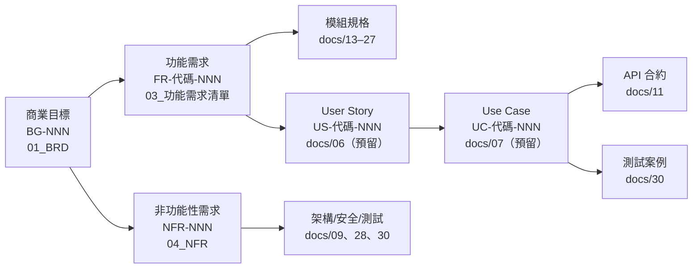

# 需求追溯矩陣（RTM, Requirement Traceability Matrix）

> 建立商業目標（BG）↔ 功能需求（FR）/ 非功能性需求（NFR）↔ 模組資料夾 ↔ 未來 User Story（US）/ Use Case（UC）的雙向追溯對照，確保每條需求有商業依據、每個商業目標有需求落地。

| 文件版本 | 狀態 | 最後更新 | 所屬模組 |
| --- | --- | --- | --- |
| v0.2.0 | 初稿 | 2026-07-02 | 04 需求分析 |

---

## 1. 追溯模型

### 1.1 追溯鏈

### 1.2 編號來源與預留規則

| 產出物 | 編號格式 | 定義文件 | 狀態 |
| --- | --- | --- | --- |
| 商業目標 | `BG-NNN` | [01_商業需求文件BRD.md](01_商業需求文件BRD.md) 第 3 節 | 已發佈 |
| 功能需求 | `FR-<模組代碼>-NNN` | [03_功能需求清單.md](03_功能需求清單.md) | 已發佈 |
| 非功能性需求 | `NFR-NNN` | [04_非功能性需求NFR.md](04_非功能性需求NFR.md) | 已發佈 |
| User Story | `US-<模組代碼>-NNN` | [`docs/06_User_Story/`](../06_User_Story/README.md) | **預留**（撰寫時啟用） |
| Use Case | `UC-<模組代碼>-NNN` | [`docs/07_Use_Case/`](../07_Use_Case/README.md) | **預留**（撰寫時啟用） |

- 模組代碼沿用 [03_功能需求清單.md](03_功能需求清單.md) 第 1.2 節之對照表（PET、OWN、HLT、BRD、REG、PHT、SUB、PAY、STO、RBC、AUD、NTF、AI、TNT）。
- US/UC 尚未撰寫，本矩陣先**預留編號區段**；docs/06、docs/07 文件建立後，須回填實際編號並更新本矩陣。
- 追溯為**雙向**：每條 FR/NFR 須可回溯至至少一個 BG；每個 BG 須有至少一條 FR 或 NFR 落地（見第 5 節檢核）。

## 2. 商業目標 → 需求（正向追溯）

| 商業目標 | 目標摘要 | 主要對應 FR | 主要對應 NFR |
| --- | --- | --- | --- |
| BG-001 | 以寵物為中心的平台、北極星指標 MAMP | FR-PET-001～012、FR-OWN-001～010、FR-HLT-001～012、FR-PHT-001～010、FR-TNT-001～008 | NFR-001～008（效能）、NFR-010（可用性） |
| BG-002 | 訂閱制經常性收入（MRR） | FR-SUB-001～008、FR-PAY-001～006 | NFR-014（Webhook 冪等）、NFR-036（金流合規） |
| BG-003 | 降低行政作業時間 ≥ 60% | FR-PET-001/010（快速建檔/匯入）、FR-REG-001～010、FR-HLT-002（到期日自動建議）、FR-BRD-002/003 | NFR-001～003（效能）、NFR-042（Mobile First） |
| BG-004 | Free → 付費轉換率 ≥ 8% | FR-SUB-003～006（額度/升級）、FR-PHT-005（容量限制與升級提示）、FR-TNT-001（Free 註冊） | NFR-040～045（使用性） |
| BG-005 | 多店/連鎖客戶、提高客單價 | FR-STO-001～006、FR-RBC-007（自訂角色）、FR-SUB-001（Pro/Enterprise 方案） | NFR-008（容量）、NFR-023（隔離） |
| BG-006 | 合規與稽核建立企業信任、資料事故 0 件 | FR-TNT-002/003、FR-RBC-001～006、FR-AUD-001～006、FR-OWN-006/010 | NFR-020～029（安全）、NFR-030～036（合規） |
| BG-007 | 付費租戶月流失率 ≤ 3% | FR-HLT-006（到期清單）、FR-NTF-001～006、FR-STO-005（儀表板）、FR-AI-001～004 | NFR-010～016（可靠度）、NFR-045（錯誤可理解） |

> 橫切型 NFR（NFR-050～057 可維護性、NFR-060～065 Edge 限制）支撐**所有** BG 的長期交付能力與成本結構（BRD 限制 C-001、C-003），不逐一列於上表。

## 3. 模組層追溯總表（FR ↔ 模組 ↔ US/UC 預留）

| 模組（代碼） | 模組資料夾 | FR 區段 | 主要 BG | 關鍵 NFR | 預留 US 區段 | 預留 UC 區段 |
| --- | --- | --- | --- | --- | --- | --- |
| 寵物管理（PET） | [`docs/13_寵物管理/`](../13_寵物管理/README.md) | FR-PET-001～012 | BG-001、BG-003 | NFR-001、NFR-002、NFR-033 | US-PET-001～ | UC-PET-001～ |
| 飼主管理（OWN） | [`docs/14_飼主管理/`](../14_飼主管理/README.md) | FR-OWN-001～010 | BG-001、BG-006 | NFR-025、NFR-030、NFR-031 | US-OWN-001～ | UC-OWN-001～ |
| 健康管理（HLT） | [`docs/15_健康管理/`](../15_健康管理/README.md) | FR-HLT-001～012 | BG-001、BG-003、BG-007 | NFR-001、NFR-029、NFR-033 | US-HLT-001～ | UC-HLT-001～ |
| 配種管理（BRD） | [`docs/16_配種管理/`](../16_配種管理/README.md) | FR-BRD-001～008 | BG-003、BG-005 | NFR-001、NFR-061（COI 計算） | US-BRD-001～ | UC-BRD-001～ |
| 官方登記助手（REG） | [`docs/17_官方登記助手/`](../17_官方登記助手/README.md) | FR-REG-001～010 | BG-003 | NFR-035（免責標示）、NFR-053 | US-REG-001～ | UC-REG-001～ |
| 照片管理（PHT） | [`docs/18_照片管理/`](../18_照片管理/README.md) | FR-PHT-001～010 | BG-001、BG-004 | NFR-004、NFR-026、NFR-064 | US-PHT-001～ | UC-PHT-001～ |
| 會員訂閱（SUB） | [`docs/19_會員訂閱/`](../19_會員訂閱/README.md) | FR-SUB-001～008 | BG-002、BG-004、BG-005 | NFR-032、NFR-034 | US-SUB-001～ | UC-SUB-001～ |
| 付款系統（PAY） | [`docs/20_付款系統/`](../20_付款系統/README.md) | FR-PAY-001～006 | BG-002 | NFR-014、NFR-036 | US-PAY-001～ | UC-PAY-001～ |
| 多店管理（STO） | [`docs/23_多店管理/`](../23_多店管理/README.md) | FR-STO-001～006 | BG-005 | NFR-022、NFR-023 | US-STO-001～ | UC-STO-001～ |
| RBAC（RBC） | [`docs/24_RBAC/`](../24_RBAC/README.md) | FR-RBC-001～007 | BG-006 | NFR-021、NFR-022、NFR-025 | US-RBC-001～ | UC-RBC-001～ |
| Audit Log（AUD） | [`docs/25_AuditLog/`](../25_AuditLog/README.md) | FR-AUD-001～006 | BG-006 | NFR-029、NFR-034、NFR-055 | US-AUD-001～ | UC-AUD-001～ |
| 通知中心（NTF） | [`docs/26_通知中心/`](../26_通知中心/README.md) | FR-NTF-001～006 | BG-007 | NFR-013、NFR-015、NFR-061 | US-NTF-001～ | UC-NTF-001～ |
| AI 功能（AI） | [`docs/27_AI/`](../27_AI/README.md) | FR-AI-001～004 | BG-001、BG-007 | NFR-035、NFR-061 | US-AI-001～ | UC-AI-001～ |
| Multi-Tenant（TNT） | [`docs/22_MultiTenant/`](../22_MultiTenant/README.md) | FR-TNT-001～008 | BG-001、BG-006 | NFR-021、NFR-023、NFR-032 | US-TNT-001～ | UC-TNT-001～ |

> 預留編號約定：US / UC 之尾碼**原則上對齊其主要對應 FR 之尾碼**（例：`FR-PET-001` → `US-PET-001` → `UC-PET-001`）；一條 FR 拆分為多則 Story 時，自該模組區段之後續號碼接續編號。

### 3.1 P0（MVP）關鍵需求逐條追溯

MVP 發佈標準要求 P0 需求 100% 追溯；下表為 P0 各模組**代表性需求**之逐條對照（完整 P0 清單以 [03 文件](03_功能需求清單.md) 標記 P0 者為準），API 資源欄為 `/api/v1` 下之預定資源命名（複數名詞，待 [`docs/11_API設計/`](../11_API設計/README.md) 定案）：

| FR 編號 | 需求摘要 | 對應 BG | 預留 US | 預留 UC | 預定 API 資源 |
| --- | --- | --- | --- | --- | --- |
| FR-PET-001 | 寵物建檔（名稱+物種即可） | BG-001、BG-003 | US-PET-001 | UC-PET-001 | `/pets` |
| FR-PET-002 | 晶片號碼租戶內唯一（409） | BG-001 | US-PET-002 | UC-PET-002 | `/pets` |
| FR-PET-007 | 寵物軟刪除與還原 | BG-006 | US-PET-007 | UC-PET-007 | `/pets/{id}` |
| FR-OWN-001 | 飼主建檔（姓名+電話） | BG-001、BG-003 | US-OWN-001 | UC-OWN-001 | `/owners` |
| FR-OWN-002 | 電話重複偵測與選用 | BG-003 | US-OWN-002 | UC-OWN-002 | `/owners` |
| FR-OWN-006 | 個資遮蔽（`owner:pii:read`） | BG-006 | US-OWN-006 | UC-OWN-006 | `/owners/{id}` |
| FR-HLT-001 | 疫苗紀錄建立 | BG-001 | US-HLT-001 | UC-HLT-001 | `/vaccinations` |
| FR-HLT-005 | 健康時間軸 | BG-001、BG-007 | US-HLT-005 | UC-HLT-005 | `/pets/{id}/health-timeline` |
| FR-HLT-006 | 疫苗到期清單（7/30/90 天） | BG-007 | US-HLT-006 | UC-HLT-006 | `/vaccinations/due` |
| FR-REG-002 | 登記案件自動帶入主檔資料 | BG-003 | US-REG-002 | UC-REG-002 | `/registration-cases` |
| FR-REG-004 | 案件狀態機（非法轉移 422） | BG-003 | US-REG-004 | UC-REG-004 | `/registration-cases/{id}` |
| FR-REG-005 | 申請資料彙整頁（列印/PDF） | BG-003 | US-REG-005 | UC-REG-005 | `/registration-cases/{id}/summary` |
| FR-PHT-001 | 照片上傳（R2） | BG-001 | US-PHT-001 | UC-PHT-001 | `/photos` |
| FR-PHT-002 | 縮圖非同步產生（Queues） | BG-001 | US-PHT-002 | UC-PHT-002 | `/photos` |
| FR-PHT-005 | 方案容量限制（422 + 升級提示） | BG-004 | US-PHT-005 | UC-PHT-005 | `/photos` |
| FR-TNT-002 | 資料層租戶隔離（`tenant_id`） | BG-006 | US-TNT-002 | UC-TNT-002 | 全部資源（橫切） |
| FR-TNT-003 | Token 綁定租戶（跨租戶 403/404） | BG-006 | US-TNT-003 | UC-TNT-003 | 全部資源（橫切） |
| FR-RBC-002 | 權限模型（Deny by default） | BG-006 | US-RBC-002 | UC-RBC-002 | `/roles`、`/permissions` |
| FR-RBC-003 | 端點權限宣告與強制檢查 | BG-006 | US-RBC-003 | UC-RBC-003 | 全部資源（橫切） |
| FR-AUD-001 | 寫入操作自動稽核 | BG-006 | US-AUD-001 | UC-AUD-001 | `/audit-logs` |
| FR-AUD-002 | 稽核唯讀不可竄改 | BG-006 | US-AUD-002 | UC-AUD-002 | `/audit-logs` |
| FR-SUB-008 | 平台管理員手動開通方案（P0 例外） | BG-002 | US-SUB-008 | UC-SUB-008 | `/subscriptions` |

### 3.2 Persona ↔ 模組 ↔ 商業目標

Persona 定義見 [`docs/05_使用者角色/`](../05_使用者角色/README.md)，摘自 [PRD 第 1.3 節](02_產品需求文件PRD.md)：

| Persona | 角色 | 關鍵模組（FR 區段） | 主要 BG |
| --- | --- | --- | --- |
| 阿豪 | 單店寵物店老闆 | PET / OWN / HLT / PHT | BG-001、BG-003、BG-004 |
| 雅婷 | 連鎖店區經理 | STO / RBC / AUD | BG-005、BG-006 |
| 志明 | 專業犬舍繁殖者 | BRD / REG / PET | BG-003、BG-001 |
| 小美 | 門市店員 | PET / OWN / PHT | BG-001、BG-003 |
| Dr. Chen | 特約獸醫 | HLT（FR-HLT-009 受限存取） | BG-001、BG-006 |
| 宥廷 | 平台管理員 | TNT / SUB / PAY / AUD | BG-002、BG-006 |

## 4. NFR → 落點追溯

NFR 屬品質屬性，落點多為橫切機制與基礎設計文件，而非單一模組：

| NFR 區段 | 分類 | 主要 BG | 落點文件 |
| --- | --- | --- | --- |
| NFR-001～008 | 效能 | BG-001、BG-003 | [`docs/09_系統架構/`](../09_系統架構/README.md)、[`docs/10_資料庫設計/`](../10_資料庫設計/README.md)、[`docs/30_測試/`](../30_測試/README.md) |
| NFR-010～016 | 可用性與可靠度 | BG-007、BG-001 | [`docs/09_系統架構/`](../09_系統架構/README.md)、[`docs/29_部署/`](../29_部署/README.md) |
| NFR-020～029 | 安全性 | BG-006 | [`docs/28_安全性/`](../28_安全性/README.md)、[`docs/22_MultiTenant/`](../22_MultiTenant/README.md)、[`docs/24_RBAC/`](../24_RBAC/README.md)、[`docs/25_AuditLog/`](../25_AuditLog/README.md) |
| NFR-030～036 | 合規 | BG-006 | [`docs/28_安全性/`](../28_安全性/README.md)、[`docs/21_SaaS/`](../21_SaaS/README.md)、[`docs/10_資料庫設計/`](../10_資料庫設計/README.md) |
| NFR-040～045 | 使用性與無障礙 | BG-004、BG-007 | [`docs/12_UIUX設計/`](../12_UIUX設計/README.md) |
| NFR-050～057 | 可維護性與可觀測性 | 全部（交付能力） | 根目錄 `CLAUDE.md`、[`docs/09_系統架構/`](../09_系統架構/README.md)、[`docs/11_API設計/`](../11_API設計/README.md)、[`docs/30_測試/`](../30_測試/README.md) |
| NFR-060～065 | Edge 限制 | 全部（成本/架構前提） | [`docs/09_系統架構/`](../09_系統架構/README.md)、[`docs/29_部署/`](../29_部署/README.md) |

### 4.1 橫切機制對照（與 03 文件第 16 章一致）

| 橫切機制 | NFR 編號 | 對應 FR 代表 | 規範來源 |
| --- | --- | --- | --- |
| Multi-Tenant 隔離 | NFR-023 | FR-TNT-002、FR-TNT-003 | CLAUDE.md 第 4、13 節 |
| RBAC Deny by default | NFR-022 | FR-RBC-002、FR-RBC-003 | CLAUDE.md 第 13 節 |
| Audit Log 不可竄改 | NFR-029 | FR-AUD-001、FR-AUD-002 | CLAUDE.md 第 12 節 |
| Soft Delete | NFR-033 | FR-PET-007、FR-OWN-007、FR-HLT-008、FR-PHT-006 | CLAUDE.md 第 11 節 |
| Migration Up/Down | NFR-053 | 所有涉及 Schema 之 FR | CLAUDE.md 第 14 節 |

### 4.2 BRD 限制與風險 ↔ 需求對照

BRD 第 8、9 節之限制（C-NNN）與風險（R-NNN）落地追溯：

| BRD 編號 | 內容摘要 | 對應需求 |
| --- | --- | --- |
| C-001 | 限定 Cloudflare 生態與 Edge 限制 | NFR-060～065 |
| C-002 | 預設繁體中文（P2 前不做多語系） | NFR-044 |
| C-003 | 團隊規模有限、聚焦 P0 | NFR-050～057（工程紀律與自動化） |
| C-004 | 台灣個資法、GDPR 精神 | NFR-030～033、FR-OWN-006、FR-OWN-010 |
| C-005 | 第三方金流、不留存卡號 | NFR-036、FR-PAY-001 |
| R-001 | 跨租戶資料外洩 | NFR-023、FR-TNT-002、FR-TNT-003 |
| R-002 | 登記規則過時 | FR-REG-001、FR-REG-008（版本化）、NFR-035 |
| R-003 | Free 方案儲存濫用 | FR-PHT-005、NFR-027（Rate Limiting） |
| R-004 | 競品向下延伸 | FR-BRD-001～008、FR-REG-001～010（差異化深耕） |
| R-005 | 金流整合延誤 | FR-SUB-008（人工開通過渡） |
| R-006 | 業者 Onboarding 失敗 | FR-PET-010（批次匯入）、NFR-040～045（使用性） |

## 5. 反向追溯檢核（Coverage Check）

本版檢核結果（v0.2.0）：

- [x] 每個 BG（BG-001～BG-007）均有至少一條 FR 與一條 NFR 對應（見第 2 節）。
- [x] 每個模組代碼之 FR 區段均可回溯至至少一個 BG（見第 3 節）。
- [x] 每條 NFR 區段均有明確落點文件（見第 4 節）。
- [x] 無孤兒需求：03 文件中無任何 FR 無法對應 BG；BRD 範圍外項目（POS、電商、C 端 App 等）未出現於 FR 清單。
- [ ] US/UC 編號回填：待 [`docs/06_User_Story/`](../06_User_Story/README.md)、[`docs/07_Use_Case/`](../07_Use_Case/README.md) 撰寫後補齊。
- [ ] API 端點與測試案例追溯：待 [`docs/11_API設計/`](../11_API設計/README.md)、[`docs/30_測試/`](../30_測試/README.md) 撰寫後補齊。

## 6. 維護規則

1. **新增 FR/NFR** 時，必須同步更新本矩陣對應列；PR 中未更新者不予合併（文件先行原則）。
2. **US/UC 建立**時，於第 3 節將預留區段替換為實際編號範圍，並在對應模組文件內維護逐條對照（本矩陣維持「區段層級」粒度，逐條對照下放至各模組資料夾）。
3. **廢止需求**：於 03/04 文件標記廢止後，本矩陣對應區段加註「（含已廢止：編號）」。
4. 每次里程碑（P0/P1/P2）結束時執行一次第 5 節之覆蓋檢核並更新勾選狀態與文件版本號。

## 7. 相關文件

- [01_商業需求文件BRD.md](01_商業需求文件BRD.md)：BG 編號來源
- [02_產品需求文件PRD.md](02_產品需求文件PRD.md)：模組需求概述與發佈標準
- [03_功能需求清單.md](03_功能需求清單.md)：FR 編號來源
- [04_非功能性需求NFR.md](04_非功能性需求NFR.md)：NFR 編號來源
- [`docs/06_User_Story/`](../06_User_Story/README.md)、[`docs/07_Use_Case/`](../07_Use_Case/README.md)：下游追溯對象（預留）

---

> 本文件屬於 PetFlow Enterprise 官方文件，遵循根目錄 CLAUDE.md 之規範。
