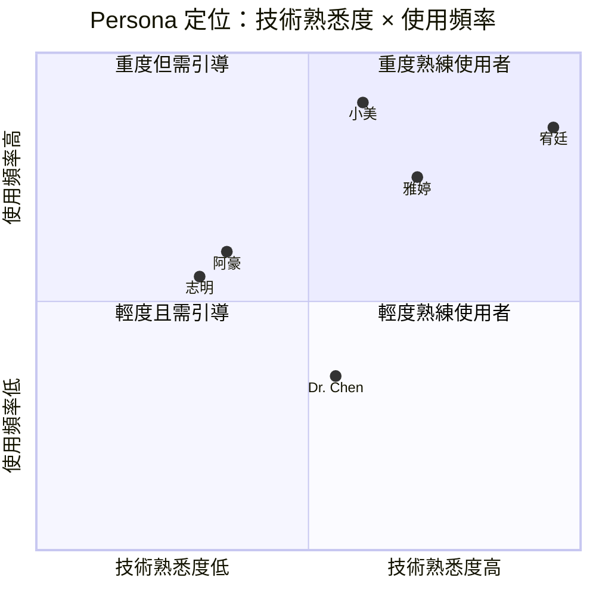
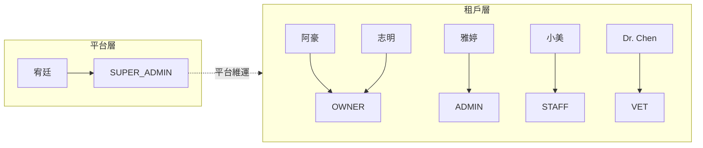

# Persona 卡片

> 定義 PetFlow Enterprise 的六位標準 Persona，作為全 repo 需求、User Story、UX 與 RBAC 設計的共同人物基準。

| 文件版本 | 狀態 | 最後更新 | 所屬模組 |
| --- | --- | --- | --- |
| v0.2.0 | 初稿 | 2026-07-02 | 05 使用者角色 |

---

## 1. 目的與使用方式

本文件定義 PetFlow Enterprise 的 **六位標準 Persona**。所有模組（需求分析、User Story、Use Case、UI/UX、RBAC）撰寫時，**必須引用本文件的 Persona 名稱與設定**，不得自創新人物或修改既有設定；若需補充細節，應先回填本文件。

Persona 的使用原則：

- User Story 主詞一律使用 Persona 名稱（例：「身為**阿豪**，我想要…」）。
- UX 流程與畫面設計須標註主要服務的 Persona。
- 每位 Persona 對應一個主要系統角色（詳見 [02_系統角色定義表](02_系統角色定義表.md)）。

## 2. Persona 總覽

| # | Persona | 身分 | 年齡 | 主要系統角色 | 主要裝置 | 訂閱方案傾向 |
| --- | --- | --- | --- | --- | --- | --- |
| 1 | 阿豪 | 單店寵物店老闆 | 38 | OWNER | 桌機 + 手機 | Starter（NT$599/月） |
| 2 | 雅婷 | 連鎖店區經理 | 34 | ADMIN | 筆電 + 平板 | Pro（NT$1,499/月） |
| 3 | 志明 | 專業犬舍繁殖者 | 45 | OWNER | 手機 + 桌機 | Pro（NT$1,499/月） |
| 4 | 小美 | 門市店員 | 24 | STAFF | 手機為主 | （隨租戶方案） |
| 5 | Dr. Chen | 特約獸醫 | 41 | VET | 平板 + 手機 | （隨租戶方案） |
| 6 | 宥廷 | 平台管理員 | 29 | SUPER_ADMIN | 桌機 | （內部人員） |

---

## 3. Persona 1：阿豪 — 單店寵物店老闆

> 「我只想把店顧好，不想每天跟 Excel 和一堆 LINE 訊息搏鬥。」

| 項目 | 內容 |
| --- | --- |
| 年齡 / 地區 | 38 歲 / 南部（高雄）單店 |
| 身分 | 寵物店老闆兼店長，員工 2–3 人 |
| 技術能力 | 中偏低；會用 Excel、LINE、Facebook 粉專 |
| 主要裝置 | 店內桌機、下班後手機 |
| 主要系統角色 | OWNER（租戶擁有者） |
| 訂閱方案傾向 | 從 Free 試用 → Starter NT$599/月 |

### 3.1 背景故事

阿豪經營寵物店 10 年，店內販售幼犬幼貓並提供美容服務。目前用 **Excel 管寵物與客戶資料、LINE 對話管預約與詢問**，特定寵物買賣的官方登記文件都靠手寫與影印留存。曾因找不到某隻幼犬的疫苗紀錄被客訴，也曾因登記文件缺漏被主管機關要求補件。

### 3.2 目標

- 寵物、飼主、健康紀錄集中在一個系統，不再散落各處。
- 特定寵物買賣的**官方登記流程合規**，文件可隨時調出。
- 花在行政上的時間每週減少 5 小時以上。

### 3.3 痛點

| 痛點 | 現況 | 影響 |
| --- | --- | --- |
| 登記合規繁瑣 | 手寫表單 + 影印留存 | 補件、罰則風險 |
| 資料散落 | Excel、LINE、紙本各一份 | 找資料耗時、版本不一致 |
| 疫苗時程靠記憶 | 無提醒機制 | 漏打、客訴 |

### 3.4 關鍵情境

1. 新幼犬入店時，用手機拍照建檔並掛上來源犬舍資訊。
2. 售出寵物時，一站式完成飼主建檔、官方登記文件與交付紀錄。
3. 每週一早上查看「本週疫苗到期」清單並通知飼主。

---

## 4. Persona 2：雅婷 — 連鎖店區經理

> 「五家店五套做法，我要的是同一份即時、正確的數字。」

| 項目 | 內容 |
| --- | --- |
| 年齡 / 地區 | 34 歲 / 北部，管理 5 家門市 |
| 身分 | 連鎖寵物店區經理，向總部負責 |
| 技術能力 | 高；熟悉試算表、BI 報表、SaaS 後台 |
| 主要裝置 | 筆電（辦公）、平板（巡店） |
| 主要系統角色 | ADMIN（租戶管理員） |
| 訂閱方案傾向 | Pro NT$1,499/月，成長後評估 Enterprise |

### 4.1 背景故事

雅婷負責北部 5 家門市的營運。各店店長回報格式不一，寵物庫存與銷售數字要靠她每週人工彙整。離職店員帳號常忘記停用，曾發生前員工仍能看到客戶名單的資安疑慮。

### 4.2 目標

- 跨店數據**單一版本**、即時彙總（MAMP、銷售、疫苗完成率）。
- 集中管理各店人員帳號與權限，離職即停權。
- 巡店時用平板直接查該店營運儀表板。

### 4.3 痛點

| 痛點 | 現況 | 影響 |
| --- | --- | --- |
| 跨店數據不一致 | 各店各自維護 Excel | 決策依據錯誤 |
| 權限難管 | 共用帳號、離職未停權 | 資安與個資風險 |
| 回報耗時 | 每週人工彙整 | 每週多花 6–8 小時 |

### 4.4 關鍵情境

1. 每月初檢視各店 MAMP 與營收儀表板，找出落後門市。
2. 新店長到職當天，指派 MANAGER 角色並限定其門市範圍。
3. 稽核前調出某店近三個月的 Audit Log。

---

## 5. Persona 3：志明 — 專業犬舍繁殖者

> 「一窩柴犬的血統寫錯一代，這個犬舍的信譽就毀了。」

| 項目 | 內容 |
| --- | --- |
| 年齡 / 地區 | 45 歲 / 中部，經營柴犬與柯基犬舍 |
| 身分 | 特定寵物繁殖業者，持繁殖許可證 |
| 技術能力 | 低；紀錄以手寫筆記本為主 |
| 主要裝置 | 手機（現場）、桌機（文書） |
| 主要系統角色 | OWNER（租戶擁有者） |
| 訂閱方案傾向 | Pro NT$1,499/月（配種與血統功能） |

### 5.1 背景故事

志明的犬舍有 20 餘隻種犬。血統書、配種日期、產仔紀錄全寫在筆記本，疫苗與驅蟲時程貼在牆上的月曆。曾因漏記一次配種日期而算錯預產期，也擔心筆記本遺失等於失去整個犬舍的歷史。

### 5.2 目標

- 血統（父母、祖代）與配種紀錄**數位化且可回溯**。
- 疫苗、驅蟲、發情週期自動提醒，不再漏掉。
- 出售幼犬時能一鍵產出血統與健康履歷給買家與登記機關。

### 5.3 痛點

| 痛點 | 現況 | 影響 |
| --- | --- | --- |
| 血統與配種紀錄手寫 | 筆記本、無備份 | 遺失風險、查詢困難 |
| 疫苗時程易漏 | 牆上月曆 | 幼犬健康與信譽風險 |
| 近親配種難檢查 | 靠記憶比對 | 遺傳疾病風險 |

### 5.4 關鍵情境

1. 配種當天用手機記錄公母犬、方式與日期，系統自動推算預產期。
2. 建立新生幼犬時自動帶入父母血統鏈。
3. 收到「近親係數過高」警示後改選其他種公。

---

## 6. Persona 4：小美 — 門市店員

> 「系統要是比 LINE 難用，我就會偷偷回去用 LINE。」

| 項目 | 內容 |
| --- | --- |
| 年齡 / 地區 | 24 歲 / 連鎖門市第一線店員 |
| 身分 | 門市店員，負責接待、餵養、美容預約 |
| 技術能力 | 中；重度手機使用者，不碰桌機後台 |
| 主要裝置 | 個人手機、門市平板 |
| 主要系統角色 | STAFF（店員） |
| 訂閱方案傾向 | 隨租戶方案（無採購決策權） |

### 6.1 背景故事

小美是雅婷轄下門市的店員，每天要餵養、清潔、接待客人、記錄寵物狀況。過去用店內群組回報「今天 3 號籠的柯基沒吃完飼料」，訊息很快被洗掉。她對難用的系統忍耐度極低：欄位太多、按鈕太小、要登入桌機的流程，她一律放棄。

### 6.2 目標

- 用手機 30 秒內完成一筆日常紀錄（餵食、體重、照片）。
- 交接班時能快速看到「今天要注意哪幾隻」。
- 不需要理解後台設定，開箱即用。

### 6.3 痛點

| 痛點 | 現況 | 影響 |
| --- | --- | --- |
| 系統難用就不用 | 回退到 LINE 群組 | 資料斷層、MAMP 下降 |
| 手機操作為主 | 多數系統僅桌機友善 | 現場無法即時記錄 |
| 交接資訊零散 | 口頭 + 群組訊息 | 照護疏漏 |

### 6.4 關鍵情境

1. 早班巡籠時用手機逐籠拍照打卡，異常寵物一鍵標記。
2. 客人詢問某幼貓疫苗狀態，當場用平板查給客人看。
3. 下班前送出交接摘要給晚班同事。

---

## 7. Persona 5：Dr. Chen — 特約獸醫

> 「我巡五家店，卻拿不到任何一隻狗完整的病史。」

| 項目 | 內容 |
| --- | --- |
| 年齡 / 地區 | 41 歲 / 北部，巡迴多家合作門市與犬舍 |
| 身分 | 特約獸醫師，非單一租戶員工 |
| 技術能力 | 中高；慣用平板記錄診療 |
| 主要裝置 | 平板（診療）、手機（通知） |
| 主要系統角色 | VET（獸醫） |
| 訂閱方案傾向 | 隨合作租戶方案 |

### 7.1 背景故事

Dr. Chen 與多家寵物店及犬舍簽有特約，每週固定巡診。每到一家店，健康紀錄格式都不同：有的用紙卡、有的用 Excel、有的只有口述。他無法追蹤上次用藥後的反應，開立疫苗時也常缺前次接種資訊。

### 7.2 目標

- 巡診時看到寵物**完整、連續**的健康與用藥史。
- 診療紀錄、疫苗接種一次輸入，各店格式統一。
- 只看得到「與他有診療關係」的寵物資料（最小權限）。

### 7.3 痛點

| 痛點 | 現況 | 影響 |
| --- | --- | --- |
| 健康紀錄不完整 | 各店格式不一、紙本 | 誤診與重複用藥風險 |
| 無法追蹤病史 | 上次紀錄找不到 | 診療品質下降 |
| 跨租戶身分尷尬 | 每店一組帳號 | 帳號管理混亂 |

### 7.4 關鍵情境

1. 巡診前收到本日排程與待診寵物清單。
2. 診療時於平板檢視病史時間軸，完成後即時寫入診療與處方。
3. 為整批幼犬批次登錄疫苗接種紀錄。

---

## 8. Persona 6：宥廷 — 平台管理員

> 「租戶半夜回報資料不見，我需要五分鐘內查出發生什麼事。」

| 項目 | 內容 |
| --- | --- |
| 年齡 / 地區 | 29 歲 / PetFlow 內部維運工程師 |
| 身分 | 平台管理員（PetFlow 官方人員） |
| 技術能力 | 極高；熟悉 Cloudflare 生態與 SQL |
| 主要裝置 | 桌機 |
| 主要系統角色 | SUPER_ADMIN（平台） |
| 訂閱方案傾向 | 不適用（內部人員） |

### 8.1 背景故事

宥廷負責 PetFlow 平台維運：租戶開通、方案異動、問題排查、稽核配合。最怕的是租戶回報「資料不見了」但缺乏足夠的 Audit Log 可以追查，以及在排查時**不小心看到不該看的租戶業務資料**造成合規問題。

### 8.2 目標

- 排查工具完善：以租戶維度快速定位問題，全程留下稽核軌跡。
- 平台操作（開通、停權、方案變更）標準化、可回溯。
- 對租戶資料的存取遵循最小權限並全數記錄。

### 8.3 痛點

| 痛點 | 現況 | 影響 |
| --- | --- | --- |
| 租戶問題排查 | 缺工具、靠土法查 DB | 處理時間長、SLA 壓力 |
| 稽核需求 | 日誌分散 | 合規舉證困難 |
| 越權存取風險 | 排查即看到業務資料 | 個資與信任風險 |

### 8.4 關鍵情境

1. 收到租戶工單後，在平台後台檢視該租戶的健康度與錯誤日誌。
2. 依稽核要求匯出某租戶指定期間的 Audit Log。
3. 執行租戶方案升級（Starter → Pro）並確認配額生效。

---

## 9. Persona 與系統角色對照

| Persona | 主要系統角色 | 次要角色情境 | 說明 |
| --- | --- | --- | --- |
| 阿豪 | OWNER | — | 單店租戶擁有者，兼日常操作 |
| 雅婷 | ADMIN | MANAGER（代管單店時） | 連鎖租戶的管理員 |
| 志明 | OWNER | — | 犬舍型租戶擁有者 |
| 小美 | STAFF | — | 僅限所屬門市之日常操作 |
| Dr. Chen | VET | VIEWER（僅查閱之合作店） | 健康模組為主的專業角色 |
| 宥廷 | SUPER_ADMIN | — | 平台層級，非租戶內角色 |

> 系統角色的完整定義、職責邊界與授予規則，見 [02_系統角色定義表](02_系統角色定義表.md)；權限對應見 [03_角色功能權限矩陣](03_角色功能權限矩陣.md)。

## 10. 相關文件

- [02_系統角色定義表](02_系統角色定義表.md)
- [03_角色功能權限矩陣](03_角色功能權限矩陣.md)
- [04_使用者旅程地圖](04_使用者旅程地圖.md)
- [24 RBAC](../24_RBAC/README.md)、[06 User Story](../06_User_Story/README.md)

---

> 本文件屬於 PetFlow Enterprise 官方文件，遵循根目錄 CLAUDE.md 之規範。
