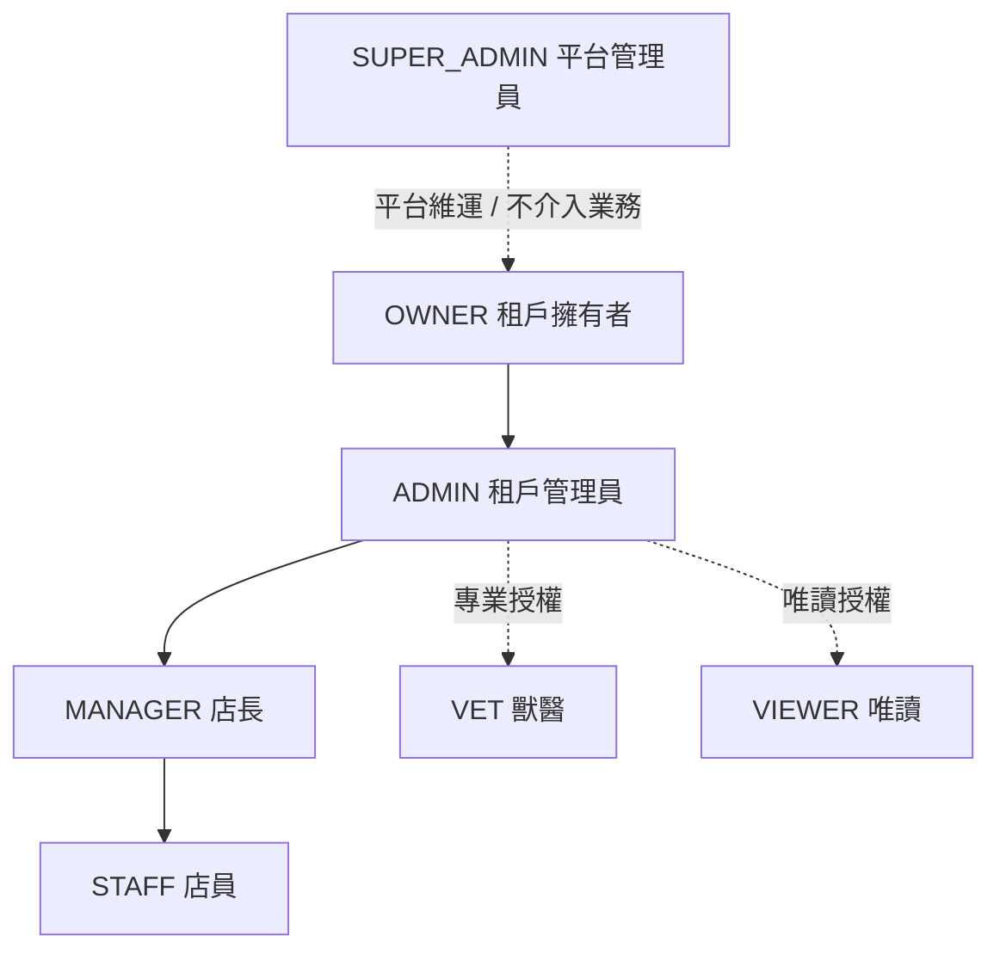
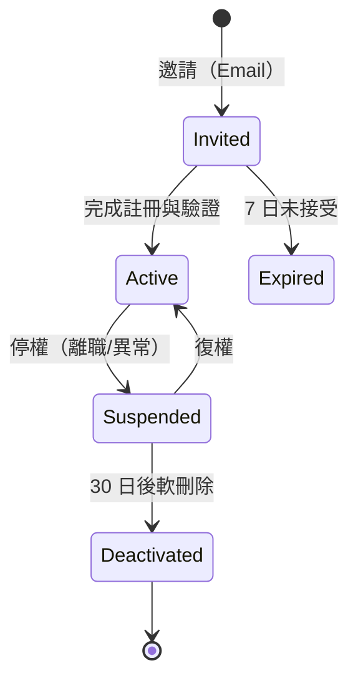

# 系統角色定義表

> 定義 PetFlow Enterprise 的七個系統角色（RBAC Role）、職責邊界、資料範圍與授予規則，作為 24_RBAC 權限落地的上游規格。

| 文件版本 | 狀態 | 最後更新 | 所屬模組 |
| --- | --- | --- | --- |
| v0.2.0 | 初稿 | 2026-07-02 | 05 使用者角色 |

---

## 1. 設計原則

1. **Deny by default（預設拒絕）**：未明確授予的權限一律拒絕。
2. **最小權限原則**：角色只擁有完成其職責所需的最小權限集合。
3. **Multi-Tenant 隔離**：除 `SUPER_ADMIN` 外，所有角色的資料範圍**不得跨租戶**；查詢一律帶 `tenantId`。
4. **角色與 Persona 解耦**：Persona 是「人」，角色是「權限集合」；一位使用者在一個租戶內可被授予一個主要角色。
5. **平台與租戶分層**：`SUPER_ADMIN` 屬平台層，不參與租戶內業務授權；租戶內最高角色為 `OWNER`。

## 2. 角色總覽

| 角色代碼 | 中文名稱 | 層級 | 資料範圍 | 對應 Persona | 典型人數/租戶 |
| --- | --- | --- | --- | --- | --- |
| `SUPER_ADMIN` | 平台管理員 | 平台 | 全平台（受稽核） | 宥廷 | 0（平台內部） |
| `OWNER` | 租戶擁有者 | 租戶 | 整個租戶 | 阿豪、志明 | 1 |
| `ADMIN` | 租戶管理員 | 租戶 | 整個租戶 | 雅婷 | 1–3 |
| `MANAGER` | 店長 | 門市 | 所轄門市 | （雅婷代管情境） | 每店 1 |
| `STAFF` | 店員 | 門市 | 所屬門市 | 小美 | 每店 2–10 |
| `VET` | 獸醫 | 專業 | 有診療關係之寵物 | Dr. Chen | 1–3 |
| `VIEWER` | 唯讀使用者 | 租戶/門市 | 被授權範圍（唯讀） | （會計、顧問） | 0–5 |

> 箭頭表示「可管理/授予下層角色」的方向，非資料繼承；權限集合各自獨立定義（見第 4 節與 [03_角色功能權限矩陣](03_角色功能權限矩陣.md)）。

## 3. 各角色定義

### 3.1 SUPER_ADMIN（平台管理員）

| 項目 | 內容 |
| --- | --- |
| 定位 | PetFlow 官方維運人員；平台層唯一角色 |
| 職責 | 租戶開通/停權、訂閱方案異動、配額管理、問題排查、稽核配合、平台公告 |
| 資料範圍 | 全平台租戶的**中繼資料**（方案、用量、健康度）；業務資料存取需走「支援模式」 |
| 明確禁止 | 未經支援模式直接檢視/修改租戶業務資料；代租戶執行業務操作 |
| 稽核要求 | 所有操作（含讀取租戶資料）100% 記錄 Audit Log，不可豁免 |

**支援模式（Support Mode）**：`SUPER_ADMIN` 需存取租戶業務資料時，須建立支援工單、取得時限性授權（預設 24 小時），期間所有讀寫均標記 `support_session_id` 並記錄。

### 3.2 OWNER（租戶擁有者）

| 項目 | 內容 |
| --- | --- |
| 定位 | 租戶的最高權限者；每租戶**有且僅有一位** |
| 職責 | 訂閱與付款管理、租戶設定、授予/撤銷 ADMIN、資料匯出、租戶刪除申請 |
| 資料範圍 | 租戶內全部資料（含所有門市） |
| 明確禁止 | 跨租戶存取；修改 Audit Log |
| 特殊規則 | OWNER 轉移須雙方確認 + Email 驗證；OWNER 不可被其他角色停權 |

### 3.3 ADMIN（租戶管理員）

| 項目 | 內容 |
| --- | --- |
| 定位 | 租戶日常管理者，通常為總部管理職（如雅婷） |
| 職責 | 使用者與角色管理（MANAGER 以下）、門市管理、跨店報表、通知政策、資料還原 |
| 資料範圍 | 租戶內全部資料（含所有門市） |
| 明確禁止 | 訂閱/付款異動（OWNER 專屬）、授予 OWNER/ADMIN、硬刪除 |

### 3.4 MANAGER（店長）

| 項目 | 內容 |
| --- | --- |
| 定位 | 單一門市的負責人 |
| 職責 | 門市內寵物/飼主/交易管理、STAFF 帳號申請與排班、門市報表、軟刪除還原申請 |
| 資料範圍 | 僅所轄門市（可被指派多店，逐店授權） |
| 明確禁止 | 檢視其他門市資料、管理使用者角色、修改租戶設定 |

### 3.5 STAFF（店員）

| 項目 | 內容 |
| --- | --- |
| 定位 | 第一線操作者（如小美），以行動裝置為主 |
| 職責 | 日常照護紀錄、寵物/飼主基本資料建立與更新、照片上傳、預約與接待、交接紀錄 |
| 資料範圍 | 僅所屬門市 |
| 明確禁止 | 刪除任何資料（僅能發起刪除申請）、檢視營收報表、匯出資料 |

### 3.6 VET（獸醫）

| 項目 | 內容 |
| --- | --- |
| 定位 | 特約獸醫（如 Dr. Chen），以健康模組為核心的專業角色 |
| 職責 | 診療紀錄、疫苗接種、處方、健康評估、配種健康建議 |
| 資料範圍 | 僅「有診療關係」之寵物的健康與基本資料；同一自然人可受多個租戶授權，各租戶身分獨立 |
| 明確禁止 | 檢視飼主付款/交易資料、修改非健康類資料、跨授權範圍查詢 |
| 特殊規則 | 診療紀錄一經簽核即鎖定，修改須以「補充紀錄」附加，原紀錄不可竄改 |

### 3.7 VIEWER（唯讀使用者）

| 項目 | 內容 |
| --- | --- |
| 定位 | 僅需查閱的外部/內部關係人（會計師、顧問、稽核員） |
| 職責 | 在被授權範圍內查閱資料與報表 |
| 資料範圍 | 由 ADMIN 指定（整租戶或特定門市），一律唯讀 |
| 明確禁止 | 任何寫入操作；預設禁止匯出（可由 OWNER 例外開啟並記錄） |

## 4. 角色授予與生命週期

### 4.1 授予規則

| 授予者 \ 被授予角色 | OWNER | ADMIN | MANAGER | STAFF | VET | VIEWER |
| --- | --- | --- | --- | --- | --- | --- |
| SUPER_ADMIN | ✅（開通時指定） | ❌ | ❌ | ❌ | ❌ | ❌ |
| OWNER | ✅（轉移） | ✅ | ✅ | ✅ | ✅ | ✅ |
| ADMIN | ❌ | ❌ | ✅ | ✅ | ✅ | ✅ |
| MANAGER | ❌ | ❌ | ❌ | ⚠️ 申請制 | ❌ | ❌ |

> ⚠️ 申請制：MANAGER 送出 STAFF 帳號申請，由 ADMIN 核准後生效。

### 4.2 帳號生命週期

- 停權**立即**使所有 Session 與 Token 失效。
- 帳號軟刪除後，其歷史操作與 Audit Log 保留不變（顯示為「已停用使用者」）。
- 角色變更即時生效，並記錄 `before/after` 於 Audit Log。

## 5. 資料範圍（Scope）模型

| Scope | 說明 | 適用角色 |
| --- | --- | --- |
| `platform` | 全平台（僅中繼資料，業務資料需支援模式） | SUPER_ADMIN |
| `tenant` | 單一租戶全部資料 | OWNER、ADMIN、VIEWER（租戶級） |
| `store` | 指定門市集合 | MANAGER、STAFF、VIEWER（門市級） |
| `care-relation` | 有診療關係之寵物 | VET |

所有 API 授權檢查順序：**驗證身分 → 解析租戶 → 檢查角色權限 → 套用 Scope 過濾**，缺一不可。

## 6. 與 Persona 的對照

| 系統角色 | 對應 Persona | 差異提醒 |
| --- | --- | --- |
| SUPER_ADMIN | 宥廷 | 角色屬平台層，與租戶內角色互斥 |
| OWNER | 阿豪、志明 | 同一角色可服務不同業態（門市/犬舍） |
| ADMIN | 雅婷 | 不含訂閱/付款權限 |
| MANAGER | （雅婷代管情境） | 逐店授權，非全租戶 |
| STAFF | 小美 | 無刪除權，行動優先 |
| VET | Dr. Chen | Scope 為診療關係，非門市 |
| VIEWER | （會計、顧問） | 未指定專屬 Persona，撰寫 Story 時以關係人稱之 |

## 7. 相關文件

- [01_Persona卡片](01_Persona卡片.md)
- [03_角色功能權限矩陣](03_角色功能權限矩陣.md)
- [24 RBAC](../24_RBAC/README.md)（權限落地）
- [22 MultiTenant](../22_MultiTenant/README.md)（租戶隔離）
- [25 AuditLog](../25_AuditLog/README.md)（稽核）

---

> 本文件屬於 PetFlow Enterprise 官方文件，遵循根目錄 CLAUDE.md 之規範。
