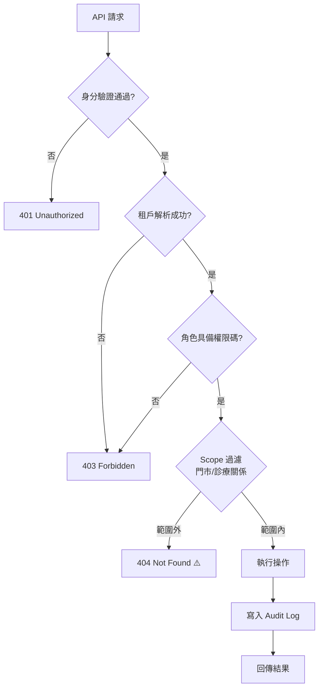

# 角色 × 功能權限矩陣（初版）

> 以功能模組 × 系統角色的矩陣定義各角色可執行的操作，作為 24_RBAC 權限碼設計與 API 授權檢查的初版依據。

| 文件版本 | 狀態 | 最後更新 | 所屬模組 |
| --- | --- | --- | --- |
| v0.2.0 | 初稿 | 2026-07-02 | 05 使用者角色 |

---

## 1. 閱讀說明

### 1.1 符號定義

| 符號 | 意義 | 說明 |
| --- | --- | --- |
| C | Create | 建立 |
| R | Read | 讀取（含清單與明細） |
| U | Update | 更新 |
| D | Delete | 軟刪除（本產品預設無實體刪除） |
| S | Restore | 還原軟刪除資料 |
| X | Export | 匯出 |
| A | Approve | 核准/簽核 |
| — | 無權限 | Deny by default |
| ⚠️ | 條件權限 | 附註於矩陣下方 |

### 1.2 通用規則

1. **Deny by default**：矩陣未列出者一律無權限。
2. **租戶隔離**：所有操作隱含 `tenantId` 過濾；`MANAGER`、`STAFF` 另受門市 Scope 限制、`VET` 受診療關係 Scope 限制（見 [02_系統角色定義表](02_系統角色定義表.md) 第 5 節）。
3. **Audit Log**：所有 C/U/D/S/A 操作自動寫入稽核日誌，任何角色不得關閉。
4. **SUPER_ADMIN**：對租戶業務模組預設 **無權限**，僅可透過支援模式取得時限性讀取權，故業務模組欄位以 `⚠️SM` 標示。
5. 權限碼命名約定：`{resource}:{action}`，例如 `pet:create`、`vaccination:approve`、`audit-log:export`。

## 2. 業務模組權限矩陣

### 2.1 寵物與飼主（13 寵物管理、14 飼主管理）

| 功能 | OWNER | ADMIN | MANAGER | STAFF | VET | VIEWER | SUPER_ADMIN |
| --- | --- | --- | --- | --- | --- | --- | --- |
| 寵物資料 | C R U D S X | C R U D S X | C R U D S | C R U | R ⚠️1 | R | ⚠️SM |
| 寵物照片（18） | C R U D | C R U D | C R U D | C R U | R ⚠️1 | R | ⚠️SM |
| 飼主資料 | C R U D S X | C R U D S X | C R U D S | C R U | R ⚠️2 | R | ⚠️SM |
| 飼主聯絡紀錄 | C R U | C R U | C R U | C R | — | R | ⚠️SM |

- ⚠️1 VET 僅能讀取有診療關係之寵物。
- ⚠️2 VET 僅能讀取飼主姓名與聯絡方式（診療聯繫用），不含交易資料。

### 2.2 健康管理（15）

| 功能 | OWNER | ADMIN | MANAGER | STAFF | VET | VIEWER | SUPER_ADMIN |
| --- | --- | --- | --- | --- | --- | --- | --- |
| 健康紀錄（體重/日常） | C R U | C R U | C R U | C R U | C R U | R | ⚠️SM |
| 診療紀錄 | R | R | R | R | C R U ⚠️3 A | R | ⚠️SM |
| 疫苗接種紀錄 | R | R | R | R ⚠️4 | C R U A | R | ⚠️SM |
| 處方紀錄 | R | R | R | R | C R U A | R | ⚠️SM |
| 疫苗到期提醒設定 | C R U | C R U | C R U | R | C R U | R | ⚠️SM |

- ⚠️3 診療紀錄簽核（A）後鎖定，僅能附加補充紀錄。
- ⚠️4 STAFF 可登錄「已由外部獸醫接種」之憑證上傳，正式紀錄仍須 VET 簽核。

### 2.3 配種與登記（16 配種管理、17 官方登記助手）

| 功能 | OWNER | ADMIN | MANAGER | STAFF | VET | VIEWER | SUPER_ADMIN |
| --- | --- | --- | --- | --- | --- | --- | --- |
| 配種紀錄 | C R U D S | C R U D S | C R U | C R | R | R | ⚠️SM |
| 血統資料 | C R U X | C R U X | C R U | R | R | R | ⚠️SM |
| 近親警示檢查 | R | R | R | R | R | R | ⚠️SM |
| 官方登記案件 | C R U A X | C R U A X | C R U | C R | — | R | ⚠️SM |
| 登記文件產出 | C R X | C R X | C R X | R | — | R | ⚠️SM |

### 2.4 交易與訂閱（19 會員訂閱、20 付款系統）

| 功能 | OWNER | ADMIN | MANAGER | STAFF | VET | VIEWER | SUPER_ADMIN |
| --- | --- | --- | --- | --- | --- | --- | --- |
| 租戶訂閱方案 | C R U | R | — | — | — | — | R U ⚠️5 |
| 付款方式/發票 | C R U D | R | — | — | — | — | R ⚠️5 |
| 帳單與收據 | R X | R | — | — | — | R ⚠️6 | R ⚠️5 |

- ⚠️5 SUPER_ADMIN 可執行平台側方案異動（如協助升級 Starter→Pro），一律記錄工單編號。
- ⚠️6 VIEWER（會計情境）由 OWNER 例外開啟帳單讀取。

### 2.5 多店與通知（23 多店管理、26 通知中心）

| 功能 | OWNER | ADMIN | MANAGER | STAFF | VET | VIEWER | SUPER_ADMIN |
| --- | --- | --- | --- | --- | --- | --- | --- |
| 門市管理 | C R U D S | C R U D S | R U ⚠️7 | R | — | R | ⚠️SM |
| 跨店報表/儀表板 | R X | R X | R ⚠️7 | — | — | R | ⚠️SM |
| 通知政策設定 | C R U | C R U | R U ⚠️7 | R | R | R | ⚠️SM |
| 通知發送（手動） | C | C | C ⚠️7 | — | C ⚠️1 | — | — |

- ⚠️7 MANAGER 僅限所轄門市。

## 3. 管理模組權限矩陣

### 3.1 使用者、角色與稽核（24 RBAC、25 AuditLog）

| 功能 | OWNER | ADMIN | MANAGER | STAFF | VET | VIEWER | SUPER_ADMIN |
| --- | --- | --- | --- | --- | --- | --- | --- |
| 使用者帳號管理 | C R U D | C R U D ⚠️8 | ⚠️9 | — | — | — | ⚠️SM |
| 角色授予/撤銷 | C R U | C R U ⚠️8 | — | — | — | — | — |
| Audit Log 查詢 | R X | R X | R ⚠️7 | — | — | R ⚠️10 | R X |
| 資料還原（Restore） | S | S | ⚠️9 | — | — | — | — |
| 硬刪除申請 | C A ⚠️11 | C | — | — | — | — | A ⚠️11 |

- ⚠️8 ADMIN 僅能管理 MANAGER 以下角色，不得授予 OWNER/ADMIN。
- ⚠️9 MANAGER 為申請制：送出申請，由 ADMIN 核准。
- ⚠️10 VIEWER（稽核員情境）僅可讀被授權範圍之日誌。
- ⚠️11 硬刪除須 OWNER 發起 + SUPER_ADMIN 平台側核准，雙簽生效並全程記錄。

### 3.2 平台管理（21 SaaS、22 MultiTenant）

| 功能 | OWNER | ADMIN | MANAGER | STAFF | VET | VIEWER | SUPER_ADMIN |
| --- | --- | --- | --- | --- | --- | --- | --- |
| 租戶開通/停權 | — | — | — | — | — | — | C R U |
| 租戶配額/用量 | R | R | — | — | — | — | C R U |
| 平台公告 | R | R | R | R | R | R | C R U D |
| 支援模式啟用 | A ⚠️12 | — | — | — | — | — | C R |

- ⚠️12 支援模式須經該租戶 OWNER 同意（緊急資安事件除外，事後補告知並記錄）。

## 4. 授權檢查流程

> ⚠️ 範圍外資源回 404 而非 403，避免洩漏「資源存在」的資訊（跨租戶探測防護）。

## 5. 權限碼對照（節錄範例）

| 權限碼 | 說明 | 具備角色 |
| --- | --- | --- |
| `pet:create` | 建立寵物 | OWNER、ADMIN、MANAGER、STAFF |
| `pet:delete` | 軟刪除寵物 | OWNER、ADMIN、MANAGER |
| `pet:restore` | 還原寵物 | OWNER、ADMIN |
| `medical-record:approve` | 簽核診療紀錄 | VET |
| `subscription:update` | 變更訂閱方案 | OWNER |
| `user:assign-role` | 授予角色 | OWNER、ADMIN（受限） |
| `audit-log:export` | 匯出稽核日誌 | OWNER、ADMIN、SUPER_ADMIN |
| `tenant:suspend` | 停權租戶 | SUPER_ADMIN |

完整權限碼清單將於 [24 RBAC](../24_RBAC/README.md) 模組落地時定義，本矩陣為其初版輸入。

## 6. 版本與後續工作

- 本矩陣為 **初版（v0.2.0）**，後續由 24_RBAC 模組細化為完整權限碼清單與 API 對應表。
- 待辦：VIEWER 匯出例外流程、VET 多租戶授權 UX、支援模式時限參數化。
- 任何矩陣變更須同步更新本文件與 24_RBAC，並於 [32 版本紀錄](../32_版本紀錄/README.md) 留痕。

## 7. 相關文件

- [01_Persona卡片](01_Persona卡片.md)
- [02_系統角色定義表](02_系統角色定義表.md)
- [24 RBAC](../24_RBAC/README.md)、[25 AuditLog](../25_AuditLog/README.md)、[22 MultiTenant](../22_MultiTenant/README.md)

---

> 本文件屬於 PetFlow Enterprise 官方文件，遵循根目錄 CLAUDE.md 之規範。
