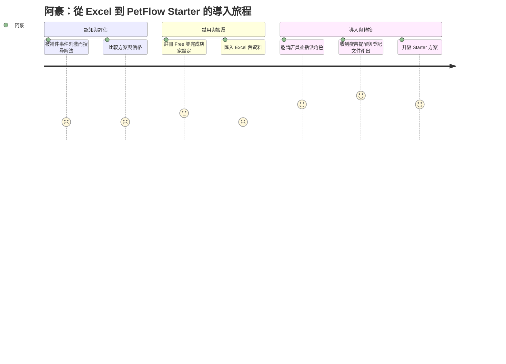
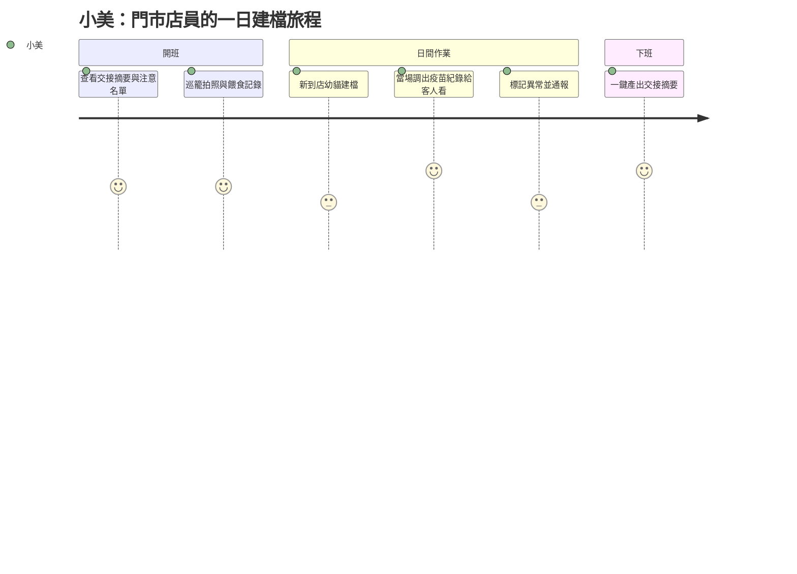
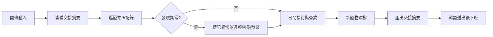
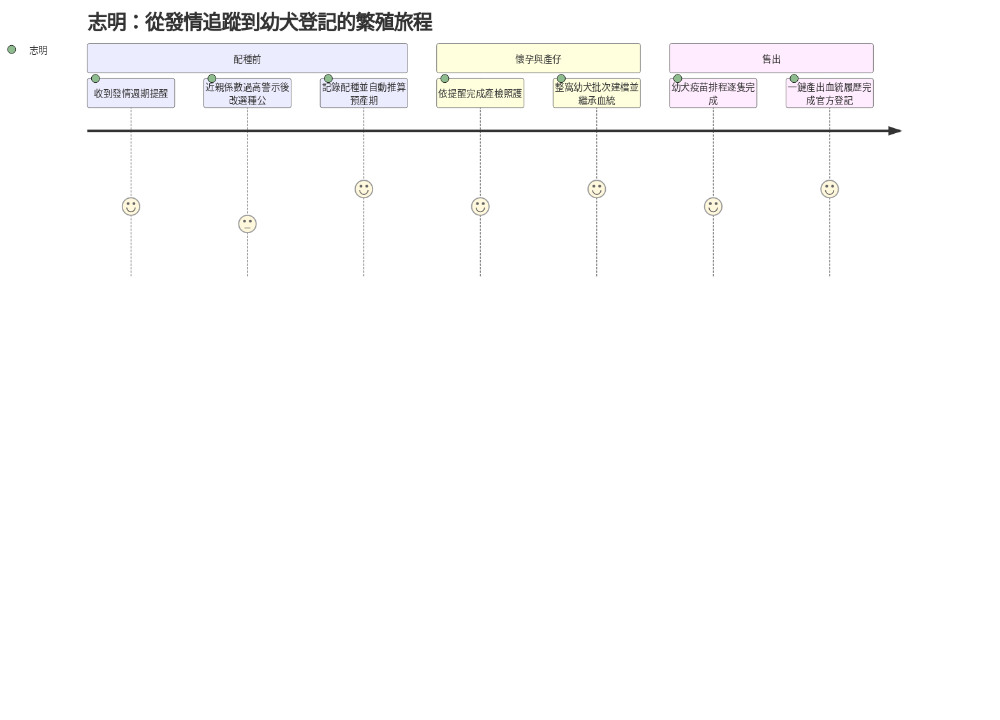

# 使用者旅程地圖（User Journey Map）

> 以阿豪、小美、志明三位核心 Persona 的端到端旅程，描繪各階段的行為、接觸點、情緒曲線、痛點與機會點，作為 UX 流程與 User Story 排序的依據。

| 文件版本 | 狀態 | 最後更新 | 所屬模組 |
| --- | --- | --- | --- |
| v0.2.0 | 初稿 | 2026-07-02 | 05 使用者角色 |

---

## 1. 目的與閱讀方式

本文件為 PetFlow Enterprise 的三條核心使用者旅程建立地圖。Persona 設定一律沿用 [01_Persona 卡片](01_Persona卡片.md)，不得另創人物；旅程中涉及的角色權限以 [02_系統角色定義表](02_系統角色定義表.md) 與 [03_角色功能權限矩陣](03_角色功能權限矩陣.md) 為準。

### 1.1 旅程選擇原則

| # | 旅程 | Persona / 角色 | 旅程類型 | 為何優先 |
| --- | --- | --- | --- | --- |
| 1 | 單店老闆導入 PetFlow | 阿豪 / OWNER | 採用旅程（Adoption） | 決定 Free → Starter 轉換率，是商業模式命脈 |
| 2 | 店員日常建檔 | 小美 / STAFF | 日常使用旅程（Daily Use） | 決定資料完整度與 MAMP，是留存命脈 |
| 3 | 繁殖者配種與登記 | 志明 / OWNER | 核心業務旅程（Core Task） | 決定 Pro 方案的差異化價值與合規賣點 |

### 1.2 地圖構成要素

每條旅程包含五個構面：

1. **階段（Stage）**：旅程的時間切分。
2. **行為（Doing）**：Persona 在該階段做什麼。
3. **接觸點（Touchpoint）**：與產品或外部管道的互動介面。
4. **情緒曲線（Feeling）**：以 mermaid journey 呈現，滿意度 1（最差）～5（最好）。
5. **痛點與機會點（Pain / Opportunity）**：對應後續 User Story 與功能設計。

---

## 2. 旅程一：阿豪 — 單店老闆導入 PetFlow

**情境**：阿豪因登記文件被要求補件、疫苗紀錄找不到而下定決心找系統。旅程從「聽說 PetFlow」到「付費訂閱 Starter 並穩定使用」，橫跨約 4–6 週。

### 2.1 階段 × 行為 × 接觸點

| 階段 | 行為 | 接觸點 | 情緒 |
| --- | --- | --- | --- |
| S1 認知 | 在寵物業者社團看到同業推薦；被補件事件刺激而搜尋 | Facebook 社團、Google 搜尋、官網 Landing Page | 焦慮中帶期待（2） |
| S2 評估 | 比較價格與功能；擔心「系統很難、店員不會用」 | 官網方案頁（Free / Starter NT$599 / Pro NT$1,499）、線上客服 | 猶豫（2） |
| S3 試用註冊 | 註冊 Free 方案、建立租戶、完成店家基本設定 | 註冊流程、Onboarding 導覽、驗證信 | 緊張轉安心（3） |
| S4 資料搬遷 | 將 Excel 寵物與飼主資料匯入；補拍寵物照片 | CSV 匯入精靈、手機拍照上傳（R2）、匯入錯誤報告 | 最低谷：怕搬錯（2） |
| S5 團隊導入 | 邀請 2 名店員（STAFF）、設定權限；店員實際試用 | 成員邀請、角色指派、行動版介面 | 回升（4） |
| S6 價值驗證 | 收到第一則「疫苗到期提醒」；售出寵物時一站式完成登記文件 | 通知中心、登記文件產出、儀表板 | 高峰（5） |
| S7 付費轉換 | Free 額度將滿，升級 Starter；設定發票與付款 | 方案升級頁、付款流程、發票設定 | 放心（4） |

### 2.2 情緒曲線

### 2.3 痛點與機會點

| 階段 | 痛點 | 機會點 |
| --- | --- | --- |
| S2 評估 | 看不懂功能術語；怕綁約、怕店員抗拒 | 方案頁以「情境」而非「功能」溝通；提供免信用卡的 Free 試用 |
| S3 試用註冊 | 設定項目多，怕一開始就做錯 | Onboarding 精靈以「開店第一天」任務清單引導，10 分鐘可完成 |
| S4 資料搬遷 | Excel 欄位對不上、匯入失敗訊息看不懂 | 提供官方 Excel 範本與逐列錯誤說明；匯入失敗可整批還原（軟刪除機制） |
| S5 團隊導入 | 不確定該給店員什麼權限 | 邀請時預設建議角色（店員 → STAFF），權限矩陣白話說明 |
| S6 價值驗證 | 尚未形成「每天打開」的習慣 | 首週推播「本週疫苗到期」清單，用提醒建立回訪習慣 |
| S7 付費轉換 | 對超額與升級規則不安 | 額度將滿前 7 天預告；升級即時生效、按比例計費 |

**成功判準**：註冊後 14 天內完成資料匯入且邀請至少 1 名店員；30 天內由 Free 轉換為 Starter。

---

## 3. 旅程二：小美 — 店員日常建檔

**情境**：小美在雅婷轄下門市值早班。旅程為單一工作日（約 9 小時），全程以手機與門市平板操作，權限為 STAFF（僅所屬門市）。

### 3.1 階段 × 行為 × 接觸點

| 階段 | 行為 | 接觸點 | 情緒 |
| --- | --- | --- | --- |
| D1 開班交接 | 登入後查看晚班留下的交接摘要與「今日注意名單」 | 手機 App 首頁、交接摘要、注意標記 | 平穩（4） |
| D2 巡籠記錄 | 逐籠拍照、記錄餵食與體重；異常寵物一鍵標記 | 手機拍照上傳、快速建檔表單、異常標記 | 順手（4） |
| D3 新寵物建檔 | 新到店幼貓建檔：拍照、輸入品種與來源、掛上疫苗排程 | 建檔精靈、品種選單、疫苗排程範本 | 欄位多時會煩（3） |
| D4 接待查詢 | 客人詢問幼貓疫苗狀態，用平板當場調出健康紀錄 | 門市平板、寵物健康時間軸 | 有面子（5） |
| D5 異常回報 | 發現柯基食慾不振，標記異常並通知店長與 Dr. Chen | 異常通報、通知中心 | 緊張但被承接（3） |
| D6 交接下班 | 系統自動彙整今日紀錄成交接摘要，確認後送出 | 交接摘要產生器、送出確認 | 輕鬆（5） |

### 3.2 情緒曲線

### 3.3 痛點與機會點

| 階段 | 痛點 | 機會點 |
| --- | --- | --- |
| D1 開班交接 | 過去靠 LINE 群組，訊息被洗掉 | 交接摘要結構化保存，可回看歷史交接 |
| D2 巡籠記錄 | 記錄若超過 30 秒就會想放棄 | 拍照即建檔：照片＋預設值一鍵送出，欄位可後補 |
| D3 新寵物建檔 | 欄位多、專有名詞不熟 | 建檔精靈分步驟、品種與疫苗用範本帶入；必填欄位極小化 |
| D4 接待查詢 | 過去要回頭問老闆或翻紙本 | 平板唯讀檢視模式，適合直接轉給客人看 |
| D5 異常回報 | 口頭回報常被遺忘、無人追蹤 | 異常標記自動通知 MANAGER 與 VET，處理狀態可追蹤 |
| D6 交接下班 | 手寫交接費時且遺漏 | 由當日紀錄自動彙整，小美只需確認與補充 |

**成功判準**：單筆日常紀錄（餵食/體重/照片）中位數完成時間 ≤ 30 秒；小美所在門市不再回退使用 LINE 群組回報。

> 本旅程直接影響 MAMP（活躍管理寵物數）：STAFF 若棄用，資料斷層將使租戶價值感崩塌，是留存風險的最前線。

### 3.4 一日流程圖

---

## 4. 旅程三：志明 — 繁殖者配種與登記

**情境**：志明的犬舍以 Pro 方案（NT$1,499/月）管理 20 餘隻種犬。旅程從母犬發情到幼犬售出完成官方登記，橫跨約 4 個月，是繁殖業的完整生命週期。

### 4.1 階段 × 行為 × 接觸點

| 階段 | 行為 | 接觸點 | 情緒 |
| --- | --- | --- | --- |
| B1 發情追蹤 | 收到母犬發情週期預測提醒，現場確認並記錄 | 發情週期提醒、手機快速記錄 | 安心（4） |
| B2 配對評估 | 挑選種公；系統比對血統鏈計算近親係數 | 血統樹檢視、近親係數警示 | 警示當下緊張，改選後放心（3） |
| B3 配種記錄 | 配種當天用手機記錄公母犬、方式、日期；系統推算預產期 | 配種紀錄表單、預產期自動計算、行事曆 | 踏實（5） |
| B4 懷孕照護 | 依預產期倒數收到產檢與營養提醒；Dr. Chen 巡診記錄 | 照護提醒、獸醫診療紀錄（VET 寫入） | 平穩（4） |
| B5 產仔建檔 | 為整窩幼犬批次建檔，自動帶入父母血統鏈 | 批次建檔、血統自動繼承、幼犬照片上傳 | 高峰（5） |
| B6 幼犬照護 | 疫苗與驅蟲排程自動展開，逐隻完成接種 | 疫苗排程、批次接種登錄（VET） | 平穩（4） |
| B7 出售與登記 | 售出幼犬：產出血統與健康履歷、完成官方登記與交付紀錄 | 履歷一鍵匯出、登記文件產出、飼主移轉 | 專業感（5） |

### 4.2 情緒曲線

### 4.3 痛點與機會點

| 階段 | 痛點 | 機會點 |
| --- | --- | --- |
| B1 發情追蹤 | 過去貼牆上月曆，漏記就算錯預產期 | 依歷史週期預測發情日，提前推播提醒 |
| B2 配對評估 | 近親比對靠記憶，遺傳疾病風險高 | 血統鏈自動計算近親係數，超標即警示並建議替代種公 |
| B3 配種記錄 | 手寫筆記本，遺失即失去犬舍歷史 | 手機 30 秒記錄；雲端保存、可回溯（軟刪除、Audit Log） |
| B4 懷孕照護 | 照護節點靠經驗，忙起來會忘 | 以預產期自動展開照護任務清單 |
| B5 產仔建檔 | 一窩 5–8 隻逐隻抄血統，易寫錯代 | 批次建檔 + 血統自動繼承，寫錯一代的風險歸零 |
| B6 幼犬照護 | 多窩幼犬疫苗時程交錯，人腦難排 | 排程總覽 + 批次接種登錄（與 Dr. Chen 協作） |
| B7 出售與登記 | 登記文件手寫、買家索取血統證明費時 | 血統與健康履歷一鍵匯出；登記文件由系統資料自動帶入 |

**成功判準**：血統鏈完整率 100%、零筆遺失；每窩幼犬從出生到官方登記完成的行政時間由數天縮短為 1 小時內。

---

## 5. 跨旅程共同洞察

三條旅程交叉比對後，得到以下對產品設計的共同要求：

| 洞察 | 涉及旅程 | 設計含意 |
| --- | --- | --- |
| 「30 秒內完成一筆紀錄」是行動端的硬門檻 | 旅程二、三 | Mobile First、拍照即建檔、欄位可後補 |
| 提醒（疫苗/發情/額度）是建立回訪習慣的鉤子 | 全部 | 通知中心為第一優先的橫向能力（Queues 非同步發送） |
| 合規文件的「一鍵產出」是付費轉換的臨門一腳 | 旅程一、三 | 登記文件與血統履歷須由既有資料自動帶入，零重複輸入 |
| 情緒低谷都發生在「資料建立」階段（匯入/建檔） | 全部 | 匯入精靈、批次建檔、範本帶入是降低流失的關鍵投資 |
| 每個寫入行為都是後續稽核與履歷的素材 | 全部 | Audit Log 與軟刪除不是負擔，而是「可回溯」價值的基礎 |

### 5.1 機會點 → 後續文件對應

| 機會點主題 | 承接文件 |
| --- | --- |
| Onboarding 精靈、匯入精靈 | [06 User Story](../06_User_Story/README.md)、[07 Use Case](../07_Use_Case/README.md) |
| 行動端快速建檔、交接摘要 | [12 UIUX 設計](../12_UIUX設計/README.md) |
| 血統繼承、近親係數、登記文件 | [04 需求分析](../04_需求分析/README.md) |
| 角色與資料範圍（STAFF 門市限定、VET 診療關係） | [24 RBAC](../24_RBAC/README.md) |

## 6. 相關文件

- [01_Persona 卡片](01_Persona卡片.md)
- [02_系統角色定義表](02_系統角色定義表.md)
- [03_角色功能權限矩陣](03_角色功能權限矩陣.md)
- [06 User Story](../06_User_Story/README.md)、[07 Use Case](../07_Use_Case/README.md)

---

> 本文件屬於 PetFlow Enterprise 官方文件，遵循根目錄 CLAUDE.md 之規範。
