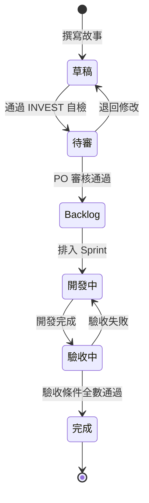

# User Story 撰寫規範（INVEST）

> 定義 PetFlow Enterprise 全專案 User Story 的統一撰寫格式、INVEST 品質原則、編號規則與生命週期，作為所有故事文件的最高撰寫依據。

| 文件版本 | 狀態 | 最後更新 | 所屬模組 |
| --- | --- | --- | --- |
| v0.2.0 | 初稿 | 2026-07-02 | 06 User Story |

---

## 1. 目的與適用範圍

本規範適用於 PetFlow Enterprise 所有模組的 User Story 撰寫，包括：

- [02_各功能模組使用者故事清單](02_各功能模組使用者故事清單.md) 內之全部故事
- 未來各功能模組（`docs/13_寵物管理/` 至 `docs/27_AI/`）自行維護之故事
- Sprint Backlog 與需求追溯（Traceability）文件

任何 User Story 若與本規範牴觸，一律以本規範為準；本規範若與根目錄 `CLAUDE.md` 牴觸，以 `CLAUDE.md` 為準。

## 2. 標準格式

### 2.1 敘述句型（固定三段式）

```text
身為（角色），我想要（功能），以便（價值）。
```

| 欄位 | 說明 | 範例 |
| --- | --- | --- |
| 角色 | 必須使用 [05 使用者角色](../05_使用者角色/README.md) 定義之 Persona 或系統角色 | 小美（店員／STAFF） |
| 功能 | 使用者可觀察到的行為，不描述技術實作 | 建立寵物基本檔案 |
| 價值 | 對使用者或商業的效益，回答「為什麼」 | 快速為到店寵物留存紀錄 |

### 2.2 每則故事必備欄位

| 欄位 | 必填 | 規則 |
| --- | --- | --- |
| 編號 | 是 | `US-<模組代碼>-NNN`，NNN 為三位數流水號，同模組內不重複、不回收 |
| 標題 | 是 | 動詞開頭之短句（如「建立寵物檔案」） |
| 敘述 | 是 | 依 2.1 三段式句型 |
| 驗收條件 | 是 | Given／When／Then 格式，**至少 2 條** |
| 優先級 | 是 | P0（MVP 必要）／P1（第二階段）／P2（未來） |
| 對應 FR | 是 | `FR-<模組代碼>-NNN`，對應 [04 需求分析](../04_需求分析/README.md) 之功能需求 |

### 2.3 模組代碼（統一語言）

| 代碼 | 模組 | 代碼 | 模組 |
| --- | --- | --- | --- |
| PET | 寵物管理 | SUB | 會員訂閱 |
| OWN | 飼主管理 | PAY | 付款系統 |
| HLT | 健康管理 | STO | 多店管理 |
| BRD | 配種管理 | RBC | RBAC 權限 |
| REG | 官方登記助手 | AUD | Audit Log 稽核 |
| PHT | 照片管理 | NTF | 通知中心 |
| TNT | Multi-Tenant 租戶 | AI | AI 功能 |

## 3. INVEST 原則

每則故事在進入 Backlog 前，必須逐項通過 INVEST 檢核：

| 原則 | 意義 | 檢核問題 |
| --- | --- | --- |
| **I** Independent（獨立） | 故事間盡量無強制順序依賴 | 這則故事能否單獨排入任一 Sprint？ |
| **N** Negotiable（可協商） | 描述意圖而非實作細節 | 是否保留了解決方案的討論空間？ |
| **V** Valuable（有價值） | 對使用者或商業有明確價值 | 「以便」段落是否說得出具體效益？ |
| **E** Estimable（可估算） | 團隊能估出相對規模 | 資訊是否足以估點？不足則需先開 Spike |
| **S** Small（夠小） | 一個 Sprint 內可完成 | 超過 1 個 Sprint 即應拆分 |
| **T** Testable（可測試） | 驗收條件可被客觀驗證 | 每條 Given/When/Then 是否可自動化？ |

### 3.1 常見違規與修正範例

| 違規 | 錯誤範例 | 修正 |
| --- | --- | --- |
| 描述實作 | 「我想要一個 D1 資料表儲存寵物」 | 「我想要建立寵物檔案，以便留存到店紀錄」 |
| 太大（Epic） | 「我想要完整的健康管理」 | 拆為疫苗、病歷、提醒等多則故事 |
| 不可測 | 「我想要系統很好用」 | 改為具體行為與可量測的驗收條件 |
| 無價值段 | 缺少「以便」 | 補上商業或使用者價值 |

## 4. 驗收條件（Acceptance Criteria）

- 一律使用 **Given／When／Then**（Gherkin 風格），詳細範本見 [03_驗收條件範本](03_驗收條件範本.md)。
- 每則故事**至少 2 條**：至少 1 條正向情境（Happy Path）、建議 1 條例外／邊界情境。
- 驗收條件必須可對應 [30 測試](../30_測試/README.md) 之測試案例。

## 5. 橫切關注點（每則故事隱含之全域規則）

以下規則為全平台預設，除非故事明確排除，否則**不需在每則故事重複撰寫**，但驗收時一律適用：

1. **Multi-Tenant 隔離**：任何查詢與操作僅限於使用者所屬租戶（Tenant）。
2. **RBAC**：操作前檢查角色權限，預設拒絕（Deny by default）。
3. **Audit Log**：所有建立／修改／刪除／還原操作寫入稽核日誌。
4. **Soft Delete**：刪除一律為軟刪除，查詢預設排除已刪除資料。
5. **輸入驗證**：所有外部輸入經 schema 驗證後才進入 Domain。

## 6. 優先級定義

| 優先級 | 定義 | 對應模組（依產品 Roadmap） |
| --- | --- | --- |
| P0 | MVP 必要，缺少即無法上線 | 寵物、飼主、健康、官方登記、照片基礎、Multi-Tenant、RBAC、Audit Log |
| P1 | 第二階段商業化功能 | 配種、訂閱、付款、通知、多店 |
| P2 | 未來增值功能 | AI |

## 7. 故事生命週期



## 8. 追溯關係

```text
Persona（05） → User Story（06） → Use Case（07） → 流程圖（08） → API 合約（11） → 測試案例（30）
                     │
                     └→ FR 功能需求（04）
```

- 每則 Story 必須對應至少一筆 FR；每筆 P0/P1 FR 至少被一則 Story 覆蓋。
- Story 展開之互動細節寫入 [07 Use Case](../07_Use_Case/README.md)。

## 9. 相關文件

- [02_各功能模組使用者故事清單](02_各功能模組使用者故事清單.md)
- [03_驗收條件範本](03_驗收條件範本.md)
- [04_Story_Map故事地圖](04_Story_Map故事地圖.md)
- [05 使用者角色](../05_使用者角色/README.md)、[04 需求分析](../04_需求分析/README.md)

---

> 本文件屬於 PetFlow Enterprise 官方文件，遵循根目錄 CLAUDE.md 之規範。
