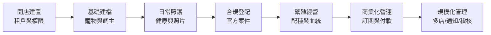
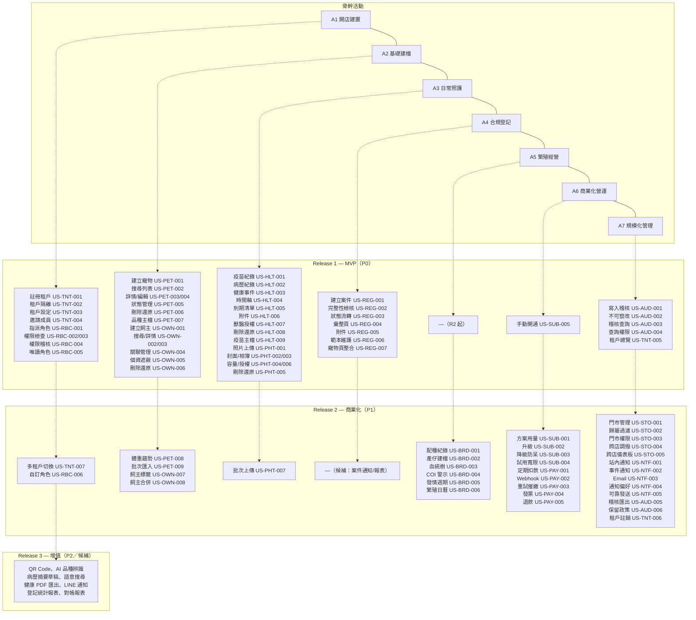

# Story Map（故事地圖）

> 以使用者活動為骨幹（Backbone），將 [02_各模組使用者故事清單](02_各模組使用者故事清單.md) 之故事展開為任務並依 Release（MVP／R2／R3）水平切片，作為 Roadmap 與 Sprint 規劃的視覺化依據。

| 文件版本 | 狀態 | 最後更新 | 所屬模組 |
| --- | --- | --- | --- |
| v0.2.0 | 初稿 | 2026-07-02 | 06 User Story |

---

## 1. 地圖結構說明

- **活動（Activity／Backbone）**：使用者達成目標的大步驟，依日常營運時序由左至右排列。
- **任務（Task）**：活動下的具體行為，對應一至多則 User Story（以 `US-XXX-NNN` 標註）。
- **切片（Release Slice）**：由上往下依價值遞減水平切片——
  - **MVP**：P0 故事，缺少即無法上線（合規、建檔、健康、隔離與稽核底線）。
  - **R2**：P1 故事，第二階段商業化（配種、訂閱、付款、通知、多店）。
  - **R3**：P2 與候補故事，未來增值（AI、進階報表、匯出與整合）。

## 2. 骨幹總覽（Backbone）

| 活動 | 主要角色 | 涉及模組 |
| --- | --- | --- |
| A1 開店建置 | 阿豪／志明、宥廷 | TNT、RBC |
| A2 基礎建檔 | 小美、雅婷 | PET、OWN |
| A3 日常照護 | 小美、Dr. Chen | HLT、PHT |
| A4 合規登記 | 阿豪、小美、宥廷 | REG |
| A5 繁殖經營 | 志明 | BRD |
| A6 商業化營運 | 阿豪、宥廷 | SUB、PAY |
| A7 規模化管理 | 雅婷、宥廷 | STO、NTF、AUD |

## 3. 完整故事地圖

## 4. 活動 × Release 切片表

### 4.1 A1 開店建置（租戶與權限）

| 任務 | MVP | R2 | R3 |
| --- | --- | --- | --- |
| 建立租戶 | US-TNT-001 註冊初始化、US-TNT-002 資料隔離、US-TNT-003 租戶設定 | US-TNT-006 停用註銷 | — |
| 建立團隊 | US-TNT-004 邀請成員、US-RBC-001 指派角色 | US-TNT-007 多租戶切換 | — |
| 權限治理 | US-RBC-002 強制檢查、US-RBC-003 最小揭露、US-RBC-004 權限稽核、US-RBC-005 唯讀角色 | US-RBC-006 自訂角色 | — |

### 4.2 A2 基礎建檔（寵物與飼主）

| 任務 | MVP | R2 | R3 |
| --- | --- | --- | --- |
| 寵物建檔 | US-PET-001 建立、US-PET-004 編輯、US-PET-007 品種主檔 | US-PET-009 批次匯入 | 寵物 QR Code（FR-PET-012） |
| 寵物檢視 | US-PET-002 搜尋列表、US-PET-003 詳情、US-PET-005 狀態管理 | US-PET-008 體重趨勢 | AI 語意搜尋（FR-AI-003） |
| 寵物治理 | US-PET-006 軟刪除還原 | 寵物轉讓（FR-PET-011 候補） | — |
| 飼主建檔 | US-OWN-001 建立、US-OWN-004 關聯管理 | US-OWN-007 標籤、US-OWN-008 合併 | — |
| 飼主檢視與治理 | US-OWN-002 搜尋、US-OWN-003 詳情、US-OWN-005 個資遮蔽、US-OWN-006 軟刪除還原 | 飼主匯出（FR-OWN-010 候補） | — |

### 4.3 A3 日常照護（健康與照片）

| 任務 | MVP | R2 | R3 |
| --- | --- | --- | --- |
| 健康記錄 | US-HLT-001 疫苗、US-HLT-002 病歷、US-HLT-003 事件、US-HLT-006 附件、US-HLT-009 疫苗主檔 | 過敏警示（FR-HLT-011 候補） | 病歷摘要草稿（FR-AI-002） |
| 健康檢視 | US-HLT-004 時間軸、US-HLT-005 到期清單 | 健康 PDF 匯出（FR-HLT-012 候補） | — |
| 健康治理 | US-HLT-007 獸醫授權、US-HLT-008 軟刪除還原 | — | — |
| 照片管理 | US-PHT-001 上傳、US-PHT-002 封面、US-PHT-003 相簿、US-PHT-004 容量、US-PHT-005 軟刪除、US-PHT-006 存取授權 | US-PHT-007 批次上傳、標籤整理／EXIF 清理（候補） | AI 品種辨識（FR-AI-001） |

### 4.4 A4 合規登記（官方案件）

| 任務 | MVP | R2 | R3 |
| --- | --- | --- | --- |
| 案件準備 | US-REG-001 建立案件、US-REG-002 完整性檢核、US-REG-005 附件 | — | — |
| 案件進行 | US-REG-003 狀態流轉、US-REG-004 彙整頁、US-REG-007 寵物頁整合 | 案件狀態通知（FR-REG-009 候補） | 登記統計報表（FR-REG-010） |
| 平台維運 | US-REG-006 範本版本管理 | — | — |

### 4.5 A5 繁殖經營（配種與血統）

| 任務 | MVP | R2 | R3 |
| --- | --- | --- | --- |
| 配種規劃 | — | US-BRD-004 COI 警示、US-BRD-005 發情週期、US-BRD-006 繁殖日曆 | — |
| 配種執行 | — | US-BRD-001 配種紀錄、US-BRD-002 產仔批次建檔 | — |
| 血統呈現 | — | US-BRD-003 血統樹 | 血統書輸出（候補） |

### 4.6 A6 商業化營運（訂閱與付款）

| 任務 | MVP | R2 | R3 |
| --- | --- | --- | --- |
| 方案管理 | US-SUB-005 平台手動開通（P0 例外） | US-SUB-001 方案用量、US-SUB-002 升級、US-SUB-003 降級防呆、US-SUB-004 試用寬限 | — |
| 金流收付 | — | US-PAY-001 定期扣款、US-PAY-002 Webhook、US-PAY-003 重試催繳 | 對帳報表（FR-PAY-006） |
| 帳務作業 | — | US-PAY-004 發票收據、US-PAY-005 退款 | — |

### 4.7 A7 規模化管理（多店／通知／稽核）

| 任務 | MVP | R2 | R3 |
| --- | --- | --- | --- |
| 多店營運 | — | US-STO-001 門市管理、US-STO-002 歸屬過濾、US-STO-003 門市權限、US-STO-004 跨店調撥、US-STO-005 跨店儀表板 | — |
| 主動提醒 | — | US-NTF-001 站內通知、US-NTF-002 事件通知、US-NTF-003 Email、US-NTF-004 偏好、US-NTF-005 可靠發送 | LINE 通知（FR-NTF-006） |
| 稽核治理 | US-AUD-001 寫入稽核、US-AUD-002 不可竄改、US-AUD-003 查詢、US-AUD-004 查詢權限 | US-AUD-005 匯出、US-AUD-006 保留政策 | — |
| 平台維運 | US-TNT-005 租戶總覽 | US-TNT-006 停用註銷 | — |

## 5. Release 切片原則與統計

| Release | 切片原則 | 故事數 |
| --- | --- | --- |
| MVP | 單店可完整走完「建置→建檔→照護→登記」閉環，且隔離、權限、稽核、軟刪除底線一次到位 | 59 |
| R2 | 可收錢（訂閱＋付款）、可長大（多店）、可繁殖（BRD）、可主動提醒（NTF） | 26 |
| R3 | AI 與報表匯出等增值功能，依 R2 商業數據再排序 | 候補中 |

- MVP 的行走骨架（Walking Skeleton）為：US-TNT-001 → US-RBC-001 → US-PET-001 → US-OWN-001 → US-HLT-001 → US-REG-001~004，此路徑打通即可進行首批種子租戶驗證。
- R3 故事尚未逐則撰寫，來源為 [03_功能需求清單](../04_需求分析/03_功能需求清單.md) 之 P2 需求與各模組候補項，將於 R2 期中補寫。

## 6. 相關文件

- [02_各模組使用者故事清單](02_各模組使用者故事清單.md)：各故事完整敘述與驗收條件
- [31 Roadmap](../31_Roadmap/README.md)：Release 時程對應
- [07 Use Case](../07_Use_Case/README.md)：故事展開之互動細節

---

> 本文件屬於 PetFlow Enterprise 官方文件，遵循根目錄 CLAUDE.md 之規範。
