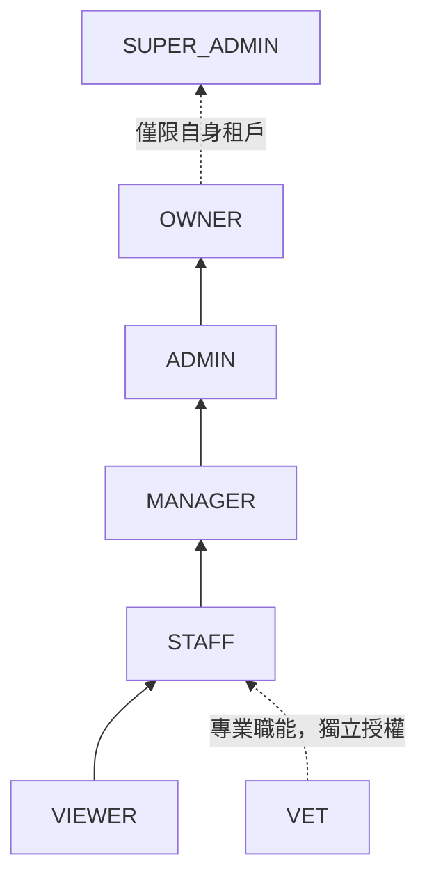
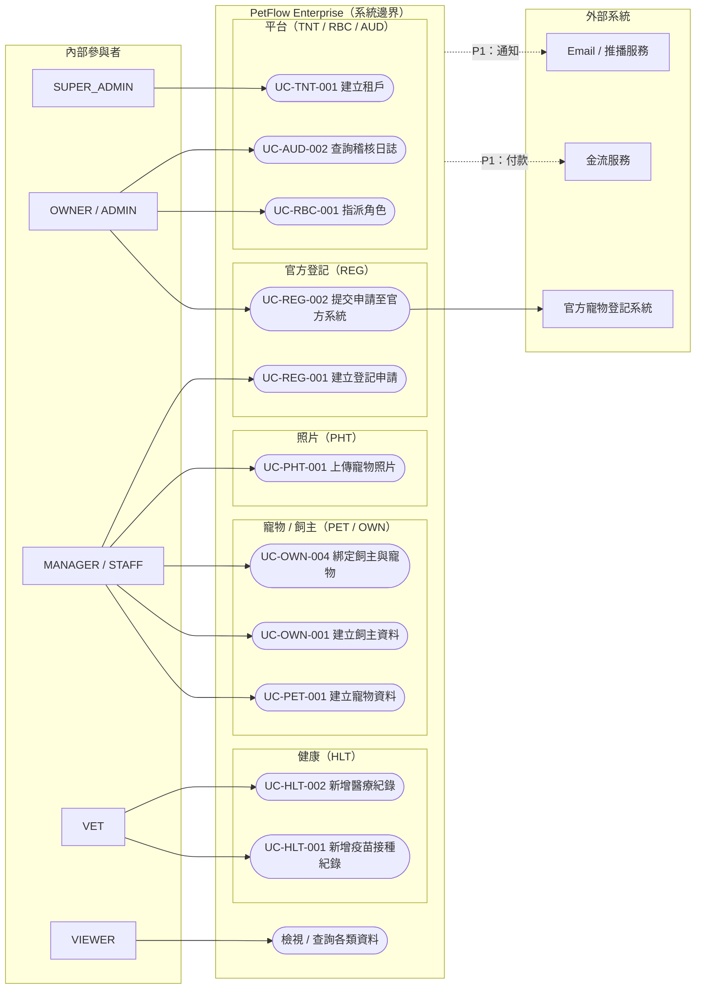
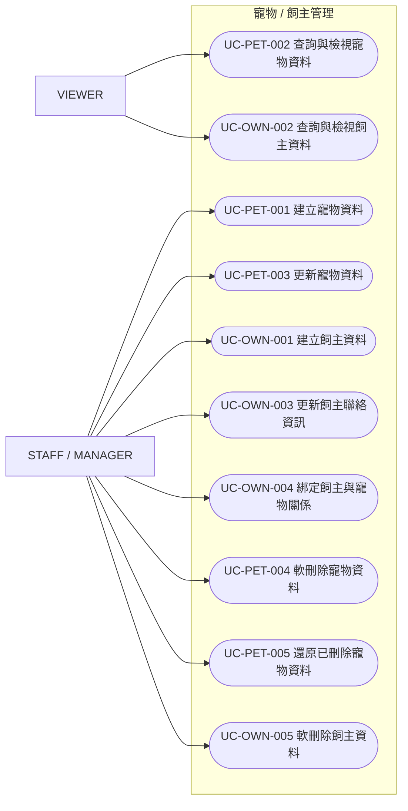
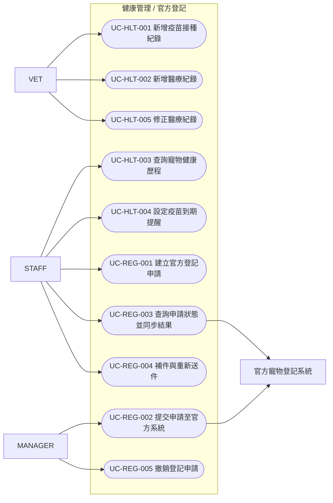
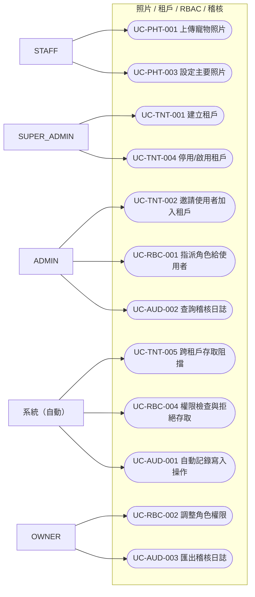

# Use Case 圖總覽

> 定義 PetFlow Enterprise 的系統邊界、參與者（Actor）與各模組使用案例的整體視圖，作為所有 Use Case 規格的導覽地圖。

| 文件版本 | 狀態 | 最後更新 | 所屬模組 |
| --- | --- | --- | --- |
| v0.2.0 | 初稿 | 2026-07-02 | 07 Use Case |

---

## 1. 目的與範圍

本文件提供 PetFlow Enterprise（多租戶 B2B SaaS，服務寵物店、連鎖門市、專業繁殖者與寵物服務業者）的 Use Case 整體視圖：

- 定義**系統邊界**：哪些行為屬於系統內部、哪些由外部系統承擔。
- 定義**參與者（Actor）**：內部角色與外部系統。
- 提供 **Use Case 編號規則**與**全模組 Use Case 索引**。
- 以 mermaid 繪製**總覽圖**與 **MVP 各模組 Use Case 圖**。

詳細規格請見 [02_各模組Use_Case規格書](02_各模組Use_Case規格書.md)。

## 2. 參與者（Actors）

### 2.1 內部角色（人員參與者）

| 參與者 | 說明 | 權限層級 |
| --- | --- | --- |
| SUPER_ADMIN | 平台超級管理員，管理所有租戶與平台設定 | 平台層 |
| OWNER | 租戶擁有者（店東／負責人），擁有租戶內最高權限 | 租戶層 |
| ADMIN | 租戶管理員，管理使用者、角色與租戶設定 | 租戶層 |
| MANAGER | 門市／部門主管，管理營運資料與報表 | 門市層 |
| STAFF | 一般員工，執行日常資料建立與維護 | 門市層 |
| VET | 獸醫師，維護健康與醫療紀錄（Vaccination、MedicalRecord） | 專業角色 |
| VIEWER | 唯讀使用者，僅可檢視被授權範圍內的資料 | 唯讀 |

### 2.2 外部系統（系統參與者）

| 參與者 | 說明 | 互動方向 |
| --- | --- | --- |
| 官方寵物登記系統 | 政府／協會之官方登記平台，接收 RegistrationApplication 送件並回覆審核結果 | 雙向 |
| 金流服務 | 第三方金流（付款、退款、Webhook 通知） | 雙向 |
| Email／推播服務 | 對外通知遞送（Email、Push） | 系統 → 外部 |

### 2.3 角色繼承關係

> 上層角色**包含**下層角色的權限（RBAC 詳見 [24_RBAC](../24_RBAC/README.md)）；所有角色皆受租戶隔離限制，SUPER_ADMIN 為唯一的平台層角色。

## 3. 系統邊界

- **系統內部**：寵物（Pet）、飼主（Owner）、健康（Vaccination／MedicalRecord）、官方登記（RegistrationApplication）、照片、配種（BreedingRecord）、訂閱、付款編排、多店（Store）、租戶（Tenant）、RBAC、Audit Log、通知編排、AI。
- **系統外部**：官方登記審核作業本身、實際金流扣款、Email／推播的最終遞送。
- **橫切關注點（Cross-cutting）**：所有 Use Case 一律隱含下列約束，於各規格之例外流程呈現：
  1. **Multi-Tenant 隔離**：任何查詢與寫入皆以 `tenantId` 限定，跨租戶一律禁止。
  2. **RBAC**：每個 Use Case 宣告所需權限，Deny by default；權限不足回 403。
  3. **Audit Log**：所有寫入操作（建立／修改／刪除／還原）自動記錄稽核日誌。
  4. **Soft Delete**：刪除一律為軟刪除（`deleted_at`），查詢預設排除已刪除資料。

## 4. Use Case 編號規則

格式：`UC-<模組代碼>-NNN`（NNN 自 001 起算）。

| 模組代碼 | 模組 | 階段 | 模組代碼 | 模組 | 階段 |
| --- | --- | --- | --- | --- | --- |
| PET | 寵物管理 | P0（MVP） | BRD | 配種管理 | P1 |
| OWN | 飼主管理 | P0（MVP） | SUB | 會員訂閱 | P1 |
| HLT | 健康管理 | P0（MVP） | PAY | 付款系統 | P1 |
| REG | 官方登記 | P0（MVP） | NTF | 通知中心 | P1 |
| PHT | 照片管理 | P0（MVP） | STO | 多店管理 | P1 |
| TNT | 租戶（Multi-Tenant） | P0（MVP） | AI | AI 功能 | P2 |
| RBC | RBAC | P0（MVP） | | | |
| AUD | Audit Log | P0（MVP） | | | |

## 5. 整體 Use Case 圖（總覽）

> mermaid 未內建 UML Use Case 圖，以下以 flowchart 慣例表示：橢圓為 Use Case、矩形為參與者、subgraph 為系統邊界；圖中僅列各模組代表性案例，完整清單見第 6 節索引。

## 6. Use Case 索引

### 6.1 MVP（P0）— 詳細規格見 [02_各模組Use_Case規格書](02_各模組Use_Case規格書.md)

| 編號 | 名稱 | 主要參與者 |
| --- | --- | --- |
| UC-PET-001 | 建立寵物資料 | STAFF |
| UC-PET-002 | 查詢與檢視寵物資料 | VIEWER（含以上角色） |
| UC-PET-003 | 更新寵物資料 | STAFF |
| UC-PET-004 | 軟刪除寵物資料 | MANAGER |
| UC-PET-005 | 還原已刪除寵物資料 | MANAGER |
| UC-OWN-001 | 建立飼主資料 | STAFF |
| UC-OWN-002 | 查詢與檢視飼主資料 | VIEWER（含以上角色） |
| UC-OWN-003 | 更新飼主聯絡資訊 | STAFF |
| UC-OWN-004 | 綁定飼主與寵物關係 | STAFF |
| UC-OWN-005 | 軟刪除飼主資料 | MANAGER |
| UC-HLT-001 | 新增疫苗接種紀錄 | VET |
| UC-HLT-002 | 新增醫療紀錄 | VET |
| UC-HLT-003 | 查詢寵物健康歷程 | STAFF |
| UC-HLT-004 | 設定疫苗到期提醒 | STAFF |
| UC-HLT-005 | 修正醫療紀錄 | VET |
| UC-REG-001 | 建立官方登記申請 | STAFF |
| UC-REG-002 | 提交申請至官方寵物登記系統 | MANAGER |
| UC-REG-003 | 查詢申請狀態並同步官方結果 | STAFF |
| UC-REG-004 | 補件與重新送件 | STAFF |
| UC-REG-005 | 撤銷登記申請 | MANAGER |
| UC-PHT-001 | 上傳寵物照片 | STAFF |
| UC-PHT-002 | 檢視照片與縮圖 | VIEWER（含以上角色） |
| UC-PHT-003 | 設定主要照片 | STAFF |
| UC-PHT-004 | 軟刪除照片 | STAFF |
| UC-TNT-001 | 建立租戶 | SUPER_ADMIN |
| UC-TNT-002 | 邀請使用者加入租戶 | ADMIN |
| UC-TNT-003 | 更新租戶基本設定 | ADMIN |
| UC-TNT-004 | 停用／啟用租戶 | SUPER_ADMIN |
| UC-TNT-005 | 跨租戶存取阻擋（隔離驗證） | 系統 |
| UC-RBC-001 | 指派角色給使用者 | ADMIN |
| UC-RBC-002 | 調整角色權限 | OWNER |
| UC-RBC-003 | 移除使用者角色 | ADMIN |
| UC-RBC-004 | 權限檢查與拒絕存取 | 系統 |
| UC-RBC-005 | 檢視角色權限矩陣 | ADMIN |
| UC-AUD-001 | 自動記錄寫入操作 | 系統 |
| UC-AUD-002 | 查詢稽核日誌 | ADMIN |
| UC-AUD-003 | 匯出稽核日誌 | OWNER |
| UC-AUD-004 | 稽核日誌完整性驗證 | SUPER_ADMIN |

### 6.2 P1／P2（編號保留，詳細規格於對應版本補齊）

| 編號區段 | 模組 | 代表案例（預定） |
| --- | --- | --- |
| UC-BRD-0xx | 配種管理 | 建立配種紀錄（BreedingRecord）、記錄產仔結果 |
| UC-SUB-0xx | 會員訂閱 | 訂閱方案、升降級、續約 |
| UC-PAY-0xx | 付款系統 | 發起付款（金流服務）、退款、對帳 |
| UC-NTF-0xx | 通知中心 | 發送通知（Email／推播服務）、通知偏好設定 |
| UC-STO-0xx | 多店管理 | 建立門市（Store）、跨店調撥、門市權限範圍 |
| UC-AI-0xx | AI 功能 | 智慧建議、照片辨識輔助 |

## 7. MVP 各模組 Use Case 圖

### 7.1 寵物與飼主（PET / OWN）

### 7.2 健康與官方登記（HLT / REG）

### 7.3 照片與平台基礎（PHT / TNT / RBC / AUD）

## 8. 追溯關係

- 每個 Use Case 於規格書中對應 **US（User Story）** 與 **FR（功能需求）** 編號：`US-<模組>-NNN`、`FR-<模組>-NNN`（見 [06_User_Story](../06_User_Story/README.md)、[04_需求分析](../04_需求分析/README.md)）。
- Use Case → API 端點對應於 [11_API設計](../11_API設計/README.md) 維護；流程與狀態圖見 [08_流程圖](../08_流程圖/README.md)。

---

> 本文件屬於 PetFlow Enterprise 官方文件，遵循根目錄 CLAUDE.md 之規範。
