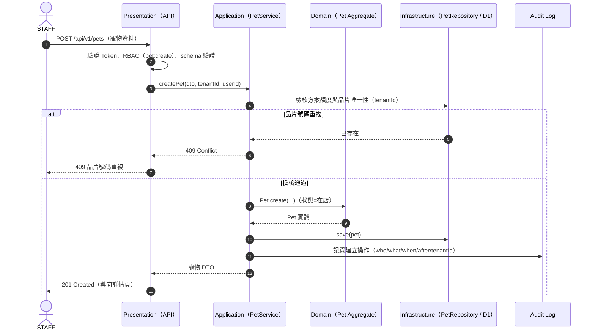
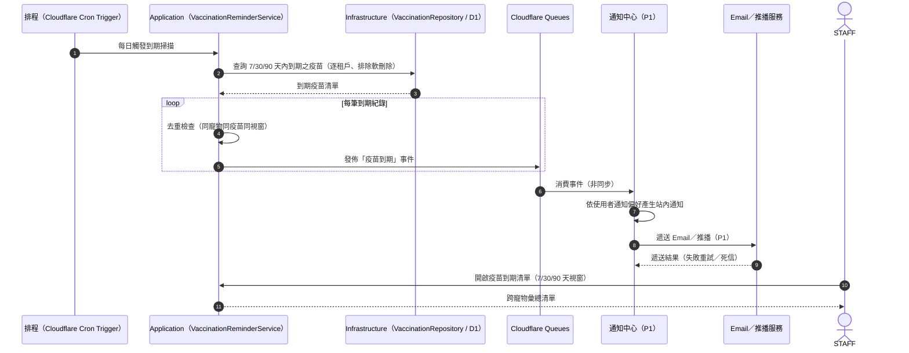
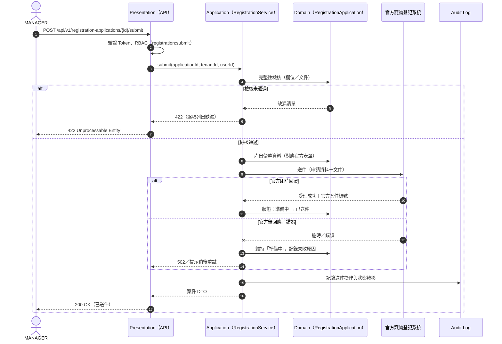

# 各模組 Use Case 規格書

> 依模組逐一定義 PetFlow Enterprise 的 Use Case 規格：參與者、前置／後置條件、主要／替代／例外流程，並回溯 US 與 FR 編號，作為 API 設計與測試案例的依據。

| 文件版本 | 狀態 | 最後更新 | 所屬模組 |
| --- | --- | --- | --- |
| v0.2.0 | 初稿 | 2026-07-02 | 07 Use Case |

---

## 1. 閱讀說明

### 1.1 欄位定義

每個 Use Case 包含下列欄位：

| 欄位 | 說明 |
| --- | --- |
| 編號 | `UC-<模組代碼>-NNN`，與 [01_Use_Case圖總覽](01_Use_Case圖總覽.md) 索引一致 |
| 主要參與者 | 執行本案例的最低權限角色；上層角色（見角色繼承）一律可執行 |
| 前置條件 | 案例開始前必須成立的狀態（彙整見 [03_前置後置條件清單](03_前置後置條件清單.md)） |
| 觸發事件 | 啟動案例的操作或系統事件 |
| 主要流程 | 正常成功路徑（編號步驟） |
| 替代流程 | 仍可成功的分支（A1、A2…，標註自主要流程哪一步分岔） |
| 例外流程 | 失敗或中止的分支（E1、E2…），詳細行為見 [04_例外與錯誤情境彙整](04_例外與錯誤情境彙整.md) |
| 後置條件 | 案例成功結束後保證成立的狀態 |
| 關聯 US / FR | 追溯 `US-<模組>-NNN` 與 [03_功能需求清單](../04_需求分析/03_功能需求清單.md) 的 `FR-<模組>-NNN` |

### 1.2 橫切約束（所有 Use Case 一律適用）

1. **Multi-Tenant 隔離**：所有查詢與寫入以 `tenantId` 限定；跨租戶資源一律視為不存在（回 404，不洩漏存在性）。
2. **RBAC**：每個 Use Case 宣告所需權限（`資源:動作`），Deny by default。
3. **Audit Log**：所有寫入操作（建立／修改／刪除／還原）自動觸發 UC-AUD-001。
4. **Soft Delete**：刪除一律為軟刪除（`deleted_at`），查詢預設排除已刪除資料。
5. **輸入驗證**：所有輸入先經 schema 驗證，失敗回 422。

### 1.3 共通例外（Common Exceptions）

以下例外適用於**所有** Use Case，各規格之例外流程僅列出「該案例特有」的例外；完整目錄見 [04_例外與錯誤情境彙整](04_例外與錯誤情境彙整.md)。

| 代碼 | 例外 | HTTP |
| --- | --- | --- |
| CE-401 | 未登入或 Token 失效 | 401 |
| CE-403 | 權限不足（RBAC 拒絕） | 403 |
| CE-404T | 跨租戶存取（隱藏存在性） | 404 |
| CE-404 | 資源不存在或已軟刪除 | 404 |
| CE-422 | 輸入驗證失敗 | 422 |

---

## 2. 寵物管理（PET）

### UC-PET-001 建立寵物資料

| 項目 | 內容 |
| --- | --- |
| 主要參與者 | STAFF |
| 所需權限 | `pet:create` |
| 前置條件 | 已登入；租戶為啟用狀態；寵物數未達訂閱方案額度 |
| 觸發事件 | 使用者於寵物列表點選「新增寵物」並送出表單 |
| 後置條件 | Pet 建立成功（狀態預設「在店」）、寫入 Audit Log、出現於列表查詢 |
| 關聯 US / FR | US-PET-001；FR-PET-001、FR-PET-002、FR-PET-006、FR-PET-009 |

**主要流程**

1. 使用者開啟「新增寵物」表單。
2. 系統載入品種主檔（依物種）供選擇。
3. 使用者填寫必填欄位（名稱、物種）與選填欄位（品種、性別、生日、晶片號碼、毛色、體重、備註）。
4. 使用者送出，系統以 schema 驗證輸入。
5. 系統檢核租戶寵物數額度（訂閱方案）。
6. 若填寫晶片號碼，系統檢查同租戶內唯一性。
7. 系統建立 Pet（狀態「在店」）並寫入 Audit Log。
8. 系統回傳 201 與寵物詳情，導向詳情頁。

**替代流程**

- A1（自步驟 3）：品種主檔無所需品種 → 使用者自訂新增品種（FR-PET-009）後繼續步驟 4。
- A2（自步驟 8）：使用者選擇「儲存並繼續新增」→ 系統清空表單回到步驟 3。

**例外流程**

- E1（步驟 5）：寵物數已達方案額度 → 回 422 並提示升級方案，中止建立。
- E2（步驟 6）：晶片號碼於同租戶重複 → 回 409 與明確錯誤訊息（含既有寵物連結），中止建立。
- E3：共通例外 CE-401／CE-403／CE-422 適用。

### UC-PET-002 查詢與檢視寵物資料

| 項目 | 內容 |
| --- | --- |
| 主要參與者 | VIEWER（含以上角色） |
| 所需權限 | `pet:read` |
| 前置條件 | 已登入；租戶為啟用狀態 |
| 觸發事件 | 使用者開啟寵物列表或詳情頁 |
| 後置條件 | 系統狀態不變（唯讀）；使用者取得授權範圍內的寵物資料 |
| 關聯 US / FR | US-PET-002；FR-PET-003、FR-PET-004 |

**主要流程**

1. 使用者開啟寵物列表。
2. 系統依 `tenantId`（P1 另依門市範圍）回傳游標分頁列表，預設排除已軟刪除資料。
3. 使用者以關鍵字（名稱／晶片／品種）、狀態過濾與排序調整結果。
4. 使用者點選任一寵物，系統顯示詳情頁：基本資料、健康摘要、封面照、飼主關聯、登記案件狀態。

**替代流程**

- A1（自步驟 2）：查詢結果為空 → 顯示空狀態與「新增寵物」引導（具 `pet:create` 權限者）。

**例外流程**

- E1：共通例外 CE-401／CE-403／CE-404T／CE-404 適用。

### UC-PET-003 更新寵物資料

| 項目 | 內容 |
| --- | --- |
| 主要參與者 | STAFF |
| 所需權限 | `pet:update` |
| 前置條件 | 已登入；目標寵物存在於本租戶且未被軟刪除 |
| 觸發事件 | 使用者於寵物詳情頁點選「編輯」並送出變更 |
| 後置條件 | 寵物資料更新；Audit Log 含 before/after；狀態變更留存歷程 |
| 關聯 US / FR | US-PET-003；FR-PET-005、FR-PET-006 |

**主要流程**

1. 使用者開啟編輯表單，系統帶入現有資料與版本標記。
2. 使用者修改欄位（含寵物狀態：在店／已售／寄養／歿）並送出。
3. 系統驗證輸入與晶片唯一性（若異動）。
4. 系統更新 Pet；狀態變更時寫入狀態歷程。
5. 系統寫入 Audit Log（before/after）並回傳 200。

**替代流程**

- A1（自步驟 2）：僅變更狀態（快速操作）→ 系統跳過其他欄位驗證，直接執行步驟 4。

**例外流程**

- E1（步驟 3）：晶片號碼與同租戶其他寵物重複 → 回 409。
- E2（步驟 4）：版本標記不符（他人已先修改）→ 回 409 併發修改衝突，提示重新載入。
- E3：共通例外 CE-401／CE-403／CE-404T／CE-404／CE-422 適用。

### UC-PET-004 軟刪除寵物資料

| 項目 | 內容 |
| --- | --- |
| 主要參與者 | MANAGER |
| 所需權限 | `pet:delete` |
| 前置條件 | 已登入；目標寵物存在於本租戶且未被軟刪除 |
| 觸發事件 | 使用者於寵物詳情頁點選「刪除」並確認 |
| 後置條件 | 寵物標記 `deleted_at`，不再出現於任何預設查詢；可自回收區還原；寫入 Audit Log |
| 關聯 US / FR | US-PET-004；FR-PET-007 |

**主要流程**

1. 使用者點選「刪除」，系統顯示確認對話框（含關聯資料提示：健康紀錄、照片、登記案件）。
2. 使用者確認刪除。
3. 系統將 Pet 標記 `deleted_at`（不做實體刪除），關聯查詢同步隱藏。
4. 系統寫入 Audit Log 並回傳 204。

**替代流程**

- A1（自步驟 1）：寵物有進行中的登記案件 → 系統要求二次確認並提示先處理案件，使用者仍可確認刪除（案件標記為待處理）。

**例外流程**

- E1（步驟 3）：寵物已被軟刪除（重複刪除）→ 回 409 狀態衝突。
- E2：共通例外 CE-401／CE-403／CE-404T／CE-404 適用。

### UC-PET-005 還原已刪除寵物資料

| 項目 | 內容 |
| --- | --- |
| 主要參與者 | MANAGER |
| 所需權限 | `pet:restore` |
| 前置條件 | 已登入；目標寵物存在於本租戶且處於已軟刪除狀態 |
| 觸發事件 | 使用者於回收區點選「還原」 |
| 後置條件 | 寵物 `deleted_at` 清除，恢復出現於查詢；寫入 Audit Log |
| 關聯 US / FR | US-PET-005；FR-PET-007 |

**主要流程**

1. 使用者開啟回收區，系統列出本租戶已軟刪除的寵物。
2. 使用者點選「還原」並確認。
3. 系統檢核還原後不超過方案額度，清除 `deleted_at`。
4. 系統寫入 Audit Log 並回傳 200。

**替代流程**

- A1（自步驟 3）：寵物之晶片號碼已被其他寵物使用 → 系統提示需先清除晶片欄位再還原，經確認後以空晶片還原。

**例外流程**

- E1（步驟 3）：還原將超過方案寵物數額度 → 回 422 並提示升級。
- E2（步驟 2）：寵物未處於已刪除狀態 → 回 409。
- E3：共通例外 CE-401／CE-403／CE-404T／CE-404 適用。

## 3. 飼主管理（OWN）

### UC-OWN-001 建立飼主資料

| 項目 | 內容 |
| --- | --- |
| 主要參與者 | STAFF |
| 所需權限 | `owner:create` |
| 前置條件 | 已登入；租戶為啟用狀態 |
| 觸發事件 | 使用者點選「新增飼主」並送出表單 |
| 後置條件 | Owner 建立成功並寫入 Audit Log |
| 關聯 US / FR | US-OWN-001；FR-OWN-001、FR-OWN-002 |

**主要流程**

1. 使用者填寫必填欄位（姓名、電話）與選填欄位（Email、地址、備註）。
2. 系統驗證輸入並以電話進行重複偵測（同租戶）。
3. 系統建立 Owner，寫入 Audit Log，回傳 201。

**替代流程**

- A1（自步驟 2）：偵測到相同電話之既有飼主 → 系統提示並列出候選，使用者可直接選用既有飼主（不建立新資料）結束案例。
- A2（自步驟 2）：使用者確認為不同人（如家人共用電話）→ 忽略提示繼續建立。

**例外流程**

- E1：共通例外 CE-401／CE-403／CE-422 適用。

### UC-OWN-002 查詢與檢視飼主資料

| 項目 | 內容 |
| --- | --- |
| 主要參與者 | VIEWER（含以上角色） |
| 所需權限 | `owner:read`；個資明碼另需 `owner:pii:read` |
| 前置條件 | 已登入 |
| 觸發事件 | 使用者開啟飼主列表或詳情頁 |
| 後置條件 | 系統狀態不變；無 `owner:pii:read` 者電話／地址以遮蔽形式顯示 |
| 關聯 US / FR | US-OWN-002；FR-OWN-003、FR-OWN-004、FR-OWN-006 |

**主要流程**

1. 使用者以姓名／電話搜尋、標籤過濾瀏覽分頁列表。
2. 使用者點選飼主，系統顯示詳情頁：基本資料、名下所有寵物、互動紀錄。
3. 系統依 `owner:pii:read` 權限決定電話／地址顯示為明碼或遮蔽（例：`0912***678`）。

**替代流程**

- A1（自步驟 1）：以完整電話精確搜尋 → 直接顯示唯一符合的飼主詳情。

**例外流程**

- E1：共通例外 CE-401／CE-403／CE-404T／CE-404 適用。

### UC-OWN-003 更新飼主聯絡資訊

| 項目 | 內容 |
| --- | --- |
| 主要參與者 | STAFF |
| 所需權限 | `owner:update` |
| 前置條件 | 已登入；目標飼主存在於本租戶且未被軟刪除 |
| 觸發事件 | 使用者於飼主詳情頁編輯聯絡資訊並送出 |
| 後置條件 | 飼主資料更新，Audit Log 含 before/after |
| 關聯 US / FR | US-OWN-003；FR-OWN-001、FR-OWN-002 |

**主要流程**

1. 使用者開啟編輯表單，系統帶入現有資料。
2. 使用者修改電話／Email／地址等並送出。
3. 系統驗證輸入；電話異動時執行重複偵測提示。
4. 系統更新 Owner，寫入 Audit Log（before/after），回傳 200。

**替代流程**

- A1（自步驟 3）：新電話與其他飼主重複 → 系統提示可能重複，使用者確認後仍可儲存（提供後續合併依據，FR-OWN-009）。

**例外流程**

- E1（步驟 4）：併發修改衝突 → 回 409。
- E2：共通例外 CE-401／CE-403／CE-404T／CE-404／CE-422 適用。

### UC-OWN-004 綁定飼主與寵物關係

| 項目 | 內容 |
| --- | --- |
| 主要參與者 | STAFF |
| 所需權限 | `owner:update` 與 `pet:update` |
| 前置條件 | 已登入；飼主與寵物皆存在於本租戶且未被軟刪除 |
| 觸發事件 | 使用者於寵物或飼主詳情頁點選「綁定關係」 |
| 後置條件 | 建立多對多關聯；每隻寵物恰有一位主要飼主；寫入 Audit Log |
| 關聯 US / FR | US-OWN-004；FR-OWN-005 |

**主要流程**

1. 使用者於寵物詳情頁搜尋並選擇飼主（或反向自飼主頁選擇寵物）。
2. 使用者指定關係類型：主要飼主或共同飼養。
3. 系統檢核關聯不重複；若指定為主要飼主且該寵物已有主要飼主，提示將改置換。
4. 系統建立關聯（必要時原主要飼主降為共同飼養），寫入 Audit Log，回傳 201。

**替代流程**

- A1（自步驟 1）：找不到飼主 → 內嵌執行 UC-OWN-001 建立新飼主後回到步驟 2。
- A2：解除綁定 → 使用者點選既有關聯「解除」，系統確認後移除關聯（寵物至少保留一位主要飼主，否則提示指定）。

**例外流程**

- E1（步驟 3）：同一組飼主—寵物關聯已存在 → 回 409。
- E2：共通例外 CE-401／CE-403／CE-404T／CE-404 適用。

### UC-OWN-005 軟刪除飼主資料

| 項目 | 內容 |
| --- | --- |
| 主要參與者 | MANAGER |
| 所需權限 | `owner:delete` |
| 前置條件 | 已登入；目標飼主存在於本租戶且未被軟刪除 |
| 觸發事件 | 使用者於飼主詳情頁點選「刪除」 |
| 後置條件 | 飼主標記 `deleted_at`；寵物關聯保留但標示飼主已刪除；寫入 Audit Log |
| 關聯 US / FR | US-OWN-005；FR-OWN-007 |

**主要流程**

1. 使用者點選「刪除」，系統檢查名下寵物關聯。
2. 系統顯示確認對話框；若有「在店」狀態寵物關聯，要求二次確認（輸入飼主姓名）。
3. 使用者確認，系統標記 `deleted_at`，寫入 Audit Log，回傳 204。

**替代流程**

- A1（自步驟 2）：使用者改選「先轉移寵物」→ 內嵌執行 UC-OWN-004 將寵物改綁其他飼主後回到步驟 2。

**例外流程**

- E1（步驟 3）：飼主已被軟刪除 → 回 409。
- E2：共通例外 CE-401／CE-403／CE-404T／CE-404 適用。

## 4. 健康管理（HLT）

### UC-HLT-001 新增疫苗接種紀錄

| 項目 | 內容 |
| --- | --- |
| 主要參與者 | VET（STAFF 亦可代登） |
| 所需權限 | `health:create`；VET 僅限被授權寵物（FR-HLT-009） |
| 前置條件 | 已登入；目標寵物存在於本租戶且未被軟刪除 |
| 觸發事件 | 使用者於寵物健康頁點選「新增疫苗紀錄」 |
| 後置條件 | Vaccination 建立、下次到期日確定、寫入 Audit Log、健康時間軸與到期清單更新 |
| 關聯 US / FR | US-HLT-001；FR-HLT-001、FR-HLT-002、FR-HLT-009、FR-HLT-010 |

**主要流程**

1. 使用者自疫苗種類主檔（內建＋租戶自訂）選擇疫苗種類。
2. 使用者填寫施打日、施打獸醫、疫苗批號。
3. 系統依疫苗種類規則自動建議下次到期日。
4. 使用者確認或手動覆寫到期日後送出。
5. 系統驗證輸入（施打日不得為未來日）、建立 Vaccination、寫入 Audit Log，回傳 201。

**替代流程**

- A1（自步驟 1）：主檔無該疫苗 → 具權限者新增租戶自訂疫苗種類（FR-HLT-010）後繼續。
- A2（自步驟 3）：疫苗種類無到期規則 → 到期日留空或由使用者手動輸入。

**例外流程**

- E1（步驟 5）：VET 對該寵物無授權 → 回 403（不洩漏寵物其他資訊）。
- E2：共通例外 CE-401／CE-403／CE-404T／CE-404／CE-422 適用。

### UC-HLT-002 新增醫療紀錄

| 項目 | 內容 |
| --- | --- |
| 主要參與者 | VET |
| 所需權限 | `health:create`；VET 僅限被授權寵物 |
| 前置條件 | 已登入；目標寵物存在於本租戶且未被軟刪除 |
| 觸發事件 | 使用者於寵物健康頁點選「新增病歷」 |
| 後置條件 | MedicalRecord 建立（含附件於 R2）、寫入 Audit Log、健康時間軸更新 |
| 關聯 US / FR | US-HLT-002；FR-HLT-003、FR-HLT-007、FR-HLT-009 |

**主要流程**

1. 使用者填寫病歷：日期、症狀、診斷、處置、用藥。
2. 使用者上傳附件（照片／檢驗報告），系統存入 R2 並關聯。
3. 系統驗證輸入、建立 MedicalRecord、寫入 Audit Log，回傳 201。

**替代流程**

- A1（自步驟 2）：無附件 → 直接送出。
- A2（自步驟 1）：記錄一般健康事件（驅蟲／健檢／洗牙）→ 改建立健康事件紀錄（FR-HLT-004），其餘流程相同。

**例外流程**

- E1（步驟 2）：附件格式或大小不符 → 回 422 並列出限制。
- E2（步驟 2）：租戶儲存容量超限 → 回 422 並提示升級（同 UC-SUB-004）。
- E3：共通例外 CE-401／CE-403／CE-404T／CE-404／CE-422 適用。

### UC-HLT-003 查詢寵物健康歷程

| 項目 | 內容 |
| --- | --- |
| 主要參與者 | STAFF（VIEWER 亦可檢視） |
| 所需權限 | `health:read` |
| 前置條件 | 已登入；目標寵物存在於本租戶 |
| 觸發事件 | 使用者開啟寵物詳情頁之「健康」分頁 |
| 後置條件 | 系統狀態不變（唯讀） |
| 關聯 US / FR | US-HLT-003；FR-HLT-004、FR-HLT-005 |

**主要流程**

1. 系統整合疫苗、病歷、健康事件，依時間倒序呈現健康時間軸。
2. 使用者依紀錄類型／時間區間過濾。
3. 使用者點選單筆紀錄檢視完整內容與附件（附件經簽章 URL 取得）。

**替代流程**

- A1（自步驟 1）：無任何健康紀錄 → 顯示空狀態與「新增紀錄」引導。

**例外流程**

- E1：共通例外 CE-401／CE-403／CE-404T／CE-404 適用。

### UC-HLT-004 設定疫苗到期提醒

| 項目 | 內容 |
| --- | --- |
| 主要參與者 | STAFF（提醒發送由系統排程執行） |
| 所需權限 | `health:read`；設定變更需 `health:update` |
| 前置條件 | 已登入；租戶內存在含下次到期日的疫苗紀錄 |
| 觸發事件 | 使用者開啟「疫苗到期清單」；或系統每日排程掃描到期疫苗 |
| 後置條件 | 使用者取得到期清單；到期事件產生站內提醒（Email 推播屬 UC-NTF-001，P1） |
| 關聯 US / FR | US-HLT-004；FR-HLT-006（P1 連動 FR-NTF-002） |

**主要流程**

1. 使用者開啟疫苗到期清單，系統依 7／30／90 天視窗過濾，跨寵物彙總顯示。
2. 使用者切換視窗天數與門市（P1）過濾條件。
3. 系統每日排程掃描各租戶即將到期之疫苗紀錄。
4. 排程對每筆到期紀錄產生站內提醒事件（P1 交由通知中心遞送 Email／推播）。
5. 使用者自清單點選寵物，可直接執行 UC-HLT-001 登記補打。

**替代流程**

- A1（自步驟 1）：清單為空 → 顯示「近期無到期疫苗」空狀態。
- A2（自步驟 4）：同一寵物同疫苗已於本視窗提醒過 → 排程去重，不重複產生提醒。

**例外流程**

- E1（步驟 4）：提醒事件寫入失敗 → 排程記錄錯誤並於下次執行重試，不影響其他租戶處理。
- E2：共通例外 CE-401／CE-403 適用（限步驟 1–2 之互動查詢）。

### UC-HLT-005 修正醫療紀錄

| 項目 | 內容 |
| --- | --- |
| 主要參與者 | VET |
| 所需權限 | `health:update`；VET 僅限被授權寵物 |
| 前置條件 | 已登入；目標紀錄存在於本租戶且未被軟刪除 |
| 觸發事件 | 使用者於健康紀錄詳情點選「修正」 |
| 後置條件 | 紀錄更新，Audit Log 含 before/after（醫療紀錄修改強制留痕） |
| 關聯 US / FR | US-HLT-005；FR-HLT-008 |

**主要流程**

1. 使用者開啟修正表單，系統帶入原始內容。
2. 使用者修改內容並填寫修正原因（必填）。
3. 系統驗證後更新紀錄，寫入 Audit Log（before/after、修正原因），回傳 200。

**替代流程**

- A1：紀錄需作廢 → 使用者改執行軟刪除（`deleted_at`），可自回收區還原；同樣寫入 Audit Log。

**例外流程**

- E1（步驟 3）：併發修改衝突 → 回 409。
- E2：共通例外 CE-401／CE-403／CE-404T／CE-404／CE-422 適用。

## 5. 官方登記（REG）

### UC-REG-001 建立官方登記申請

| 項目 | 內容 |
| --- | --- |
| 主要參與者 | STAFF |
| 所需權限 | `registration:create` |
| 前置條件 | 已登入；目標寵物存在於本租戶；已有可用的登記類型範本 |
| 觸發事件 | 使用者於寵物詳情頁點選「建立登記申請」 |
| 後置條件 | RegistrationApplication 建立（狀態「草稿」）、綁定範本版本、與寵物雙向關聯、寫入 Audit Log |
| 關聯 US / FR | US-REG-001；FR-REG-001、FR-REG-002、FR-REG-006、FR-REG-008 |

**主要流程**

1. 使用者選擇登記類型（晶片登記、血統登記等），系統載入對應範本之最新版本。
2. 系統自動帶入寵物與飼主主檔資料至申請欄位。
3. 使用者補齊其餘欄位並儲存。
4. 系統建立 RegistrationApplication（狀態「草稿」，綁定範本版本），寫入 Audit Log，回傳 201。

**替代流程**

- A1（自步驟 2）：寵物尚無主要飼主 → 系統提示先執行 UC-OWN-004 綁定後繼續。

**例外流程**

- E1（步驟 1）：該登記類型無可用範本 → 回 422 並提示聯繫平台。
- E2（步驟 4）：同寵物同類型已有進行中案件 → 回 409 並附既有案件連結。
- E3：共通例外 CE-401／CE-403／CE-404T／CE-404／CE-422 適用。

### UC-REG-002 提交申請至官方寵物登記系統

| 項目 | 內容 |
| --- | --- |
| 主要參與者 | MANAGER；外部系統：官方寵物登記系統 |
| 所需權限 | `registration:submit` |
| 前置條件 | 已登入；案件存在於本租戶且狀態為「準備中」；完整性檢核全數通過 |
| 觸發事件 | 使用者於案件頁點選「提交送件」 |
| 後置條件 | 案件狀態轉為「已送件」並記錄官方案件編號（若即時回覆）；寫入 Audit Log |
| 關聯 US / FR | US-REG-002；FR-REG-003、FR-REG-004、FR-REG-005、FR-REG-007 |

**主要流程**

1. 使用者於案件頁點選「提交送件」。
2. 系統執行完整性檢核清單（必填欄位、必要文件附件）。
3. 系統產出申請資料彙整頁（對應官方表單欄位，可列印／PDF）。
4. 使用者確認彙整內容並送出。
5. 系統呼叫官方寵物登記系統送件介面，附上申請資料與文件。
6. 官方系統回覆受理結果與官方案件編號。
7. 系統將案件狀態「準備中 → 已送件」，記錄官方案件編號與送件時間，寫入 Audit Log。

**替代流程**

- A1（自步驟 5）：官方系統僅支援紙本／人工送件 → 使用者列印彙整頁自行送件後，手動將案件標記「已送件」並填入官方案件編號。
- A2（自步驟 6）：官方系統非即時回覆 → 案件先轉「已送件（待確認）」，由 UC-REG-003 後續同步結果。

**例外流程**

- E1（步驟 2）：完整性檢核未通過 → 回 422 並逐項列出缺漏欄位／文件，案件維持「準備中」。
- E2（步驟 5）：官方系統無回應或錯誤 → 案件維持「準備中」，記錄失敗原因並提示稍後重試。
- E3（步驟 7）：案件狀態已被他人變更（非「準備中」）→ 回 409 非法狀態轉移。
- E4：共通例外 CE-401／CE-403／CE-404T／CE-404 適用。

### UC-REG-003 查詢申請狀態並同步官方結果

| 項目 | 內容 |
| --- | --- |
| 主要參與者 | STAFF；外部系統：官方寵物登記系統 |
| 所需權限 | `registration:read`；同步觸發需 `registration:update` |
| 前置條件 | 已登入；案件存在於本租戶且狀態為「已送件」或「補件」 |
| 觸發事件 | 使用者點選「同步官方狀態」；或系統排程定期查詢 |
| 後置條件 | 案件狀態與官方結果一致；狀態變更寫入 Audit Log 並產生站內通知（FR-REG-009） |
| 關聯 US / FR | US-REG-003；FR-REG-004、FR-REG-006、FR-REG-009 |

**主要流程**

1. 系統以官方案件編號向官方寵物登記系統查詢最新狀態。
2. 官方回覆結果：審核中／須補件／核准／退件。
3. 系統依狀態機轉移案件狀態（已送件 → 補件／完成／退件），記錄官方回覆內容。
4. 系統寫入 Audit Log，產生狀態變更站內通知，並同步寵物詳情頁的登記狀態顯示。

**替代流程**

- A1（自步驟 2）：狀態無變化 → 僅更新「最後同步時間」，不寫入狀態轉移。
- A2：官方不提供查詢介面 → 使用者依紙本公文手動更新狀態，其餘步驟相同。

**例外流程**

- E1（步驟 1）：官方系統無回應 → 保留原狀態並記錄同步失敗，排程稍後重試。
- E2（步驟 3）：官方回覆狀態不符狀態機 → 標記「狀態異常」待人工處理，回 422。
- E3：共通例外 CE-401／CE-403／CE-404T／CE-404 適用。

### UC-REG-004 補件與重新送件

| 項目 | 內容 |
| --- | --- |
| 主要參與者 | STAFF |
| 所需權限 | `registration:update`、重新送件需 `registration:submit` |
| 前置條件 | 已登入；案件存在於本租戶且狀態為「補件」 |
| 觸發事件 | 使用者於案件頁檢視補件要求並上傳補正資料 |
| 後置條件 | 補件文件上傳至 R2；案件重新送件後轉回「已送件」；寫入 Audit Log |
| 關聯 US / FR | US-REG-004；FR-REG-004、FR-REG-007 |

**主要流程**

1. 使用者檢視官方補件要求清單。
2. 使用者更正欄位並上傳補正文件（掃描檔存入 R2）。
3. 系統重新執行完整性檢核。
4. 使用者確認後重新送件（同 UC-REG-002 步驟 5–7），案件狀態「補件 → 已送件」。

**替代流程**

- A1（自步驟 2）：僅需補文件、不需重送 → 上傳後標記補件完成，由官方端續審。

**例外流程**

- E1（步驟 3）：檢核仍有缺漏 → 回 422 逐項列出，案件維持「補件」。
- E2（步驟 4）：案件狀態非「補件」→ 回 409 非法狀態轉移。
- E3：共通例外 CE-401／CE-403／CE-404T／CE-404／CE-422 適用。

### UC-REG-005 撤銷登記申請

| 項目 | 內容 |
| --- | --- |
| 主要參與者 | MANAGER |
| 所需權限 | `registration:cancel` |
| 前置條件 | 已登入；案件存在於本租戶且狀態為「草稿」「準備中」或「補件」 |
| 觸發事件 | 使用者於案件頁點選「撤銷申請」並確認 |
| 後置條件 | 案件轉為終止狀態（撤銷）並保留完整歷程；寫入 Audit Log |
| 關聯 US / FR | US-REG-005；FR-REG-004 |

**主要流程**

1. 使用者點選「撤銷申請」，系統顯示確認對話框與撤銷原因欄位（必填）。
2. 使用者填寫原因並確認。
3. 系統將案件轉為「撤銷」，保留所有欄位與附件供查閱，寫入 Audit Log，回傳 200。

**替代流程**

- A1：案件已送件（狀態「已送件」）→ 系統提示須先向官方申請撤件，官方確認後由使用者手動標記撤銷。

**例外流程**

- E1（步驟 3）：案件狀態為「完成」或「退件」等終止狀態 → 回 409 非法狀態轉移。
- E2：共通例外 CE-401／CE-403／CE-404T／CE-404 適用。

## 6. 照片管理（PHT）

### UC-PHT-001 上傳寵物照片

| 項目 | 內容 |
| --- | --- |
| 主要參與者 | STAFF |
| 所需權限 | `photo:create` |
| 前置條件 | 已登入；目標寵物存在於本租戶；儲存容量與單檔大小未超過方案限制 |
| 觸發事件 | 使用者於寵物相簿點選「上傳照片」 |
| 後置條件 | 照片存入 R2、縮圖任務進入 Queues、容量用量更新、寫入 Audit Log |
| 關聯 US / FR | US-PHT-001；FR-PHT-001、FR-PHT-002、FR-PHT-005、FR-PHT-007 |

**主要流程**

1. 使用者選擇照片檔案（JPEG／PNG／WebP）。
2. 系統驗證格式與單檔大小，並檢核租戶剩餘容量（訂閱方案）。
3. 系統將原圖存入 R2（路徑含 `tenantId`，不可公開列舉）。
4. 系統建立照片紀錄並發佈縮圖產生任務至 Cloudflare Queues。
5. 縮圖處理完成前，前端顯示佔位圖；系統寫入 Audit Log，回傳 201。

**替代流程**

- A1（自步驟 1）：批次上傳多張（P1，FR-PHT-008）→ 逐檔執行步驟 2–5，個別失敗不影響其他檔案，最後回傳逐檔結果。
- A2（自步驟 4）：縮圖任務失敗 → Queues 自動重試；超過次數進入死信佇列並保留原圖可用。

**例外流程**

- E1（步驟 2）：容量或單檔大小超過方案限制 → 回 422 並提示升級方案。
- E2（步驟 2）：格式不支援 → 回 422 並列出允許格式。
- E3：共通例外 CE-401／CE-403／CE-404T／CE-404 適用。

### UC-PHT-002 檢視照片與縮圖

| 項目 | 內容 |
| --- | --- |
| 主要參與者 | VIEWER（含以上角色） |
| 所需權限 | `photo:read` |
| 前置條件 | 已登入；目標寵物存在於本租戶 |
| 觸發事件 | 使用者開啟寵物相簿 |
| 後置條件 | 系統狀態不變；照片一律經簽章 URL 存取 |
| 關聯 US / FR | US-PHT-002；FR-PHT-004、FR-PHT-007 |

**主要流程**

1. 系統以網格呈現寵物相簿縮圖（排除已軟刪除）。
2. 使用者點選照片，系統以簽章 URL（短效期）載入原圖並以燈箱放大。

**替代流程**

- A1（自步驟 1）：縮圖尚在處理中 → 顯示佔位圖，處理完成後自動更新。

**例外流程**

- E1（步驟 2）：簽章 URL 過期 → 前端自動重新取得授權 URL；無權限則回 403。
- E2：共通例外 CE-401／CE-403／CE-404T／CE-404 適用。

### UC-PHT-003 設定主要照片

| 項目 | 內容 |
| --- | --- |
| 主要參與者 | STAFF |
| 所需權限 | `photo:update` |
| 前置條件 | 已登入；照片存在於本租戶且未被軟刪除 |
| 觸發事件 | 使用者於相簿對某照片點選「設為封面」 |
| 後置條件 | 該照片成為寵物封面照（唯一），列表與詳情頁同步顯示；寫入 Audit Log |
| 關聯 US / FR | US-PHT-003；FR-PHT-003 |

**主要流程**

1. 使用者點選「設為封面」。
2. 系統將該照片標記為封面照，原封面照自動取消標記（同寵物僅一張）。
3. 系統寫入 Audit Log，回傳 200。

**替代流程**

- A1：取消封面 → 使用者對現任封面點選「取消封面」，寵物回到預設佔位圖。

**例外流程**

- E1（步驟 2）：照片已軟刪除 → 回 409。
- E2：共通例外 CE-401／CE-403／CE-404T／CE-404 適用。

### UC-PHT-004 軟刪除照片

| 項目 | 內容 |
| --- | --- |
| 主要參與者 | STAFF |
| 所需權限 | `photo:delete` |
| 前置條件 | 已登入；照片存在於本租戶且未被軟刪除 |
| 觸發事件 | 使用者於相簿點選「刪除照片」並確認 |
| 後置條件 | 照片標記 `deleted_at`、容量用量釋放；可還原（還原時回復容量計算）；寫入 Audit Log |
| 關聯 US / FR | US-PHT-004；FR-PHT-006 |

**主要流程**

1. 使用者點選「刪除照片」，系統顯示確認對話框。
2. 使用者確認；系統標記 `deleted_at`（R2 物件保留），釋放容量計算。
3. 若該照片為封面照，系統一併取消封面標記。
4. 系統寫入 Audit Log，回傳 204。

**替代流程**

- A1：還原照片 → 使用者自回收區還原；系統檢核容量足夠後清除 `deleted_at` 並回復容量計算。

**例外流程**

- E1（A1）：還原後將超過方案容量 → 回 422 並提示升級。
- E2：共通例外 CE-401／CE-403／CE-404T／CE-404 適用。

## 7. 租戶（TNT）

### UC-TNT-001 建立租戶

| 項目 | 內容 |
| --- | --- |
| 主要參與者 | SUPER_ADMIN（或經由自助註冊流程之新使用者） |
| 所需權限 | `tenant:create`（平台層）；自助註冊走公開註冊端點 |
| 前置條件 | 註冊 Email 未被占用；平台服務正常 |
| 觸發事件 | 新客戶完成註冊表單；或 SUPER_ADMIN 於平台後台代建 |
| 後置條件 | Tenant 建立並初始化：OWNER 帳號、內建角色（FR-RBC-001）、預設 Free 方案；寫入 Audit Log |
| 關聯 US / FR | US-TNT-001；FR-TNT-001、FR-TNT-006 |

**主要流程**

1. 申請者填寫租戶名稱、擁有者姓名、Email、密碼。
2. 系統驗證輸入與 Email 唯一性。
3. 系統建立 Tenant，初始化：OWNER 使用者、內建角色組、預設方案 Free。
4. 系統寄送啟用確認信（經 Email 服務），寫入 Audit Log。
5. 申請者點擊確認連結完成啟用，可登入進入租戶。

**替代流程**

- A1（自步驟 1）：SUPER_ADMIN 代建 → 略過自助表單，由平台後台輸入資料；啟用信寄給指定 OWNER。
- A2（自步驟 5）：確認連結逾期 → 使用者要求重寄啟用信。

**例外流程**

- E1（步驟 2）：Email 已被占用 → 回 409 並提示登入或使用多租戶切換（FR-TNT-008，P1）。
- E2：共通例外 CE-422 適用（本案例之公開註冊步驟不適用 CE-401）。

### UC-TNT-002 邀請使用者加入租戶

| 項目 | 內容 |
| --- | --- |
| 主要參與者 | ADMIN |
| 所需權限 | `tenant:member:invite` |
| 前置條件 | 已登入；租戶為啟用狀態；使用者數未達方案額度 |
| 觸發事件 | ADMIN 於成員管理頁輸入受邀者 Email 並選擇預派角色 |
| 後置條件 | 邀請建立並寄出（有效期限）；受邀者接受後成為租戶成員並帶有預派角色；寫入 Audit Log |
| 關聯 US / FR | US-TNT-002；FR-TNT-005 |

**主要流程**

1. ADMIN 輸入受邀者 Email 並自內建角色選擇預派角色（不得高於自身層級）。
2. 系統檢核方案使用者額度與 Email 是否已為成員。
3. 系統建立邀請（含期限）並經 Email 服務寄送邀請連結，寫入 Audit Log。
4. 受邀者點擊連結，登入或註冊帳號後接受邀請。
5. 系統將使用者加入租戶並指派預派角色，寫入 Audit Log。

**替代流程**

- A1（自步驟 4）：受邀者已有平台帳號（服務多租戶情境）→ 直接登入接受，帳號同時隸屬多租戶（FR-TNT-008，P1）。
- A2：ADMIN 撤回未接受的邀請 → 邀請失效，連結不可再使用。

**例外流程**

- E1（步驟 2）：使用者數已達方案額度 → 回 422 並提示升級。
- E2（步驟 2）：Email 已是本租戶成員 → 回 409。
- E3（步驟 4）：邀請連結逾期或已失效 → 回 410／404，提示重新邀請。
- E4：共通例外 CE-401／CE-403／CE-422 適用。

### UC-TNT-003 更新租戶基本設定

| 項目 | 內容 |
| --- | --- |
| 主要參與者 | ADMIN |
| 所需權限 | `tenant:settings:update` |
| 前置條件 | 已登入；租戶為啟用狀態 |
| 觸發事件 | ADMIN 於租戶設定頁修改並儲存 |
| 後置條件 | 名稱、Logo、時區、聯絡資訊更新；Audit Log 含 before/after |
| 關聯 US / FR | US-TNT-003；FR-TNT-004 |

**主要流程**

1. ADMIN 修改租戶名稱、時區、聯絡資訊，或上傳 Logo（存 R2）。
2. 系統驗證輸入（Logo 格式與大小）。
3. 系統更新設定並寫入 Audit Log（before/after），回傳 200。

**替代流程**

- A1（自步驟 1）：僅更換 Logo → 上傳成功後即時生效，其他欄位不動。

**例外流程**

- E1（步驟 2）：Logo 格式或大小不符 → 回 422。
- E2：共通例外 CE-401／CE-403／CE-422 適用。

### UC-TNT-004 停用／啟用租戶

| 項目 | 內容 |
| --- | --- |
| 主要參與者 | SUPER_ADMIN |
| 所需權限 | `tenant:suspend`（平台層） |
| 前置條件 | 以平台層身分登入；目標租戶存在 |
| 觸發事件 | SUPER_ADMIN 於平台後台對租戶執行停用或啟用 |
| 後置條件 | 停用：租戶資料凍結、所有成員無法登入該租戶（資料保留）；啟用：恢復存取；寫入 Audit Log |
| 關聯 US / FR | US-TNT-004；FR-TNT-006、FR-TNT-007（P1） |

**主要流程**

1. SUPER_ADMIN 於租戶總覽選擇目標租戶並點選「停用」。
2. 系統要求填寫停用原因（欠費、違規、客戶要求等）。
3. 系統將租戶標記為停用：既有 Token 失效、後續請求一律拒絕，資料完整保留。
4. 系統寫入 Audit Log（平台層），並通知租戶 OWNER（Email）。

**替代流程**

- A1：重新啟用 → SUPER_ADMIN 點選「啟用」，租戶恢復正常存取，寫入 Audit Log。
- A2（P1）：進入註銷流程 → 停用後經保留期未復原，依 FR-TNT-007 執行資料清除（含法遵保留）。

**例外流程**

- E1（步驟 3）：租戶已處於目標狀態（重複停用／啟用）→ 回 409。
- E2：共通例外 CE-401／CE-403／CE-404 適用。

### UC-TNT-005 跨租戶存取阻擋（隔離驗證）

| 項目 | 內容 |
| --- | --- |
| 主要參與者 | 系統（中介層自動執行；任何登入使用者皆為次要參與者） |
| 所需權限 | 不適用（本案例即為權限與隔離的強制機制） |
| 前置條件 | 請求已通過認證，Token 內含租戶上下文 |
| 觸發事件 | 任一 API 請求嘗試存取資源 |
| 後置條件 | 僅本租戶資料可被存取；跨租戶嘗試被拒絕並留下紀錄 |
| 關聯 US / FR | US-TNT-005；FR-TNT-002、FR-TNT-003 |

**主要流程**

1. 中介層自 Token 解析 `tenantId`，注入請求上下文。
2. Repository 層所有查詢與寫入強制附帶 `tenantId` 條件（介面層即要求參數）。
3. 資源查無（含屬於他租戶）時一律回 404，不洩漏資源是否存在。
4. 請求正常完成，回傳本租戶資料。

**替代流程**

- A1（自步驟 1）：SUPER_ADMIN 平台層操作 → 僅允許存取租戶中繼資料（清單、狀態、方案、用量），不含業務資料內容（FR-TNT-006）。
- A2（P1）：多租戶使用者切換租戶 → 重新簽發帶新 `tenantId` 的 Token 後，回到步驟 1。

**例外流程**

- E1（步驟 3）：偵測到帶他租戶 ID 的明確存取嘗試 → 回 404 並記錄安全事件供稽核分析。
- E2（步驟 1）：Token 無租戶上下文或租戶已停用 → 回 401／403。

## 8. RBAC（RBC）

### UC-RBC-001 指派角色給使用者

| 項目 | 內容 |
| --- | --- |
| 主要參與者 | ADMIN |
| 所需權限 | `role:assign` |
| 前置條件 | 已登入；目標使用者為本租戶成員 |
| 觸發事件 | ADMIN 於成員管理頁為使用者指派角色 |
| 後置條件 | 使用者獲得角色與其權限（即時生效）；寫入 Audit Log |
| 關聯 US / FR | US-RBC-001；FR-RBC-001、FR-RBC-004、FR-RBC-006 |

**主要流程**

1. ADMIN 選擇目標使用者與欲指派的角色（內建：OWNER／ADMIN／MANAGER／STAFF／VET／VIEWER）。
2. 系統檢核操作者不得指派高於（或等於 OWNER 層級之）自身層級的角色。
3. 系統建立使用者—角色關聯，權限即時生效，寫入 Audit Log，回傳 201。

**替代流程**

- A1（自步驟 1）：使用者已有其他角色 → 允許多角色並存，權限取聯集。

**例外流程**

- E1（步驟 2）：指派高於自身層級的角色 → 回 403。
- E2（步驟 3）：該使用者已擁有此角色 → 回 409。
- E3：共通例外 CE-401／CE-403／CE-404T／CE-404 適用。

### UC-RBC-002 調整角色權限

| 項目 | 內容 |
| --- | --- |
| 主要參與者 | OWNER |
| 所需權限 | `role:update`（自訂角色屬 Enterprise 方案，FR-RBC-007） |
| 前置條件 | 已登入；目標為本租戶之自訂角色（內建角色權限不可修改） |
| 觸發事件 | OWNER 於角色管理頁調整自訂角色之權限組合 |
| 後置條件 | 角色權限更新並即時套用至所有持有者；Audit Log 含 before/after |
| 關聯 US / FR | US-RBC-002；FR-RBC-002、FR-RBC-006、FR-RBC-007（P1） |

**主要流程**

1. OWNER 開啟自訂角色，系統以「資源 × 動作」矩陣呈現目前權限。
2. OWNER 勾選／取消權限項目並儲存。
3. 系統驗證組合（Deny by default，未勾選即拒絕），更新角色。
4. 系統寫入 Audit Log（before/after），權限即時套用至所有持有此角色的使用者。

**替代流程**

- A1（自步驟 1）：建立新自訂角色 → OWNER 以權限組合建立角色（Enterprise 方案），後續同步驟 2–4。

**例外流程**

- E1（步驟 2）：嘗試修改內建角色 → 回 422 並提示改用自訂角色。
- E2（步驟 1）：租戶方案不含自訂角色 → 回 422 並提示升級 Enterprise。
- E3：共通例外 CE-401／CE-403／CE-404T／CE-404 適用。

### UC-RBC-003 移除使用者角色

| 項目 | 內容 |
| --- | --- |
| 主要參與者 | ADMIN |
| 所需權限 | `role:assign` |
| 前置條件 | 已登入；目標使用者持有該角色 |
| 觸發事件 | ADMIN 於成員管理頁移除使用者的某一角色 |
| 後置條件 | 角色關聯移除、權限即時失效；寫入 Audit Log |
| 關聯 US / FR | US-RBC-003；FR-RBC-004、FR-RBC-006 |

**主要流程**

1. ADMIN 選擇使用者與欲移除的角色並確認。
2. 系統檢核：不得移除租戶最後一位 OWNER 的 OWNER 角色。
3. 系統移除關聯，使用者權限即時重算，寫入 Audit Log，回傳 204。

**替代流程**

- A1：使用者離職 → ADMIN 改以「停用成員」一次移除所有角色並封鎖登入（同樣寫入 Audit Log）。

**例外流程**

- E1（步驟 2）：目標為最後一位 OWNER → 回 409 並提示先轉移擁有權。
- E2：共通例外 CE-401／CE-403／CE-404T／CE-404 適用。

### UC-RBC-004 權限檢查與拒絕存取

| 項目 | 內容 |
| --- | --- |
| 主要參與者 | 系統（API 中介層） |
| 所需權限 | 不適用（本案例為權限機制本身） |
| 前置條件 | 請求已通過認證與租戶解析（UC-TNT-005） |
| 觸發事件 | 任一 API 請求到達已宣告所需權限的端點 |
| 後置條件 | 具權限之請求放行；不具權限之請求被拒且不洩漏多餘資訊 |
| 關聯 US / FR | US-RBC-004；FR-RBC-002、FR-RBC-003、FR-RBC-005 |

**主要流程**

1. 中介層讀取端點宣告的所需權限（如 `pet:create`）。
2. 系統彙整使用者所有角色之權限聯集（Deny by default）。
3. 權限符合則放行至 Application 層；門市範圍限制（P1）另行過濾資料範圍。
4. 檢查結果不需寫入業務資料，拒絕事件計入安全記錄。

**替代流程**

- A1（自步驟 3）：具部分欄位權限（如無 `owner:pii:read`）→ 放行請求但回應中遮蔽受限欄位。

**例外流程**

- E1（步驟 3）：權限不足 → 回 403，訊息不含資源存在性或所需權限細節（FR-RBC-005）。
- E2（步驟 1）：端點未宣告權限 → 視為設計錯誤，一律拒絕（Deny by default）並告警。

### UC-RBC-005 檢視角色權限矩陣

| 項目 | 內容 |
| --- | --- |
| 主要參與者 | ADMIN |
| 所需權限 | `role:read` |
| 前置條件 | 已登入 |
| 觸發事件 | ADMIN 開啟角色管理頁 |
| 後置條件 | 系統狀態不變（唯讀） |
| 關聯 US / FR | US-RBC-005；FR-RBC-001、FR-RBC-002 |

**主要流程**

1. 系統以矩陣呈現各角色（內建＋自訂）對各「資源 × 動作」的允許狀態。
2. ADMIN 可依資源或角色過濾，並檢視各角色目前持有人數。

**替代流程**

- A1：自矩陣點選角色 → 進入該角色詳情，可續接 UC-RBC-002（自訂角色）。

**例外流程**

- E1：共通例外 CE-401／CE-403 適用。

## 9. 稽核日誌（AUD）

### UC-AUD-001 自動記錄寫入操作

| 項目 | 內容 |
| --- | --- |
| 主要參與者 | 系統（Application 層自動觸發） |
| 所需權限 | 不適用（系統內部機制） |
| 前置條件 | 任一寫入操作（建立／修改／刪除／還原）已通過驗證並執行 |
| 觸發事件 | 寫入操作交易提交 |
| 後置條件 | 稽核紀錄以附加式寫入（唯讀、不可竄改），含完整六要素 |
| 關聯 US / FR | US-AUD-001；FR-AUD-001、FR-AUD-002 |

**主要流程**

1. 寫入操作完成時，系統組裝稽核紀錄：`who`（操作者）、`what`（動作／實體類型／實體 ID）、`when`（時間）、`where`（IP／裝置）、`before/after`（變更內容）、`tenantId`。
2. 系統以附加式（append-only）寫入稽核儲存，不提供任何更新／刪除介面。
3. 寫入失敗時重試；持續失敗則發出系統告警（稽核不可默默遺失）。

**替代流程**

- A1：系統排程或外部 Webhook 觸發之寫入 → `who` 記錄為系統身分（如 `system:cron`、`system:webhook`）。

**例外流程**

- E1（步驟 3）：稽核寫入持續失敗 → 依模組風險等級決定阻斷交易（高敏感操作）或告警後放行（一般操作），策略見 [25_AuditLog](../25_AuditLog/README.md)。

### UC-AUD-002 查詢稽核日誌

| 項目 | 內容 |
| --- | --- |
| 主要參與者 | ADMIN |
| 所需權限 | `audit:read` |
| 前置條件 | 已登入；僅限查詢本租戶紀錄 |
| 觸發事件 | ADMIN 開啟稽核日誌頁並設定查詢條件 |
| 後置條件 | 系統狀態不變（唯讀）；查詢行為本身亦得記錄 |
| 關聯 US / FR | US-AUD-002；FR-AUD-003、FR-AUD-004 |

**主要流程**

1. ADMIN 設定過濾條件：操作者、實體類型、實體 ID、動作、時間區間。
2. 系統回傳符合條件之本租戶稽核紀錄（分頁、時間倒序）。
3. ADMIN 點選單筆紀錄檢視 before/after 差異明細。

**替代流程**

- A1（自步驟 1）：自業務頁面（如寵物詳情）點選「變更歷程」→ 以實體 ID 預帶條件進入查詢。

**例外流程**

- E1（步驟 1）：時間區間超出方案保留期（FR-AUD-006，P1）→ 回傳保留期內資料並提示已逾期範圍。
- E2：共通例外 CE-401／CE-403 適用。

### UC-AUD-003 匯出稽核日誌

| 項目 | 內容 |
| --- | --- |
| 主要參與者 | OWNER |
| 所需權限 | `audit:export` |
| 前置條件 | 已登入；查詢條件已設定 |
| 觸發事件 | OWNER 於稽核日誌頁點選「匯出 CSV」 |
| 後置條件 | 產出 CSV 檔（經簽章 URL 下載）；匯出行為本身寫入 Audit Log |
| 關聯 US / FR | US-AUD-003；FR-AUD-005（P1） |

**主要流程**

1. OWNER 設定查詢條件並點選「匯出 CSV」。
2. 系統以非同步任務（Queues）產出 CSV 至 R2。
3. 完成後系統通知並提供簽章下載 URL（短效期）。
4. 匯出行為寫入 Audit Log（含條件與筆數）。

**替代流程**

- A1（自步驟 2）：筆數少於同步門檻 → 直接同步回傳檔案，略過通知。

**例外流程**

- E1（步驟 2）：符合筆數超過單次匯出上限 → 回 422 並提示縮小時間區間。
- E2：共通例外 CE-401／CE-403 適用。

### UC-AUD-004 稽核日誌完整性驗證

| 項目 | 內容 |
| --- | --- |
| 主要參與者 | SUPER_ADMIN（平台層例行作業） |
| 所需權限 | `audit:verify`（平台層） |
| 前置條件 | 以平台層身分登入；稽核儲存採附加式寫入且含完整性驗證資訊（如雜湊鏈） |
| 觸發事件 | 定期排程或稽核事件（外部稽核、爭議調查）觸發 |
| 後置條件 | 產出完整性驗證報告；異常時發出告警 |
| 關聯 US / FR | US-AUD-004；FR-AUD-002 |

**主要流程**

1. 系統對指定期間之稽核紀錄執行完整性驗證（序號連續性、雜湊鏈一致性）。
2. 驗證通過，系統產出報告（期間、筆數、驗證結果）供平台留存。

**替代流程**

- A1（自步驟 1）：由排程自動執行 → 週期性驗證最近區段並保存結果。

**例外流程**

- E1（步驟 1）：發現斷鏈或竄改跡象 → 立即發出安全告警、凍結相關區段並啟動調查流程。
- E2：共通例外 CE-401／CE-403 適用。

## 10. 配種管理（BRD，P1）

### UC-BRD-001 建立配種紀錄

| 項目 | 內容 |
| --- | --- |
| 主要參與者 | STAFF |
| 所需權限 | `breeding:create` |
| 前置條件 | 已登入；父／母至少一方為本租戶寵物 |
| 觸發事件 | 使用者點選「新增配種紀錄」 |
| 後置條件 | BreedingRecord 建立，預產期確定；寫入 Audit Log |
| 關聯 US / FR | US-BRD-001；FR-BRD-001、FR-BRD-002、FR-BRD-008 |

**主要流程**

1. 使用者選擇父／母個體（站內寵物或外部個體）、配種日與方式。
2. 系統依物種孕期規則自動計算預產期（可手動調整）。
3. 系統驗證後建立 BreedingRecord，寫入 Audit Log，回傳 201。

**替代流程**

- A1（自步驟 1）：對象為外部種公／種母 → 內嵌登錄外部個體（FR-BRD-008，僅供血統紀錄）後繼續。

**例外流程**

- E1（步驟 3）：父母為同一個體或性別不符 → 回 422。
- E2：共通例外 CE-401／CE-403／CE-404T／CE-404／CE-422 適用。

### UC-BRD-002 記錄產仔結果並批次建檔

| 項目 | 內容 |
| --- | --- |
| 主要參與者 | STAFF |
| 所需權限 | `breeding:update`、`pet:create` |
| 前置條件 | 已登入；BreedingRecord 存在且尚未記錄產仔結果 |
| 觸發事件 | 使用者於配種紀錄點選「記錄產仔」 |
| 後置條件 | 產仔結果寫入；幼犬／幼貓批次建檔並自動建立親子關聯；寫入 Audit Log |
| 關聯 US / FR | US-BRD-002；FR-BRD-003 |

**主要流程**

1. 使用者填寫產仔日、產仔數、存活數。
2. 使用者選擇「一鍵批次建檔」，系統為每隻幼仔預填物種、品種、生日與親子關聯。
3. 使用者補齊個別名稱後送出；系統批次建立 Pet 並寫入 Audit Log。

**替代流程**

- A1（自步驟 2）：暫不建檔 → 僅儲存產仔結果，之後可再批次建檔。

**例外流程**

- E1（步驟 3）：批次建檔將超過方案寵物數額度 → 回 422 並提示升級（整批不建立）。
- E2（步驟 1）：該紀錄已有產仔結果 → 回 409。
- E3：共通例外 CE-401／CE-403／CE-404T／CE-404／CE-422 適用。

### UC-BRD-003 檢視血統樹與近親警示

| 項目 | 內容 |
| --- | --- |
| 主要參與者 | STAFF（VIEWER 可檢視） |
| 所需權限 | `breeding:read` |
| 前置條件 | 已登入；寵物存在於本租戶 |
| 觸發事件 | 使用者開啟寵物「血統」分頁；或於建立配種紀錄前檢查配對 |
| 後置條件 | 系統狀態不變（唯讀） |
| 關聯 US / FR | US-BRD-003；FR-BRD-004、FR-BRD-005 |

**主要流程**

1. 系統以寵物為節點呈現至少三代祖先之血統樹（含外部個體）。
2. 使用者於配種前選擇候選配對，系統計算近親係數（COI）。
3. COI 超過警示門檻時，系統顯示配種前警示。

**替代流程**

- A1（自步驟 1）：祖先資料不足三代 → 呈現可得世代並標示缺漏。

**例外流程**

- E1：共通例外 CE-401／CE-403／CE-404T／CE-404 適用。

## 11. 會員訂閱（SUB，P1）

### UC-SUB-001 訂閱與升級方案

| 項目 | 內容 |
| --- | --- |
| 主要參與者 | OWNER；外部系統：金流服務 |
| 所需權限 | `subscription:manage` |
| 前置條件 | 已登入；租戶為啟用狀態 |
| 觸發事件 | OWNER 於訂閱頁選擇目標方案（Starter／Pro／Enterprise，月繳或年繳 83 折） |
| 後置條件 | 升級即時生效並按比例補收；方案額度即時更新；寫入 Audit Log |
| 關聯 US / FR | US-SUB-001；FR-SUB-001、FR-SUB-002、FR-SUB-004 |

**主要流程**

1. OWNER 選擇目標方案與計費週期，系統顯示按比例補收金額。
2. OWNER 確認後，系統經 UC-PAY-001 向金流服務發起扣款。
3. 扣款成功，系統即時切換方案並更新額度，寫入 Audit Log。

**替代流程**

- A1（自步驟 1）：Free 首次升級 → 需先完成付款方式綁定（金流服務代管，平台不留存卡號）。

**例外流程**

- E1（步驟 2）：扣款失敗 → 方案不變更，提示更換付款方式（後續由 UC-PAY-002 重試機制接手）。
- E2：共通例外 CE-401／CE-403／CE-422 適用。

### UC-SUB-002 降級方案

| 項目 | 內容 |
| --- | --- |
| 主要參與者 | OWNER |
| 所需權限 | `subscription:manage` |
| 前置條件 | 已登入；現有用量不超過目標方案額度 |
| 觸發事件 | OWNER 於訂閱頁選擇較低方案 |
| 後置條件 | 降級排定於當期週期末生效；寫入 Audit Log |
| 關聯 US / FR | US-SUB-002；FR-SUB-004、FR-SUB-005 |

**主要流程**

1. OWNER 選擇目標（較低）方案。
2. 系統執行降級防呆檢核：寵物數、使用者數、照片容量、門市數是否超過目標額度。
3. 檢核通過，系統排定於當期週期末生效並顯示生效日，寫入 Audit Log。

**替代流程**

- A1（自步驟 3）：生效日前取消降級 → 系統撤銷排定，維持原方案。

**例外流程**

- E1（步驟 2）：用量超過目標方案額度 → 回 422 並逐項列出須處理項目（如刪減寵物、移除成員）。
- E2：共通例外 CE-401／CE-403 適用。

### UC-SUB-003 平台手動開通／調整方案

| 項目 | 內容 |
| --- | --- |
| 主要參與者 | SUPER_ADMIN |
| 所需權限 | `subscription:admin`（平台層） |
| 前置條件 | 以平台層身分登入；目標租戶存在 |
| 觸發事件 | 客服或業務需求（MVP 期間付款未上線之人工開通） |
| 後置條件 | 租戶方案與額度即時調整；寫入 Audit Log（含調整原因） |
| 關聯 US / FR | US-SUB-003；FR-SUB-008（P0 例外） |

**主要流程**

1. SUPER_ADMIN 於平台後台選擇租戶，設定目標方案、有效期與調整原因（必填）。
2. 系統套用方案與額度，寫入平台層 Audit Log。
3. 系統通知租戶 OWNER 方案已變更。

**替代流程**

- A1（自步驟 1）：延長試用期或給予寬限期（唯讀模式，FR-SUB-006）→ 僅調整期限不變更方案。

**例外流程**

- E1（步驟 2）：向下調整且用量超過目標額度 → 系統要求 SUPER_ADMIN 確認以「超額寬限」模式套用（限期整改），並記錄於 Audit Log。
- E2：共通例外 CE-401／CE-403／CE-404 適用。

### UC-SUB-004 方案額度即時檢核

| 項目 | 內容 |
| --- | --- |
| 主要參與者 | 系統（於各建立類操作內自動執行） |
| 所需權限 | 不適用（系統內部機制） |
| 前置條件 | 租戶具有效方案（含 Free）與額度定義 |
| 觸發事件 | 任一受額度限制的操作（建立寵物／邀請使用者／上傳照片／建立門市） |
| 後置條件 | 未超額之操作放行；超額之操作被拒並提示升級 |
| 關聯 US / FR | US-SUB-004；FR-SUB-003（連動 FR-PHT-005、FR-STO-006） |

**主要流程**

1. 受額度限制之操作進入 Application 層時，系統讀取租戶方案額度與目前用量。
2. 用量＋本次增量 ≤ 額度 → 放行並於成功後更新用量計數。

**替代流程**

- A1（自步驟 1）：租戶處於到期寬限期（唯讀模式，FR-SUB-006）→ 所有寫入操作一律拒絕並提示續約。

**例外流程**

- E1（步驟 2）：超過額度 → 回 422，訊息含目前用量、方案上限與升級引導。
- E2（步驟 1）：用量計數與實際不一致 → 以實際重算為準並記錄差異告警。

## 12. 付款系統（PAY，P1）

### UC-PAY-001 發起定期扣款

| 項目 | 內容 |
| --- | --- |
| 主要參與者 | 系統（計費排程）；外部系統：金流服務 |
| 所需權限 | 不適用（系統排程）；手動觸發需 `subscription:manage` |
| 前置條件 | 租戶訂閱有效且已綁定付款方式（金流代管，平台不留存卡號） |
| 觸發事件 | 計費週期到期之排程；或 UC-SUB-001 之升級補收 |
| 後置條件 | 扣款請求送達金流服務，交易建立（待 Webhook 確認結果）；寫入 Audit Log |
| 關聯 US / FR | US-PAY-001；FR-PAY-001 |

**主要流程**

1. 排程掃描本期到期之訂閱，逐筆組裝扣款請求（含冪等鍵）。
2. 系統呼叫金流服務發起信用卡定期定額扣款。
3. 系統建立交易紀錄（狀態「處理中」），寫入 Audit Log，等待 Webhook 回覆。

**替代流程**

- A1（自步驟 1）：升級補收 → 以單筆即時扣款發起，其餘相同。

**例外流程**

- E1（步驟 2）：金流服務無回應 → 交易標記「送出失敗」，排程重試（冪等鍵防止重複扣款）。
- E2（步驟 1）：付款方式失效 → 跳過扣款、產生催繳通知（UC-PAY-002 E2 流程接手）。

### UC-PAY-002 處理付款結果 Webhook

| 項目 | 內容 |
| --- | --- |
| 主要參與者 | 金流服務（發起方）；系統（處理方） |
| 所需權限 | Webhook 端點以簽章驗證取代使用者權限 |
| 前置條件 | 交易紀錄存在；Webhook 簽章有效 |
| 觸發事件 | 金流服務回傳付款結果（成功／失敗／退款） |
| 後置條件 | 交易與訂閱狀態一致；重複通知被冪等處理；寫入 Audit Log |
| 關聯 US / FR | US-PAY-002；FR-PAY-002、FR-PAY-003、FR-PAY-004 |

**主要流程**

1. 系統驗證 Webhook 簽章與來源。
2. 系統以交易冪等鍵比對；已處理過之通知直接回 200（不重複執行）。
3. 付款成功：交易轉「成功」、訂閱續期、開立收據／發票紀錄（FR-PAY-004）。
4. 系統寫入 Audit Log（`who = system:webhook`）並回 200。

**替代流程**

- A1（自步驟 3）：付款失敗 → 交易轉「失敗」，排定自動重試並發送催繳通知；重試多次仍失敗則進入寬限期（唯讀模式）。
- A2（自步驟 3）：退款通知 → 交易標記退款並回沖帳務（對應 UC-PAY-003）。

**例外流程**

- E1（步驟 1）：簽章無效 → 回 401 並記錄安全事件。
- E2（步驟 2）：查無對應交易 → 回 404 並告警（可能為金流設定錯誤）。

### UC-PAY-003 退款申請與處理

| 項目 | 內容 |
| --- | --- |
| 主要參與者 | OWNER（申請）、SUPER_ADMIN（審核）；外部系統：金流服務 |
| 所需權限 | 申請 `subscription:manage`；審核 `payment:admin`（平台層） |
| 前置條件 | 存在可退款之成功交易（於退款期限內） |
| 觸發事件 | OWNER 於帳單歷史對交易提出退款申請 |
| 後置條件 | 核准後金流退款執行、交易標記退款、必要時方案回退；寫入 Audit Log |
| 關聯 US / FR | US-PAY-003；FR-PAY-005、FR-PAY-006 |

**主要流程**

1. OWNER 選擇交易、填寫退款原因並送出申請。
2. SUPER_ADMIN 於平台後台審核申請（核准／駁回，附意見）。
3. 核准後系統呼叫金流服務執行退款。
4. 金流退款結果經 Webhook（UC-PAY-002）確認，交易標記退款、必要時回退方案，寫入 Audit Log。

**替代流程**

- A1（自步驟 2）：駁回 → 系統通知 OWNER 駁回原因，案件結束。

**例外流程**

- E1（步驟 1）：交易超過退款期限或已退款 → 回 422／409。
- E2（步驟 3）：金流退款失敗 → 案件轉「退款異常」，由平台對帳報表（FR-PAY-006）追蹤人工處理。
- E3：共通例外 CE-401／CE-403／CE-404 適用。

## 13. 通知中心（NTF，P1）

### UC-NTF-001 發送疫苗到期通知

| 項目 | 內容 |
| --- | --- |
| 主要參與者 | 系統（消費 Queues 事件）；外部系統：Email／推播服務 |
| 所需權限 | 不適用（系統內部機制） |
| 前置條件 | UC-HLT-004 已發佈到期事件；收件者通知偏好允許該事件類型 |
| 觸發事件 | Queues 中出現「疫苗到期」事件（其他事件類型：預產期臨近、登記案件狀態變更、訂閱帳務） |
| 後置條件 | 站內通知建立；Email／推播依偏好遞送；失敗重試與死信處理 |
| 關聯 US / FR | US-NTF-001；FR-NTF-002、FR-NTF-003、FR-NTF-005 |

**主要流程**

1. 通知中心自 Queues 消費事件，解析事件類型與目標租戶。
2. 系統依各收件者之通知偏好（UC-NTF-003）決定通道：站內／Email。
3. 系統建立站內通知，並套用 Email 範本經 Email／推播服務遞送。
4. 遞送結果回寫（成功／失敗）；失敗依策略重試。

**替代流程**

- A1（自步驟 2）：收件者關閉該事件類型 → 跳過該收件者，不產生通知。

**例外流程**

- E1（步驟 4）：重試超過上限 → 事件進入死信佇列並告警，站內通知仍保留。
- E2（步驟 1）：事件格式無法解析 → 進入死信佇列供人工分析。

### UC-NTF-002 檢視站內通知

| 項目 | 內容 |
| --- | --- |
| 主要參與者 | 任一登入使用者（VIEWER 含以上） |
| 所需權限 | 登入即可（僅見發給自己的通知） |
| 前置條件 | 已登入 |
| 觸發事件 | 使用者點擊鈴鐺圖示 |
| 後置條件 | 通知標記已讀、未讀計數歸零（唯影響自身通知狀態） |
| 關聯 US / FR | US-NTF-002；FR-NTF-001 |

**主要流程**

1. 系統顯示鈴鐺未讀計數；使用者點開通知清單（時間倒序）。
2. 使用者點選單筆通知，系統標記已讀並導向對應頁面（寵物健康頁、登記案件等）。

**替代流程**

- A1：使用者點選「全部標為已讀」→ 未讀計數歸零。

**例外流程**

- E1（步驟 2）：通知目標資源已被軟刪除 → 導向後顯示 404 空狀態，通知仍可讀。
- E2：共通例外 CE-401 適用。

### UC-NTF-003 設定通知偏好

| 項目 | 內容 |
| --- | --- |
| 主要參與者 | 任一登入使用者 |
| 所需權限 | 登入即可（僅能設定自身偏好） |
| 前置條件 | 已登入 |
| 觸發事件 | 使用者開啟「通知設定」頁調整開關 |
| 後置條件 | 偏好即時生效於後續通知；寫入 Audit Log |
| 關聯 US / FR | US-NTF-003；FR-NTF-004 |

**主要流程**

1. 系統列出事件類型（疫苗到期、預產期、登記狀態、訂閱帳務）× 通道（站內、Email）之偏好矩陣。
2. 使用者切換開關並儲存；系統驗證後即時生效，寫入 Audit Log。

**替代流程**

- A1：租戶關鍵通知（如訂閱到期）→ 站內通道強制開啟，僅可關閉 Email。

**例外流程**

- E1：共通例外 CE-401／CE-422 適用。

## 14. 多店管理（STO，P1）

### UC-STO-001 建立門市

| 項目 | 內容 |
| --- | --- |
| 主要參與者 | OWNER |
| 所需權限 | `store:create` |
| 前置條件 | 已登入；門市數未達訂閱方案額度 |
| 觸發事件 | OWNER 於門市管理頁點選「新增門市」 |
| 後置條件 | Store 建立；寵物與使用者可歸屬該門市；寫入 Audit Log |
| 關聯 US / FR | US-STO-001；FR-STO-001、FR-STO-006 |

**主要流程**

1. OWNER 填寫門市名稱、地址、聯絡電話。
2. 系統檢核方案門市數額度（FR-STO-006）。
3. 系統建立 Store，寫入 Audit Log，回傳 201。

**替代流程**

- A1（自步驟 3）：建立後指派店長 → 續接 UC-RBC-001 並設定其門市範圍。

**例外流程**

- E1（步驟 2）：門市數已達方案額度 → 回 422 並提示升級。
- E2：共通例外 CE-401／CE-403／CE-422 適用。

### UC-STO-002 寵物跨店調撥

| 項目 | 內容 |
| --- | --- |
| 主要參與者 | MANAGER |
| 所需權限 | `store:transfer`（來源門市範圍內） |
| 前置條件 | 已登入；寵物歸屬來源門市且狀態允許調撥（非「歿」「已售」） |
| 觸發事件 | MANAGER 於寵物詳情頁點選「跨店調撥」 |
| 後置條件 | 寵物歸屬變更為目標門市並留存調撥歷程；寫入 Audit Log |
| 關聯 US / FR | US-STO-002；FR-STO-004 |

**主要流程**

1. MANAGER 選擇目標門市與調撥原因。
2. 系統檢核寵物狀態與目標門市有效性。
3. 系統變更寵物門市歸屬、寫入調撥歷程與 Audit Log，回傳 200。

**替代流程**

- A1（自步驟 1）：批次調撥多隻寵物 → 逐筆執行步驟 2–3，回傳逐筆結果。

**例外流程**

- E1（步驟 2）：寵物狀態不允許調撥 → 回 409。
- E2（步驟 2）：目標門市與來源相同或已停用 → 回 422。
- E3：共通例外 CE-401／CE-403／CE-404T／CE-404 適用。

### UC-STO-003 門市範圍權限控管

| 項目 | 內容 |
| --- | --- |
| 主要參與者 | 系統（查詢過濾）；ADMIN（設定使用者門市範圍） |
| 所需權限 | 設定需 `store:member:update`；過濾為系統機制 |
| 前置條件 | 租戶已啟用多店；使用者已設定門市範圍 |
| 觸發事件 | ADMIN 設定使用者所屬門市；或任一資料查詢請求到達 |
| 後置條件 | 限定門市範圍之使用者僅見所屬門市資料；設定變更寫入 Audit Log |
| 關聯 US / FR | US-STO-003；FR-STO-002、FR-STO-003、FR-STO-005 |

**主要流程**

1. ADMIN 於成員管理頁設定使用者的門市範圍（單店／多店／全租戶）。
2. 系統儲存設定並寫入 Audit Log。
3. 後續查詢時，系統於 RBAC 檢查（UC-RBC-004）後追加門市範圍過濾條件。
4. 跨店儀表板（FR-STO-005）僅對具全租戶範圍者呈現彙總數據。

**替代流程**

- A1（自步驟 3）：使用者未設定門市範圍 → 預設全租戶範圍（相容單店租戶）。

**例外流程**

- E1（步驟 3）：存取非所屬門市之資源 → 回 404（同租戶隔離原則，不洩漏存在性）。
- E2：共通例外 CE-401／CE-403 適用。

---

## 15. 追溯與維護

- 新增 Use Case：依模組接續編號，並同步更新 [01_Use_Case圖總覽](01_Use_Case圖總覽.md) 索引、[03_前置後置條件清單](03_前置後置條件清單.md) 與 [04_例外與錯誤情境彙整](04_例外與錯誤情境彙整.md)。
- Use Case → API 端點對應由 [11_API設計](../11_API設計/README.md) 維護；狀態機與流程圖見 [08_流程圖](../08_流程圖/README.md)。
- US 編號（`US-<模組>-NNN`）與本文件之 UC 編號採同號對應原則（UC-PET-001 ↔ US-PET-001），詳見 [06_User_Story](../06_User_Story/README.md)。

---

> 本文件屬於 PetFlow Enterprise 官方文件，遵循根目錄 CLAUDE.md 之規範。
