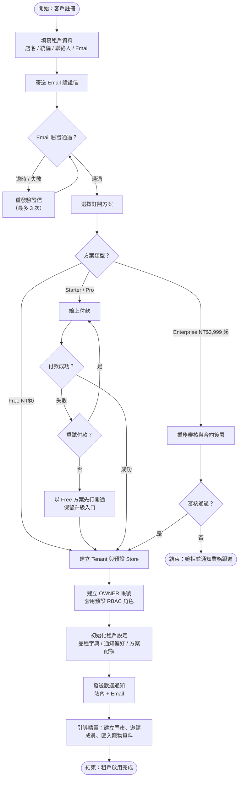
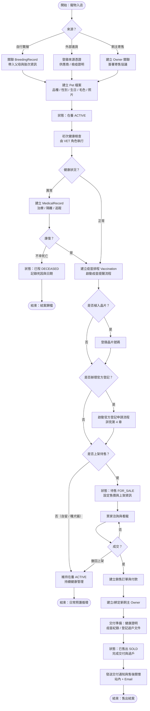
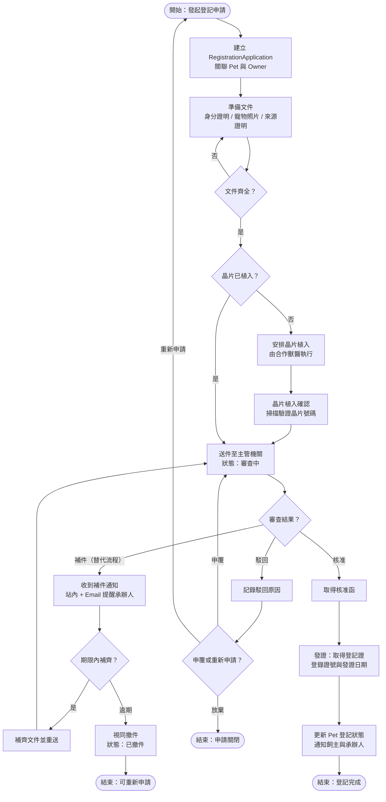
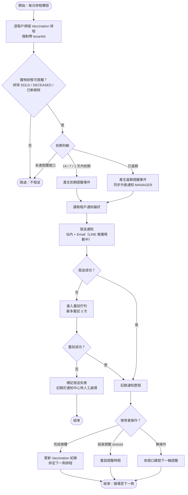
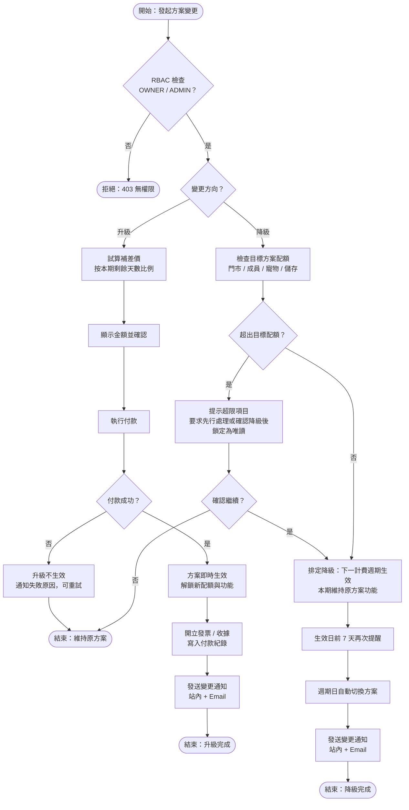
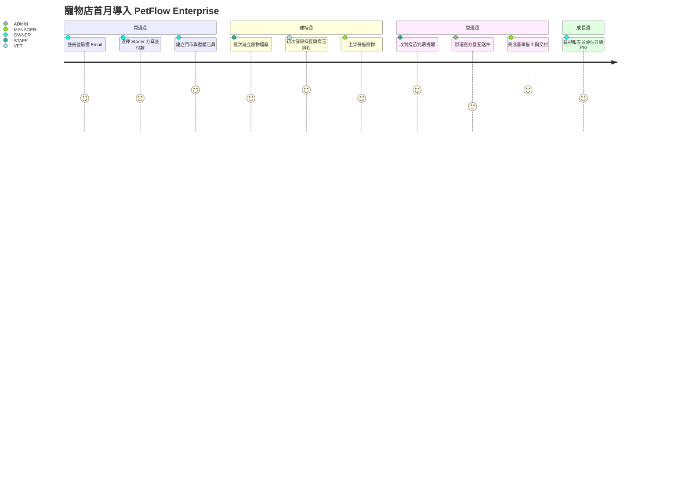

# 核心業務流程圖

> 以 Mermaid 流程圖完整描述 PetFlow Enterprise 的核心業務流程：租戶開通、寵物入店建檔、健康管理、官方登記、售出/交付、疫苗提醒與訂閱方案變更。

| 文件版本 | 狀態 | 最後更新 | 所屬模組 |
| --- | --- | --- | --- |
| v0.2.0 | 初稿 | 2026-07-02 | 08 流程圖 |

---

## 1. 文件目的

本文件為 PetFlow Enterprise 全平台核心業務流程的唯一事實來源（SSOT），供產品、設計、開發與測試團隊對齊流程認知。所有流程圖統一使用 Mermaid 語法，命名與繪製規範見 [04_流程圖繪製與命名規範](04_流程圖繪製與命名規範.md)。

**共通前提（適用本文件所有流程）：**

- 所有操作均在 **Multi-Tenant 隔離**下進行，任何查詢與寫入一律帶 `tenantId`。
- 所有操作均受 **RBAC** 權限檢查（角色：SUPER_ADMIN、OWNER、ADMIN、MANAGER、STAFF、VET、VIEWER），預設 Deny by default。
- 所有寫入操作（建立/修改/刪除/還原）一律記錄 **Audit Log**。
- 流程中的「刪除」一律為**軟刪除**（`deleted_at`），並提供還原能力。
- 通知管道：站內通知、Email、推播（LINE 規劃中）。

---

## 2. 租戶開通（Onboarding）流程

### 2.1 流程說明

- **觸發點**：潛在客戶（寵物店、連鎖門市、專業繁殖者、寵物服務業者）於官網註冊，或由業務代為建立。
- **關鍵決策**：Email 驗證是否通過、選擇訂閱方案（Free / Starter / Pro / Enterprise）、付費方案是否付款成功。
- **例外處理**：Email 驗證逾時可重發驗證信；付款失敗可重試或先降回 Free 方案開通；Enterprise 方案需業務審核後開通。

### 2.2 流程圖

> 補充：Onboarding 全程寫入 Audit Log（`who=系統/業務`、`what=TenantCreated` 等事件）。租戶停用不刪除資料，僅標記狀態並凍結登入。

---

## 3. 核心業務主流程：寵物入店建檔 → 健康 → 登記 → 售出/交付

### 3.1 流程說明

- **觸發點**：寵物入店（自行繁殖出生、進貨、飼主寄養轉售）。
- **關鍵決策**：來源類型、是否植入晶片、是否辦理官方登記、是否上架待售。
- **例外處理**：健康檢查異常轉入醫療流程（MedicalRecord）；寵物不幸死亡轉入「已歿」結案流程；建檔資料錯誤以修改方式修正並記 Audit Log，不做實體刪除。
- **狀態對應**：本流程驅動寵物狀態機（在養 ACTIVE → 待售 FOR_SALE → 已售出 SOLD / 已歿 DECEASED），狀態機詳見 [02_狀態機圖](02_狀態機圖.md)。

### 3.2 流程圖

> 補充：SOLD 與 DECEASED 為終態，僅 ADMIN 以上角色可於誤操作時走「狀態更正」特別流程（需填寫原因並記 Audit Log）。

---

## 4. 官方登記申請流程

### 4.1 流程說明

- **觸發點**：租戶為寵物（RegistrationApplication）向主管機關申請官方登記，或買家要求交付時完成過戶登記。
- **關鍵決策**：文件是否齊全、晶片是否已植入並確認、主管機關審查結果（核准 / 補件 / 駁回）。
- **例外處理**：**補件為替代流程**——收到補件通知後於期限內補齊重送；逾期未補件視同撤件；駁回可申覆或重新申請。
- **狀態對應**：對應 [02_狀態機圖](02_狀態機圖.md) 的登記申請狀態機。

### 4.2 流程圖

> 補充：每次狀態變更（送件、補件、核准、駁回、發證）均發送站內與 Email 通知，並記 Audit Log（含 before/after）。

---

## 5. 疫苗提醒流程

### 5.1 流程說明

- **觸發點**：系統每日排程（Cloudflare Queues / Cron Trigger）掃描各租戶的 Vaccination 排程，找出即將到期（預設前 14 / 7 / 1 天）與逾期的疫苗。
- **關鍵決策**：寵物目前狀態（已售出/已歿/已軟刪除不提醒）、通知偏好設定、是否已完成接種。
- **例外處理**：通知發送失敗進入重試佇列（最多 3 次）；飼主可設定延後提醒（snooze）；逾期未接種升級提醒 MANAGER。

### 5.2 流程圖

> 補充：提醒窗口（14/7/1 天）與升級規則為租戶層級設定，預設值由系統提供，細節見 [26 通知中心](../26_通知中心/README.md)。

---

## 6. 訂閱升級 / 降級流程

### 6.1 流程說明

- **觸發點**：租戶 OWNER 或 ADMIN 於方案管理頁面發起方案變更。方案：Free NT$0、Starter NT$599、Pro NT$1,499、Enterprise NT$3,999 起（NT$/月）。
- **關鍵決策**：升級或降級、補差價付款是否成功、降級後配額是否超限。
- **計費規則（canon）**：**升級即時生效，按剩餘天數比例補差價；降級於下一計費週期生效**，期間功能維持原方案。
- **例外處理**：補差價付款失敗則升級不生效；降級時若現有資料超出目標方案配額（門市數、成員數、寵物數、儲存空間），須先處理超限項目或改為僅讀取。

### 6.2 流程圖

> 補充：降級生效前可隨時取消排定；所有方案變更、試算金額與付款結果均記 Audit Log。付款細節見 [20 付款系統](../20_付款系統/README.md)、方案內容見 [19 會員訂閱](../19_會員訂閱/README.md)。

---

## 7. 使用者旅程（Journey）：寵物店首月導入

以使用者旅程圖補充上述流程在真實情境中的體驗節奏。

---

## 8. 流程與模組對照

| 流程 | 主要模組 | 相關文件 |
| --- | --- | --- |
| 租戶開通 | 21 SaaS、22 MultiTenant | [21 SaaS](../21_SaaS/README.md)、[22 MultiTenant](../22_MultiTenant/README.md) |
| 寵物入店建檔 | 13 寵物管理 | [13 寵物管理](../13_寵物管理/README.md) |
| 健康 / 疫苗 | 15 健康管理、26 通知中心 | [15 健康管理](../15_健康管理/README.md) |
| 官方登記 | 17 官方登記助手 | [17 官方登記助手](../17_官方登記助手/README.md) |
| 售出 / 交付 | 13 寵物管理、14 飼主管理 | [14 飼主管理](../14_飼主管理/README.md) |
| 訂閱變更 | 19 會員訂閱、20 付款系統 | [19 會員訂閱](../19_會員訂閱/README.md) |

---

> 本文件屬於 PetFlow Enterprise 官方文件，遵循根目錄 CLAUDE.md 之規範。
