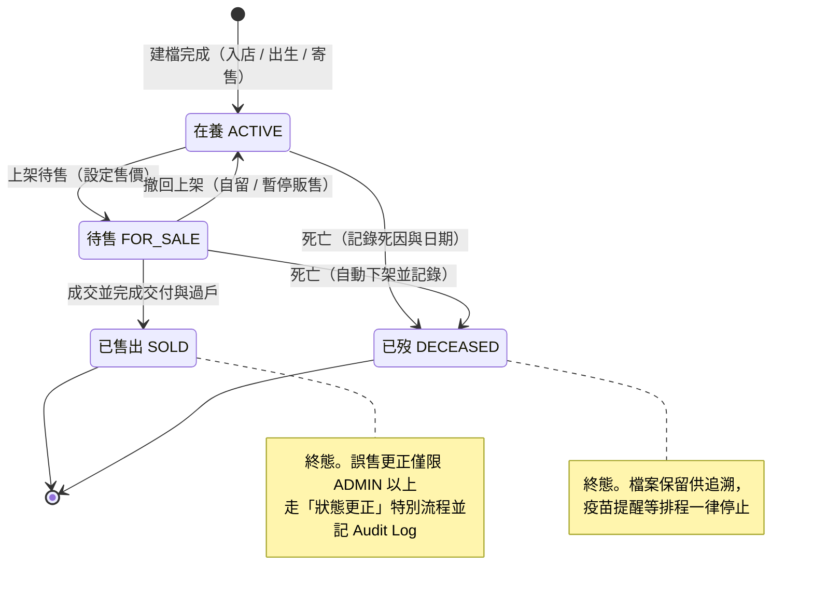
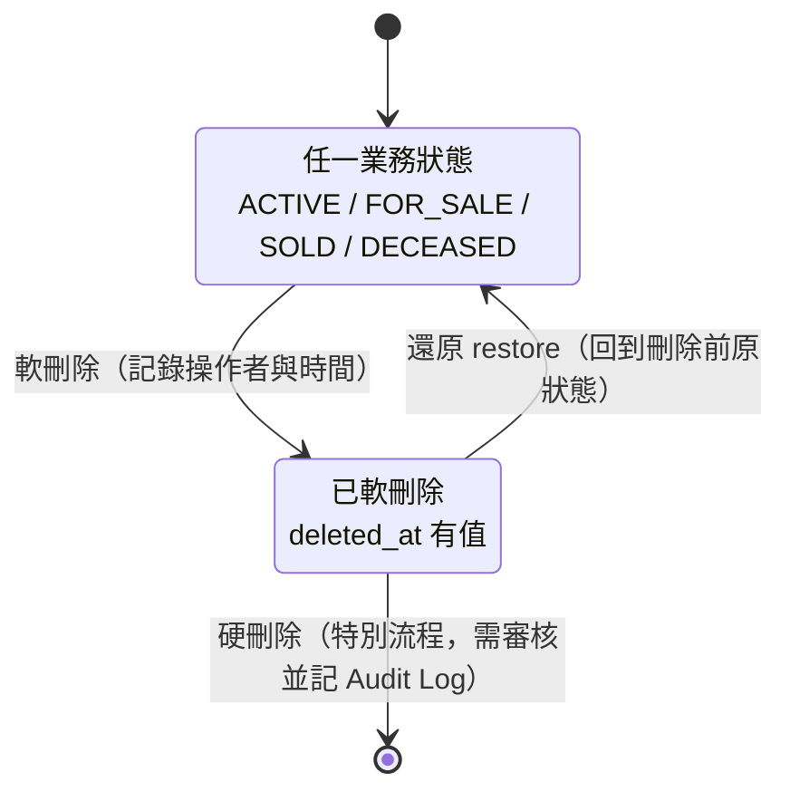
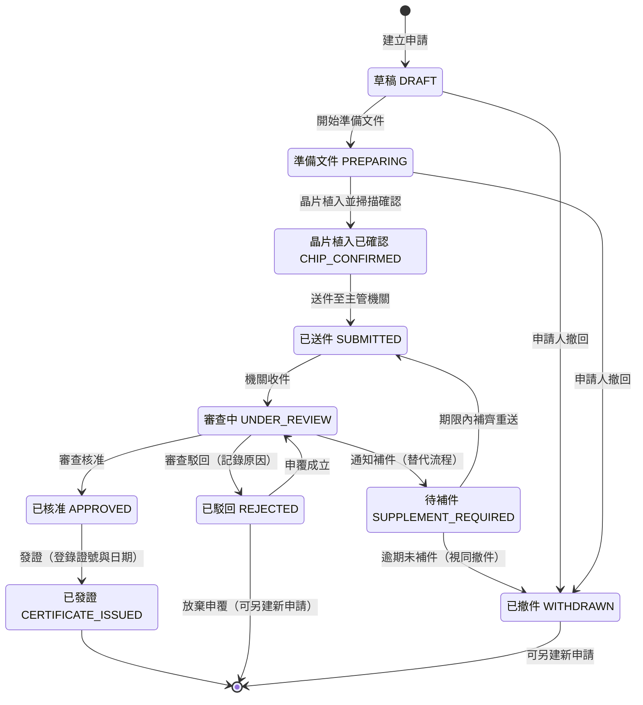
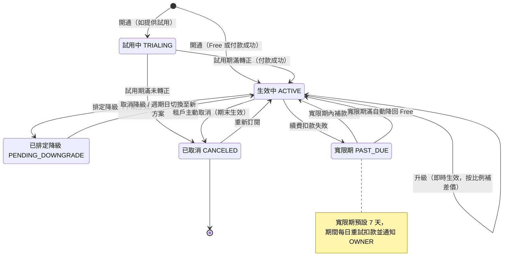
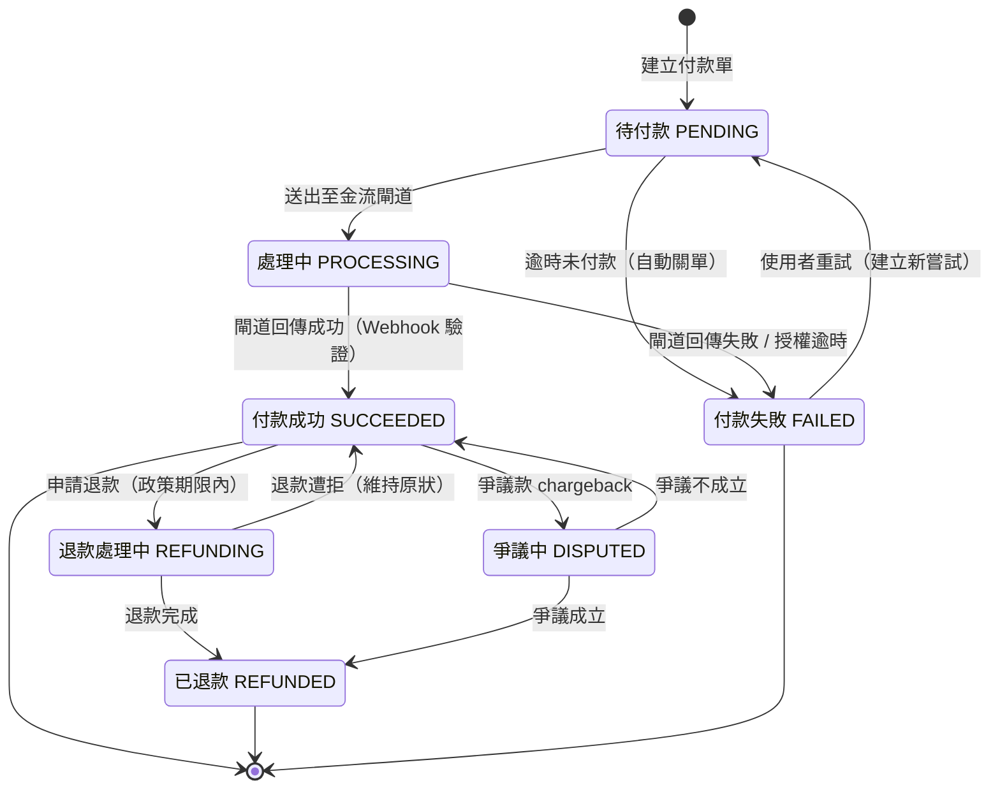
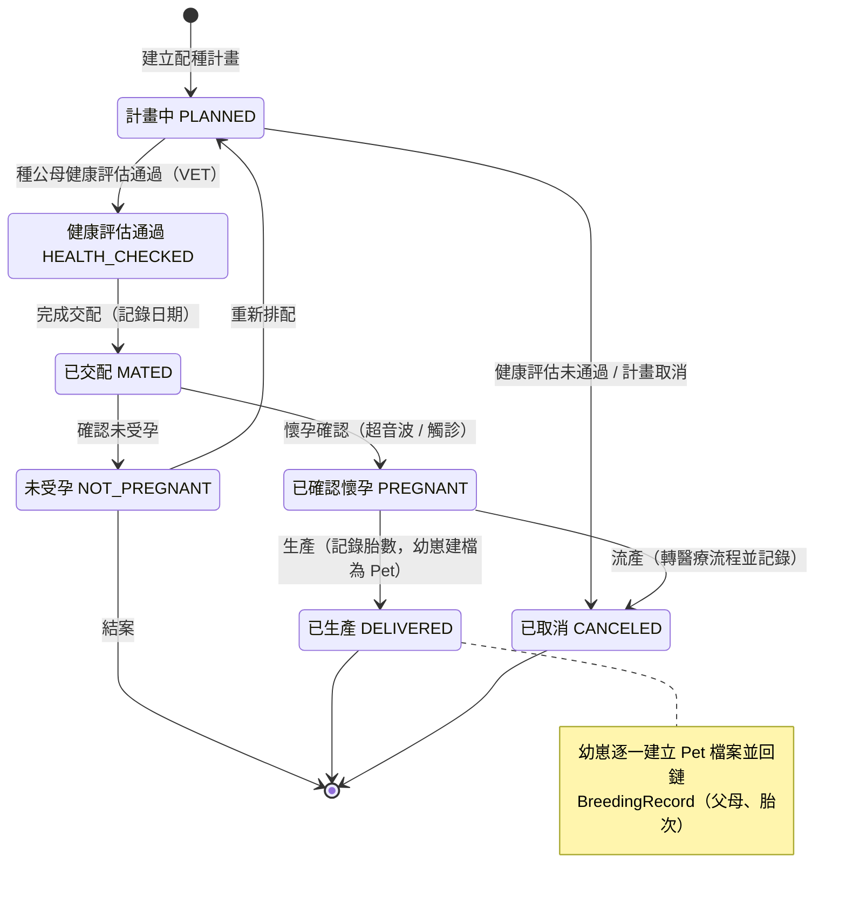

# 狀態機圖

> 以 Mermaid stateDiagram-v2 定義關鍵實體的狀態機：寵物生命週期（含軟刪除）、官方登記申請、訂閱、付款與配種，作為資料庫欄位與 API 行為的設計依據。

| 文件版本 | 狀態 | 最後更新 | 所屬模組 |
| --- | --- | --- | --- |
| v0.2.0 | 初稿 | 2026-07-02 | 08 流程圖 |

---

## 1. 文件目的

狀態機是商業規則的核心，屬於 **Domain 層**的職責。本文件定義各 Aggregate Root 的合法狀態與轉移條件；**未列於本文件的狀態轉移一律視為非法**，API 收到非法轉移請求時回應 `409 Conflict` 或 `422 Unprocessable Entity`。

**共通規則：**

- 每次狀態轉移均為寫入操作，必須記錄 Audit Log（含 before/after 狀態）。
- 狀態值以 `UPPER_SNAKE_CASE` 常數落入資料庫欄位，命名須與本文件一致（統一語言）。
- 軟刪除（`deleted_at`）為**橫切狀態（cross-cutting）**，不屬於任一實體狀態機的節點：任何狀態的實體都可被軟刪除與還原，還原後回到刪除前的原狀態；已軟刪除資料預設排除於所有查詢。

---

## 2. 寵物狀態機（Pet，全 repo 標準）

### 2.1 說明

- **觸發點**：寵物建檔即進入「在養 ACTIVE」。
- **關鍵決策**：是否上架待售、是否成交、是否死亡。
- **例外處理**：SOLD 與 DECEASED 為終態；誤操作更正僅限 ADMIN 以上角色走特別流程並記 Audit Log。軟刪除為橫切狀態，於下方獨立描述。

### 2.2 狀態圖

### 2.3 軟刪除橫切狀態

**軟刪除規則：**

| 規則 | 內容 |
| --- | --- |
| 標記方式 | `deleted_at` 時間戳記（NULL 表示未刪除） |
| 查詢行為 | 所有查詢預設排除已軟刪除資料 |
| 還原 | 清空 `deleted_at`，回到刪除前的業務狀態 |
| 硬刪除 | 僅限特別流程（如個資刪除請求），須審核並完整記錄 Audit Log |
| 連動 | 寵物被軟刪除時，其疫苗提醒、待辦排程一併暫停 |

---

## 3. 官方登記申請狀態機（RegistrationApplication）

### 3.1 說明

- **觸發點**：建立登記申請即進入「草稿 DRAFT」。
- **關鍵決策**：文件是否齊全並完成晶片植入確認、主管機關審查結果（核准 / 補件 / 駁回）。
- **例外處理**：補件為替代流程，逾期未補件轉「已撤件」；駁回可申覆（回到審查中）或關閉後重新申請。

### 3.2 狀態圖

> 補充：每次狀態變更均發送站內與 Email 通知承辦人；`SUPPLEMENT_REQUIRED` 帶補件期限欄位，由排程於期限前提醒。

---

## 4. 訂閱狀態機（Subscription）

### 4.1 說明

- **觸發點**：租戶開通時建立訂閱（Free 直接生效；付費方案待付款成功）。
- **關鍵決策**：續費付款是否成功、是否排定降級、是否取消。
- **例外處理**：續費失敗進入「寬限期 PAST_DUE」（預設 7 天，期間重試扣款），寬限期滿未付款自動降回 Free。

### 4.2 狀態圖

---

## 5. 付款狀態機（Payment）

### 5.1 說明

- **觸發點**：訂閱開通、升級補差價或週期續費時建立付款單。
- **關鍵決策**：金流閘道回傳結果、是否重試、是否退款。
- **例外處理**：授權逾時視為失敗；退款僅限成功付款且於政策期限內；爭議款（chargeback）凍結並人工處理。

### 5.2 狀態圖

> 補充：Webhook 必須驗簽且具冪等性（同一事件重送不得重複轉移狀態），細節見 [20 付款系統](../20_付款系統/README.md)。

---

## 6. 配種狀態機（BreedingRecord）

### 6.1 說明

- **觸發點**：MANAGER / VET 建立配種計畫，選定種公與種母。
- **關鍵決策**：健康評估是否通過、交配後是否確認懷孕、生產結果。
- **例外處理**：健康評估未通過即取消；未受孕可重新排配或結案；流產/難產轉入醫療流程並記錄結果。

### 6.2 狀態圖

---

## 7. 狀態機與資料庫、API 對照

| 實體 | 狀態欄位（建議） | 相關模組 |
| --- | --- | --- |
| Pet | `pets.status` + `pets.deleted_at` | [13 寵物管理](../13_寵物管理/README.md)、[10 資料庫設計](../10_資料庫設計/README.md) |
| RegistrationApplication | `registration_applications.status` | [17 官方登記助手](../17_官方登記助手/README.md) |
| Subscription | `subscriptions.status` | [19 會員訂閱](../19_會員訂閱/README.md) |
| Payment | `payments.status` | [20 付款系統](../20_付款系統/README.md) |
| BreedingRecord | `breeding_records.status` | [16 配種管理](../16_配種管理/README.md) |

---

> 本文件屬於 PetFlow Enterprise 官方文件，遵循根目錄 CLAUDE.md 之規範。
