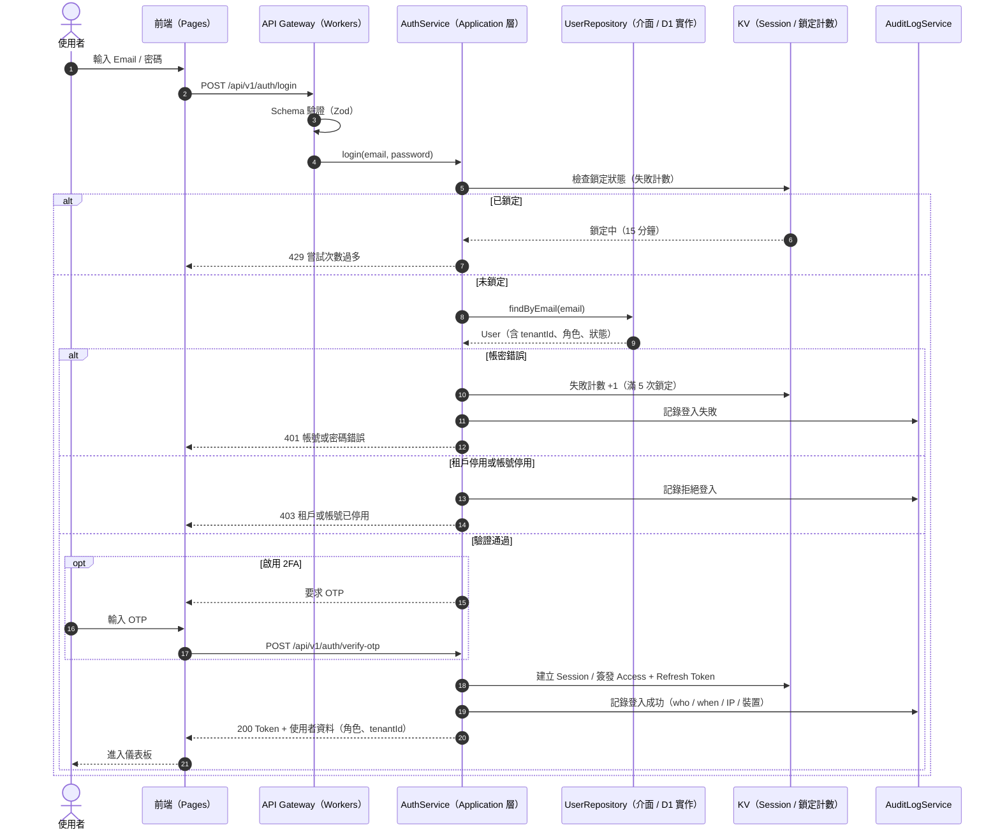
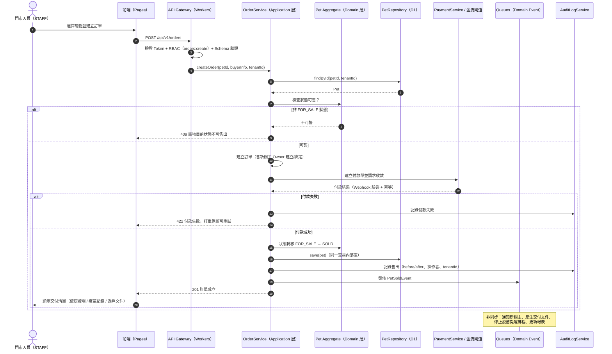
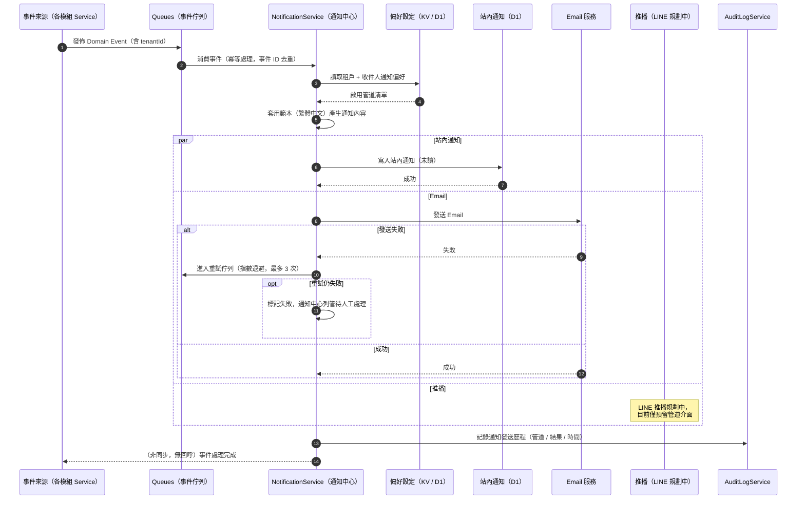

# 時序圖

> 以 Mermaid sequenceDiagram 描述關鍵跨系統互動：登入驗證、下單（售出交易）與通知發送，明確標示各層職責與 Cloudflare 元件。

| 文件版本 | 狀態 | 最後更新 | 所屬模組 |
| --- | --- | --- | --- |
| v0.2.0 | 初稿 | 2026-07-02 | 08 流程圖 |

---

## 1. 文件目的

時序圖用於呈現**跨層、跨服務**的互動順序與職責邊界，補足流程圖無法表達的呼叫細節。所有互動遵循 Clean Architecture：Controller 極薄，流程編排在 Application 層 Service，商業規則在 Domain 層，資料存取透過 Repository 介面。

**共通約定：**

- 所有 API 走 `/api/v1/...`，預設需要驗證與授權（RBAC + Multi-Tenant）。
- 後端執行於 Cloudflare Workers，資料庫為 D1，快取為 KV，非同步任務走 Queues。
- 所有寫入操作記 Audit Log；錯誤回應採統一錯誤格式與正確 HTTP 狀態碼。

---

## 2. 登入時序圖

### 2.1 說明

- **觸發點**：使用者於登入頁輸入 Email 與密碼（或使用 SSO，Enterprise 方案）。
- **關鍵決策**：帳密是否正確、帳號是否啟用、租戶是否有效、是否啟用兩步驟驗證（2FA）。
- **例外處理**：連續失敗 5 次鎖定 15 分鐘；租戶停用回應 403；Token 過期走 Refresh 流程。

### 2.2 時序圖

> 補充：Access Token 內含 `tenantId` 與角色宣告，後續每個請求由 Gateway 統一驗證並注入租戶上下文，禁止跨租戶存取。

---

## 3. 下單（寵物售出交易）時序圖

### 3.1 說明

- **觸發點**：門市人員（STAFF 以上）為狀態「待售 FOR_SALE」的寵物建立銷售訂單。
- **關鍵決策**：RBAC 權限、寵物狀態是否可售、付款是否成功。
- **例外處理**：寵物非 FOR_SALE 狀態回應 409；付款失敗訂單保留為待付款可重試；成交後以 Domain Event 觸發後續交付與通知。

### 3.2 時序圖

> 補充：狀態轉移合法性由 Pet Aggregate（Domain 層）把關，Service 不重複實作規則；非法轉移一律回應 409。

---

## 4. 通知發送時序圖

### 4.1 說明

- **觸發點**：任何 Domain Event（如 `VaccinationDueEvent`、`PetSoldEvent`、`RegistrationStatusChangedEvent`、`SubscriptionChangedEvent`）進入通知中心。
- **關鍵決策**：租戶與使用者的通知偏好、管道可用性（站內 / Email / 推播，LINE 規劃中）、發送結果。
- **例外處理**：單一管道失敗不影響其他管道；失敗進入重試佇列（指數退避，最多 3 次）；最終失敗記錄於通知中心待人工處理。

### 4.2 時序圖

> 補充：通知中心對每個事件以事件 ID 去重，確保 Queues 重送時不會重複通知；範本與管道細節見 [26 通知中心](../26_通知中心/README.md)。

---

## 5. 時序圖與模組對照

| 時序圖 | 對應端點（示意） | 相關模組 |
| --- | --- | --- |
| 登入 | `POST /api/v1/auth/login` | [24 RBAC](../24_RBAC/README.md)、[28 安全性](../28_安全性/README.md) |
| 下單 / 售出 | `POST /api/v1/orders` | [13 寵物管理](../13_寵物管理/README.md)、[20 付款系統](../20_付款系統/README.md) |
| 通知 | Queues 消費（無公開端點） | [26 通知中心](../26_通知中心/README.md)、[25 AuditLog](../25_AuditLog/README.md) |

---

> 本文件屬於 PetFlow Enterprise 官方文件，遵循根目錄 CLAUDE.md 之規範。
