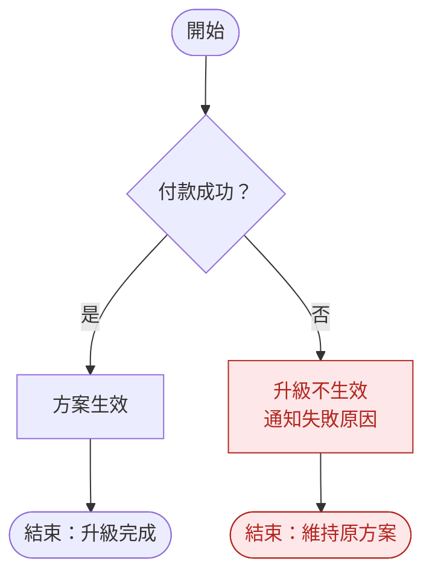
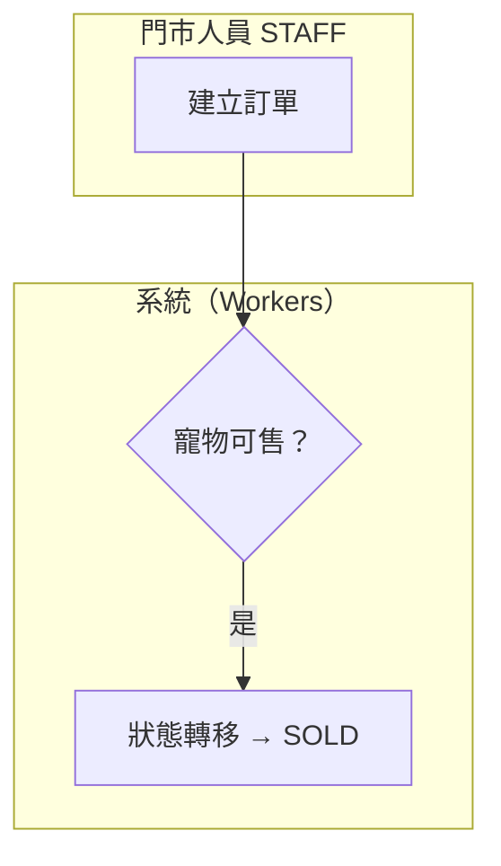

# 流程圖繪製與命名規範

> 定義本模組所有 Mermaid 圖表的類型選用原則、節點命名、圖表編號、樣式約定、與文件的整合方式及版本維護原則，確保跨文件圖表風格一致、可追溯、可維護。

| 文件版本 | 狀態 | 最後更新 | 所屬模組 |
| --- | --- | --- | --- |
| v0.2.0 | 初稿 | 2026-07-02 | 08 流程圖 |

---

## 1. 文件目的

本文件為 `docs/08_流程圖/` 及全 repo 所有 Mermaid 圖表的**繪製與命名規範（SSOT）**。任何模組文件（如 07 Use Case、10 資料庫設計、26 通知中心）內嵌的流程圖、狀態機圖、時序圖，均須遵循本規範；與本規範牴觸的圖表視為錯誤，須先修正圖表或先更新本規範。

**共通原則：**

- 所有圖表一律使用 **Mermaid** 語法，內嵌於 Markdown 的 ```` ```mermaid ```` 區塊，不使用外部圖檔（截圖、Visio、draw.io 匯出圖）。
- 圖表內容與文件正文同為唯一事實來源的一部分：圖與文字衝突時，須立即修正，不得留待「之後再改」。
- 圖表用語遵循 **統一語言（Ubiquitous Language）**：實體名稱（`Pet`、`Owner`、`BreedingRecord`、`Vaccination`、`RegistrationApplication`）與狀態碼須與各模組 `docs/` 文件一致。

---

## 2. Mermaid 圖類型選用原則

依「想回答的問題」選擇圖類型，**一張圖只回答一種問題**；同一主題需要多視角時，拆成多張圖並互相連結。

| 圖類型 | 回答的問題 | 使用時機 | 本模組範例 |
| --- | --- | --- | --- |
| `flowchart TD` | 「事情怎麼做？」 | 業務流程：有明確起點/終點、判斷分支、例外路徑的操作步驟 | [01_核心業務流程圖](01_核心業務流程圖.md) |
| `stateDiagram-v2` | 「實體處於什麼狀態、如何轉移？」 | 單一 Aggregate Root 的生命週期與合法狀態轉移（Domain 層規則） | [02_狀態機圖](02_狀態機圖.md) |
| `sequenceDiagram` | 「誰呼叫誰、順序為何？」 | 跨層、跨服務互動：API 呼叫、金流 Webhook、Queues 事件消費 | [03_時序圖](03_時序圖.md) |
| `journey` | 「使用者體驗節奏如何？」 | 以角色視角補充體驗滿意度與階段節奏，僅作流程圖的輔助視角 | 01 文件第 7 章「寵物店首月導入」 |

**選用判斷準則：**

1. 描述**人或系統執行的步驟與決策** → `flowchart TD`（方向統一用 `TD`，由上而下）。
2. 描述**一個實體的狀態欄位如何變化** → `stateDiagram-v2`；狀態機屬 Domain 層商業規則，未列於狀態圖的轉移一律視為非法（API 回 `409` / `422`）。
3. 描述**多個參與者之間的呼叫順序與回應** → `sequenceDiagram`，一律加 `autonumber`。
4. 描述**使用者跨階段的體驗與滿意度** → `journey`，僅作輔助，不得取代 flowchart 作為流程規格。
5. 一張 flowchart 節點數建議 **不超過 30 個**；超過時依子流程拆圖（例：官方登記自主流程獨立成章，並以「詳見第 N 章」節點銜接）。

---

## 3. 節點命名規則

### 3.1 語言與標籤

- 節點標籤一律使用**繁體中文**；涉及狀態、實體、角色、事件時，**繁體中文與英文代碼並列**。
- 標籤內換行使用 `<br/>`；第一行為主要動作/狀態，第二行為補充資訊。

| 對象 | 格式 | 範例 |
| --- | --- | --- |
| 狀態 | `中文狀態名 + 英文狀態碼（UPPER_SNAKE_CASE）` | `待售 FOR_SALE`、`審查中 UNDER_REVIEW` |
| 實體 | `PascalCase` 英文，與 docs 用語一致 | `Pet`、`BreedingRecord`、`RegistrationApplication` |
| 角色 | RBAC 角色碼（UPPER_SNAKE_CASE） | `OWNER`、`MANAGER`、`VET` |
| Domain Event | `PascalCase + Event` 後綴 | `PetSoldEvent`、`VaccinationDueEvent` |
| API 端點 | `HTTP 動詞 + /api/v1/...` | `POST /api/v1/orders` |

### 3.2 節點 ID

- 節點 ID 使用**簡短英文大寫字母**（`A`、`B`、`C1`、`Z1`…），依流程順序編排。
- 終點節點 ID 以 `Z` 開頭（`Z1`、`Z2`、`Z3`），一眼可辨識流程出口。
- 狀態機的節點 ID 直接使用**英文狀態碼**（`ACTIVE`、`FOR_SALE`），並以 `狀態碼 : 中文名 狀態碼` 宣告顯示標籤。
- 時序圖參與者以**縮寫 ID + as 中文（技術註記）** 宣告，例：`participant GW as API Gateway（Workers）`。

### 3.3 邊（Edge）標籤

- 判斷分支的邊一律標示條件結果：`-- "通過" -->`、`-- "逾時 / 失敗" -->`。
- 狀態轉移的邊標示**觸發事件與條件**：`FOR_SALE --> SOLD : 成交並完成交付與過戶`。

---

## 4. 圖表編號規則

### 4.1 編號格式

每張圖表擁有全模組唯一編號，格式為 `類型前綴-NNN`（三位數流水號，自 `001` 起）：

| 前綴 | 圖類型 | 範例 |
| --- | --- | --- |
| `FLOW-NNN` | flowchart（業務流程圖） | `FLOW-001` 租戶開通流程 |
| `STM-NNN` | stateDiagram-v2（狀態機圖） | `STM-001` 寵物狀態機 |
| `SEQ-NNN` | sequenceDiagram（時序圖） | `SEQ-001` 登入時序圖 |
| `JNY-NNN` | journey（使用者旅程圖） | `JNY-001` 寵物店首月導入 |

- 編號**只增不減、不回收**：圖表廢棄時保留編號並於總表標記「已廢棄（Deprecated）」，避免歷史文件斷鏈。
- 其他模組文件引用圖表時，以「編號 + 文件連結」引用（例：見 `STM-001`，[02_狀態機圖](02_狀態機圖.md)），不得複製貼上整張圖。

### 4.2 圖表編號總表（Registry）

本表為編號的唯一發放來源；新增圖表時**先在此表登記，再繪圖**。

| 編號 | 圖表名稱 | 所在文件與章節 |
| --- | --- | --- |
| FLOW-001 | 租戶開通（Onboarding）流程 | [01_核心業務流程圖](01_核心業務流程圖.md) §2 |
| FLOW-002 | 寵物入店建檔 → 健康 → 登記 → 售出/交付 | [01_核心業務流程圖](01_核心業務流程圖.md) §3 |
| FLOW-003 | 官方登記申請流程 | [01_核心業務流程圖](01_核心業務流程圖.md) §4 |
| FLOW-004 | 疫苗提醒流程 | [01_核心業務流程圖](01_核心業務流程圖.md) §5 |
| FLOW-005 | 訂閱升級 / 降級流程 | [01_核心業務流程圖](01_核心業務流程圖.md) §6 |
| STM-001 | 寵物狀態機（Pet） | [02_狀態機圖](02_狀態機圖.md) §2.2 |
| STM-002 | 軟刪除橫切狀態 | [02_狀態機圖](02_狀態機圖.md) §2.3 |
| STM-003 | 官方登記申請狀態機（RegistrationApplication） | [02_狀態機圖](02_狀態機圖.md) §3 |
| STM-004 | 訂閱狀態機（Subscription） | [02_狀態機圖](02_狀態機圖.md) §4 |
| STM-005 | 付款狀態機（Payment） | [02_狀態機圖](02_狀態機圖.md) §5 |
| STM-006 | 配種狀態機（BreedingRecord） | [02_狀態機圖](02_狀態機圖.md) §6 |
| SEQ-001 | 登入時序圖 | [03_時序圖](03_時序圖.md) §2 |
| SEQ-002 | 下單（寵物售出交易）時序圖 | [03_時序圖](03_時序圖.md) §3 |
| SEQ-003 | 通知發送時序圖 | [03_時序圖](03_時序圖.md) §4 |
| JNY-001 | 寵物店首月導入 | [01_核心業務流程圖](01_核心業務流程圖.md) §7 |

---

## 5. 樣式約定

### 5.1 節點形狀（flowchart）

| 形狀 | Mermaid 語法 | 用途 |
| --- | --- | --- |
| 圓角膠囊 | `A(["文字"])` | 開始 / 結束節點 |
| 矩形 | `B["文字"]` | 一般處理步驟 |
| **菱形** | `C{"文字？"}` | **判斷／決策，一律用菱形**，標籤以「？」結尾 |

### 5.2 例外路徑標紅

- **例外路徑（失敗、逾期、駁回、死亡等非快樂路徑）以紅色標示**，使用 `classDef` 統一定義，不逐節點手寫色碼：



- 色碼固定為 `fill:#FDE7E9`、`stroke:#B3261E`（對齊 Material Design 3 Error 色系，深淺模式下均可辨識）。
- 既有 FLOW-001～005 於下一次修訂時補齊例外標紅；**新增圖表一律適用**。

### 5.3 泳道（Swimlane）用法

- flowchart 需要表達**跨角色/跨系統職責**時，以 `subgraph` 作泳道，一個泳道對應一個角色或系統：



- 泳道標題採「中文角色名 + 英文代碼」；泳道數建議 **≤ 4 條**，超過時改用 `sequenceDiagram`（時序圖的 participant 天然即為泳道）。
- 純單一角色的流程**不使用泳道**，維持版面簡潔。

### 5.4 其他約定

- 時序圖一律使用 `autonumber`；分支用 `alt/else`、可選步驟用 `opt`、並行用 `par/and`、補充說明用 `Note over`。
- 狀態機的補充規則（終態限制、特別流程）以 `note right of` 標註於圖內。

---

## 6. 與文件的整合方式

每張圖表在文件中必須遵循「**說明在前、圖在中、補充在後**」的固定結構，禁止孤圖（只有圖、沒有文字）：

1. **圖前——流程/狀態說明**（`### N.1 說明`），至少涵蓋三項：
   - **觸發點**：誰、在什麼情境下啟動此流程或狀態轉移。
   - **關鍵決策**：圖中菱形節點對應的判斷依據。
   - **例外處理**：失敗、逾期、補件等替代路徑的處置方式。
2. **圖本體**（`### N.2 流程圖 / 狀態圖 / 時序圖`）：內嵌 Mermaid 區塊。
3. **圖後——補充引言**：以 `> 補充：…` 引言收尾，記載橫切關注點（Audit Log、通知、RBAC 限制）與相關模組文件連結。

其他整合規則：

- 流程圖若驅動狀態機，說明中須註明「狀態對應」並連結至 [02_狀態機圖](02_狀態機圖.md)（例：FLOW-002 對應 STM-001）。
- 文件末尾提供「與模組對照表」，將每張圖對應到相關模組的 `docs/` 連結。
- 每個 Use Case（[07 Use Case](../07_Use_Case/README.md)）的主要流程應能對應到本模組至少一張圖。

---

## 7. 版本維護原則

- **文件與圖同步更新**：修改流程、狀態或互動行為時，必須在**同一次 commit** 內同步更新對應圖表與文字說明；只改字不改圖（或反之）視為未完成的變更。
- **版本遞增**：圖表有實質變更（新增/刪除節點、改變轉移條件）時，遞增所在文件的「文件版本」並更新「最後更新」日期；純錯字修正可不遞增版本。
- **編號總表先行**：新增圖表前，先於本文件 §4.2 總表登記編號；廢棄圖表標記「已廢棄」而非刪除列。
- **變更追溯**：以 Git 歷史作為圖表變更的稽核紀錄，commit 訊息採 Conventional Commits（`docs: 更新 STM-004 訂閱狀態機新增寬限期轉移`）。
- **一致性檢查**：Review 時逐項確認——圖類型選用正確、狀態碼與 [02_狀態機圖](02_狀態機圖.md) 及 [10 資料庫設計](../10_資料庫設計/README.md) 一致、例外路徑已標紅、圖前後文字說明齊備。
- 下游文件（資料庫欄位、API 合約、UI 狀態）引用狀態碼時，以本模組狀態機圖為準；發現不一致時，**先修文件再寫碼**（SSOT 原則）。

---

> 本文件屬於 PetFlow Enterprise 官方文件，遵循根目錄 CLAUDE.md 之規範。
