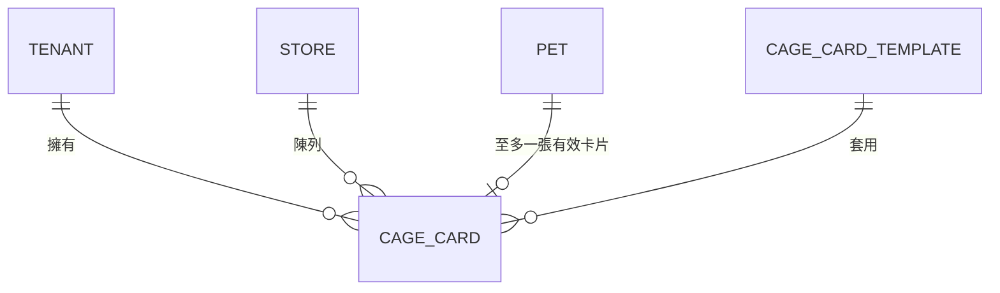

# 掛籠資訊表 資料庫設計 Cage Card Schema

> 掛籠資訊表（Cage Card）之 Cloudflare D1（SQLite）資料表設計與 Migration 草案。功能規格見 [13 寵物管理 › 掛籠資訊表](../13_寵物管理/掛籠資訊表.md)；API 合約見 [11 API 設計 › 掛籠資訊表 API](../11_API設計/掛籠資訊表-API.md)。

## 1. 設計原則

- **多租戶**：每表含 `tenant_id`，所有查詢必帶;跨租戶查詢一律禁止(見 [22 Multi-Tenant](../22_MultiTenant/README.md))。
- **軟刪除**：以 `deleted_at` 標記，預設查詢排除;不做實體刪除(見 `CLAUDE.md` 第 11 節)。
- **稽核欄位**:`created_at` / `updated_at` / `created_by` / `updated_by`;寫入另記 Audit Log(見 [25 AuditLog](../25_AuditLog/README.md))。
- **引用不複製**:`cage_card` 僅存 `pet_id`,寵物欄位(品種、晶片號…)顯示時即時 JOIN,維持單一事實來源。
- **識別碼**:主鍵採 `TEXT`(ULID/UUID),對應 API 之 Branded Type;金額以整數「分」儲存,避免浮點誤差。

## 2. ER 概念



## 3. 資料字典

### `cage_card`

| 欄位 | 型別 | 限制 | 說明 |
| --- | --- | --- | --- |
| `id` | TEXT | PK | 卡片識別碼（ULID） |
| `tenant_id` | TEXT | NOT NULL | 租戶隔離 |
| `store_id` | TEXT | NOT NULL | 所屬門市 |
| `pet_id` | TEXT | NOT NULL | 引用寵物（不複製寵物資料） |
| `cage_no` | TEXT | NOT NULL | 籠位編號 |
| `template_id` | TEXT | NOT NULL | 套版樣板 |
| `qr_slug` | TEXT | NOT NULL, UNIQUE | 公開頁短碼（不可猜測） |
| `status` | TEXT | NOT NULL, DEFAULT 'draft' | draft / published / archived |
| `price_amount` | INTEGER | NULL | 售價（最小貨幣單位，分） |
| `price_currency` | TEXT | NULL | ISO 4217，如 TWD |
| `note` | TEXT | NULL | 備註 |
| `field_visibility` | TEXT | NOT NULL, DEFAULT '{}' | JSON；欄位顯示開關 |
| `published_at` | TEXT | NULL | 發布時間（ISO 8601） |
| `print_count` | INTEGER | NOT NULL, DEFAULT 0 | 列印次數 |
| `created_at` | TEXT | NOT NULL | 建立時間 |
| `updated_at` | TEXT | NOT NULL | 更新時間 |
| `created_by` | TEXT | NOT NULL | 建立者 |
| `updated_by` | TEXT | NOT NULL | 最後更新者 |
| `deleted_at` | TEXT | NULL | 軟刪除標記 |

**索引與約束**

- `UNIQUE (qr_slug)`：公開頁短碼唯一。
- `INDEX (tenant_id, store_id, status)`：門市 / 狀態列表查詢。
- `INDEX (tenant_id, pet_id)`：依寵物查詢。
- **部分唯一索引**：同一寵物在「未刪除且非 archived」下至多一張有效卡片
  `UNIQUE (tenant_id, pet_id) WHERE deleted_at IS NULL AND status != 'archived'`。
- `status` 以 `CHECK` 限制列舉值。

## 4. Migration（版本化）

遵循 `CLAUDE.md` 第 14 節：每條 Migration 提供 **Up / Down**，採「先擴充、後收斂」以向後相容。

### Up — `0001_create_cage_card.sql`

```sql
CREATE TABLE cage_card (
  id               TEXT PRIMARY KEY,
  tenant_id        TEXT NOT NULL,
  store_id         TEXT NOT NULL,
  pet_id           TEXT NOT NULL,
  cage_no          TEXT NOT NULL,
  template_id      TEXT NOT NULL,
  qr_slug          TEXT NOT NULL,
  status           TEXT NOT NULL DEFAULT 'draft'
                     CHECK (status IN ('draft', 'published', 'archived')),
  price_amount     INTEGER,
  price_currency   TEXT,
  note             TEXT,
  field_visibility TEXT NOT NULL DEFAULT '{}',
  published_at     TEXT,
  print_count      INTEGER NOT NULL DEFAULT 0,
  created_at       TEXT NOT NULL,
  updated_at       TEXT NOT NULL,
  created_by       TEXT NOT NULL,
  updated_by       TEXT NOT NULL,
  deleted_at       TEXT
);

CREATE UNIQUE INDEX ux_cage_card_qr_slug ON cage_card (qr_slug);
CREATE INDEX ix_cage_card_store_status ON cage_card (tenant_id, store_id, status);
CREATE INDEX ix_cage_card_pet ON cage_card (tenant_id, pet_id);

-- 一隻寵物至多一張有效卡片（未刪除且非 archived）
CREATE UNIQUE INDEX ux_cage_card_active_pet
  ON cage_card (tenant_id, pet_id)
  WHERE deleted_at IS NULL AND status != 'archived';
```

### Down — `0001_create_cage_card.down.sql`

```sql
DROP INDEX IF EXISTS ux_cage_card_active_pet;
DROP INDEX IF EXISTS ix_cage_card_pet;
DROP INDEX IF EXISTS ix_cage_card_store_status;
DROP INDEX IF EXISTS ux_cage_card_qr_slug;
DROP TABLE IF EXISTS cage_card;
```

!!! note "回滾注意"
    D1（SQLite）對 `ALTER TABLE` 支援有限（不支援 `DROP COLUMN` 舊版本、修改欄位型別）。後續調整欄位時採「新增欄位 → 回填 → 切換讀寫 → 清理」策略,Down 對應反向操作;必要時以「建新表 → 複製 → 換名」處理。

## 5. 與其他規格對齊

| 規格 | 對應 |
| --- | --- |
| API `Money` | `price_amount`（INTEGER）+ `price_currency`（TEXT） |
| API `fieldVisibility` | `field_visibility`（JSON TEXT） |
| API `status` 列舉 | `CHECK` 約束 |
| API `qrSlug` 唯一 | `ux_cage_card_qr_slug` |
| 售出自動下架 | 由 Application 層更新 `status='archived'`;部分唯一索引隨即釋放該寵物 |

## 6. 待完成

- [ ] 併入資料庫總綱 ER 圖與資料字典
- [ ] 樣板表 `cage_card_template` Schema
- [ ] 效能：大量卡片列表查詢的分頁游標（keyset pagination）評估
- [ ] 資料保留 / 封存政策(archived 卡片的長期處置)

## 相關文件

- [13 寵物管理 › 掛籠資訊表](../13_寵物管理/掛籠資訊表.md)、[11 API 設計 › 掛籠資訊表 API](../11_API設計/掛籠資訊表-API.md)
- [10 資料庫設計](README.md)、[22 Multi-Tenant](../22_MultiTenant/README.md)、[25 AuditLog](../25_AuditLog/README.md)

---

> 本文件屬於 PetFlow Enterprise 官方文件。撰寫前請先閱讀根目錄 `CLAUDE.md`。狀態：草稿（Draft）。
