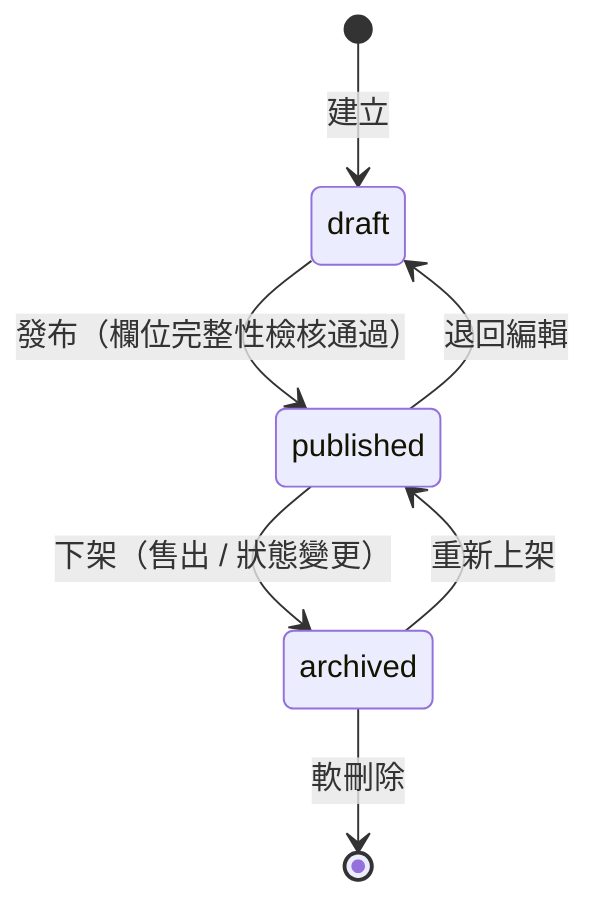
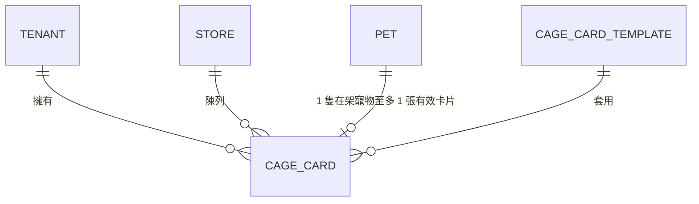

# 掛籠資訊表 Cage Card

> 掛於店內籠位、揭示寵物完整資訊的卡片；支援線上維護、套版列印與 QR Code 連結。

## 1. 功能簡介

「掛籠資訊表」（Cage Card）是寵物店與繁殖場掛在每個籠位明顯處的資訊卡，向消費者與主管機關揭示該寵物的品種、性別、出生日期、晶片號碼、來源與健康狀況等資訊。

本功能讓業者：

1. 從寵物檔案（[13 寵物管理](README.md)）**一鍵產生**掛籠資訊表，資料不重複輸入。
2. 依店家需求**設定顯示欄位**（例如是否顯示售價）。
3. 以固定樣板**套版列印**（A5 / A6、直式 / 橫式）。
4. 於卡片上產生 **QR Code**，消費者掃描即可瀏覽線上版寵物頁（照片、疫苗紀錄等延伸資訊）。

!!! warning "法遵提醒"
    臺灣《動物保護法》與《特定寵物業管理辦法》對買賣業者陳列犬貓時的資訊揭示訂有義務（如來源、晶片號碼等）。本文件所列欄位為產品設計草案，**實作前須由法遵確認當時有效之法規條文與主管機關要求**，並以法規要求為最低揭示標準。

## 2. 使用者與情境

| 角色 | 情境 |
| --- | --- |
| 店長 / 門市人員 | 寵物上架時建立掛籠資訊表並列印；售出或狀態變更時下架、重印 |
| 繁殖場人員 | 為待售幼犬貓批次產生卡片 |
| 消費者 | 於店內閱讀卡片、掃描 QR Code 查看線上寵物頁 |
| 主管機關稽查 | 核對卡片揭示資訊與晶片、來源證明是否一致 |

### User Story（草案）

- 作為**門市人員**，我想在寵物檔案頁一鍵產生掛籠資訊表，以免重複抄寫資料。
- 作為**店長**，我想控制卡片上是否顯示售價，以配合門市行銷策略。
- 作為**消費者**，我想掃描卡片上的 QR Code 看到更多照片與疫苗紀錄，以增加購買信心。
- 作為**店長**，我想在寵物售出後自動將卡片下架，避免資訊不一致。

## 3. 領域模型

- **統一語言**：`CageCard`（掛籠資訊表）、`CageCardTemplate`（卡片樣板）、`Pet`（寵物）。
- `CageCard` 為獨立 Aggregate Root，**引用** `PetId`，不複製寵物主檔；顯示時即時取用寵物資料，確保單一事實來源。
- 卡片內容分兩類：
  - **引用欄位**：來自 `Pet` 及關聯模組（品種、性別、出生日期、晶片號碼、疫苗摘要…），唯讀。
  - **卡片自有欄位**：售價、備註、欄位顯示開關、樣板選擇、籠位編號。

### 3.1 欄位定義（草案）

| 欄位 | 型別 | 來源 | 必填 | 說明 |
| --- | --- | --- | --- | --- |
| `cageCardId` | `CageCardId`（Branded） | 自有 | ✔ | 卡片識別碼 |
| `tenantId` | `TenantId` | 自有 | ✔ | 租戶隔離，所有查詢必帶 |
| `storeId` | `StoreId` | 自有 | ✔ | 所屬門市（[23 多店管理](../23_多店管理/README.md)） |
| `petId` | `PetId` | 引用 | ✔ | 對應寵物 |
| `cageNo` | `string` | 自有 | ✔ | 籠位編號 |
| 寵物名稱 / 品種 / 性別 / 出生日期 / 毛色 | — | 引用 `Pet` | ✔ | 顯示時即時帶出 |
| 晶片號碼 | — | 引用 `Pet` | ✔ | 法規揭示項目 |
| 來源資訊 | — | 引用 `Pet` | ✔ | 繁殖場名稱與特定寵物業許可證字號 |
| 疫苗 / 驅蟲摘要 | — | 引用 [15 健康管理](../15_健康管理/README.md) | 建議 | 最近接種項目與日期 |
| `price` | `Money`（Value Object） | 自有 | ✕ | 售價；受 `showPrice` 開關控制 |
| `fieldVisibility` | `object` | 自有 | ✔ | 各欄位顯示開關（price、vaccination…） |
| `templateId` | `CageCardTemplateId` | 自有 | ✔ | 套版樣板（A5 / A6、直式 / 橫式） |
| `qrSlug` | `string` | 自有 | ✔ | QR Code 對應的公開頁短碼（不可猜測） |
| `status` | `enum` | 自有 | ✔ | `draft` / `published` / `archived` |
| `publishedAt` / `printCount` | — | 自有 | ✕ | 發布時間、列印次數 |
| `createdAt` / `updatedAt` / `deletedAt` | — | 自有 | ✔ | 軟刪除依 [11 Soft Delete 規範](../10_資料庫設計/README.md) |

### 3.2 狀態機

- 寵物狀態變更為「已售出 / 已歿」時，系統**自動下架**（`published → archived`）其掛籠資訊表，並發送通知（[26 通知中心](../26_通知中心/README.md)）。
- `published` 狀態的卡片其 QR 公開頁可被存取；`draft` / `archived` 的公開頁回傳 404。

### 3.3 ER 關聯（草案）

## 4. API 設計（草案）

依 [11 API 設計](../11_API設計/README.md) 之 API First 原則，正式合約以 OpenAPI 3.1 為準；以下為端點草案。

| 方法 | 路徑 | 說明 | 權限（RBAC） |
| --- | --- | --- | --- |
| `GET` | `/api/v1/cage-cards` | 列表（分頁 / 依門市、狀態過濾） | `cage-card:read` |
| `POST` | `/api/v1/cage-cards` | 由 `petId` 建立卡片 | `cage-card:create` |
| `GET` | `/api/v1/cage-cards/{id}` | 讀取單筆（合併引用欄位） | `cage-card:read` |
| `PATCH` | `/api/v1/cage-cards/{id}` | 更新自有欄位 / 狀態轉換 | `cage-card:update` |
| `DELETE` | `/api/v1/cage-cards/{id}` | 軟刪除 | `cage-card:delete` |
| `POST` | `/api/v1/cage-cards/{id}/print` | 產生列印用 PDF（回傳 R2 暫存連結、`printCount + 1`） | `cage-card:print` |
| `GET` | `/api/v1/public/cage-cards/{qrSlug}` | QR 公開頁（**免登入**，僅回傳已發布卡片之揭示欄位） | 公開 |

- 除公開頁外，所有端點皆需驗證並受 Multi-Tenant 隔離；公開頁以 `qrSlug` 定位且不得洩漏 `tenantId` / 內部識別碼。
- 所有寫入操作記錄 Audit Log（[25 AuditLog](../25_AuditLog/README.md)），含 before / after。

## 5. 列印與 UI（草案）

- 樣板遵循 [12 UIUX 設計](../12_UIUX設計/README.md) 之 Material Design 3 Token；列印版面提供 A5 / A6、直式 / 橫式四種預設樣板。
- PDF 產生於 Cloudflare Workers 內完成，成品暫存 R2 並以短效簽章連結下載（Edge 限制見 `CLAUDE.md` 第 8 節）。
- QR Code 指向 `https://{tenant-domain}/p/{qrSlug}` 公開寵物頁；行動版優先（Mobile First）。
- 編輯畫面提供**即時預覽**：左側欄位設定、右側卡片預覽。

## 6. 非功能需求

- **法遵**：揭示欄位以法規為最低標準，欄位開關不得關閉法定揭示項目（系統鎖定）。
- **Multi-Tenant / 多店**：卡片屬於單一租戶單一門市；跨租戶查詢一律禁止。
- **RBAC**：權限矩陣併入 [24 RBAC](../24_RBAC/README.md)；預設 Deny。
- **Audit Log**：建立 / 修改 / 發布 / 下架 / 列印 / 刪除皆須留痕。
- **Soft Delete**：預設軟刪除，支援還原。

## 7. 驗收條件（草案）

- [ ] 由寵物檔案一鍵建立卡片，引用欄位與寵物主檔即時一致
- [ ] 法定揭示欄位無法被關閉；缺漏時不可發布
- [ ] 寵物售出後卡片自動下架，公開頁回傳 404
- [ ] 列印 PDF 版面符合樣板規格且 `printCount` 正確累加
- [ ] 未授權角色無法建立 / 修改卡片；跨租戶存取被拒
- [ ] 所有寫入操作可於 Audit Log 查得完整 before / after

## 8. 待完成文件

- [x] 掛籠資訊表 OpenAPI 3.1 合約（見 [掛籠資訊表 API 合約](../11_API設計/掛籠資訊表-API.md)）
- [x] D1 資料表 Schema 與 Migration（見 [掛籠資訊表 資料庫設計](../10_資料庫設計/掛籠資訊表-Schema.md)）
- [ ] 卡片樣板視覺稿（併入 `docs/12_UIUX設計/`）
- [ ] Use Case 紀錄（併入 `docs/07_Use_Case/`）
- [ ] 法遵欄位對照表（依最新法規條文覆核）

## 相關模組

- [13 寵物管理](README.md)（上層模組）
- [15 健康管理](../15_健康管理/README.md)、[18 照片管理](../18_照片管理/README.md)
- [23 多店管理](../23_多店管理/README.md)、[24 RBAC](../24_RBAC/README.md)、[25 AuditLog](../25_AuditLog/README.md)

---

> 本文件屬於 PetFlow Enterprise 官方文件。撰寫前請先閱讀根目錄 `CLAUDE.md`。狀態：草稿（Draft）。
