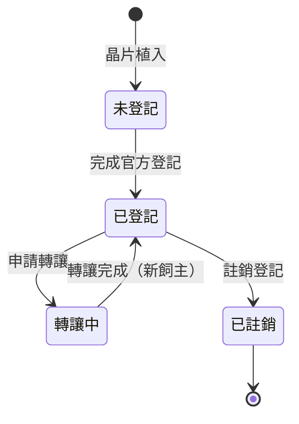

# 晶片表 Microchip Registry

> 寵物晶片（Microchip）欄位規格與示範資料表。示範租戶：**小小貓屋**。

## 概述

晶片號碼是寵物在官方登記體系中的唯一識別依據，也是 [寵物管理](README.md) 模組 `Pet` 實體的關鍵欄位。本文件定義晶片資料的欄位規格、驗證規則與狀態機，並以示範租戶「小小貓屋」的貓咪資料作為範例，供後續資料庫設計、API 設計與官方登記助手引用。

> ⚠️ 本文件中的所有寵物、晶片號碼與人物皆為**虛構示範資料**，僅供文件說明使用。

## 欄位定義

| 欄位 | 型別（概念） | 必填 | 說明 |
| --- | --- | --- | --- |
| `chipNumber` | `ChipNumber`（Branded Type） | ✅ | 晶片號碼，ISO 11784/11785 規範之 **15 碼數字** |
| `petId` | `PetId` | ✅ | 對應的寵物（Aggregate Root: `Pet`） |
| `implantedAt` | `Date` | ✅ | 晶片植入日期 |
| `implantClinic` | `string` | ✅ | 植入動物醫院 / 診所名稱 |
| `veterinarian` | `string` | ⬜ | 執行植入之獸醫師 |
| `registrationStatus` | `enum` | ✅ | 登記狀態：`未登記` / `已登記` / `轉讓中` / `已註銷` |
| `registeredAt` | `Date` | ⬜ | 官方登記完成日期（已登記時必填） |
| `ownerId` | `OwnerId` | ✅ | 登記飼主（見 [飼主管理](../14_飼主管理/README.md)） |
| `tenantId` | `TenantId` | ✅ | 所屬租戶，所有查詢一律帶入（Multi-Tenant 隔離） |
| `deletedAt` | `Date \| null` | ✅ | 軟刪除標記，預設 `null` |
| `createdAt` / `updatedAt` | `Date` | ✅ | 建立 / 更新時間 |

## 驗證規則

1. **格式**：晶片號碼必須為 15 碼純數字（ISO 11784/11785），輸入時以 schema（如 Zod）驗證後才進入 Domain。
2. **唯一性**：晶片號碼於**全系統唯一**；查詢與寫入一律帶 `tenantId`，禁止跨租戶存取。
3. **狀態轉移**：僅允許下列狀態機定義的轉移；`已註銷` 為終態。
4. **軟刪除**：不做實體刪除；所有查詢預設排除 `deletedAt` 非空之資料。
5. **稽核**：晶片資料之建立 / 修改 / 註銷 / 還原皆須寫入 [Audit Log](../25_AuditLog/README.md)。
6. **權限**：讀寫皆受 [RBAC](../24_RBAC/README.md) 控管，預設拒絕（Deny by default）。

## 登記狀態機

## 示範資料：小小貓屋 晶片表

> 租戶：小小貓屋（示範）｜資料截止：2026-07-02

| # | 寵物名 | 品種 | 性別 | 出生日期 | 晶片號碼 | 植入日期 | 植入院所 | 登記狀態 | 登記飼主 |
| --- | --- | --- | --- | --- | --- | --- | --- | --- | --- |
| 1 | 麻糬 | 布偶貓 | ♀ | 2024-03-15 | 900123000000101 | 2024-06-20 | 安心動物醫院 | 已登記 | 小小貓屋 |
| 2 | 湯圓 | 英國短毛貓 | ♂ | 2024-05-02 | 900123000000102 | 2024-08-11 | 安心動物醫院 | 已登記 | 小小貓屋 |
| 3 | 布丁 | 美國短毛貓 | ♀ | 2025-01-08 | 900123000000103 | 2025-04-03 | 毛孩家動物診所 | 已登記 | 小小貓屋 |
| 4 | 奶蓋 | 布偶貓 | ♂ | 2025-02-14 | 900123000000104 | 2025-05-19 | 毛孩家動物診所 | 轉讓中 | 小小貓屋 → 王小姐 |
| 5 | 芝麻 | 蘇格蘭摺耳貓 | ♀ | 2025-06-30 | 900123000000105 | 2025-09-25 | 安心動物醫院 | 已登記 | 小小貓屋 |
| 6 | 雪球 | 波斯貓 | ♂ | 2025-11-20 | 900123000000106 | 2026-02-27 | 安心動物醫院 | 未登記 | 小小貓屋 |
| 7 | 可可 | 孟加拉貓 | ♀ | 2026-01-05 | 900123000000107 | 2026-04-10 | 毛孩家動物診所 | 未登記 | 小小貓屋 |

## 相關模組

- [13 寵物管理](README.md)：晶片號碼為 `Pet` 實體欄位
- [17 官方登記助手](../17_官方登記助手/README.md)：晶片登記 / 變更 / 轉讓 / 註銷流程
- [10 資料庫設計](../10_資料庫設計/README.md)：Schema 與 Migration 規範
- [22 Multi-Tenant](../22_MultiTenant/README.md)：租戶隔離

---

> 本文件屬於 PetFlow Enterprise 官方文件。撰寫前請先閱讀根目錄 `CLAUDE.md`。狀態：草稿（Draft）。
